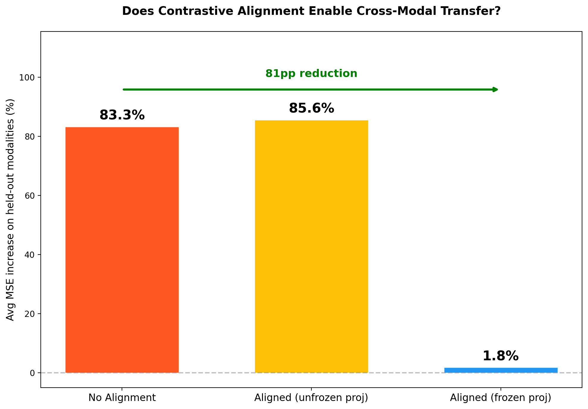
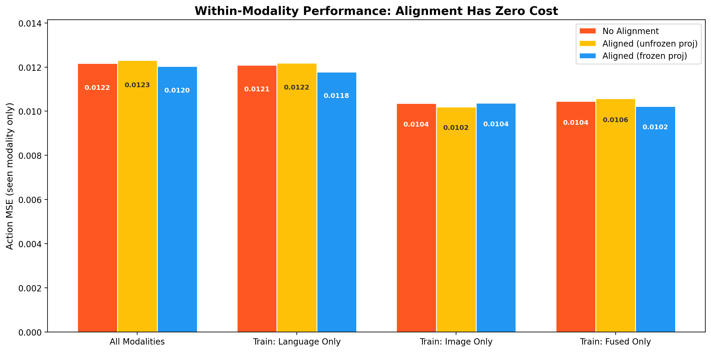
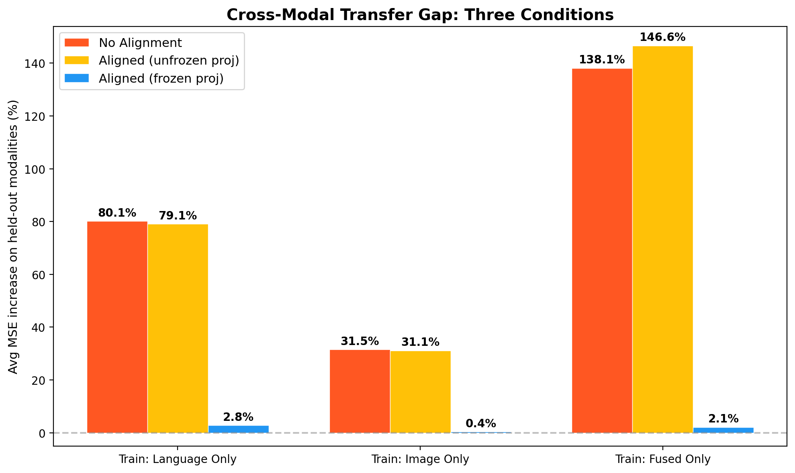
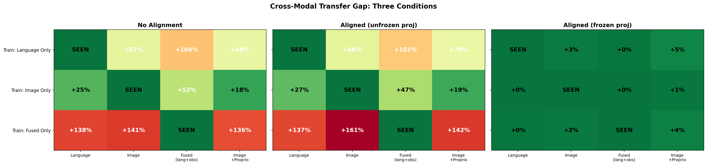
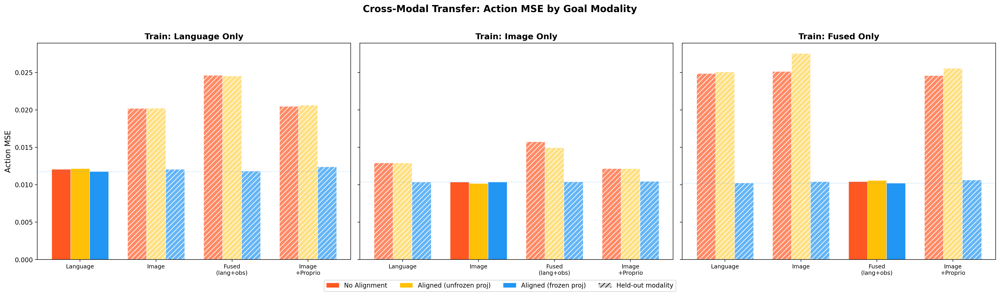
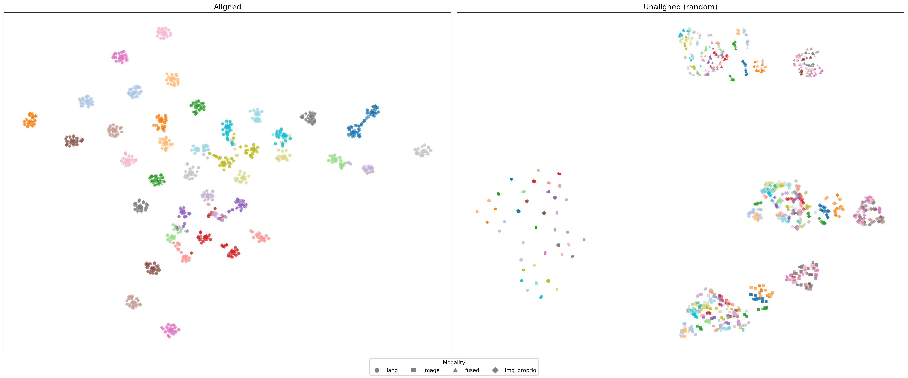
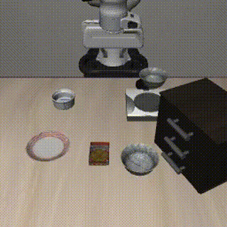
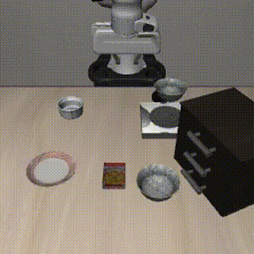
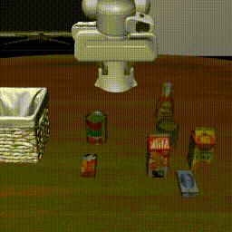
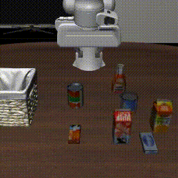

# Cross-Modal Latent Alignment for Goal-Conditioned Robot Manipulation

**Antony Zhao** — [@antony-zhao](https://github.com/antony-zhao)
**Group A** — Multi-Modal Sensing Lab

---

## Abstract

Goal-conditioned manipulation policies are typically trained and evaluated with a single goal modality, either language instructions or goal images.
At deployment, users may want to specify goals interchangeably, but policies trained on one modality fail when conditioned on another because each modality's representations occupy disjoint regions of the latent space.
We learn a shared 512-dim goal embedding space across four modalities via contrastive alignment, then train a policy transformer conditioned on modality-agnostic goal representations.
With frozen projection heads, cross-modal transfer gap drops from 83% (baseline) to 1.8% (aligned), with zero cost to within-modality performance.
We validate in LIBERO simulation, demonstrating that a policy trained only with image goals can execute tasks when conditioned on language.

---

## 1. The Architectural Delta

### 1.1 The Bottleneck

Standard VLA architectures handle goal conditioning in one of two ways, both problematic for cross-modal transfer.

Fused VLMs (OpenVLA, PaliGemma, SmolVLM) deeply interleave vision and language in a single backbone.
This pre-solves alignment through internet-scale pretraining, making it impossible to isolate and study cross-modal transfer as an independent contribution.
The alignment is inherited, not learned.

Separate-encoder approaches (RT-1, goal-conditioned BC) train independent encoders per modality with no explicit alignment objective.
Each modality maps to a disjoint region of the latent space.
A policy trained with language goals cannot transfer to image goals for the same task because "put the bowl on the plate" as text and an image of a bowl on a plate produce unrelated embeddings.

### 1.2 Our Approach

We use separate frozen encoders (DINOv2 for vision, SigLIP for language) and learn lightweight projection heads that map each modality into a shared goal space via contrastive alignment.
The policy transformer then operates on modality-agnostic goal embeddings — it cannot distinguish whether its goal came from language, an image, or a combination.

The key claim: a policy trained with one goal modality for a given task generalizes to unseen modalities for that same task at evaluation time, because the contrastive objective forces all modalities to map to the same embedding region.

### 1.3 Why Not a VLM?

Using a fused VLM would pre-solve the problem we aim to study.
Our separate-encoder design makes the alignment contribution isolable and measurable.

---

## 2. Architecture

### 2.1 Frozen Encoders

| Component | Checkpoint | Params | Output |
|-----------|-----------|--------|--------|
| Vision | `facebook/dinov2-large` | 300M | CLS token, 1024-dim |
| Language | `google/siglip-so400m-patch14-384` text tower | 150M | Pooled output, 1152-dim |

DINOv2 was chosen over CLIP/SigLIP's vision tower because its features are purely visual with no language pretraining bias, giving a cleaner separation between what the encoder provides and what the alignment learns.
Images are ImageNet-normalized before encoding.

SigLIP's text tower was chosen for its strong sentence-level representations and sigmoid-based training objective, which provides better per-pair alignment semantics than CLIP's softmax.

### 2.2 Trainable Projection Heads (~5M params)

Four 2-layer MLPs (LayerNorm + GELU, L2-normalized output), each mapping a different goal specification into a shared 512-dim embedding space:

1. **`proj_vision`**: DINOv2 CLS [1024] $\rightarrow$ [512] — goal image only
2. **`proj_lang`**: SigLIP pooled [1152] $\rightarrow$ [512] — language instruction only
3. **`proj_fused`**: concat(SigLIP [1152], DINOv2 CLS of current obs [1024]) $\rightarrow$ [512] — language grounded in current observation
4. **`proj_img_proprio`**: concat(DINOv2 CLS [1024], proprio [8]) $\rightarrow$ [512] — goal image + proprioceptive state

### 2.3 Policy Backbone

We evaluate two policy architectures conditioned on the aligned goal embeddings:

**PolicyTransformer (MSE BC):** 4-layer encoder-only transformer (512 hidden dim, 8 heads).
Input sequence: `[goal_token, obs_img_CLS, obs_proprio]` with learned token type embeddings.
Single-frame observation, agentview camera only.
Action readout from the goal token position, predicting 7-DoF continuous actions (end-effector delta position + orientation + gripper).
Used for all offline holdout evaluations (three-way comparison, t-SNE, temperature ablation).
 
**FlowMatchingPolicy (sim evaluation):** 6–8 layer encoder-only transformer (512–768 hidden dim, 8 heads).
Input sequence: `[goal, obs_img₁..ₜ, obs_wrist₁..ₜ, obs_proprio₁..ₜ, flow_time, noisy_action]` with learned token type and temporal embeddings.
Multi-frame observation history ($T=3$) for implicit velocity estimation, optional wrist camera, and action chunking ($H=3\text{--}5$).
Predicts the velocity field $v(x_t, t \mid o, g)$; at inference, actions are generated via Euler integration from noise.
This avoids the mean-seeking problem inherent to MSE behavioral cloning.
Used for closed-loop simulation evaluation in LIBERO.
 
---

## 3. Data

### 3.1 LIBERO via LeRobot

| Property | Value |
|----------|-------|
| Source | `lerobot/libero` (LeRobot v3.0) |
| Episodes | 1,693 |
| Frames | 273,465 |
| Unique tasks | 40 |
| FPS | 10 Hz |
| State space | 8-dim (eef pos [3], axis-angle [3], gripper qpos [2]) |
| Action space | 7-dim (end-effector delta + gripper), range [-1, 1] |
| Images | 256×256, agentview + wrist camera |

### 3.2 Language Paraphrases

5 variants per task (200 total), manually written with structural variation.
This prevents the text encoder from overfitting to exact phrases.

### 3.3 Temporal Goal Sampling

Goal frames sampled from an exponential distribution over future frames within each episode (base=1.02, ~20× bias toward final frame), with 50% probability of forcing the final frame.
This gives training signal at multiple temporal horizons rather than only task-completion frames.

### 3.4 Precomputation

All DINOv2 CLS tokens (273K frames × 2 cameras) and SigLIP text embeddings (40 tasks) are cached to disk.
Training loops index into cached tensors with zero encoder forward passes, yielding ~10–50× speedup.

---

## 4. Loss Formulation

### 4.1 Phase 1 — Contrastive Goal Alignment

**Goal embeddings.** Four projection functions map goal specifications into a shared space $\mathcal{Z} \subset \mathbb{R}^{512}$ (all $\ell_2$-normalized):

$$z_{\text{img}} = f_V\big(\text{DINOv2}(I_G)\big)$$
$$z_{\text{lang}} = f_L\big(\text{SigLIP}(\ell)\big)$$
$$z_{\text{fused}} = f_F\big([\text{SigLIP}(\ell)\;;\;\text{DINOv2}(I_t)]\big)$$
$$z_{\text{ip}} = f_{IP}\big([\text{DINOv2}(I_G)\;;\;s_G]\big)$$

**Alignment loss.** Symmetric InfoNCE with task-aware collision masking.
For a batch of $B$ paired embeddings:

$$\mathcal{L}_{\text{NCE}}(z^a, z^b) = -\frac{1}{2B}\sum_{i=1}^{B}\left[\log\frac{e^{z^a_i \cdot z^b_i / \tau}}{\sum_{j \notin C_i} e^{z^a_i \cdot z^b_j / \tau}} + \log\frac{e^{z^b_i \cdot z^a_i / \tau}}{\sum_{j \notin C_i} e^{z^b_i \cdot z^a_j / \tau}}\right]$$

where $C_i = \{j \neq i : \text{task}(j) = \text{task}(i)\}$ masks same-task off-diagonal pairs as false negatives, and $\tau = 0.1$.

**Collision masking** is critical: with batch 128 and 40 tasks, ~3.2 samples per task appear per batch on average.
Without masking, the loss would penalize correct same-task alignments as false negatives, actively fighting the objective.

**Total alignment loss**, with all modalities anchored against the goal image embedding:

$$\mathcal{L}_{\text{align}} = \mathcal{L}_{\text{NCE}}(z_{\text{lang}}, z_{\text{img}}) + 0.5 \cdot \mathcal{L}_{\text{NCE}}(z_{\text{fused}}, z_{\text{img}}) + 0.5 \cdot \mathcal{L}_{\text{NCE}}(z_{\text{ip}}, z_{\text{img}})$$

### 4.2 Phase 2 — Policy Learning

**Modality dropout.** Each training sample's goal modality is sampled from $\{$lang: 0.3, image: 0.3, fused: 0.2, img\_proprio: 0.2$\}$.

**MSE policy loss:**

$$\mathcal{L}_{\text{policy}} = \frac{1}{B}\sum_{i=1}^{B} \left\| a_i - \pi(z_{\text{goal}_i}, o_i) \right\|^2$$

**Flow matching loss.** For ground truth action chunks $a \in \mathbb{R}^{H \times 7}$, noise $x_0 \sim \mathcal{N}(0, I)$, and timestep $t \sim U(0, 1)$:

$$x_t = (1-t) \cdot x_0 + t \cdot a$$
$$v^* = a - x_0$$
$$\mathcal{L}_{\text{flow}} = \left\| v_\theta(x_t, t, o, g) - v^* \right\|^2$$

At inference, actions are generated via Euler integration: $x_{t+\Delta t} = x_t + v_\theta(x_t, t) \cdot \Delta t$ starting from $x_0 \sim \mathcal{N}(0, I)$.

### 4.3 Learning Rate Schedule

Linear warmup over 500 steps, then cosine decay to zero (`torch.optim.lr_scheduler.SequentialLR`).

---

## 5. Results

### 5.1 Cross-Modal Transfer: Three-Way Comparison

The primary experiment evaluates cross-modal transfer under three conditions.
Phase 1 trains alignment on all 40 tasks.
Phase 2 restricts goal modalities per task group: 20 tasks get all modalities, 7 get language only, 7 get image only, 6 get fused only.
At evaluation, we measure action prediction MSE with the held-out modalities.

| Condition | Phase 1 | Projections in Phase 2 | Avg transfer gap |
|-----------|---------|----------------------|------------------|
| Baseline | None | Jointly trained | 83.3% |
| Aligned (unfrozen) | Contrastive | Jointly finetuned | 85.6% |
| **Aligned (frozen)** | **Contrastive** | **Frozen** | **1.8%** |

**Key findings:**

Freezing projection heads is critical.
Joint finetuning of projection heads during policy training destroys the alignment (85.6% gap, worse than baseline) without improving within-modality performance.

Contrastive pretraining is necessary but not sufficient.
The alignment must be preserved by freezing the projection heads during Phase 2.

Within-modality performance is identical across all three conditions (~0.010 MSE).
The alignment is purely additive: zero cost on seen modalities, massive benefit on unseen modalities.

### 5.2 Per-Group Transfer Gap

| Group | Modality seen | Baseline gap | Aligned (frozen) gap |
|-------|-------------|-------------|---------------------|
| Language only | lang | 80.1% | 2.8% |
| Image only | image | 31.5% | 0.4% |
| Fused only | fused | 138.1% | 2.1% |

The fused-only group is the most dramatic: baseline held-out modalities are 2.4× worse than the seen modality, while the aligned model is essentially flat.

### 5.3 Temperature Ablation

| $\tau$ | Avg frozen transfer gap | Within-modality MSE |
|--------|------------------------|-------------------|
| 0.05 | ~5.1% | 0.0109 |
| 0.10 | ~1.5% | 0.0107 |
| 0.20 | ~0.9% | 0.0110 |
| 0.50 | ~0.5% | 0.0106 |

The alignment is robust across a 10× range of temperature.
All values eliminate the baseline transfer gap (60–130%), indicating the method is not sensitive to this hyperparameter.

### 5.4 t-SNE Visualization

Aligned embeddings cluster by task with mixed modality markers (circles, squares, triangles, diamonds overlapping within each cluster).
Unaligned embeddings separate into modality-specific blobs (language on one side, image on another, fused in a third region) with colors mixed within each blob.

This visually confirms: alignment organizes the space by *task semantics*, not by *input modality*.

### 5.5 LIBERO Simulation Evaluation
 
We evaluate the flow matching policy in closed-loop LIBERO simulation to validate that cross-modal transfer produces purposeful behavior beyond offline metrics.
 
**Modality holdout demo:** The policy is trained with image goals only on 5 held-out tasks.
At evaluation, it is conditioned on language for those tasks.
 
#### Task: "pick up the black bowl next to the cookie box and place it on the plate"
 
This task was held out — the policy only saw image goals during training, never language.
The aligned model achieves **full task completion**: it picks up the correct black bowl, carries it to the plate, and places it successfully — all from a language instruction it never trained on.
The baseline model flails on the wrong side of the table for the full episode, never approaching the correct bowl.
 
**Aligned model (frozen projections) — full success in ~8 seconds:**
 

 
**Baseline model (trained random projections) — complete failure:**
 

 
Same task, same initial state, same policy architecture — the only difference is contrastive alignment.
 
#### Task: "put both the alphabet soup and the tomato sauce in the basket"
 
Also held out — image goals only during training.
The aligned model reaches toward the cans (alphabet soup and tomato sauce) — the correct target objects specified by the language instruction.
The baseline reaches toward the milk and cream cheese boxes — the wrong objects entirely.
 
**Aligned model — reaches for correct objects (cans):**
 

 
**Baseline model — reaches for wrong objects (milk/cream cheese):**
 

 
#### Summary
 
The simulation results confirm that the offline transfer gap metric (83% → 1.8%) translates to qualitative behavioral differences in closed-loop control.
The aligned model achieves full task completion on held-out tasks conditioned on language it never trained on, while the baseline typically produces task-irrelevant behavior.
On more complex tasks, the aligned model demonstrates correct object targeting and task sequencing, with full completion limited by the policy backbone's grasp precision rather than goal understanding.
 
**Caveats:** Our custom policy backbone (flow matching with frozen DINOv2 CLS tokens) is substantially weaker than published LIBERO baselines (ACT, Diffusion Policy) that train ResNet-18 end-to-end with spatial feature maps.
Overall success rates are low for both models — the alignment contribution is best evaluated by comparing *which objects* each model targets, not raw success rates.
Additionally, the baseline does occasionally produce correct behavior on holdout tasks, likely by leveraging the observation inputs (current image and proprioceptive state) rather than the language goal embedding — since the scene itself provides cues about plausible actions regardless of the goal modality.
The aligned model targets the correct objects more consistently across episodes, which is the expected signature of functioning cross-modal transfer.

---

## 6. Intuitive Derivations

### 6.1 Why Frozen Projections Matter

When projections train jointly with the policy (unfrozen), each modality's projector can specialize for the specific tasks it sees, carving out a private subspace optimized for action prediction.
This maximizes within-modality performance but destroys the shared geometry that enables transfer.

Freezing projections forces the policy to operate within the embedding space that contrastive alignment established.
The policy learns to map from a modality-agnostic representation to actions, rather than exploiting modality-specific shortcuts.

---

## 7. Implementation Gotchas

### 7.1 Contrastive Batch Collisions

With batch size 128 and 40 tasks, approximately 3.2 samples per task appear per batch.
Sample-level retrieval accuracy plateaus at ~31% (the theoretical ceiling), which appears broken but is expected.
Task-level accuracy (does the nearest embedding belong to the same task?) exceeds 95%.
Without collision masking, the contrastive loss actively fights alignment by penalizing correct same-task pairs.

### 7.2 LeRobot–LIBERO Image Orientation

The LIBERO simulator returns images that are both vertically and horizontally flipped relative to what LeRobot stores.
A 180° rotation (`obs["agentview_image"][::-1, ::-1].copy()`) is required.
Without this fix, DINOv2 produces CLS tokens for spatially inverted scenes, making the policy effectively blind.

### 7.3 Proprioceptive Representation Mismatch

LeRobot stores proprioceptive state as `[eef_pos(3), axis_angle(3), gripper_qpos(2)]`.
The LIBERO simulator provides `robot0_eef_quat` (quaternion, 4d) and `robot0_gripper_qpos` (2d).
Quaternion must be converted to axis-angle to match training data:

Using quaternion directly (5 of 8 proprio dimensions wrong) produces a policy that moves but cannot execute precise manipulation.

---

## 8. Limitations and Future Work

**Policy backbone:** Our custom flow matching policy with frozen DINOv2 CLS tokens approaches but does not match the grasp precision of published methods (ACT, Diffusion Policy) that train ResNet-18 end-to-end with spatial feature maps.
The alignment contribution is orthogonal to policy backbone strength — plugging aligned projection heads into a stronger backbone is straightforward.

**Dataset scale:** 40 tasks may be sufficient for alignment to work but insufficient to demonstrate that the baseline *cannot* implicitly align.
With 500+ tasks (e.g., Bridge V2), the baseline would have a harder time discovering cross-modal structure from action loss alone.

**Single camera for alignment:** The contrastive alignment uses only the agentview camera CLS token.
Incorporating wrist camera features or spatial patch-level features could improve the alignment quality.

**Simulation only:** All evaluation is in LIBERO simulation.
Real-world transfer would require handling domain shift in visual features.