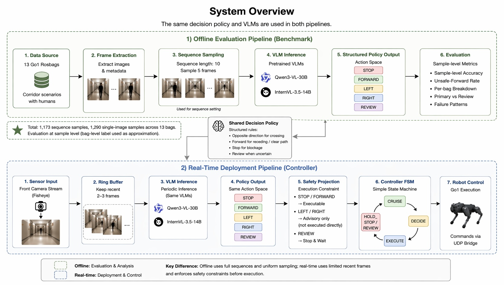

# Vision-Language-Based Social Navigation Decision on Unitree Go1

## 1. Motivation

- Existing robot navigation systems primarily rely on geometric planning and lack social awareness  
- In human environments, robots must make **interaction-aware decisions**, not just avoid obstacles  

**Examples:**
- When encountering a person:
  - Should the robot stop?
  - Move left/right?
  - Continue forward?

> This is fundamentally a **decision-making problem under social context**, rather than pure motion planning.

---

## 2. Objective

- Enable Go1 to perform **socially-aware action selection** using a Vision-Language Model (VLM)  
- Focus on **decision-making at interaction points**, rather than full navigation  

**Specifically:**
- Given a scene → choose next action from:
  - `{STOP, FORWARD, LEFT, RIGHT, REVIEW}`  

- Ensure actions are:
  - Safe  
  - Socially appropriate  
  - Interpretable  

The goal of this project is to transform pretrained VLMs from passive perception systems into structured decision-making components that can generate socially meaningful navigation actions.

---

## 3. System Design

### Input
- RGB image from the Go1 onboard camera  
- Optional high-level instruction  

### Model
- Qwen3-VL-30B  
- InternVL-3.5-14B  

These models are accessed via an external GPU server and integrated through a lightweight wrapper.

### Output: High-Level Action
- Discrete action:
  - STOP  
  - FORWARD  
  - LEFT  
  - RIGHT  
  - REVIEW  

**Important clarification**  
These actions are **high-level semantic decisions**, not low-level control commands.

They are later mapped to robot commands via a controller.

---

## 4. Core Idea

I reformulate social navigation as a **vision-language decision problem**, instead of:

- geometric path planning  
- continuous low-level control policy learning  

By operating over a **discrete action space**, the system:
- reduces learning complexity  
- lowers data requirements  
- simplifies deployment on real robots  

---

## 5. Architectural Delta

Existing social navigation systems either:
- rely on rule-based heuristics that lack semantic understanding, or  
- use learned policies that are computationally expensive and difficult to deploy in real-time  

While Vision-Language Models (VLMs) provide strong semantic reasoning capabilities, they are typically large and computationally intensive.

This creates a key deployment challenge on **resource-constrained robots like Go1**, where:
- onboard compute is limited  
- large VLMs cannot be run efficiently  

> There is a gap between VLM reasoning capability and deployability.

---

## 6. Method

### 6.1 Structured Decision Policy

Instead of allowing the model to generate free-form outputs, I define a structured decision policy with a fixed action space:

- STOP  
- FORWARD  
- LEFT  
- RIGHT  
- REVIEW  

I design prompts that guide the model to output a structured decision based on the observed scene.

The key rules are:

- Move FORWARD when the path is clear or the person is receding  
- Move in the opposite direction when a crossing is detected  
- Output REVIEW when the situation is uncertain  
- STOP when the path is blocked  

This design makes the outputs more structured and easier to inspect.

---

### 6.2 My Approach

This project introduces a **prompt-policy architecture**, where:

$$
\hat{a} = f_{\text{VLM}}(s_t)
$$

and

$$
a \rightarrow (v_x, \omega_z)
$$

---

### 6.3 Control Mapping

The system separates:

- **High-level decision (VLM output)**  
- **Low-level control (robot execution)**  

Example mapping:

- STOP → $v_x = 0$  
- LEFT → $\omega_z > 0$  
- RIGHT → $\omega_z < 0$  
- FORWARD → $v_x > 0$  

The VLM does **not** output motor commands directly.

---

### 6.4 Action Space Justification

The system uses a constrained action space:

$$
\{STOP, FORWARD, LEFT, RIGHT, REVIEW\}
$$

This is not intended to model full human interaction.

I treat this as a **bounded primitive action set** for evaluating socially-aware navigation decisions.

---

### 6.5 Perception vs Decision

The system does **not implement an explicit perception module**.

Instead, perception is implicitly handled by the VLM, which jointly infers:
- human presence  
- relative position  
- motion cues  

A key limitation is that incorrect perception, such as failure to detect crossing, leads to incorrect or missing policy activation.

---

### 6.6 Prompting

I prompt the VLM with:
- current image or image sequence  
- predefined action space  

**Example prompt:**
> "Given this scene, choose the safest and most socially appropriate action: [STOP, FORWARD, LEFT, RIGHT, REVIEW]"

No fine-tuning is performed. All behaviors are induced through prompt design.

---

## 7. Data and Evaluation Setup

I evaluate the system using 13 Go1 rosbags, each representing a different human interaction scenario.

**Scenarios include:**
- Person blocking the path  
- Person on left/right side  
- Person approaching or crossing  
- Multiple people / narrow passage  
- No person / clear path  

For each bag:

- I extract single images and image sequences  
- Sequence length = 10 frames  
- 5 frames are sampled and sent to the VLM  

This results in:

- 1,173 sequence samples  
- 1,290 single-image samples  

This project focuses on **decision-level supervision**, not trajectory imitation.

---

## 8. Loss Formulation and Evaluation Objective

- **State**:

$$
s_t = (I_t) \quad \text{or} \quad (I_{t-k:t})
$$

- **Action**:

$$
a \in \{STOP, FORWARD, LEFT, RIGHT, REVIEW\}
$$

- **Prediction**:

$$
\hat{a} = f_{\text{VLM}}(s_t)
$$

- **Evaluation Objective**:

$$
L = CrossEntropy(\hat{a}, a_{human})
$$

This loss is **not used for training**.  
It is used only as a conceptual measure of alignment with human-labeled decisions.

---

## 9. Evaluation Metrics

### 9.1 Sample-Level Accuracy

I report **sample-level accuracy**, where each frame prediction is compared to the expected action of the corresponding bag.

Since per-frame ground truth labels are not available, I use the bag-level label as an approximation for all frames within that bag.

This metric provides a view of frame-level behavior, although it does not represent true per-frame ground truth.

---

### 9.2 Safety and Unsafe-Forward Rate

A safety violation occurs if:

$$
d_{human} < d_{min}
$$

or

$$
a = FORWARD \text{ while human is in front}
$$

In addition to accuracy, I analyze unsafe-forward rate, which measures how often the model outputs FORWARD in scenarios where the expected action is STOP.

This metric captures safety risks at the frame level that are not reflected in accuracy alone.

---

### 9.3 Social Compliance

- Correct avoidance direction  

---

### 9.4 Temporal Consistency

- Stability across frames  

---

## 10. Results

### 10.1 Overall Sample-Level Accuracy

The overall sample-level accuracy across all 13 bags is:

| Method               | Accuracy |
|----------------------|----------|
| Qwen (sequence)      | 56.86%   |
| InternVL (single)    | 52.64%   |
| InternVL (sequence)  | 50.38%   |
| Qwen (single)        | 42.87%   |

Sequence-based inputs perform best for Qwen, but the advantage is not consistent across both models.

InternVL with single-image input slightly outperforms its sequence version, suggesting that temporal information is not fully utilized and may introduce noise.

---

### 10.2 Primary vs Review Scenarios

Performance varies across scenario types:

- Sequence models perform better in primary scenarios (STOP / FORWARD)  
- Qwen (single) performs better in review scenarios (ambiguous cases)  

Qwen (single) achieves 47.15% accuracy on review cases, while other methods remain near zero.

This indicates that Qwen (single) is more likely to express uncertainty via REVIEW.

---

### 10.3 Failure Patterns

Several consistent failure patterns are observed:

- STOP scenarios frequently collapse to FORWARD predictions  
- Crossing events are rarely detected  
- REVIEW is underutilized except in Qwen (single)  

These patterns suggest that the main limitation lies in perception rather than decision policy.

---

### 10.4 Safety Analysis: Unsafe Forward Rate

The results show that:

- Some methods produce frequent forward actions even in STOP scenarios  
- This behavior is particularly evident in bags where the model fails to detect the presence or motion of a person  

This indicates that a model can achieve reasonable accuracy while still producing unsafe intermediate behaviors.

---

## 11. Discussion

### 11.1 Effect of Structured Policy

The structured policy leads the models to output actions beyond STOP and FORWARD.

The model is able to produce LEFT, RIGHT, and REVIEW actions, indicating that it can express directional avoidance and uncertainty.

However, these behaviors are not triggered frequently enough, which limits their impact on overall performance.

---

### 11.2 Temporal Input Trade-offs

While sequence inputs provide additional context, they also introduce variability across frames.

When the model cannot effectively utilize temporal information, additional frames can reduce prediction stability.

This explains why single-image inputs can sometimes perform comparably or even better than sequence inputs.

---

### 11.3 Perception as the Bottleneck

The results indicate that the primary limitation is perception:

- Crossing detection is rare  
- Motion understanding remains limited in dynamic scenarios  
- Incorrect assumptions lead to unsafe forward predictions  

The decision policy itself is consistent when activated, but it is not applied reliably due to perception failures.

---

### 11.4 Offline vs Real-Time Gap

There is a noticeable gap between offline evaluation and real-time deployment.

In offline evaluation:

- The model receives clean and uniformly sampled frames  
- Temporal context is consistent  
- Decision quality is more stable  

In real-time execution:

- The system relies on a small ring buffer (2–3 frames)  
- Frame availability is inconsistent  
- Latency affects responsiveness  

As a result:

- Crossing events become harder to detect reliably due to limited temporal context  
- The controller receives fewer frames and must operate under latency constraints  
- The system reacts more slowly  

This highlights that a policy that performs well offline cannot be directly transferred to real-time control without additional engineering considerations.

---

## 12. Ablation Plan

The current system uses the five-action prompt-policy design as the primary implementation.

I evaluate:

- Different action space granularity  
- End-to-end vs structured prompting  
- Single-frame vs sequence inputs  

These ablations test whether finer representations improve stability or accuracy.

---

## 13. Implementation Status

### Completed
- Go1 ROS pipeline  
- VLM inference pipeline  
- Offline evaluation benchmark  
- Single-image and sequence evaluation modes  
- Sample-level metric computation  
- Unsafe-forward analysis  

### Real-Time Status
- The system is currently **offline or low-frequency**, not a real-time Go1 controller  
- VLM latency prevents real-time closed-loop deployment  
- Perception errors limit decision activation  

---

## 14. Code Implementation

For implementation, I built an offline evaluation pipeline and a lightweight real-time controller path.

The offline pipeline extracts Go1 rosbag frames, constructs single-image and sequence-image samples, sends them to pretrained VLM backends, normalizes structured outputs into a fixed action space, and computes sample-level metrics.

The implementation directly addresses the stated bottleneck by expanding the decision interface from binary STOP/FORWARD into STOP/FORWARD/LEFT/RIGHT/REVIEW.

For deployment safety, I also separate offline policy actions from executable robot controls. In real time, LEFT and RIGHT are treated as advisory avoidance hints rather than direct lateral commands unless additional safety checks are available.

I added documentation and unit tests for policy rules, action normalization, sequence sampling, majority voting, unsafe-forward calculation, and real-time action projection.

Repository: [GitHub](https://github.com/yuni-wyx/vlm_social_navigation_go1)

---

## 15. Limitations

This work has several limitations:

- Sample-level accuracy uses bag-level labels as an approximation, which introduces noise  
- Not all frames within a bag require the same action  
- The evaluation does not include true per-frame ground truth annotations  
- The real-time system is limited by latency and low frame availability  
- No fine-tuning or large-scale embodied data is used  
- Perception errors can prevent correct decision-rule activation  

These limitations affect both the reliability of evaluation and the robustness of deployment.

---

## 16. The Hard Question

**Question:**  
How can I ensure safe decisions without training?

**Answer:**
- Constrain action space  
- Use human-labeled evaluation  
- Apply temporal smoothing  
- Measure unsafe-forward behavior separately from accuracy  

---

## 17. Expected Contribution

- Show that VLMs can support **interaction-aware decision-making**  
- Provide a deployable system design that separates semantic decisions from low-level control  
- Bridge semantic reasoning and robot control  
- Demonstrate the gap between offline decision quality and real-time deployment constraints  

---

## 18. Conclusion

This project demonstrates that pretrained VLMs can be transformed into structured decision-making systems through prompt design.

The system is capable of producing directional avoidance behaviors and handling uncertainty, which are not present in traditional geometric navigation approaches.

However, the effectiveness of these behaviors is limited by perception. The model often fails to recognize the appropriate situations in which the policy should be applied.

This suggests that the main limitation lies in perception rather than reasoning or policy design.

---

## 19. Future Work

Future work will focus on improving perception and real-time deployment:

- Collect more real-world data for fine-tuning  
- Improve motion understanding, especially for crossing detection  
- Explore better temporal modeling methods  
- Optimize real-time perception under latency constraints  

Overall, the policy design shows promising behavior in offline evaluation, but its effectiveness depends on more reliable perception and real-time execution.
