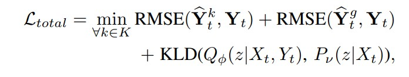

# Design Review: Visual Grounding for Trajectory Safety Uncertainty

## 1. Motivations and Project Summary

One of the problems in current state-of-the-art vision foundation models is a weak understanding of the world rules--for example, dynamics, intent, or potential hazards--essentially, problems that involve examining the current state, and making an educated guess at what the future states could be and reasoning accordingly. Given the complex nature of robot navigation, VLMs have to handle multiple decision boundaries (i.e. tasks) simultaneously, making the underlying results hazy as to whether sucess is truthfully attributed to the model's capabilities (lack of interpretability, no bounded guarantees). 

Similar to the critiques in the navigation paper audit, VLAs and VLMs might push a robot to make decisions that are correct, but there is no clear determination that these are reason-based and not just learned behaviors, making generalization poor. Prior navigation approaches like ViNT (*Visual Navigation Transformer, Shah et al.*) learn traversal behavior through imitation without explicit semantic reasoning — the reasoning is implicit and uninterpretable. VLA-based systems inherit this opacity while adding language conditioning, but still struggle with physical grounding: they may correctly describe a scene in language while failing to account for how a seated human's potential motion should affect a robot's path.

This project seeks to tackle a small subset of this larger problem - seeing if there is any potential for using trajectory prediction models to offload this task from the VLMs themselves (instead of just use only VLM to try do whole task, use trajectory prediction model in conjunction with visual features). In essence, pure VLMs can't do these tasks well or ensure safety in the time horizon rollouts, pure trajectory prediction models do not take in any visual cues and only rely on a small window and maybe contextual labels (like intent), and we want to find some middle ground that uses the capabilities of both.

Another example to help illustrate this approach is waiting at a traffic light--while a pure trajectory prediction model could potentially learn how a pedestrian might move when the walking sign goes on, it is blind to the reasoning and visual cues that could be present that a human can easily determine to contextualize when a person might start walking.

## 2. Approach

For the baseline trajectory prediction model, I am using SGNet (*Stepwise Goal-Driven Network for Trajectory Prediction, Wang et al.*), which is trained purely on bounding box trajectories. These bounding boxes are extracted from captures of pedestrian scenes from a ego-vehicle camera, specifically the PIE (pedestrian intent estimation) dataset which was one of the datasets used in the SGNet paper. While this model is effective in modeling goals at multiple timescales to produce better trajectory predictions than just predicting a single endpoint, it still has no visual insight on the scene itself. 

We could just append the output from a VLM (since it can provide bbox, and potentially a context label - interesting since this was included in PIE dataset, but not used in SGNet's dataloader), but another approach could be to take the images, extract CLIP features, and then see if the image features and bbox trajectory features can attend to each other somehow. To reiterate, the point of this is that VLMs can't perform a subset of tasks well, if we can offload that task to something else, how will these two work together when integrated.

While the current problem and dataset is modelled towards pedestrians in a driving scenario, this could be adapted towards other scenarios like an office scene (humans sitting at a desk with potential to turn around and walk away from desk, etc.).

## 3. System Architecture

### SGNet (Baseline)
SGNet is a recurrent trajectory prediction network built around a CVAE. Given a sequence of observed bounding box coordinates, a linear feature extractor first projects the raw coordinates into a higher-dimensional embedding, which is fed into a GRU encoder that maintains a running hidden state over the motion history. At each encoding step, the hidden state is passed to the Stepwise Goal Estimator (SGE) — a secondary GRU that unrolls intermediate goal predictions across the future horizon rather than predicting a single endpoint. An attention mechanism over these goals feeds back into the encoder, and the resulting hidden state is passed to the CVAE, which samples K latent variables to produce K diverse trajectory hypotheses decoded at each future timestep. At no point does SGNet consume image data, semantic labels, or any signal beyond raw bounding box coordinates.

### CLIP Feature Extraction (Frozen)
For each pedestrian crop defined by PIE bounding box annotations, a frozen CLIP ViT encoder produces a 512-dimensional visual embedding. These embeddings are precomputed and stored offline, aligned to the bounding box sequence by pedestrian ID and frame index. The CLIP encoder is not fine-tuned at any stage.

### Integration Strategies
Configuration A — Baseline: Standard SGNet on bounding box sequences only. Reproduces paper results and serves as the performance floor.
Configuration B — Concatenation: The precomputed CLIP embedding is concatenated to the bounding box input at each timestep before the GRU encoder. Tests whether visual features carry useful signal with minimal architectural change.
Configuration C — Cross-Attention: A lightweight cross-attention module is inserted between the GRU encoder and the SGE. The GRU hidden state serves as the query; the CLIP embedding sequence over the observation window serves as keys and values. This allows the model to selectively attend to visually relevant features rather than naively appending them.

### PIE (Pedestrian Intent Estimation) Dataset Processing

PIE is an ego-vehicle dataset containing approximately 300,000 labeled video frames captured from a forward-facing onboard camera in urban driving environments. Each pedestrian instance is annotated with:

- Per-frame bounding box coordinates (pixel space)
- Crossing intent label (will cross / will not cross)
- Pedestrian attributes (age, gender, motion state)
- Ego-vehicle speed and GPS coordinates

SGNet's existing PIE dataloader extracts fixed-length sequences of bounding box coordinates as input and future bounding box positions as prediction targets. This project reuses the dataloader with minimal modification, adding a parallel data channel that loads precomputed CLIP embeddings aligned by pedestrian ID and frame index. In particular, I'm currently only using set01 out of 6 sets in total.

### Loss Function

The training loss follows the original SGNet formulation for the stochastic (CVAE) model:

where:
- Y_hat_k is the k-th trajectory hypothesis sampled from the CVAE decoder
- Y_hat_goal is the stepwise goal prediction from the SGE
- Y_t is the ground truth future position at time t
- The KLD term regularizes the posterior distribution toward the prior

## 4. Evaluation

### Metrics

| Metric | Description |
|--------|-------------|
| ADE (Average Displacement Error) | Mean L2 distance between predicted and ground truth positions over all future timesteps |
| FDE (Final Displacement Error) | L2 distance at the final predicted timestep only |
| MSE | Mean squared error over predicted bounding box coordinates |
| CMSE | MSE computed only on crossing pedestrians |
| CFMSE | Final-step MSE computed only on crossing pedestrians |

(mostly just using same metrics as original paper for consistency).

### Experimental Comparisons

| Configuration | Input | Expected Outcome |
|---------------|-------|-----------------|
| A: Baseline SGNet | Bounding boxes only | Trying to Reproduce paper numbers |
| B: SGNet + CLIP concat | Bounding boxes + CLIP embedding (concatenated) | Tests whether visual signal helps at all |
| C: SGNet + CLIP cross-attention | Bounding boxes + CLIP sequence (attended) | Tests whether structured integration improves over naive concat |

## 5. Current Status

| Component | Status |
|-----------|--------|
| SGNet repo cloned and environment configured | Complete |
| PIE dataset downloaded (set01 capture) | Complete |
| CLIP feature extraction pipeline | Complete |
| Configuration A (baseline) training | Complete |
| Configuration B (concat) | Complete |
| Configuration C (cross-attention) | In progress |
| Evaluation and visualization | Not started |

## 6. Concerns

Current approach is exploratory--the central assumption that CLIP visual embeddings and bounding box trajectory features can be meaningfully combined, even with cross-attention, is relatively naive. The interaction between visual semantics and motion dynamics may require deeper architectural coupling than either concatenation or a lightweight attention module can provide. Additionally, results are currently limited to set01 of the PIE dataset (1 of 6 sets), which limits the generalizability of any conclusions drawn.
A more principled future direction could be to replace the frozen CLIP encoder with a small VLM backbone (1–3B parameters), which could produce structured semantic descriptions of the scene rather than dense visual embeddings--more directly encoding intent signals like gaze direction, body pose, and interaction context that are relevant to trajectory prediction.