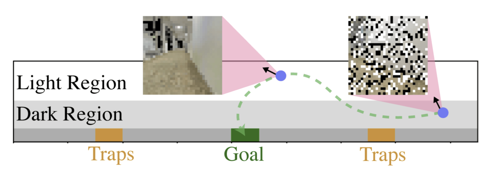
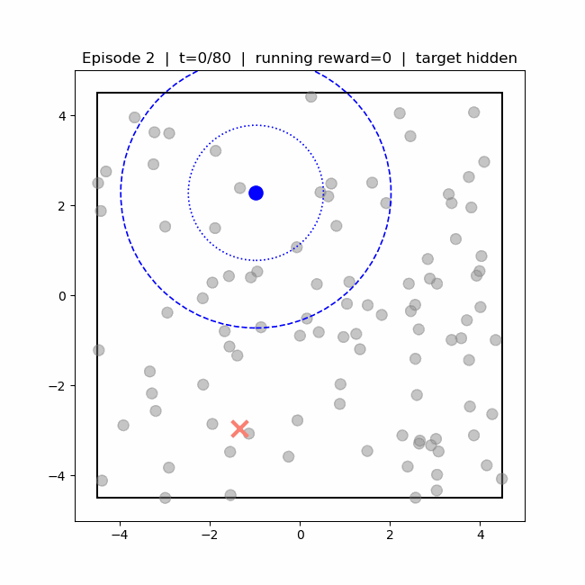
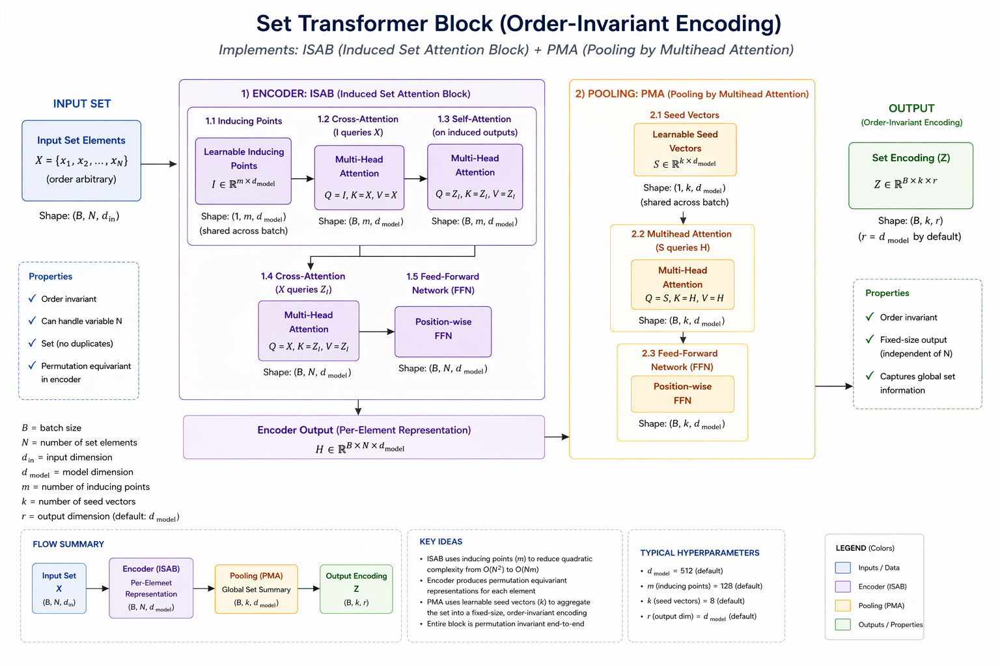
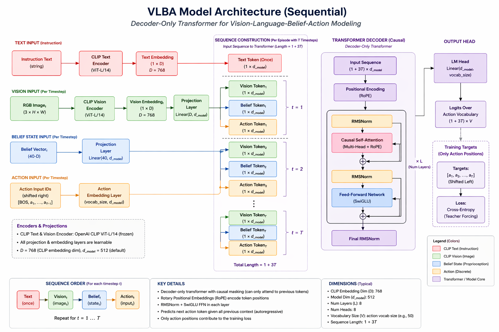
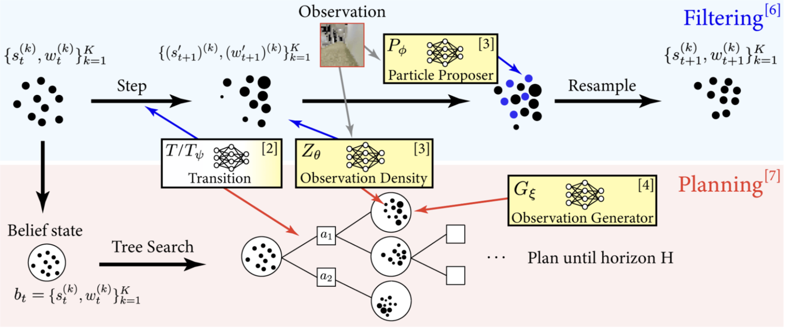
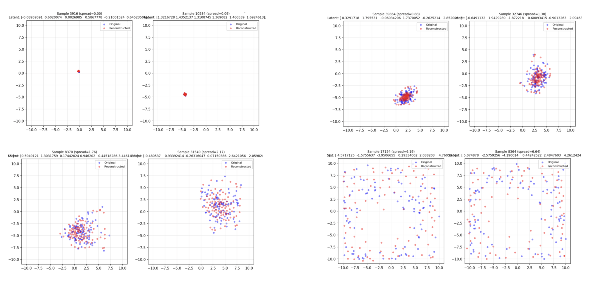
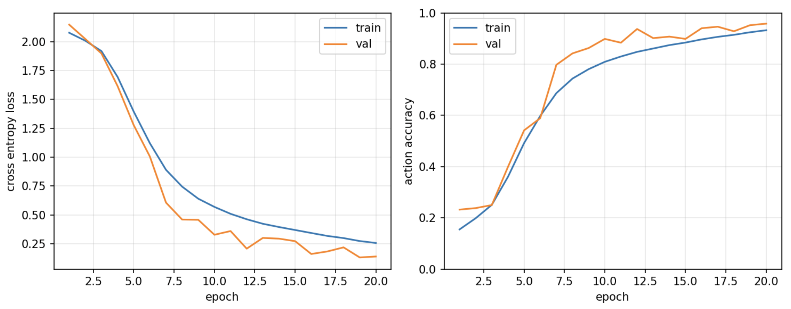

# Vision-Language-Belief-Action (VLBA) Models for POMDPs

## Final Project Report

----------

## 1. Overview

This project proposes a **Vision-Language-Belief-Action (VLBA)** model for decision-making in **Partially Observable Markov Decision Processes (POMDPs)**.

The system receives:

-   Visual observations from recent timesteps
    
-   A natural language instruction describing the task
    
-   A particle filter (PF) belief representing uncertainty over latent state
    

The objective is to **predict the next discrete action token** conditioned on all three modalities.

This work extends standard Vision-Language-Action (VLA) models by incorporating **explicit belief representations**, enabling structured reasoning under uncertainty.

### Contributions

The key contributions of this project are:

* **Integration of belief into VLA models**: We propose a Vision-Language-Belief-Action (VLBA) framework that incorporates explicit belief representations into action prediction, enabling structured decision-making under uncertainty.

* **Set-based belief encoding**: We adopt a Set Transformer to encode particle filter beliefs, preserving permutation invariance and capturing multimodal uncertainty.

* **Compositional data generation pipeline**: We develop a training pipeline that combines particle filtering and visual tree search to generate datasets of the form $(\text{vision}, \text{belief}, \text{action})$, enabling supervised learning in POMDP settings.

* **Empirical validation of belief representations**: We demonstrate that the belief encoder captures meaningful distributional structure through reconstruction-based analysis and improved action prediction performance.

----------

## 2. Motivation

Many real-world robotic problems are inherently **partially observable**, where the agent does not have direct access to the true state.

Consider these two representative tasks:

- A)  **3D Light-Dark Navigation**

This is a canonical POMDP that highlights the need for state estimation under perceptual uncertainty. In this environment, observation noise is state-dependent: regions with good lighting provide accurate observations, while darker regions produce highly noisy visual inputs. Critically, the goal often lies in the dark region, where the agent cannot reliably infer its state directly from observations. As a result, the agent must actively reason over uncertainty and maintain a belief over its state (e.g., via a particle filter) to make informed decisions.

_Figure 1: Visual description of the LightDark3D problem._

- B)   **Active Target Search**

The Active Target Search problem (closely related to the LaserTag/Tag POMDP) involves locating and intercepting a moving target whose state is only partially observable. The agent receives limited and noisy observations (e.g., within a restricted sensing region or field of view), and the target may move unpredictably when not observed. As a result, the agent cannot rely on instantaneous perception to determine the target’s location. Instead, it must maintain and update a belief distribution over the target state (e.g., using a particle filter) and take actions that both reduce uncertainty and enable interception. This setting highlights the importance of explicitly reasoning over belief rather than relying solely on raw observations.

_Figure 2: Visual description of the Active Target Search problem._

In both cases, classical methods benefit from knowing the underlying state, but in practice the agent only receives **noisy visual observations**, making state estimation difficult.

This leads to three key challenges in learning policies for POMDPs:

### (1) State Representation from Vision

Inferring the state directly from visual inputs is unreliable under partial observability.

### (2) Training Data Generation

Learning policies requires datasets capturing interactions between **observations, belief, and actions**, which are not available in standard datasets.

### (3) Belief Representation

Belief is naturally represented as a **set of weighted particles**, which is not directly compatible with standard neural network inputs.

----------

To address these challenges, we adopt a compositional approach:

-   Maintain a **particle filter belief** over latent state
    
-   Generate training data using **visual tree search**
    
-   Encode belief using a **Set Transformer**

These challenges motivate the need for architectures that explicitly incorporate belief as a structured input, rather than relying solely on implicit representations learned from perception.

----------

## 3. Problem Formulation

We consider a POMDP with latent state $x_t$, observations $o_t$, and actions $a_t$.

The belief is defined as:  

$$b_t(x) = P(x_t = x \mid a_{1:t-1}, o_{1:t})$$

We approximate this belief using a particle filter:  

$$b_t(x) \approx \{(x_i, w_i)\}_{i=1}^N$$

The goal is to learn a policy: 

$$\pi(a_t \mid \text{vision}, \text{language}, b_t)$$

----------

## 4. System Architecture

The VLBA model consists of four main components.

### 4.1 Vision Encoder

-   Input: sequence of recent RGB images
    
-   Output: visual tokens
    
-   Implementation: pretrained vision encoder
    

### 4.2 Language Encoder

-   Input: task instruction
    
-   Output: language tokens
    

### 4.3 Belief Encoder

-   Input: particle set $${(x_i, w_i)}_{i=1}^N$$
    

A **Set Transformer** takes the entire particle set as input and produces belief tokens:

$$\{b_1, b_2,....b_K\}$$

This ensures permutation invariance and captures interactions between particles.

_Figure 3: Overview of the Set Transformer architecture. It produces an input-set order-invariant encoding that is useful for downstream tasks._

### 4.4 Fusion and Decoder

All tokens are concatenated:  
$$[\text{vision tokens}, \text{language tokens}, \text{belief tokens}]$$

A transformer performs **self-attention over all tokens**, and a classification head predicts the next action token.

----------

_Figure 4: Overview of the VLBA model architecture. Vision, language, and belief tokens are fused using a transformer to predict actions._

----------

## 5. Input and Output Specification

### Inputs

-   Vision: image sequence from recent timesteps
    
-   Language: single instruction
    
-   Belief: particle set with weights
    

### Output

-   Discrete action token from predefined vocabulary
    

----------

## 6. Training Data Generation

Training data is generated using a **compositional pipeline**:

-   A particle filter performs belief updates
    
-   A planning module (visual tree search) generates actions
    
-   Observations, beliefs, and actions are recorded
    

The dataset has the form:

$$[\text{text}, {(\text{vision}_t, \text{belief}_t, \text{action}_t)}_{t=1}^T]$$

----------

_Figure 5: Data generation pipeline combining particle filtering and planning to produce training trajectories._

----------

## 7. Training Methodology

The model is trained using **behavior cloning (supervised imitation learning)**.

### Loss Function

-   Cross-entropy loss over action tokens
    

### Setup

-   Pretrained vision and language encoders
    
-   Joint training of belief encoder and decoder
    
-   Standard train/validation split
    

----------

## 8. Experimental Setup

We evaluate the VLBA model on a simulated POMDP task, **the LightDark3D navigation problem**, where observation noise is state-dependent.
This environment provides a controlled setting to study decision-making under uncertainty and evaluate the role of belief representations.
    
The dataset is generated using the pipeline described above.

Evaluation metrics:

-   Action prediction accuracy
    
-   Training convergence behavior
    
-   Qualitative analysis of belief representations
    

----------

## 9. Results

### 9.1 Belief Encoding Analysis

We evaluate whether the Set Transformer captures meaningful structure in the particle distribution.

_Figure 6: Particle distributions reconstructed from belief embeddings. The model preserves multimodal structure and spatial spread._

The reconstructed particles maintain:

-   spatial consistency
    
-   multimodal structure
    
-   distribution spread
    

This indicates that the belief encoder captures meaningful distributional information.

----------

### 9.2 Training Performance

_Figure 7: Training loss and action prediction accuracy over epochs._

Observations:

-   Cross-entropy loss decreases steadily, indicating stable optimization
    
-   Action prediction accuracy increases significantly over training
    
-   Validation performance closely tracks training performance
    

These results indicate that the model learns a stable and meaningful mapping from multimodal inputs to actions, demonstrating the feasibility of incorporating belief representations into VLA-style policies.

----------

## 10. Future Work

-   Evaluate performance through rollout metrics (success rate, reward)
    
-   Compare VLBA with VLA baselines (VLA without belief input, VLA with MAP estimate for state)
    
-   Study the effect of belief history vs single-step belief
    
-   Improve generalization across environments
    

----------

## 11. Risks and Limitations

-   Errors in particle filter may propagate to policy
    
-   Belief encoder may lose fine-grained structure
    
-   Distribution shift between training and deployment
    
-   Discrete actions may limit control precision
    

----------

## 12. Conclusion

This work introduces a **Vision-Language-Belief-Action (VLBA)** framework that integrates explicit belief representations into VLA models.

By combining perception, language, and probabilistic belief, the model enables **structured decision-making under uncertainty**, addressing key challenges in POMDP settings.

This demonstrates the potential of integrating explicit belief representations into modern VLA-style architectures for robotics under uncertainty.
----------

The code for this project can be found at: https://github.com/himanshugupta1009/VBA
