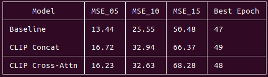
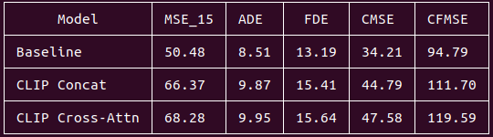
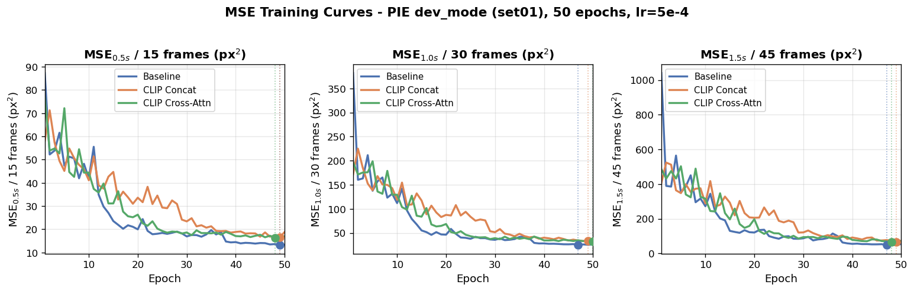
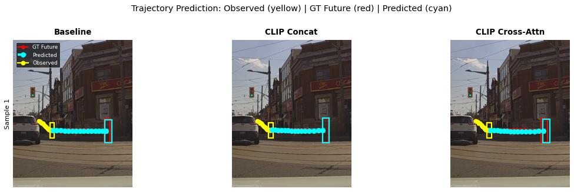

# Design Review: Visual Grounding for Trajectory Safety Uncertainty

## 1. Motivations and Project Summary

One of the problems in state-of-the-art vision foundation models is a 'weak' understanding of the world rules--for example, dynamics (how agents in the scene physically mode), intent (how agents in the scene decide to move), or potential hazards (how interactions of the observer with the environment might play out)--essentially problems that involve examning the current world state, and making an educated guess coupled with interpretable reasoning at what the future states could be. Given the complex nature of robot navigation, VL models have to handle multiple decision boundaries (i.e. tasks informed by some prior) simultaneously, making the underlying results hazy as to whether success is truthfully attributed to the model's capabilities. This lack of interpretability results in no bounded guarantees on safety or accuracy, making the integration of what could be very powerful tools unrealiable in systems where failure, as well as characterization of failure (percentage as well as failure mode) are required.

Making a similar point to the navigation paper audit, the outputs of VLMs and VLAs might lead to a robot making a correct devision, but there is no clear determination that these decisions are causally linked and backed by clear reasoning traces, and not just learned behaviors. In the VLM case, if you were to query Qwen3-VL for example on an image asking it to provide a bounding box for where the human might be in 5 seconds, it will give you a 'guesstimate' that could make sense, but the dynamics and intent determination are not precise enough for applications like autonomous driving. On the other hand with VLAs, prior navigation approaches like VINT (*Visual Navigation Transformer, Shah et al.*) learn traversal behavior through imitation (past experience) without explicit semantic reasoning--any reasoning is implicit, and dataset dependent (in their example, they marketed their robots learning to take a wider swatch around incoming humans as emergent human collision avoidance behavior, but would this work if say, the object approaching was not a human, but another entity?).

This project seeks to tackle a smaller subset of the larger challenge: if VLMs and VLAs can not reason about dynamics well, is there potential for just offloading the task elsewhere, and leaving the semantics purely for high-level reasoning, and not determination (i.e. instead of end-to-end VL model for navigation, use VL model for semantics paired with a dynamics estimation model that informs the VL model)? In a full navigation pipeline, if we can find a way to semantically understand how a scene might evolve, pair that with some estimation model that predicts motion from learned dynamics, will there be potential to link grounded dynamical results to semantic reasoning? If this is possible, I think this approach can help improve safety in the time horizon rollouts that can be used to create safety bounds for autonomous robots.

Small example to help make the problem concrete: say a human is walking along a sidewalk towards a crosswalk with a pedestrian cross traffic light. Dynamics stimation model might be able to predict the following: given A is moving at x m/s, and/or given shape of environment (walkway straight forward, crossing going right), the agent might end up at these locations. Visual frontend semantics will then be able to further inform, this is a pedestrian crossing coming up, there is potential for human to either continue along path or enter crossing. Maybe probability could be higher if pedestrian cross traffic light is on for crossing, and less if it is on waiting signal. Maybe body language of human can inform the intents also. In short, VL model can't do the dynamics and temporal evolution of scene well, and dynamics estimation model is blind to semantic cues in scene.

## 2. Methodology

As mentioned above, I want to find a way to meaningfully integrate a dynamics (yrajectory) prediction model, with a visual semantic front end. For trajectory estimation model, I chose to use SGNet (*Stepwise Goal-Driven Network for Trajectory Prediction, Wang et al.*), because it was made for application relevant to my problem - autonomous vehicles around pedestrians. The model is trained purely on bounding box trajectories. These bounding boxes are extracted from video captures of pedestrian scenes from a ego-vehicle camera, specifically in my case the PIE (pedestrian intent estimation) dataset which was one of the datasets used in the SGNet paper. The method hinges on an approach where they model subgoals at multiple timescales to produce trajectory predictions instead of a single endpoint. My initial thought was to just use a VLM (like Qwen3-VL mentioned earlier) which can do the RGB bbox extraction, and then feed bbox history into SGNet. The approach I ended up doing was to see if I can instead improve the SGNet model by extracting CLIP features from the frames in the captures, and then see if the image features could attend to the predicted bbox trajectory features. In essence, the goal is to produce some linking behind CLIP-aligned visual semantic features to discrete predictions of pedestrian trajectories. While the current problem and dataset is modelled towards pedestrians in a driving scenario, this could be adapted towards other scenarios like an office scene (humans sitting at a desk with potential to turn around and walk away from desk, etc.).

### A. System Components

#### SGNet
SGNet is a recurrent trajectory prediction network built around a CVAE. Given a sequence of observed bounding box coordinates, a linear feature extractor first projects the raw coordinates into a higher-dimensional embedding, which is fed into a GRU encoder that maintains a running hidden state over the motion history. At each encoding step, the hidden state is passed to the Stepwise Goal Estimator (SGE) — a secondary GRU that unrolls intermediate goal predictions across the future horizon rather than predicting a single endpoint. An attention mechanism over these goals feeds back into the encoder, and the resulting hidden state is passed to the CVAE, which samples K latent variables to produce K diverse trajectory hypotheses decoded at each future timestep. At no point does SGNet consume image data, semantic labels, or any signal beyond raw bounding box coordinates.

The training loss follows the original SGNet formulation for the stochastic (CVAE) model:

where:
- Y_hat_k is the k-th trajectory hypothesis sampled from the CVAE decoder
- Y_hat_goal is the stepwise goal prediction from the SGE
- Y_t is the ground truth future position at time t
- The KLD term regularizes the posterior distribution toward the prior

#### CLIP Feature Extraction (Frozen)
For each pedestrian crop defined by PIE bounding box annotations, a frozen CLIP ViT encoder produces a 512-dimensional visual embedding. These embeddings are precomputed and stored offline, keyed by absolute image path and pixel-space bbox coordinates, and looked up at data loading time to align with the corresponding observation frame. The CLIP encoder is not fine-tuned at any stage.

#### PIE Dataset
PIE is an ego-vehicle dataset containing approximately 300,000 labeled video frames captured from a forward-facing onboard camera in urban driving environments. Each pedestrian instance is annotated with:

- Per-frame bounding box coordinates (pixel space)
- Crossing intent label (will cross / will not cross)
- Pedestrian attributes (age, gender, motion state)
- Ego-vehicle speed and GPS coordinates

SGNet's existing PIE dataloader extracts fixed-length sequences of bounding box coordinates as input and future bounding box positions as prediction targets. This project reuses the dataloader with minimal modification, adding a parallel data channel that loads precomputed CLIP embeddings aligned by pedestrian ID and frame index. In particular, I'm currently only using set01 out of 6 sets in total. Set01 has 4 video captures, and the train/val/test split is determined by clip assignment in PIE's default split configuration — different video clips within set01 are assigned to each split. Within each split, overlapping fixed-length windows are sampled to generate individual training examples.

### B. Integration Strategies

Configuration I - Baseline: Standard SGNet of bounding box sequences only. Note that my dataset setup, while using the built in PIE dataloaders, is a little modified so my metrics are not exact paper reproductions, but just used as a baseline comparison for the other integration strategies.

Configuration II - Concatenation: during data loading, 512 dim CLIP embedding for each of the 15 observed frames is concatenated directly onto the bbox at that timestep, given 516-dim input vector. Single linear projection from 516 to 512 is done before fed into GRU. 

Configuration III - Cross-Attention: cross-attention layer between CLIP image features and bbox inputs. In this case, the bbox and CLIP signals travel separately. GRU runs the bbox input as normal, updating hidden state, the hidden (query) attends to CLIP token at that timestep (key and value), and then attention output is added back to hidden state as residual and normalized with LayerNorm.

## 4. Evaluation Metrics

| Metric | Description |
|--------|-------------|
| MSE_15 | Mean squared error over all 4 x1y1x2y2 bbox coordinates in pixel space, averaged over all 45 predicted frames (1.5s horizon at 30fps). Best-of-K=20 CVAE samples per pedestrian. |
| ADE (Average Displacement Error) | L2 norm over all 4 x1y1x2y2 bbox coordinates between predicted and ground truth, averaged over all 45 future timesteps. Best-of-K=20. Units: pixels on 1920x1080. |
| FDE (Final Displacement Error) | Same L2 as ADE but only at the final predicted timestep (1.5s out). Best-of-K=20. Units: pixels. |
| CMSE (Center MSE) | Mean squared error on center coordinates (cx, cy) only, averaged over all 45 future frames. Best-of-K=20. |
| CFMSE (Center Final MSE) | Same as CMSE but only at the final predicted timestep. |

I mostly used the same metrics as the original SGNet paper for consistency. To clarify, MSE05, MSE10, and MSE15 refer to mean squared error at 0.5, 1.0, and 1.5 second predictions. The videos are captured at 30 FPS, with each prediction window spanning 45 frames (i.e. full 45 frames is 1.5, hence MSE15). These metrics are used to show short term, and long term errors.

## 5. Results and Analysis

I ran the training for each model architecture for 50 epochs at a learning rate of 5e-4, matching the original paper's optimizer settings (Adam, lr=5e-4, 50 epochs). I had to use a reduced batch size of 16 vs. the paper's 128 due to compute limitations (training on a single RTX 4060). The paper also notes that lr is dynamically reduced based on validation loss, which was not applied here. Overall training took over a day.

Below are results showing the best MSE over the 50 epochs for each model. Baseline very narrowly beats cross attention, and then concatenation.

The final training metrics are shown below. The two metrics of note are ADE and FDE, which are quite good (around 10-15 px in a 1920x1080 resolution frame) given the limited training setup. In general, the MSE and ADE/FDE values should be taken with a grain of salt, and largely in relation to each other rather than as raw values.

The training curves plotting the MSE values over time can also be seen below:

As well as a sample trajectory overlay visualization in the same style as the original SGNet paper.

## 6. Discussion and Limitations

It should be noted that while a bonus, the goal of this training excercise was not the beat the baseline - I made a very developmental training setup, used only a part of the full training dataset (set01 only out of 6 sets), and essentially added a bunch of noise in the form of CLIP embeddings to a model with very little fine tuning of hyperparameters or training setup. The reward signal is still mostly based on bbox traj accuracy, and not on semantic learning signals even though they are present and attended to - i.e. the loss doesn't explicitly push the model to learn these cues. The PIE dataset has these intent labels built in but were not used, so maybe these could be used in the future with a separate classification head. 

Despite this, the metrics came close to matching the baseline (SGNet). This demonstrated that this is a viable new space to explore that bridges the dynamics estimation model as a tool for VLMs to employ. The addition of CLIP embeddings and cross attention opens up a room for latent space representations for (visual) reasoning behind trajectory prediction. In future work, one could maybe so some VQA-style inspections on scene captures, given the potential for extracting grounding for langauge-based reasoning about the scene using CLIP's text-aligned embedding space. The same architecture could probably reused with a stronger visual backbone too (some other VLM). 

Limitations: 
- Dataset scale: results were limited to the single set01 with 4 video captures. Conclusions about whether CLIP features truly help can not be generalized, but the trends for a demo example are there.
- Training signal: the loss only rewards geometric accuracy of the trajectories, and no explicit supervision (loss) on learning the semantic patterns themselves (i.e. model input is bbox and CLIP embeddings, output is trajectory, not trajectory and reasoning). The weights are still there though (i.e. if we look at some attention map, we can see scene, and attention between visual patches and corresponding trajectories probably).
- Frame-by-frame attention: I realized after training that I actually did cross attention between single CLIP token and bbox from same frame. While this worked sort of okay, a better approach in the future would be to use the entire temporal context window. I.e. currently, can't pull semantics from 5 seconds ago to attend to trajectory reasoning at current timestep, assumption is that things happen immediately as the cues show up.
- Frozen CLIP: visual encoder is not fine-tuning so embeddings are optimized for general image text alignment, not pedestrian motion in particular.