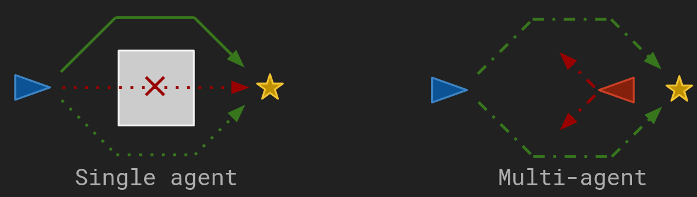
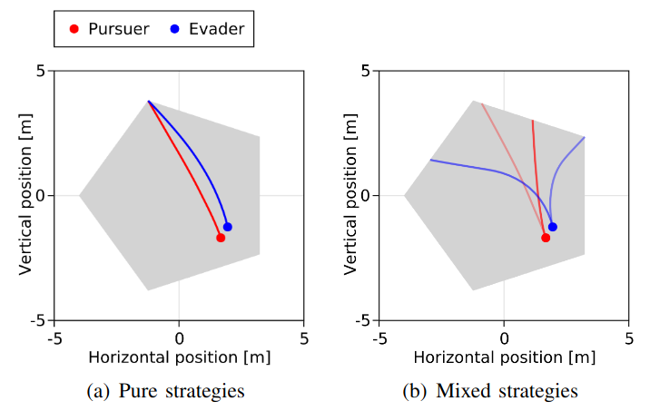
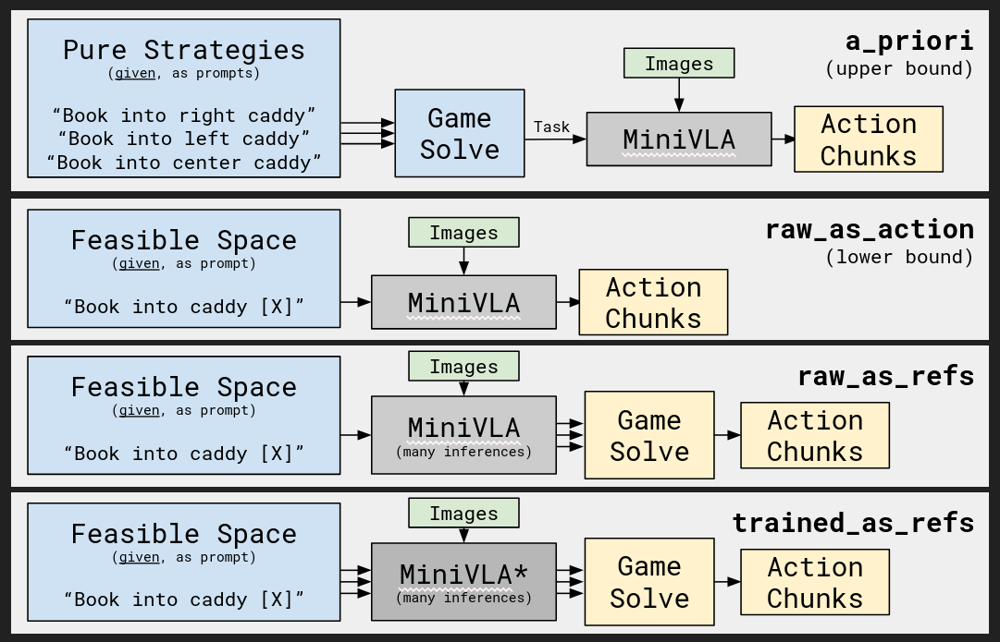
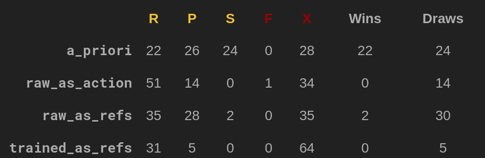

# Using VLAs as Multi-Agent Reference Generators

In single agent systems, we've discussed the failure case called "mode averaging," which occurs when there are multiple equally valid or "good" action sequences, but the average of such action sequences is not itself valid. 
However, as long as a single valid action sequence is chosen (and not an average), other valid action sequences are irrelevant. 

Adding multiagency adds a new variant of this  failure mode.
Under adversarial circumstances, consistently selecting a single valid action sequence is easily exploitable.
An optimal multiagent policy chooses from multiple valid action sequences - not averaging between them, but committing to a single one probabilistically.

The figure below denotes the difference. 
On the left, a single agent avoids mode averaging (red dotted line) by ignoring a second valid action sequence (green dotted line).
On the right, an adversary moves to intercept the agent based on its most likely action sequence, making the single-agent policy suboptimal and incentivizing the agent to use both valid action sequences.

In game theoretic terms, a system capable of producing the "pure strategy support set" (in this case, the valid action sequences) is known as a *reference generator*. 
Reference generation in continuous games is difficult, but sometimes high-level semantic information can be used as a hint. As such, I wondered if a VLA could be used as a reference generator for a robotics game. 

In this capstone project, I explore this possibility:

* I show that the multiagent failure case described above exists for an autoregressive VLA.
* I show a few naive ways of avoiding this failure case without requiring additional VLA training.
* I attempt finetuning with a modified loss to incentivize policies that avoid this failure case.

I test on a trajectory-based version of "rock-paper-scissors" (RPS), though the question at hand is not whether a VLA can play RPS.
Rather, I'm interested in whether a VLA-based system can learn that "rock," "paper," and "scissors" are the relevant trajectories for the game, without a human manually indicating those three trajectories.

### QoL: Changes from CDR
For your reading efficiency: This section and the [Results](#results) section have been modified since the CDR.

# The theoretical foundation

## The intuition: Strategic randomness in adversarial settings 
Imagine a game of tag played between two navigating point mass "robots" with second order dynamics. 
(This is not the game used in the project, but it is more illustrative.)

Players plan simultaneously, with knowledge of opponent state. 
How should the blue player - the evader - plan to avoid the red player when an obstacle? 
The optimal next action for the blue point mass in many configurations is distributed bimodally: it can either turn left or turn right. 
The red player can then also turn left or turn right. 
The figure below distinguishes between the behavior when only a single trajectory is permitted (left) versus both modes (right).

**Multiagency introduces a new detail in resolving this multimodality.** 
We have discussed the typical single-agent failure case in such situations: selecting a trajectory in between these modes results in a suboptimal trajectory (crashing into the wall). 
However, in the _multiagent_ case, it is also true that selecting _any single mode_ with 100% probability allows a wise pursuer to always move in the same direction, easily catching up. 
The optimal behavior is to choose one of these two nodes stochastically, which requires that both modes be represented.

## The formalization: Mixed strategies in game theory

This intuition is formalized by game theory.
While a full primer on game theory is out of scope, we provide a few basic definitions. 

In game theoretic language, tag is an example of a game-theoretic _trajectory game_ played in continuous space. 
The modes described above (left or right) are _pure strategies_. Agents (players) are said to probabilistically _mix_ over pure strategies, committing to one only during policy execution. 
Ideally, both agents mix over sets of pure strategies to reach a _Nash equilibrium_, an optimal point of mutual unexploitability with rich guarantees. 

We denote the set of all possible pure strategies $A^{(i)}$ for player $i$. In a trajectory game played between two 7-dof robots, $A^{(i)} = \mathbb{R}^{7 \times T}$ for horizon $T$. 
Each player incurs cost $f^{(i)}(a^{(1)}, a^{(2)})$ when trajectories $a^{(1)} \in A^{(1)}, a^{(2)} \in A^{(2)}$ are chosen. 
In expectation, players incur cost $\int_{a^{(1)} \in A^{(1)}} \int_{a^{(2)} \in A^{(2)}} p^{(1)}(a^{(1)}) p^{(2)}(a^{(2)}) f^{(i)}(a^{(1)}, a^{(2)}) \;\;\textrm{d}a^{(1)} \;\; \textrm{d}a^{(2)}$ when playing strategy $a^{(i)}$ with probability $p^{(i)}(a^{(i)})$.

In a trajectory game, a player's Nash equilibrium mix $p^{(i)}$ may have support over the entire continuous set of pure strategies $A^{(i)}$. 
Fortunately, [certain common classes of trajectory games require only finite pure strategy support](https://arxiv.org/pdf/0707.3462) - for instance, in the tag game above, only one "left" and one "right" trajectory need to be considered. 
This finite set of pure strategies is denoted $\bar{A}^{(i)}$, with $\bar{A}^{(i)} \subset A^{(i)}$.

Knowing this finite set of pure strategies (trajectories) makes it possible to easily find a Nash equilibrium to a trajectory game, because the game takes on the form of a _matrix game_: by assuming some ordering on $\bar{A}^{(i)}$ and expressing $p^{(i)}$ as a vector in the same order, the cost can be expressed as ${(p^{(1)})}^\intercal M^{(i)} p^{(2)}$, where $M^{(i)}_{a, b} = f^{(i)}(\bar{A}^{(1)}_a, \bar{A}^{(2)}_b).$ 

Calculating the $p^{(i)}$ for a Nash equilibrium in a matrix game is easy, so it is desirable to generate good "reference trajectories": trajectories which are close to a valid pure strategy set $\bar{A}^{(i)}$. 
But generating good reference trajectories [is nontrivial](https://arxiv.org/pdf/2205.00291). 

## The delta: Loss derivation

Could we use a VLA to generate appropriate reference trajectories?

Humans are good at identifying important strategies among infinite, contextualized possiblities - the "right" and "left" options in the tag example above stand out easily. 
This ability to wisely discretize problems is embedded in human language, so it is possible that a VLA could exploit language modeling for the same effect. 
To that end, I wanted to try **a full fine-tuning step for OpenVLA-Mini that embeds the game-theoretic cost** of using it as a reference generator. 

This is an imitation-learning setup. 
Each expert example trajectory is treated as an "intended" reference trajectory, so the dataset of expert examples forms $\bar{A}^{(1)}$. 
We label each example with the element of $\bar{A}^{(1)}$ reference trajectory to which it corresponds. 
Then, at each training step, we map each ground truth action chunk to its intended reference trajectory, producing a set of reference trajectories $\tilde{A}^{(1)} \subseteq \bar{A}^{(1)}$.

$\tilde{A}^{(1)}$, along with a fixed set of opponent pure strategies $\bar{A}^{(2)}$, can be used to set up a matrix game as described above. 
We solve this matrix game and weight the loss of each sample $a$ in the batch by the Nash equilibrium probability with which the corresponding element of $\bar{A}^{(1)}$ is played, denoted $p(a)$. 
This means that **strategically important errors feature more aggressively in the loss**.

This results in the following loss formulation, where $g$ is the ground truth action:

$L_\textrm{game}(a, g) = p(a) L_\textrm{ntp}(a, g)$ 

$L_\textrm{ntp}$ is the typical next token prediction loss.

In practice, calculating $p$ mid-training is very inefficient. 
This can be remedied by aliasing each expert example with a _reference group_, such that similar examples are considered to be strategically identical. 
Then, we restrict that $\tilde{A}^{(1)}$ may contain at most one member of each reference group.
Every possible combination of reference groups may result in a different Nash equilibrium, but if the number of reference groups is low, it is possible to precompute all possible equilibria.
This results in the following loss structure:

$L_\textrm{game}(a, g) = \frac{p(r(a))}{n^*(r(a))} L_\textrm{ntp}(a, g)$

where $n^*(r(a))$ is the number of times reference group $r(a)$ appears in the batch.

# The environment

## The adversarial task: Trajectory rock-paper-scissors

Our task of interest is **optimally playing the game of rock-paper-scissors** (RPS). 
This game has a single mixed-strategy Nash equilibrium where both players pick a hand trajectory from a specific pure-strategy of three, mixing with uniform random probability.

Of course, we could stochastically pick rock, paper, or scissors first, then use the VLA to execute the corresponding trajectory. 
However, not all trajectory games have pure strategies that are easily identifiable and translate well to language. 
For the purposes of this project, we pretend RPS is this more opaque type of game. 
We have some domain information available - like "pure strategies are distinct hand motions" - but more detail is unknown.

We discuss how the robot articulates the RPS actions [further below](#action-mapping).

## The adversary

We only train a single agent in this project. 
The adversary does not appear in the environment, and is not observerd by the robot agent except through the reward signal. 
This is consistent with the [model predictive gameplay model](https://arxiv.org/pdf/1910.09713), where agents plan trajectories in Nash equilibrium. 
This means agents are aware of the _probability_ with which the opponent may take a particular trajectory, but not aware of the actual trajectory that will be taken. 
One might imagine a human off-screen acting as the adversary.

The adversary plays only one of `rock`, `paper` and `scissors` - whichever action empirically gives the greatest likelihood of beating the robot agent. 
Solutions to possible matrix games before the training loop, as described [above](#the-delta-loss-derivation), effectively play against this agent.
During evaluation, I use it explicitly. 
Any set of reference groups that represents all three of `rock`, `paper`, and `scissors` results in the exploitative 

**Note**: Why do I only train a single agent in this multi-agent project? 
Cotraining two agents adversarially - even with stable self-play methods - is not trivial, and introduces some confounds with the intended thrust of this project. 
Furthermore, limiting training to a single agent allows use of typical single-robot datasets, as described below.

## The data source
Designing a brand new dataset is a task best avoided if possible. 
As such, we opted to leverage an existing dataset, LIBERO, for these experiments.

### Action mapping

The LIBERO dataset uses the Franka Panda arm, which is clearly incapable of articulating the "rock," "paper," and "scissors" hand shapes with its gripper.
Instead, we map them to behaviors in a particular environment. Specifically, we use the LIBERO-90 "study" scene, which happens to feature a caddy with several compartments. 
We map the "front," "left," and "right" compartments of the caddy to "rock," "paper," and "scissors," and treat placing any item in the compartment as taking the corresponding game action. 
Placing items in the back compartment of the caddy is considered a forfeit.
Not placing an item in the caddy, or placing multiple items in the caddy, are considered failures and have the same outcome as a forfeit.

This allows for a data breakdown that matches the loss specification. 
The task "place an item in the caddy" specifies a nonspecific subset of all possible actions. 
We can also use the four compartments of the caddy as reference groups.

### Data mixing

Generalized visual and language reasoning is not a component of this project. 
We only need enough to recognize the "caddy," items that can be placed into it, and directional concepts like "left" and "right."

As such we opted to use pure LIBERO-90 data _without_ mixing in any VQA examples like those used in training OpenVLA-Mini's backbone (Llava-1.5-Instruct VQA). 

# The architecture

## VLA design

The VLA used by the robot agent is based on OpenVLA-Mini.
[OpenVLA-Mini is more often referred to as MiniVLA, but I refer to it by its repository name here to avoid confusion with [the other MiniVLA](https://github.com/keivalya/mini-vla)]. 

### Vision backbone: DINOv2+SigLIP
This is not a vision-heavy project - we need only reason about the objects present in the `LIBERO-90` dataset. 
Lacking any need for further modification, we opted for the DINOv2+SigLIP combination used by OpenVLA and OpenVLA-Mini. 
We use only single images. 

### Language backbone: Qwen2.5-0.5B
We follow the example of OpenVLA-Mini and use Quen2.5-0.5B as the language backbone. 
OpenVLA-Mini used this model due to its small footprint. 
The resulting faster inference and training times are suitable for a class project. 

### Action tokenization: LIBERO VQ
OpenVLA used a trivial binning scheme to tokenize actions. 
One of the advancements of OpenVLA-Mini was the use of vector quantization (VQ-BeT specifically). 
OpenVLA-Mini comes with a LIBERO-trained VQ, which we have chosen to use.

We briefly experimented with a VQ trained specifically on the office scenes from LIBERO-90, but ultimately could not show a positive performance impact.

# Results

## The comparisons: Upper and lower bounds

We consider four different possible robot policies.

### `raw_as_action`
For the `raw` agent, the task is "put the book in the caddy," and no further modifications are made. 
This results in an arbitrary policy; each game action may be taken (including `forfeit`). 
In practice, this task nearly always results in the `rock` game action (front compartment) being played, assuming a valid game action is taken.

`raw` is a lower bound. 
An intelligent adversary should be expected to exploit a policy which always plays `rock` by always playing `paper`. 
Preliminary benchmarks show that this agent wins about 15% of the time, draws about 15% of the time, and loses the rest of the time against the `nash` adversary.

### `raw_as_references`
This agent is the same as the `raw_as_action` agent, but multiple action chunks are sampled at each step to serve as reference trajectories, then probabilistically selected according to a matrix game solve. 
No additional training is used.

`raw_as_references` is expected to perform near-identically to `raw_as_action`.

### `trained_as_references`
This agent uses the modified loss term described above, then generates actions as references and performs a matrix game solve similarly to `raw_as_references`.

This is our "target" policy.

### `a_priori`
In this rock-paper-scissors scenario, the correct reference trajectories are known _a priori_ and are easily represented in language. 
By selecting the intended behavior _first_ using the optimal mix and then using the VLA to carry it out, we can avoid needing to represent strategic multimodality in the VLA at all. 
Specifically, the `a_priori` agent selects one of the tasks "put the book in the [left/right/center] compartment of the caddy" with 1/3 probability each, then prompts the VLA with that task.

`a_priori` is an upper bound. 
In general, the trajectory references are not known _a priori_, and may not be well represented by language.

## Hypotheses

I tested two main hypotheses, both measured in terms of successes against the exploitative opponent.
1. `a_priori` ≥ `raw_as_refs` ≥ `raw_as_action`. This validates the bounds. This hypothesis was **supported.**
2. `trained_as_refs` ≥ `raw_as_refs`. This tests the performance of the loss tweak. This hypothesis was **not supported.**

Each approach played 100 games of RPS.
The exploitative adversary played the single move which empirically beat the agent most often.
The behavior for eahc approach is summarized below, where "R," "P," and "S" are the RPS actions, "F" are forfeits, and "X" are failures.

Failures occur often, with a frequency consistent with OpenVLA-Mini's performance on LIBERO-90 as a whole. 
The VLA appears to most often use the `rock` caddy compartment under ambiguity. 
Other modes were possibly not represented at all - some portion of the "P" and "S" cases were likely failures that happened to result in a valid move. 

`trained_as_refs` behaves very poorly. 
The initial model was already trained on LIBERO-90, so it was expected that modifications via FFT would only increase the failure rate.
However, this failure rate does not come with an increase in game action variety.
I attribute this to a poor choice of VLA.
OpenVLA-Mini is autoregressive, so the problem of mode averaging is not suitably handled even in the single agent case.

# Limitations

## Imitation learning for reference generation
The imitation learning approach used here is a poor way to discover reference trajectories, as it assumes the reference trajectories are essentially already known, if not narrowed down.

The more interesting use case for this approach would be a generalized one, in which many games exist in the training data and game-playing instructions are given as the task specification. 
If reference trajectories could be generated in unseen games, this tool would be more useful.

## Autoregression versus diffusion for mixed strategies

Using an autoregressive policy (like that of OpenVLA-Mini) as a reference generator is a poor choice compared to a diffusion policy, which is likely to better represent the modes of the problem. 
I was interested in validating this fact, and possibly alleviating it for the specific case of strategic multimodality. 
However, in retrospect, applying it on a diffusion model would likely produce better results.