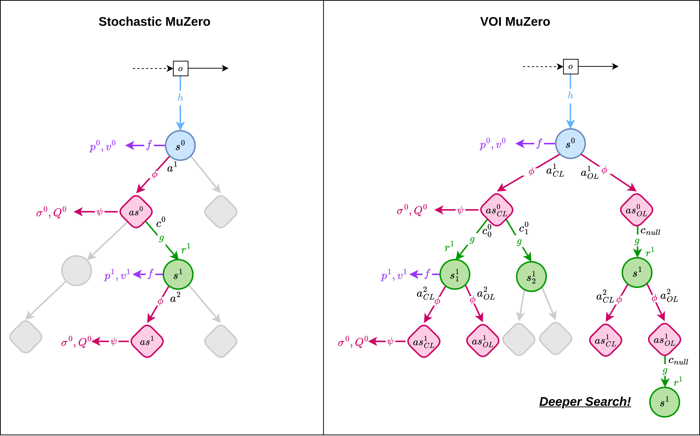
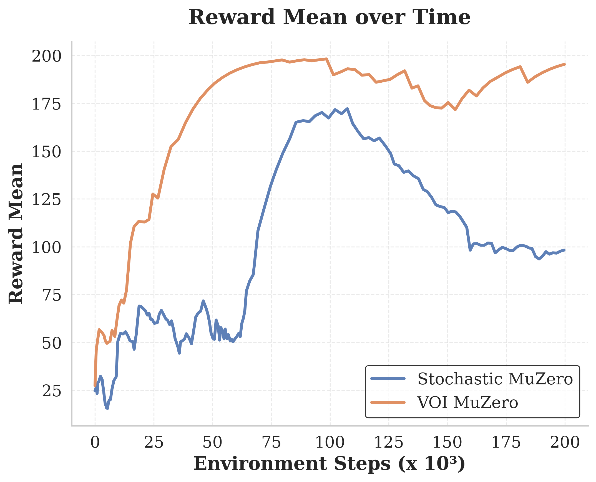
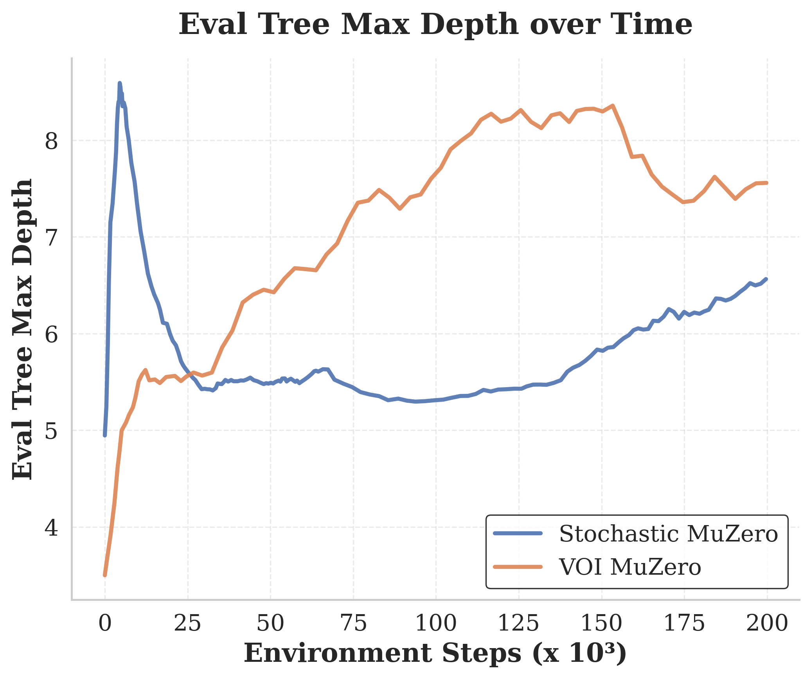
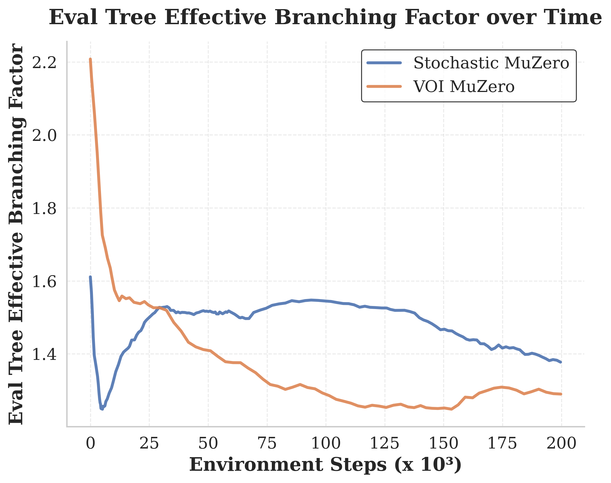
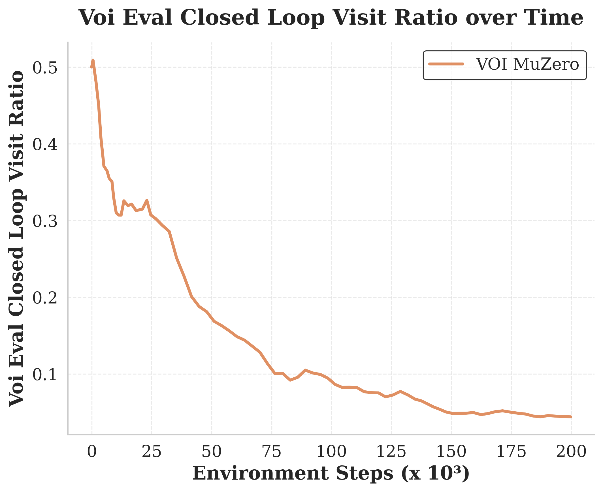

# VOI MuZero: Value of Information-Guided Planning with Learned Stochastic Models

**Critical Design Review**

## 1. Motivation

Sequential decision making in uncertain environments is a significant challenge.
Model-based reinforcement learning (MBRL) strategies like *Stochastic MuZero* offers a powerful framework for tackling this problem by learning a model of the environment and using it for planning [1].
However, in stochastic environments, reasoning about the full uncertainty can lead to combinatorial explosion in the search tree, limiting the depth of planning and thus performance of the agent.

We propose **VOI MuZero**, an extension of Stochastic MuZero that incorporates adaptive Value of Information (VOI) reasoning.
By introducing a duplicated action space with open-loop and closed-loop modalities, VOI MuZero selectively bypasses stochastic branching when reasoning about chance outcomes provides little decision-relevant value.
This enables deeper search trees within fixed computational budgets allowing for **longer-horizon planning**.

### Value-Equivalent Model Learning

The value-equivalent principle states that a learned model need only reconstruct quantities required for planning, not full environment dynamics [2].
MuZero operationalizes this by learning latent dynamics trained to predict rewards, values, and policies [5].
Stochastic MuZero extends this to stochastic environments by learning the distribution over chance outcomes at each state. 
However, it requires branching over all *M* possible outcomes at every afterstate—even when such branching provides negligible decision-relevant information.

### Adaptive Value of Information

The value of information (VOI)—the performance gain from reasoning about chance outcomes—varies across the state space.
My recent work on leveraging the value of information in planning in partially observable environments shows that dynamically switching between open-loop (ignoring observations) and closed-loop (reasoning over observations) execution based on local VOI can reduce planning complexity while maintaining bounded suboptimality [4].

### Main Idea

VOI MuZero embodies the principle that *a value-equivalent model should learn not only what to predict, but when prediction of stochastic outcomes matters for decision-making*.
When VOI is low, open-loop actions collapse chance branching from *M* to 1, enabling deeper search.
Following [4], we adopt a threshold κ that provides a principled knob of interpolating between full closed-loop planning (κ=0) and pure open-loop planning (κ=1).

---

## 2. Background

### MuZero

MuZero is a model-based reinforcement learning algorithm that learns a latent dynamics model of the environment to perform planning via Monte Carlo Tree Search (MCTS) [5].
It consists of three main components:
1. **Representation function** $h$: Encodes observation histories into latent states
2. **Dynamics function** $g$: Predicts next state and reward given current state and action
3. **Prediction function** $f$: Outputs policy and value estimates from latent states

The model is trained end-to-end to predict rewards, values, and policies, enabling it to learn a decent model for planning.
The issue is that MuZero assumes a deterministic environment, allowing only a single latent state to be predicted given an action.
Stochastic MuZero extends this by learning a distribution over possible next states.

### Stochastic MuZero

Stochastic MuZero factorizes one-step dynamics into:

1. **Representation function:** $s_t = h(o_{\le t})$

2. **Afterstate dynamics:** $as_t = \phi(s_t, a_t)$

3. **Afterstate prediction:** $(\sigma_t, Q_t) = \psi(as_t)$

4. **Dynamics:** $(s_{t+1}, r_{t+1}) = g(as_t, c_{t+1})$ where $c_{t+1} \sim \sigma_t$

5. **Prediction:** $(p_t, v_t) = f(s_t)$

Here, the dynamics are factored into a deterministic afterstate transition followed by a stochastic transition determined by sampling from the code distribution σ.
Stochastic MuZero models environment stochasticity using a **codebook**—a discrete set of *M* codes that represent possible chance outcomes.
Each code $c_i$ is a one-hot vector:

$$
c_i = \text{one-hot}(i) \in \{0,1\}^M, \quad i \in \{1, \ldots, M\}
$$

For example, in 2048, codes might represent different tile spawn outcomes; in Backgammon, they capture dice roll results.
An **encoder** network $e(o_{\leq t})$ maps observation histories to codes, learning which discrete outcome best summarizes the stochastic transition that occurred.
During planning, the model doesn't have access to future observations, so it instead predicts a **distribution** σ over codes from each afterstate, then samples to simulate possible futures.

### The Branching Problem

During Monte Carlo Tree Search, the tree alternates between:
- **Decision nodes**: Select actions via pUCT:

$$
a^* = \arg\max_a \left[ Q(s, a) + c \cdot P(s, a) \frac{\sqrt{N(s)}}{1 + N(s, a)} \right]
$$

  where $Q(s, a)$ is the mean action-value estimate, $P(s, a)$ is the prior probability from the policy network, $N(s)$ is the visit count of the parent node, $N(s, a)$ is the visit count of the child, and $c$ is an exploration constant.

- **Chance nodes**: Sample codes from σ, potentially branching into *M* children

This branching at every chance node is computationally expensive—and often unnecessary when the VOI is low.

---

## 3. Architectural Delta: VOI MuZero

### Status Quo Limitations

Although the MuZero architecture explictly supports stochastic environments, it relies on a fixed domain specific codebook. 
This is an issue since, the true stochasticity may vary across states in the environment.
Stochastic MuZero's chance branching occurs at *every* afterstate, regardless of whether the stochastic outcome meaningfully affects the optimal policy.
In many states, the same action would be optimal regardless of the chance outcome.
Yet the search tree still expands *M* branches in the worst case, consuming computational budget that could enable deeper search.

### Proposed Changes

#### 1. Expanded Codebook with Dummy Code

We augment the codebook from *M* to *M+1* codes by adding a **dummy code** $c_{\text{null}}$:

$$
\mathcal{C} = \{c_1, c_2, \ldots, c_M, c_{\text{null}}\}
$$

The dummy code $c_{\text{null}}$ is implemented as a fixed one-hot vector similar to the existing codes but reserved for open-loop execution.
When the dynamics function receives $c_{\text{null}}$, it produces a **marginalized next state**—representing the expected outcome across the chance distribution rather than a specific realization.

#### 2. Duplicated Action Space

We augment the action space: $\mathcal{A}' = \mathcal{A}^{OL} \cup \mathcal{A}^{CL}$ as shown in the figure above:

- **Open-loop actions** $a^{OL}$: Deterministically use $c_{\text{null}}$, collapsing branching to 1
- **Closed-loop actions** $a^{CL}$: Sample from σ as usual, branching up to *M*

#### 3. VOI-Aware Action Selection (VOI-pUCT)

We modify pUCT to bias toward open-loop when VOI is low.
For closed-loop actions, we deflate the exploitation term by factor κ:

$$
\text{UCB}^{VOI}(s, a^{OL}) = Q(s, a^{OL}) + \text{bonus}(s, a^{OL})
$$

$$
\text{UCB}^{VOI}(s, a^{CL}) = Q(s, a^{CL}) - \kappa |Q(s, a^{CL})| + \text{bonus}(s, a^{CL})
$$

This κ-deflation creates bias toward open-loop execution when Q-values are similar, paying the cost of stochastic branching only when justified by sufficient VOI.

### Summary of Changes

| Component | Stochastic MuZero | VOI MuZero |
|-----------|-------------------|------------|
| Codebook size | *M* (one-hot codes) | *M + 1* (+ dummy code) |
| Action space | \|𝒜\| | 2\|𝒜\| (OL + CL variants) |
| Chance branching | Always up to *M* | *M* (CL) or 1 (OL) |
| Selection formula | pUCT | VOI-pUCT with κ-deflation |

---

## 4. Evaluation and Results

**Research Questions**
1. Does VOI MuZero match or exceed Stochastic MuZero performance?
2. Does VOI-guided pruning enable longer horizon planning?

**Baselines**: Stochastic MuZero

**Benchmarks**: Stochastic variant of CartPole

**Metrics**
- *Performance*: Episode reward
- *Efficiency*: Max search depth, effective branching factor
- *VOI-specific*: Open-loop action frequency

## 6. Future Work
1. **Real-World Applications**: Test VOI MuZero in real-world robotics domains where stochasticity (dynamics/observations) is prevalent and computational budgets are tight.
2. **Continuous Outcome Spaces**: Extend the codebook to handle continuous stochastic outcomes via variational autoencoders or normalizing flows.
3. **Adaptive κ Tuning**: Explore meta-learning or bandit algorithms to adaptively tune κ during search based on observed VOI.

## References

1. Antonoglou, I., Schrittwieser, J., Ozair, S., Hubert, T., & Silver, D. (2022). Planning in stochastic environments with a learned model. *ICLR*.

2. Grimm, C., Barreto, A., Singh, S., & Silver, D. (2020). The value equivalence principle for model-based reinforcement learning. *arXiv:2011.03506*.

3. Howard, R. A. (1966). Information value theory. *IEEE Trans. Systems Science and Cybernetics*, 2(1), 22-26.

4. Laouar, Z., Ho, Q. H., & Sunberg, Z. (2026). Leveraging the value of information in POMDP planning. *ICAPS*.

5. Schrittwieser, J., et al. (2020). Mastering Atari, Go, chess and shogi by planning with a learned model. *Nature*, 588(7839), 604-609.
---

