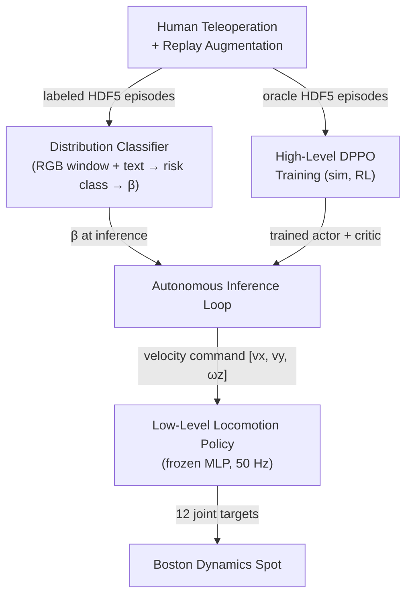

# Critical Design Review: Risk-Aware Navigation for Legged Robots via VLMs

## 1. Project Summary

This project develops a risk-aware autonomous navigation system for the Boston Dynamics Spot quadruped operating in an environment with various terrain traps.
This simulates typical field robotics navigation scenarios where the robot must choose how to navigate features of the envrionment that could pose a risk to the platform.
This contribution introduces a principled approach to navigation in variable terrain environments which improves the robot's ability to balance efficient navigation with risk.
The system uses a hierarchical two-level control architecture: a frozen low-level locomotion policy handles joint-level motion, while a trainable
high-level policy outputs velocity commands conditioned on a continuous risk parameter, Beta.
A vision-language distribution classifier estimates scene risk from onboard camera observations and maps it to Beta at inference time.
The high-level policy is trained entirely in simulation using distributional PPO with a Wang-distorted quantile critic, enabling the robot to modulate
between risk-seeking and risk-averse navigation behavior based on perceived environmental hazard.

---

## 2. System Architecture



### Low-Level Locomotion Policy

Following Schneider et. al [1], we use a pre-trained, frozen MLP running at 50 Hz. It takes a 48-dimensional proprioceptive observation vector (joint positions/velocities, base velocity, gravity projection, velocity command) and outputs 12 joint position targets.
This policy is never fine-tuned; the high-level system controls it entirely through the velocity command slice of its observation.

### High-Level DPPO Policy

A trainable policy running at 10 Hz. At each high-level step it constructs a 127-dimensional observation, produces a velocity command via a squashed Gaussian actor, and injects it into the low-level policy's observation. The policy is trained from scratch in simulation using reinforcement learning. A behavior-cloning warm-start from oracle teleoperation data optionally initializes both actor and critic before PPO begins.

### Distribution Classifier

A vision-language model that classifies the current scene's risk distribution from a rolling 10-frame RGB window and a natural language instruction. The predicted class is mapped to a scalar Beta value, which is passed to the high-level policy at inference time to modulate risk behavior.

---

## 3. Observation and Action Spaces

### High-Level Observation (127-dimensional)

| Group | Content | Dim |
|-------|---------|-----|
| Pose | World XY position, heading (sin/cos of yaw) | 4 |
| Velocity | Achieved linear and angular velocity (robot frame) | 3 |
| Stability | Projected gravity Z component | 1 |
| Risk | Beta - risk-sensitivity parameter | 1 |
| Environment | Height scan (radial arc, 180° forward, 6 rings × 19 angles) | 114 |
| History | Previous high-level velocity command | 3 |
| Progress | Time fraction through episode horizon | 1 |

**Goal position is intentionally excluded from the observation.** Navigation toward the goal emerges from the reward structure rather than being directly encoded in state. This encourages the policy to develop robust exploratory behavior rather than relying on explicit goal-seeking.

### Action Space

Continuous 3-D velocity command with asymmetric bounds:

| Axis | Min | Max | Notes |
|------|-----|-----|-------|
| Forward (v_x) | −0.5 m/s | +3.0 m/s | Forward-biased; reverse limited to discourage retreat |
| Lateral (v_y) | −1.5 m/s | +1.5 m/s | Symmetric |
| Yaw (ω_z) | −2.0 rad/s | +2.0 rad/s | Symmetric |

---

## 4. Risk-Sensitive RL Algorithm

The high-level policy is trained with Distributional PPO (DPPO), a variant of PPO that maintains a full distribution over returns rather than a scalar value estimate.

### Actor

A Gaussian actor with tanh squashing following [1, 2]. Trained with the PPO clipped surrogate objective plus an entropy bonus. The policy is conditioned on Beta at every step, allowing a single trained network to represent the full spectrum from risk-averse to risk-seeking behavior.

### Critic

A quantile value critic that represents the return distribution as a set of quantile estimates. Trained with the **Energy Distance** loss (a proper scoring rule for distributional regression) and **n-step** bootstrapped targets for improved credit assignment.

### Risk-Sensitive Advantage Estimation

Standard GAE is replaced with a risk-sensitive variant using **Wang distortion**:

$$g_\beta(\tau) = \Phi\!\left(\Phi^{-1}(\tau) + \beta\right), \quad \beta \in [-1, 1]$$

where Φ is the standard normal CDF. This distorts the quantile weights used to aggregate the critic's return distribution into a scalar advantage estimate. Positive Beta up-weights upper quantiles (risk-seeking); negative Beta up-weights lower quantiles (risk-averse). Beta is sampled uniformly per episode during training so the policy learns to respond to the full range.

### Behavior-Cloning Warm-Start

Before PPO begins, both the actor and critic can be pre-trained on oracle teleoperation episodes using supervised objectives.

---

## 5. Distribution Classifier

### Architecture

```
10 RGB frames (240×320, rolling 10 Hz window)    Natural language instruction
                │                                           │
                ▼                                           ▼
     Frozen vision encoder                    Frozen CLIP text encoder
     (patch-level features)                   (sentence embedding)
                └──────────────────┬──────────────────────┘
                                   ▼
                          Trainable Q-Former
                          (32 learnable queries;
                           cross-attention to vision and text)
                                   │
                          Mean-pool → MLP classifier
                                   │
                          5-class risk distribution logits
```

### Risk Distribution Classes

| Class | Label | Interpretation |
|-------|-------|----------------|
| 0 | Small tail | Low-variance, mostly safe trajectory distribution |
| 1 | Heavy tail | High-variance, significant failure probability |
| 2 | Bimodal | Two distinct outcome clusters |
| 3 | Plateau | Broadly uncertain, no dominant outcome |
| 4 | Unknown / misc | Out-of-distribution or ambiguous scene |

Each class is mapped to a scalar Beta value at inference, which is then held constant for the duration of that inference window before the next classification update.


---

## 6. Data Generation Strategy

Data collection uses two complementary approaches to build a labeled dataset of warehouse navigation episodes.

### Human Teleoperation

An operator drives Spot through the warehouse using a gamepad controller at 50 Hz. Observations are logged at 10 Hz (RGB, proprioception, height scan, rewards) while velocity commands and low-level control signals are logged at full policy rate (50 Hz). Each episode is labeled with a distribution class based on the navigation scenario (e.g., clear aisle vs. cluttered environment). Episodes are terminated on success (reaching the goal), fall/collision, or operator input.

### Replay-Based Scaling

Recorded velocity command sequences are replayed through Isaac Sim using the same locomotion policy. The command sequences are identical, but the outcomes they
produce differ slightly due to the underlying low-leevvel locomotion policy. This allows for multiplying the dataset without additional operator time:

- **Pass 1 (exact replay):** The recorded command sequence is replayed verbatim. The low-level locomotion policy introduces noisy actions for data diversity.

Success labels in replayed episodes are assigned independently based on whether the robot reaches the goal in the replay - not inherited from the source episode.


---

### Training

The classifier trains on RGB observations only and is independent of the height scan. An 80/20 episode-level train/validation split is used with data augmentation. The vision and text encoders remain frozen throughout; only the Q-Former and classifier head are trained.

---

### Dataset Status

| Class | Status |
|-------|--------|
| Class 0 (small tail / safe) | Collected and being scaled via replay |
| Class 1 (heavy tail / risky) | Collected and being scaled via replay |
| Classes 2–4 | Deferred; to be collected in a future phase |

---

## 7. Reward Design

Nine reward terms shape navigation behavior. All component signals are stored unweighted alongside a pre-computed weighted total, enabling offline re-weighting without re-collection.

| Term | Weight | Description |
|------|--------|-------------|
| Time penalty | −0.1/step | Constant urgency cost; incentivizes efficiency |
| Termination penalty | −100 (terminal) | Dominates all per-step rewards on fall or collision; makes failure unambiguous |
| Goal reached | +10 (terminal) | Sparse bonus for reaching the target |
| Forward velocity | +0.5 × max(v_x, 0) | Rewards forward progress; zero for reverse |
| Command tracking | +1.0 | Penalizes deviation between commanded and achieved velocity |
| Command smoothness | +0.5 | Penalizes jerk (large changes in velocity command) |
| Uprightness | +0.5 | Rewards maintaining level body orientation |
| Body contact | +0.01 | Penalizes non-foot contact forces (light collision signal) |
| Goal approach | 0.0 (disabled) | Kept in codebase for ablation; disabled in main training |

The termination penalty weight (currently −100) was deliberately set high to ensure that even long successful episodes cannot mask the cost of a single fall in the return distribution.

---

## 8. Evaluation Plan

### 8.1 Protocol

A trained Spot agent is placed at a fixed start position and must navigate to a fixed goal position.
The evaluation environment contains multiple paths of different risk levels; the agent must choose between them or traverse them depending on the condition.
This evaluation design follows from [1].

Each trial runs until one of four terminal conditions is met:

| Terminal Condition | Type |
|--------------------|------|
| Goal reached | Success |
| Fall detected | Catastrophic failure |
| Non-foot body contact detected | Behavior failure |
| Episode timeout | Stuck / unresponsive failure |

**N trials** are run per condition per terrain configuration. Two navigation modes are tested:

- **Free navigation** - the agent selects its own route through the environment
- **Forced route** - the agent is constrained to a specific path, isolating the effect of Beta on movement behavior independent of route choice

**Beta assignment strategies tested:**

| Condition | Beta Source |
|-----------|-------------|
| Fixed β = +1.5 | Risk-seeking baseline |
| Fixed β = 0 | Neutral baseline |
| Fixed β = −1.5 | Risk-averse baseline |
| VLM-conditioned β | Our proposed system (classifier → Beta) |
| Random β | Statistical lower bound (tests whether VLM conditioning matters vs. chance) |

All evaluation runs use fixed random seeds and a fixed initial state set. Confidence intervals are reported across seeds.

---

### 8.2 Quantitative Metrics

**Performance:**

| Metric | Description |
|--------|-------------|
| Success rate | Fraction of trials reaching the goal |
| Catastrophic failure rate | Fraction of trials ending in a fall |
| Failure type breakdown | Distribution of failure modes (fall / collision / timeout) per condition |
| Time-to-goal | Steps/seconds to goal on successful trials |
| Discounted return | Average episode return under fixed discount factor |

**Safety (high granularity):**

- Fall events (terminal failures requiring reset)
- Non-fall collisions (recoverable contact events)
- Near-fall events (tilt/gravity projection crosses warning threshold without terminal failure)
- Collision severity bins (light / medium / heavy, by contact force magnitude)
- Cumulative collision duration per episode
- Command saturation rate per velocity axis (fraction of steps where the actor hits the action bound)

---

### 8.3 Comparisons with Prior Work

The primary related work is Schneider et al. [1], who apply distributional RL to risk-aware quadrupedal locomotion. Key differences to highlight in the comparison:

- **Beta conditioning**: Schneider et al. use distributional RL for locomotion robustness; this work extends it to high-level navigation with a continuously adjustable, VLM-estimated Beta.
- **Risk signal source**: their risk is implicit in terrain difficulty; our Beta is estimated from visual scene context via a vision-language classifier.
- **Task scope**: locomotion stability vs. goal-directed navigation with route selection.

A direct numerical comparison is not possible (different environments and tasks), but success/failure rate trends and the behavioral response to Beta can be discussed qualitatively relative to their findings.

---

### 8.4 Risk-Sensitivity Validation

The core hypothesis is that Beta monotonically conditions behavior across the risk spectrum. The Beta sweep (β ∈ {−1.5, 0, +1.5}) tests this directly:

- **β = −1.5 (risk-averse):** Expected lower success rate on direct routes, but fewer falls; agent should prefer longer safe paths.
- **β = 0 (neutral):** Baseline behavior with no risk distortion.
- **β = +1.5 (risk-seeking):** Higher variance outcomes; agent willing to attempt riskier shorter paths.

A **Beta trajectory plot** over time during forced-route trials provides a qualitative deep-dive: if the classifier is working correctly, Beta should increase as the agent enters a hazardous region and return toward neutral in clear areas. A success case and a failure case plotted together directly shows whether the VLM response tracks environmental risk.

---

### 8.5 Ablations

**Navigation policy ablations:**

| Ablation | What is removed | Question answered |
|----------|----------------|-------------------|
| No Wang distortion | Standard GAE replaces risk-sensitive GAE | Does distributional advantage estimation matter? |
| No Beta conditioning | Beta removed from observation | Does the policy benefit from explicit risk input? |
| Scalar critic | Quantile critic replaced with mean-value baseline | Does the distributional critic contribute beyond a point estimate? |
| Random Beta | Beta assigned randomly per episode at inference | Does VLM-conditioned Beta outperform chance? |

**Classifier ablations:**

| Ablation | Architecture change | Question answered |
|----------|--------------------|--------------------|
| Full system | VLM encoder + Q-Former + MLP classifier | Proposed pipeline |
| No Q-Former | VLM encoder + mean-pool + MLP classifier | Does the Q-Former's cross-attention add value over simple pooling? |
| CNN backbone | CNN encoder + MLP classifier (no VLM) | What is the cost of removing the pretrained vision-language features? |

---

### 8.6 Qualitative Deep-Dives and Anticipated Figures

**Return distribution visualization:** Empirical return distributions from teleoperation data for class 0 (safe) vs. class 1 (risky) episodes, annotated with Wang distortion overlays at β = +1.5 and β = −1.5. This figure motivates both distributional RL (the distributions are multimodal and cannot be summarized by a mean) and the Wang distortion (Beta shifts which part of the distribution is up-weighted in the advantage estimate).

**Q-Former attention maps:** Side-by-side attention visualizations for a class 0 episode (clear path) and a class 1 episode (cluttered/hazardous). The goal is to show the model attending to geometrically relevant features such as obstacles and narrow gaps rather than global appearance or irrelevant background. A failure case - where the classifier assigns the wrong class and the attention map shows it was attending to the wrong region - illustrates the component-level failure mode.

**Navigation performance comparison:** Bar chart or table showing success rate and catastrophic failure rate across terrain configurations and Beta conditions for all baselines and ablations.

**Beta trajectory over time:** Time-series plot of the VLM-estimated Beta during forced-route trials. A success case and a failure case overlaid on the same axes shows whether the classifier's risk estimate tracks environmental hazard in real time.

---

### 8.7 Hardware Evaluation

Hardware testing is scoped conservatively to prevent platform damage while still producing meaningful results.

**Planned scope:**
- Single forced-route trial through a known corridor with one obstacle-dense section
- Fixed start and goal positions; no free navigation
- Comparison of β = −1.5 (risk-averse) vs. VLM-conditioned β on the same route

**Safety constraints:**
- Robot tethered to a physical safety rig (handheld or overhead) to arrest falls before hardware contact
- A human operator ready to halt the episode via emergency stop
- Trial aborted if contact forces exceed a threshold before the classifier can respond

**Open questions for future design:**
- Domain randomization requirements to close the sim-to-real gap for the height scan and camera rendering
- Whether the low-level locomotion policy requires any fine-tuning for the physical warehouse floor
- Minimum obstacle clearance needed for the hardware environment to be representative but safe

---

## 9. Future Work

1. **DPPO training to convergence** - Run the full PPO training loop in simulation; tune reward weights and risk hyperparameters; validate the Beta-conditioned behavioral sweep.

2. **Closed-loop system evaluation** - Deploy the full pipeline (classifier → Beta → DPPO → locomotion policy) on physical Spot hardware and evaluate risk-conditioned navigation in the real warehouse environment.


---

## 10. References

```
[1] @inproceedings{schneider2024learning,
  title={Learning risk-aware quadrupedal locomotion using distributional reinforcement learning},
  author={Schneider, Lukas and Frey, Jonas and Miki, Takahiro and Hutter, Marco},
  booktitle={2024 IEEE International Conference on Robotics and Automation (ICRA)},
  pages={11451--11458},
  year={2024},
  organization={IEEE}
}
```

```
[2] @misc{haarnoja2018softactorcriticoffpolicymaximum,
      title={Soft Actor-Critic: Off-Policy Maximum Entropy Deep Reinforcement Learning with a Stochastic Actor}, 
      author={Tuomas Haarnoja and Aurick Zhou and Pieter Abbeel and Sergey Levine},
      year={2018},
      eprint={1801.01290},
      archivePrefix={arXiv},
      primaryClass={cs.LG},
      url={https://arxiv.org/abs/1801.01290}, 
}
```