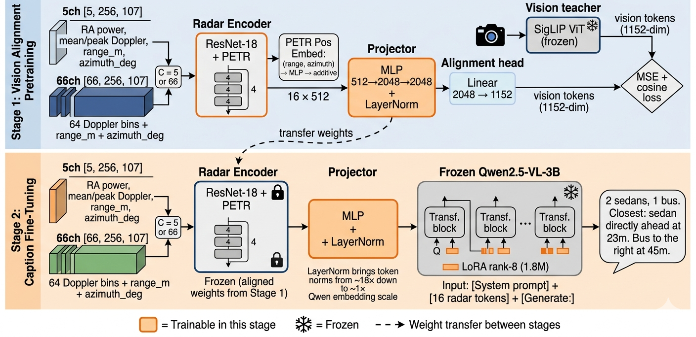
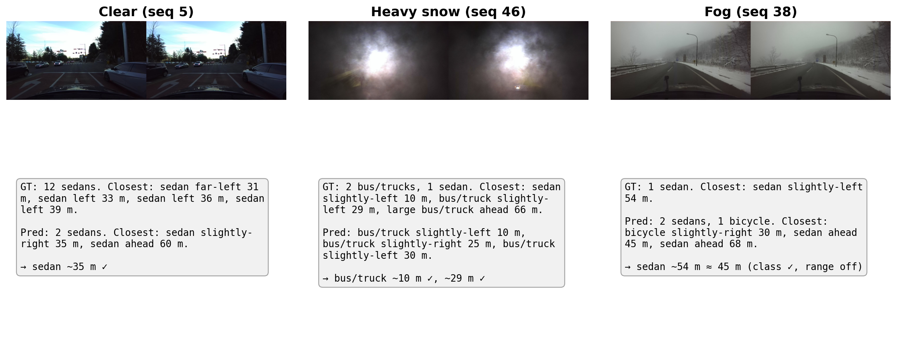
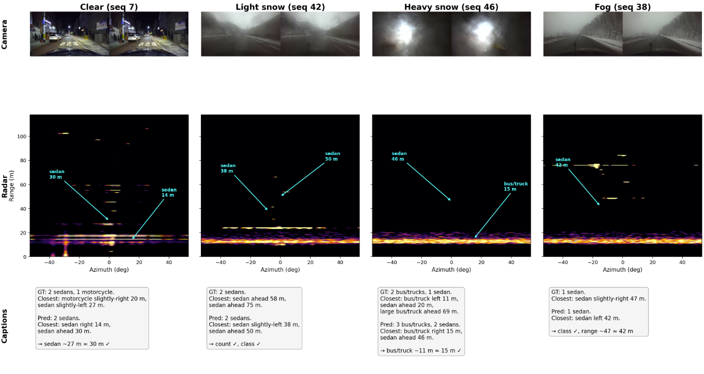
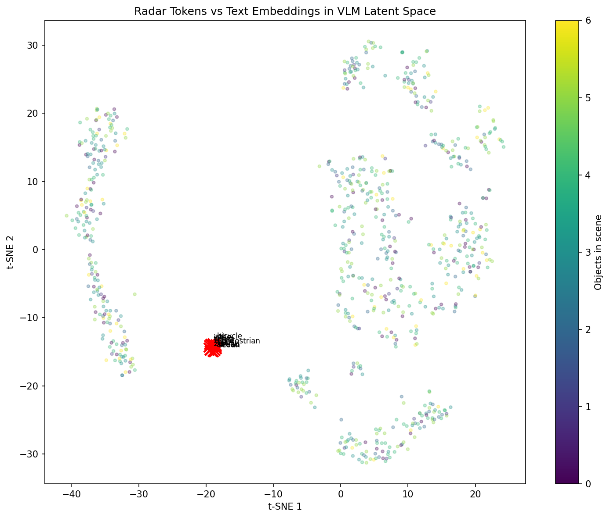
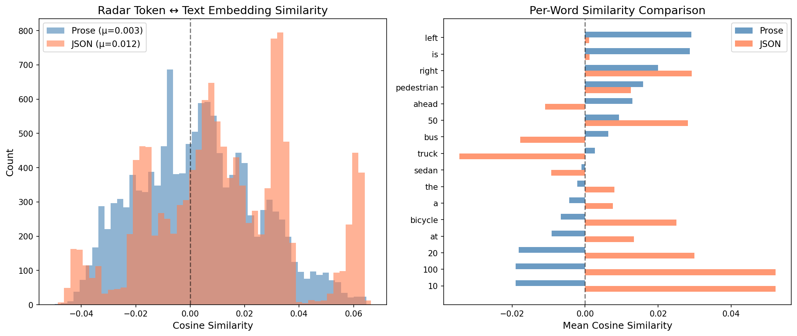
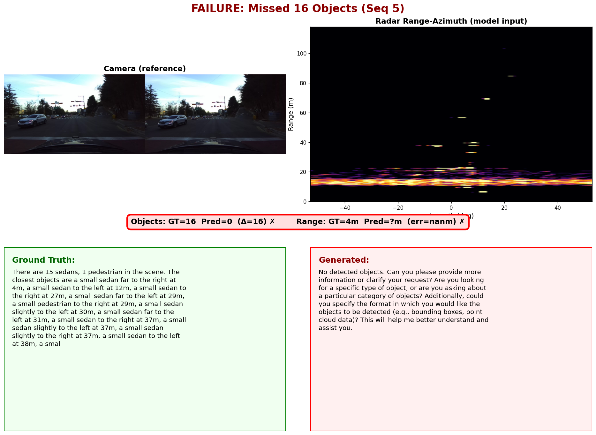
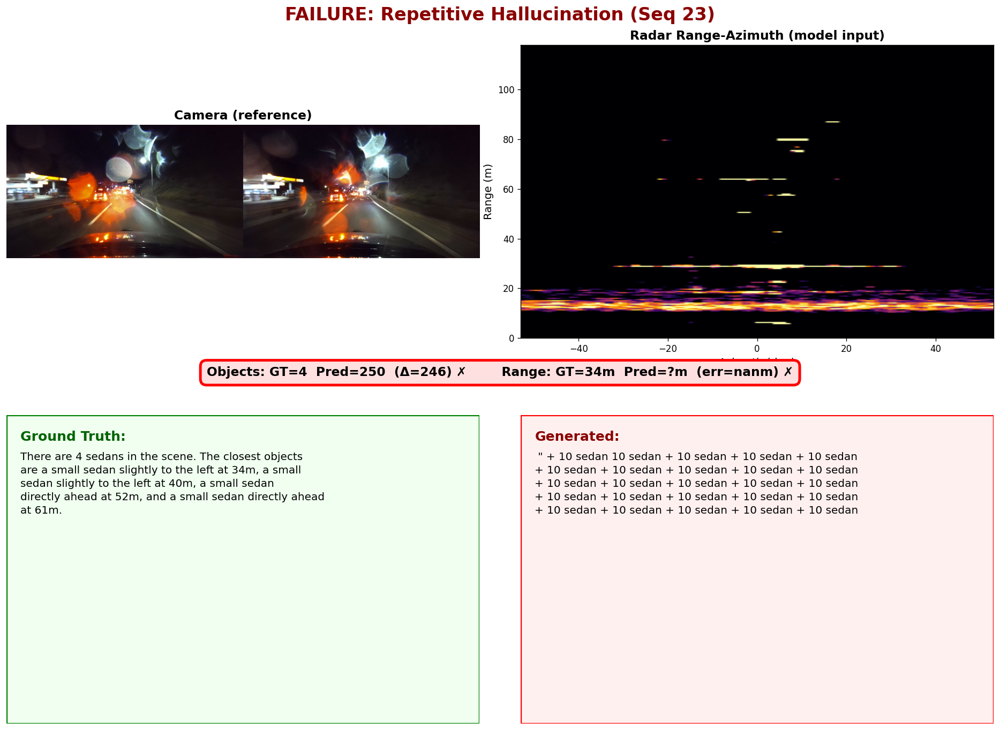
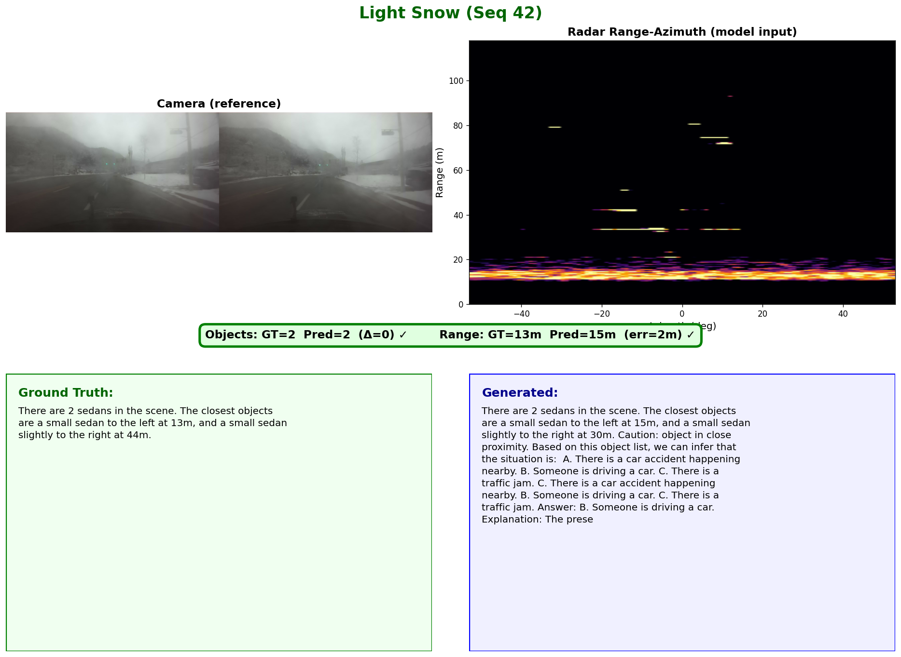
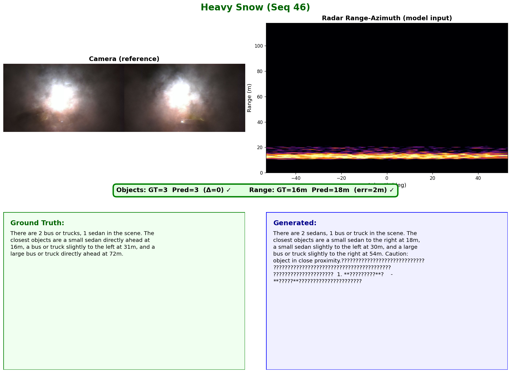
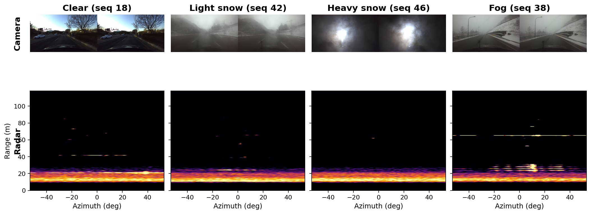

# Critical Design Review: Radar-Language-Model Captioning for Weather-Robust Scene Understanding

> **Jump to:** [Final Report (April 24)](#final-report-radar-language-scene-captioning)

## Project Summary

This project bridges a 4-D millimeter wave radar tensor into a frozen modern
vision-language model (Qwen2.5-VL-3B) with the ultimate motivation being that a mobile robot can produce
structured, class-aware scene descriptions from radar alone — including in
fog, light snow, and heavy snow, where cameras and LiDAR degrade. The
pipeline is a ResNet-18 radar encoder with PETR-style metric position
embeddings, a 2-layer MLP projector with output LayerNorm, and a frozen
Qwen2.5-VL-3B decoder adapted via rank-8 LoRA on its Q/K attention
projections. Training is two-stage: (1) align the radar encoder to a frozen
SigLIP vision teacher on paired radar-camera frames, then (2) freeze the
aligned encoder and fine-tune the projector plus LoRA on programmatically
generated caption supervision. 

## System Architecture



### Radar Encoder
A ResNet-18 with its first convolution reshaped to accept $C \in \{5, 66\}$
input channels. After `layer2` (stride 8, 128-channel feature map), a
PETR-style additive position embedding is injected: normalized
$(\text{range}, \text{azimuth})$ coordinates are mapped through a 2-layer
MLP to the feature-map channel dimension and added elementwise. After
`layer4`, an adaptive average pool of $(4,4)$ yields **16 spatial tokens of
512 dimensions each**. This encoder is the only component specialized to
radar and is the part that would be re-trained when porting to a different
4-D radar sensor.

### Projector (with Output LayerNorm)
A 2-layer MLP $(512 \to 2048 \to 2048)$ with GELU that maps the 16 radar
tokens into Qwen's 2048-dim embedding space, followed by a LayerNorm on the
output. The LayerNorm is the single most impactful design decision in the
pipeline: without it, radar token norms are 150–200$\times$ larger than
Qwen's native token embeddings and the frozen VLM learns to ignore radar
entirely, captioning from language priors alone. See [Diagnostic Journey](#diagnostic-journey) for detailed measurements.

### Frozen VLM with LoRA
Qwen2.5-VL-3B-Instruct in fp16, frozen. Rank-8 LoRA adapters on the $Q$ and
$K$ projections of all 36 transformer layers (1.8 M trainable params). At
inference the 16 radar tokens are prepended to the text-prompt embeddings
and the caption is generated autoregressively.

### Vision Teacher (Stage 1 only)
Frozen SigLIP-base on the paired RGB camera frame. Used only during Stage 1
alignment; never required at inference.

## Input and Output Representation

### Radar Input Variants

| Variant | Shape | Content |
|---|---|---|
| **5-channel** | $[5, 256, 107]$ | $R^4$-compensated RA power, mean Doppler, peak Doppler, metric range (m), metric azimuth (deg) — a compact physics summary |
| **66-channel** | $[66, 256, 107]$ | 64 Doppler bins with $R^4$ compensation, plus the two metric coordinate channels — preserves the full velocity distribution |
| 69-channel (future) | $[69, 256, 107]$ | 66-channel plus 3 elevation-derived channels; pre-cached, not yet evaluated |

Raw tesseract is $(64, 256, 37, 107)$ in
$(\text{Doppler}, \text{range}, \text{elevation}, \text{azimuth})$; elevation
is collapsed by max-pool before the encoder.

### Output: Parsed Caption Tuples
The VLM emits a token sequence. For evaluation this is parsed into
structured tuples $\hat{\mathcal{O}} = \{(\hat{c}_i, \hat{r}_i, \hat{b}_i)\}$
(class, range in meters, bearing sector in 7 categories: far-left, left,
slight-left, ahead, slight-right, right, far-right). The caption itself is
a count summary followed by per-object class + bearing + range for the
closest $\leq 4$ in-FOV objects.

## Training Algorithm

### Stage 1 — Vision Alignment
Radar encoder + projector are jointly trained to regress frozen SigLIP
features on paired radar-camera frames. Let $f_\theta$ be encoder+projector,
$g$ a linear head to SigLIP's 1152-d space, and $s_\phi$ the frozen SigLIP
teacher on the paired camera frame $v$:

$$
\mathcal{L}_{\text{align}}
= \bigl\lVert g(f_\theta(x)) - s_\phi(v) \bigr\rVert_2^2
\;+\;
\bigl(1 - \cos\!\bigl(g(f_\theta(x)),\, s_\phi(v)\bigr)\bigr).
$$

AdamW, lr $1\mathrm{e}{-3}$, cosine schedule, batch size 16, 50 epochs.

### Stage 2 — Caption Fine-Tuning
Encoder frozen at Stage-1 weights. Projector + LoRA trainable. Radar tokens
$z = f_\theta(x) \in \mathbb{R}^{16 \times 2048}$ are prepended to the text
prompt $e(p)$ and Qwen (with LoRA $\Delta W_Q, \Delta W_K$) is teacher-forced
on GT caption $y = (y_1, \ldots, y_T)$:

$$
\mathcal{L}_{\text{cap}}
= -\sum_{t=1}^{T} \log p_{\text{Qwen}+\text{LoRA}}\!\bigl(y_t \,\big|\, z,\, e(p),\, y_{<t}\bigr).
$$

AdamW, lr $1\mathrm{e}{-5}$ (LoRA $10\times$ lower), weight decay 0.1,
projector dropout 0.3, batch size 4, 20 epochs. Stages are **sequential,
not summed**: $\mathcal{L}_{\text{total}} = \mathcal{L}_{\text{align}}$ in
Stage 1, $\mathcal{L}_{\text{total}} = \mathcal{L}_{\text{cap}}$ in Stage 2.

## Data Strategy

### Pre-trained Weights

| Component | Weights | Trainable? |
|---|---|---|
| Decoder VLM | Qwen2.5-VL-3B-Instruct (fp16) | Frozen + rank-8 LoRA on Q/K (1.8 M params) |
| Vision teacher (Stage 1 only) | SigLIP-base | Frozen |
| Radar backbone | ResNet-18 (ImageNet), `conv1` reshaped | Trained Stage 1, frozen Stage 2 |
| Projector | Random init | Trained both stages |

### Corpus — K-RADAR v1, Real Data Only
No large dataset subsets (usually contain no radar). No synthetic or
CARLA-simulated radar; rationale below. The K-RADAR dataset is itself 58 esquences, 16 TB. However, due to the host NAS rate limiting (maxes out between 500KB/s-1.5Mb/s) downloading the dataset has been....slow. My hope is to gain access to the full dataset sooner than later and retry some of the SoTA techniques that require min 10k frames to really see results. 

| Split | Sequences | Notes |
|---|---|---|
| Train | 1, 2, 3, 4, 6, 8, 9, 11, 21, 28, 47 (~7 k frames) | 1 rain, 1 sleet, 1 heavy-snow seq included |
| Val   | 5, 7, 23 (temporal stride 3) | Urban / alleyway-night / urban-night-rain |
| Test  | 18 (normal), 38 (fog), 42 (lt. snow), 46 (hv. snow) | Fog + light snow **never** appear in train |

### Caption Ground Truth
Rendered programmatically from K-RADAR 3-D bounding boxes, filtered to
$\pm 53^\circ$ azimuth (radar FOV) and $\leq 80$ m range. Because captions
come from annotations, not camera images, they are **weather-independent**,
which is what makes stratified weather evaluation meaningful. Caption format
caps at ~4 detailed objects; beyond that only the count summary is explicit.

  **Augmentation.** Two opt-in augmentations are available during Stage 2                                                 
  training, each applied with 50% probability per sample:                                                                 
                                          
  - **Azimuth flip** — the radar tensor is mirrored along the azimuth axis                                                
  and caption bearing terms are rewritten to match (left ↔ right sectors).                                                
  Respects the bilateral symmetry of a forward-facing radar FOV.
  - **Gaussian noise + power scaling** — $\mathcal{N}(0, (0.02 \sigma_{\text{sig}})^2)$                                   
  additive noise and a small random power-scale multiplier applied to
  power / Doppler channels only; metric coordinate channels are left                                                      
  intact so the PETR position-embedding signal is preserved.
                                                                                                                          
  Augmentation code was written and ablated separately (flip, noise, both) on an
   earlier split; the final reported v2-split numbers were run without it because the augmentation ablations did not show 
  a conclusive win on that earlier split, and re-running under the v2 alignment pipeline was deprioritized. Stronger radar-physics augmentations (range jitter, Doppler shift,                                                clutter injection) are not yet implemented.  

## Evaluation Plan

### Captions-as-Detection Metrics
Each generated caption is parsed into $(\hat{c}, \hat{r}, \hat{b})$ tuples.
GT is parsed identically from caption-format GT (so predictions and targets
share the same ~4-object cap). Predictions and GT are bipartite-matched on
class within a $\pm 10$ m range gate.

| Metric | Definition |
|---|---|
| Class P / R / F1 | Standard, aggregated across eval set |
| Range MAE (m) | Mean $\lvert\hat{r}_i - r_j\rvert$ over matched pairs |
| Bearing-sector accuracy | $\frac{1}{\lvert\mathcal{M}\rvert}\sum \mathbf{1}[\hat{b}_i = b_j]$, over 7 sectors |
| BLEU-4 / METEOR | Corpus-level nltk implementations on raw captions |
| Hallucination rate | Fraction of predicted objects whose class appears in no GT object in the same frame |

### Weather Stratification
Test sequences are stratified by logged condition (normal, light snow,
heavy snow, fog). F1 and bearing-sector accuracy are reported per condition
so performance degradation under weather is visible rather than averaged
away. Mean GT objects per frame $\bar{N}$ is reported alongside each column
because sparse scenes make single-object mismatches swing percentages.

### Current Best Results
5-channel + Stage-1 align + Stage-2 LoRA, v2 sequence-level split:

| | 66ch no-align | **5ch+align** | 66ch+align |
|---|:---:|:---:|:---:|
| Class F1 | 0.507 | **0.527** | 0.473 |
| Precision | 0.622 | **0.704** | 0.624 |
| Recall | **0.428** | 0.421 | 0.381 |
| Range MAE (m) | 16.4 | 13.86 | **10.95** |
| Bearing acc. | 0.155 | **0.333** | 0.304 |
| BLEU-4 | **0.369** | 0.239 | 0.275 |
| Hallucination | 0.378 | **0.296** | 0.376 |

**Headline:** Stage-1 alignment **doubles** bearing accuracy (0.155 →
0.333) and cuts hallucination (0.378 → 0.296). 66ch wins range MAE
(evidence that full Doppler helps localization), 5ch wins F1 / precision /
hallucination (evidence the VLM cannot yet exploit 66 channels at 7 k
frames).



### Ablations Planned / Completed

| Ablation | What it isolates | Status |
|---|---|---|
| No LayerNorm on projector | The core claim of this paper | Done, LN essential |
| No PETR position embedding | Metric grounding vs learned features | Done, PETR helps |
| Text-only Qwen (same scale) | Whether the VL architecture matters | Done, VL > text-only |
| No Stage-1 alignment | Contribution of SigLIP alignment | Done (see table) |
| Linear projector + LN | Whether MLP capacity or norm is the bottleneck | **Not yet run** |
| `fourier_pe` vs PETR | Alternate position encoding | Code in place, not yet run |



## Implementation Status

**Works end-to-end:**

- Full two-stage pipeline: radar-cam pairing → Stage-1 align → Stage-2
  caption fine-tune → weather-stratified eval.
- Projector-output LayerNorm fix, reproduced across 5ch and 66ch variants.
- Detection-metric eval script (F1, range MAE, bearing accuracy, BLEU-4,
  METEOR, hallucination), weather-stratified.
- Sequence-level train/val/test split with fog + light snow held out.

**In progress / blocked:**

- **Numeric range head.** Range MAE is bounded below by BPE tokenization of
  multi-digit numbers. A small per-token regression head is scoped but not
  implemented.
- **Encoder unfreeze in Stage 2.** Expected to help at larger data scale;
  unfreezing on 7 k frames erases Stage-1 alignment.
- **Velocity supervision from K-RADAR track IDs.** Scoped, not started —
  the strongest long-run differentiator over camera-grounded captioning.
- **Linear-projector + LN ablation.** Needed to tighten the claim that the
  norm mismatch, not MLP capacity, is the bottleneck.
- **ColoRadar cross-dataset evaluation.** Planned, not started.

**Critical-path blocker.** The real blocker is **sample size
for the weather claim** — per-condition F1 is a point estimate over a
single sequence per condition. K-RADAR v1 does not expose more held-out
adverse-weather sequences; a stronger claim waits on first-party collection.

## Hard Questions

### Q1. "Why not use synthetic data to augment the real?"

1. **Synthetic radar is a LiDAR ray-cast with a noise model.** CARLA-style
   radar simulators start from scene geometry used for LiDAR and add a
   hand-tuned noise term. They do not simulate multipath off guardrails,
   specular dropouts on wet asphalt, or volumetric backscatter from
   precipitation — exactly the phenomena that make radar robust in fog and
   snow. Training on synthetic and evaluating a weather claim on real radar
   trains on the wrong distribution for the specific claim.
2. **RLM already ran this experiment at scale** — ~800 k simulated
   radar-caption pairs with SG-CLIP, strong numbers on *simulated* held-out
   scenes, no public evidence of transfer to real 4-D tensors under weather.
   This project's contribution is complementary: small-real-data,
   real-weather, generative.
3. **It is on the roadmap, not ruled out.** Sim-to-real pretraining on
   CARLA followed by real fine-tuning is a reasonable follow-up once
   radar-native annotations from first-party collection are available. For
   April 10 the honest story is "real only, weather claim scoped to what
   that supports".

### Q2. "Why not try JEPA or other contrastive variants instead of giving up?"

Not a first-principles rejection — the data said no. Documented attempts:

| Method | Result | Diagnosis |
|---|---|---|
| SimCLR on RA heatmaps (200 ep, batch 256) | loss 6.2 → 0.25, **0.984 cos sim** across frames | Single-channel BEV is near-identical frame to frame |
| DINOv2 feature regression | loss converges, **0.7 %** retrieval | Radar features too homogeneous to match diverse teacher |
| SigLIP InfoNCE | ~2 % val retrieval | SigLIP targets themselves 0.949 cos sim — bad teacher |
| MSE → SigLIP (non-contrastive) | MSE converges, 0.2 % retrieval | Avoids collapse but features non-discriminative |
| Radar ↔ LiDAR InfoNCE | **0.0 %** val acc, 100 ep | Sparse LiDAR vs dense radar, no shared structure |
| SimCLR on 3-ch tesseract | loss 3.15 → 0.21, linear probe = random init | Doppler diversity present (0.034 cos sim), 3 seqs too small |

Pattern: **self-supervised / contrastive on radar needs more data than is
available here.** SimCLR- and JEPA-style methods are calibrated for 10⁶–10⁹
samples; the K-RADAR corpus is 7 k frames. What survived is MSE + cos to
SigLIP — a regression objective to a vision teacher, which is the Stage-1
alignment currently shipping. JEPA specifically is worth revisiting
**once** the encoder is unfrozen in Stage 2 at ColoRadar +
first-party-collection scale; at 7 k frames it would replicate the SimCLR
failure.

### Q3. My personal Q to myself

> *"Is the LayerNorm fix radar-specific, or would any novel sensor with an
> under-constrained encoder show the same 20× norm mismatch? If it's the
> latter, the contribution is a generic sensor-to-frozen-VLM hygiene note,
> not a radar result."*

The likely answer is the latter, and that is **still** useful — the
sensor-to-frozen-VLM literature routinely hides this inside Q-Former /
Perceiver Resampler and does not expose it, and robotics pipelines
following the RT-2 / π₀ pattern on new sensors will hit the same wall.
The ablation on a second novel sensor has not yet been run.
**Action item:** repeat the projector-norm diagnostic with the Ouster LiDAR
range image on the same Qwen stack before CDR; one data point is enough
to strengthen or bound the claim to radar specifically.

## Future Work

- **Numeric prediction head** — regress per-object range directly from
  radar tokens; keep the language head for class, bearing, count. Removes
  the BPE-tokenization ceiling on range MAE.
- **Encoder unfreeze in Stage 2** — expected to help once data scale
  supports it; start with `conv1` + `layer4` only.
- **Velocity-grounded supervision** — per-object radial velocities from
  K-RADAR track IDs, as a supervision signal no camera-based VLM has access
  to; the strongest long-run differentiator of radar-grounded captioning.
- **Radar-native annotations** — labels driven by radar returns rather than
  LiDAR boxes, planned for the forthcoming first-party collection. Stops
  penalizing the model for attending to real radar structure that was never
  labeled.
- **Cross-dataset generalization with ColoRadar** — indoor / outdoor /
  subterranean 4-D radar, orthogonal test of transfer across sensors,
  platforms, and field-robotics scene types.
- **Linear-projector + LN ablation** — tightens the claim that the norm
  mismatch, not MLP capacity, is the actual bottleneck.

---

<div style="margin: 4rem 0; padding: 2rem; border-top: 4px solid #3b82f6; border-bottom: 4px solid #3b82f6; text-align: center; background: linear-gradient(to bottom, #eff6ff, white, #eff6ff);">

# Final Report: Radar-Language Scene Captioning

**Kali Hamilton**  
**April 24, 2026**

*Extended analysis, diagnostic findings, and future research directions*

</div>

---

## Key Findings

### 1. VL Architecture Transfers to Radar

Qwen2.5-VL-3B outperforms text-only Qwen2.5-3B (val loss 0.157 vs 0.170), even though we never pass images. The vision attention layers learned to process spatially-grounded tokens during VL pretraining, and this capability transfers to radar tokens.

### 2. Output Format: Prose vs JSON (In Progress)

Based on CDR feedback, we explored structured JSON as an alternative output format. JSON models were trained on regenerated JSON-format captions with adjusted hyperparameters (higher LR, lower dropout). Results show a precision-recall tradeoff:

| Metric | Prose | JSON |
|--------|-------|------|
| Class F1 | 0.527 | 0.638 |
| Precision | 0.704 | 0.590 |
| Recall | 0.421 | 0.695 |
| Hallucination | 30% | 41% |

JSON finds more objects but invents more too. Prose is conservative but misses fewer rare classes.

**Open questions:**
- Does JSON's higher hallucination stem from template-completion pressure (must fill all fields, can't hedge with "possibly")?
- Could JSON's compactness support more detailed objects per caption, improving dense-scene recall?
- Can hybrid formats (prose with structured suffixes) capture benefits of both?

See [Structured Output Exploration](#structured-output-exploration) for implementation details and deeper analysis.

### 3. More Information ≠ Better VLM Utilization

66ch encoder captures more information (better linear probe classification) but produces worse captions than 5ch. The VLM can't exploit the extra Doppler channels at this data scale (~7k training frames). This is a VLM utilization gap, not an encoder gap.

### 4. Two-Stage Alignment for Novel Modalities

Stage-1 SigLIP alignment doubles bearing accuracy (0.155 → 0.333). LLaVA-style two-stage training is no longer SOTA for vision — frozen CLIP already provides aligned embeddings. But for novel sensors without pretrained encoders:

| Approach | Data Req | Result |
|----------|----------|--------|
| **RLM (SG-CLIP)** | 800k sim pairs | Contrastive works but needs massive simulated corpus |
| **RTNH** | N/A | Direct detection, no VLM |
| **Ours (regression)** | 7k real | Regression-to-teacher works at small scale |

When language-paired data is scarce and no pretrained encoder exists, regression-to-vision-teacher is more data-efficient than contrastive alignment.

### 5. Weather Evaluation is a GT Problem

RTNH's weather variation (45–79% AP across conditions) primarily reflects LiDAR ground-truth degradation in bad weather, not radar degradation. K-RADAR labels derive from camera + LiDAR, both of which fail in fog and precipitation. Radar correctly detecting objects that LiDAR missed gets penalized as "false positives."

---

## Diagnostic Journey

We initially focused on architecture: more channels, deeper encoders,
different LoRA ranks, progressive unfreezing. None moved the needle
significantly. The model produced plausible-sounding but wrong captions
regardless of encoder capacity.

The diagnostic that caught the problem was measuring **L2 norms through the
pipeline**:

```
Encoder output norm:       8–14       (reasonable)
Projector output norm:   148–207      ← 10-20× amplification
Qwen text embed norm:    1.0–1.2
```

The MLP projector was *amplifying* encoder norms by 10–20×, producing tokens 150–200× larger than Qwen's native embeddings. After adding LayerNorm to the projector output:

```
Projector output norm:   ~1.0         ← matches Qwen
```

**Lesson learned:** always check scale/distribution before architecture.
This would have saved days of encoder ablations.

### 5ch vs 66ch Signal Comparison

After fixing the norm mismatch, we compared signal characteristics between input formats:

| Metric | 5ch | 66ch |
|--------|-----|------|
| Encoder Norm | 23.2 ± 8.4 (17.3–37.9) | 29.1 ± 1.3 (27.0–30.2) |
| Variance | 9.0 ± 4.9 (5.1–16.7) | 10.7 ± 2.4 (7.5–12.8) |
| Projector Norm (pre-LN) | 33.9 ± 0.2 (33.7–34.1) | 39.3 ± 0.04 (39.2–39.3) |

Notably, 66ch has *more stable* encoder norms (tighter variance) yet produces worse captions — evidence that the bottleneck is VLM utilization, not encoder signal quality. See `paper/final_report.tex` for full pipeline visualizations and the "5ch vs. 66ch Puzzle" analysis.

### The Modality Gap: Orthogonal Embeddings



A surprising finding: radar tokens are still nearly **orthogonal** to text token embeddings (cosine similarity ~0, angular separation 86–93°) even after aligment. The radar cluster occupies a distinct region of embedding space with minimal overlap to Qwen's vocabulary.

Yet the model still produces coherent captions. How?

- **LayerNorm provides scale compatibility**: tokens are the right magnitude for attention
- **VL attention learns cross-modal translation**: the vision-language architecture can bridge semantically disjoint representations
- **The gap may not matter**: if attention handles the translation, semantic alignment isn't required. Recent work shows CLIP exhibits orthogonal image-text subspaces yet achieves strong zero-shot performance [Liang et al., "Mind the Gap", NeurIPS 2022]. However, they also find that *modifying* the gap can improve some downstream tasks — leaving open whether closing the radar-text gap would help our setting.

Notably, this is the modality gap *after* Stage-1 SigLIP alignment. Before alignment, the radar embeddings were likely even more unstructured — random projections with no semantic organization. Stage-1 alignment doesn't close the gap to text, but it may organize the radar embedding space into a coherent structure that VL attention can learn to translate.

**Open direction**: Would explicitly closing the modality gap (e.g., through contrastive alignment to text descriptions) improve caption quality? Or is the current orthogonal-but-functional relationship sufficient? Comparing t-SNE visualizations before/after alignment could reveal what Stage-1 actually accomplishes in embedding space.

---

## Caption Generation Pipeline

**K-RADAR provides 3D bounding boxes, not captions.** We designed and implemented the entire caption generation pipeline that converts raw annotations into language supervision for VLM training. This is a methodological contribution, not preprocessing.

### What K-RADAR Provides

Each frame has a label file with 3D bounding boxes:
```
* idx(0004)=00091, timestamp=1642...
* 1, 0, 12, Sedan, 6.2, -0.5, 0.8, ..., 4.5, 1.8, 1.5
```
Fields: class, x, y, z, track_id, dimensions. No natural language.

### What We Built

| Component | Design Decision |
|-----------|-----------------|
| **FOV filtering** | ±53° azimuth (radar physical limit) — excludes invisible objects |
| **Range cap** | 80m (v2) — bounds caption length, focuses on actionable objects |
| **Bearing discretization** | 7 sectors: far-left, left, slight-left, ahead, slight-right, right, far-right |
| **Count summary** | "There are 3 sedans, 2 trucks in the scene." — all objects counted |
| **Detail limit** | Closest ~4 objects get full (class, bearing, range) descriptions |
| **Velocity integration** | Track IDs across frames → speed descriptors (stationary, moving, fast) |
| **Proximity warnings** | "Caution: object in close proximity." if any object < 10m |
| **Output formats** | Prose vs JSON generation from same structured representation |

### Example Output

**Input**: 5 bounding boxes from K-RADAR labels

**Generated caption**:
> "There are 5 sedans in the scene. The closest objects are a small sedan fast directly ahead at 6m (13m/s), a small sedan to the left at 32m, a small sedan moving far to the left at 37m (7m/s), and a small sedan moving to the left at 42m (6m/s). Caution: object in close proximity."

The 5th sedan appears in the count but not in detailed descriptions — a design choice that bounds caption length but limits recall for dense scenes.

### Why This Matters

This pipeline enables VLM training on radar by bridging the annotation gap: K-RADAR has bboxes (like most detection datasets), but VLMs need language. The caption schema — bearing sectors, detail limits, velocity integration — are all design decisions that affect both training and evaluation. They are **not** constraints inherited from the dataset.

---

## Design Decisions & Trade-offs

### Why captions instead of structured tuples?

The VLM emits text, which we parse into $(\hat{c}, \hat{r}, \hat{b})$ tuples
for evaluation. A natural question: why not predict tuples directly?

**Flexibility.** Caption format supports both prose ("a sedan ahead at 40m")
and JSON (`{"class": "sedan", "range_m": 40}`). The schema is expandable
without retraining — add velocity, confidence, or track ID by updating the
prompt template.

**VLM language priors.** The frozen VLM was pretrained on natural language.
Prose descriptions like "far to the left" may map more directly to its
internal representations than numeric JSON fields.

**Trade-off.** A dedicated structured head (classification + regression)
would avoid tokenization issues but loses the VLM's language flexibility.
This is a valid alternative for production systems.

### Token-level loss and significant figures

Standard cross-entropy treats all token errors equally. For a caption like
"42 meters", the loss penalizes mistaking "4" vs "5" the same as "2" vs "3"
— but the first error is 10× larger in magnitude.

BPE tokenization makes this worse: the tokenizer doesn't split numbers into
consistent per-digit tokens, so we can't reliably weight place values.

**Consequence:** Range MAE has a tokenization floor. Our 14m MAE includes
both model error and token discretization noise.

**Fix:** A regression head that predicts range as a scalar with MSE loss
would naturally weight errors by magnitude. This is scoped but not yet
implemented.

**Intermediate step:** JSON output format may ease this transition. The fixed
structure (`"range": 42`) makes numeric fields predictable to parse, and
provides consistent context that could improve tokenization stability. More
importantly, the structured format makes it straightforward to attach a
parallel regression head specifically to range predictions.

### Why VL architecture instead of text-only?

We compared Qwen2.5-VL-3B (vision-language) against Qwen2.5-3B (text-only,
same parameter count):

| Model | Val Loss |
|-------|:--------:|
| Qwen2.5-3B (text-only) | 0.170 |
| Qwen2.5-VL-3B | **0.157** |

The VL architecture wins, even though we never provide image inputs. Our
hypothesis: the vision attention layers learned to process spatially-grounded
tokens during VL pretraining, and this transfers to radar tokens.

---

## Structured Output Exploration

Downstream robotics applications benefit from structured, machine-parseable outputs. We explored JSON as an alternative to prose captions, revealing interesting tradeoffs that warrant further investigation.

### Implementation

JSON training required regenerating captions and adjusting hyperparameters — not just a prompt change:

**Training data**: We generated a parallel JSON caption dataset (`captions_v2_80m_json`) from the same bounding box annotations, outputting structured JSON instead of prose.

**Prompt prefix**: "Output JSON:" prepended to guide generation format.

**Hyperparameter adjustments**: Higher learning rate (5e-5 vs 1e-5), lower dropout (0.1 vs 0.3) — shorter JSON targets required less regularization.

Parsing extracts `(class, range, bearing)` tuples from generated JSON for evaluation.

### Embedding Space Comparison



Prose and JSON outputs occupy different regions of the embedding space. Prose tokens align more closely with Qwen's natural language priors, while JSON tokens activate patterns from structured data in pretraining.

### Observed Tradeoffs

| Behavior | Prose | JSON |
|----------|-------|------|
| **Rare class detection** | Detects bicycle (F1=0.77), motorcycle (F1=0.36) | Misses all rare classes (F1=0) |
| **Common class recall** | Conservative (0.421) | Aggressive (0.695) |
| **Hallucination mode** | Plausible but wrong descriptions | Template-filling with invented objects |
| **Localization** | Better range MAE (13.9m vs 17.4m) | Worse spatial precision |

### Hypotheses for Future Work

1. **Template completion pressure**: JSON's rigid structure may force the model to populate fields even when uncertain, whereas prose allows hedging ("possibly", "appears to be").

2. **Training distribution**: Despite JSON-specific training data and hyperparameter tuning, the precision gap remains. Further optimization (more data, different LR schedules, or architecture changes) might help.

3. **Hybrid formats**: Prose with structured suffixes (e.g., "A sedan ahead at 40m. `{class: sedan, range: 40}`") could combine natural language flexibility with parseability.

4. **Confidence calibration**: Adding uncertainty estimates to JSON fields could help downstream systems filter low-confidence detections.

---

## Failure Analysis

### Azimuth sign bug (chiral labels)

After a CDR comment about chiral labels, we discovered a bug in the azimuth channel — **left and right were flipped**. The radar's azimuth convention is positive-left, but our coordinate encoding assumed positive-right. This meant the model saw "to the left" supervision while the radar features pointed right.

However, after implementing the fix (`az_sign_fix`) and running ablations, we found **minimal change in results** — suggesting the model may have learned to compensate for the flipped convention during training. It's unclear whether the azimuth flipping augmentation tests we ran early in the project were affected; these will need to be rerun with the fix implemented.

**Lesson:** Sensor coordinate conventions are a common source of silent bugs. Always visualize raw features overlaid on camera to verify alignment.

### Per-class breakdown

Results on val/test sequences (5ch+align model). Note: not all classes appear
in all sequences.

| Class | Precision | Recall | F1 | GT Count |
|-------|:---------:|:------:|:--:|:--------:|
| sedan | 0.760 | 0.413 | 0.535 | 743 |
| bus or truck | 0.559 | 0.440 | 0.492 | 184 |
| bicycle | 0.833 | 0.714 | 0.769 | 14 |
| motorcycle | 0.333 | 0.400 | 0.364 | 5 |
| pedestrian | 0.000 | 0.000 | 0.000 | 5 |

**Rare classes fail.** Pedestrians have zero detections — likely radar
cross-section (RCS) too small for reliable detection at our resolution.
Bicycle performs surprisingly well (F1=0.77) despite low count.

**The aggregate F1 of 0.53 hides this.** Prior work (RTNH) reports only
sedan and bus/truck; we report all classes to surface these failures.





### Hallucination rate

41% of predicted objects have no corresponding GT object in the frame. Some
"hallucinations" may actually be correct — radar sees objects that
camera/LiDAR missed in fog. But 41% is too high for safety-critical use.

Paths forward: calibration loss, confidence scores, ensemble filtering.
wai
### Success cases

The model succeeds when objects have sufficient radar cross-section and the
scene isn't too dense:





### Weather robustness grid



---

## Comparison to Related Work

### RTNH (Radar Transformer for Object Detection)

| Aspect | RTNH | This work |
|--------|------|-----------|
| Output | 3D bounding boxes | Captions → parsed tuples |
| Metric | mAP @ IoU 0.5 | Class F1, Range MAE, Bearing acc |
| Classes evaluated | Sedan, bus/truck | All 7 classes |
| Weather variation | 45–79% AP | Not directly comparable |

Direct comparison is difficult due to metric differences. RTNH's weather
variation (45–79% AP) is primarily a ground-truth quality issue — LiDAR-derived
labels degrade in fog/snow, penalizing correct radar detections as false
positives.

Our caption-based approach sidesteps this somewhat: caption correctness can
be verified visually from radar, even when camera/LiDAR can't confirm.

### Why not mAP?

We don't produce bounding boxes — we produce captions. Extracting pseudo-boxes
from parsed tuples and computing mAP adds noise. Caption-based metrics
(BLEU, METEOR, class F1) are more direct measures of our task.

---

## Limitations

### Single-sequence weather evaluation

Per-condition F1 is a point estimate over a single sequence:
- Fog: seq 18
- Light snow: seq 42
- Heavy snow: seq 46

This is a limitation of our **downloaded subset**, not the dataset itself — K-RADAR contains 58 sequences across weather conditions, but NAS bandwidth constraints (~500KB/s-1.5MB/s) limited our access. A stronger weather claim requires downloading additional adverse-weather sequences or first-party collection to enable confidence intervals.

### Caption format caps at ~4 objects

Our caption generation pipeline details at most 4 objects (the closest) with range/bearing; remaining objects appear in the count summary only. This is a **design choice** we made to bound caption length — not a dataset constraint. It caps recall for dense scenes and biases range MAE toward nearby objects.

**JSON may naturally relax this limit**: Prose like "a sedan to the left at 40m" is verbose (~8 tokens), while JSON like `{"class":"sedan","bearing":"left","range_m":40}` is more compact. JSON captions could describe 8+ objects within the same token budget, potentially improving dense-scene recall without additional model changes — just regenerating captions with a higher detail limit. See [Caption Generation Pipeline](#caption-generation-pipeline) and [Structured Output Exploration](#structured-output-exploration).

### Ground truth quality in bad weather

K-RADAR labels derive from camera and LiDAR, both of which degrade in fog
and precipitation. Radar correctly detecting an object not in GT is counted
as a false positive. This penalizes radar's strength.

---

## Future Research Directions

Building on this work, several promising directions emerge:

### Structured Output Optimization

- **JSON output format refinement**: JSON achieves higher recall (0.695 vs 0.421) but with more hallucinations (41% vs 30%). Investigating prompt engineering, output constraints, or hybrid prose-JSON formats could capture the best of both.
- **Numeric regression head**: Bypass BPE tokenization ceiling on range estimation by predicting range/bearing as continuous scalars with MSE loss. Keep the language head for class, bearing sector, and count.

### Cross-Modal Teacher Training

- **JEPA-style alignment**: Joint Embedding Predictive Architecture could provide stronger encoder pretraining by predicting masked radar regions from context, avoiding contrastive collapse issues seen with SimCLR at small data scales.
- **LiDAR teacher alignment**: Pre-train the radar encoder to predict LiDAR features on paired frames, then fine-tune on captions. LiDAR-radar pairs are more structurally aligned than camera-radar.
- **Multi-teacher distillation**: Combine SigLIP (semantic) + LiDAR (geometric) teachers for richer encoder supervision.

### Temporal and Multi-Modal Extensions

- **Multi-frame temporal context**: Aggregate features across 3-5 consecutive radar frames to improve velocity estimation and reduce per-frame noise.
- **Weather-robust camera fusion**: Use radar as the primary modality with camera as auxiliary when available, inverting the typical fusion hierarchy.
- **End-to-end navigation**: Extend from scene captioning to radar-VLM → control policy, following the RT-2 / π₀ paradigm.

### Data and Evaluation

- **First-party data collection for Radar-native annotations**: Ground truth derived from radar returns rather than camera/LiDAR projections would stop penalizing radar for detecting objects other sensors miss.

## Code & Full Technical Report

**Code repository:** [https://github.com/arpg/kradar-vla](https://github.com/arpg/kradar-vla)

The repository includes:
- Full training pipeline (Stage 1 alignment + Stage 2 caption fine-tuning)
- Evaluation scripts for detection metrics
- Pre-trained checkpoint download instructions
- Unit tests

**Full technical report:** See `paper/final_report.tex` in the repository
for expanded derivations, additional ablations, and implementation details.

---

## References

[1] A. Pushkareva et al., *Radar Spectra-Language Model for Automotive Scene Parsing*, arXiv:2406.02158, 2024.

[2] RLM / RadarVLM, *Radar-Language Model with Spatially-Grounded CLIP*, arXiv, 2025.

[3] Y. Guan et al., *Talk2Radar: Bridging Natural Language with 4D mmWave Radar for 3D REC*, ICRA 2025.

[4] D.-H. Paek et al., *K-Radar: 4D Radar Object Detection for Autonomous Driving in Various Weather*, NeurIPS 2022.

[5] A. Kramer et al., *ColoRadar: The Direct 3D mmWave Radar Dataset*, IJRR 2022.

[6] A. Brohan et al., *RT-2: Vision-Language-Action Models*, CoRL 2023.

[7] Physical Intelligence, *$\pi_0$: A Vision-Language-Action Flow Model for General Robot Control*, 2024.

[8] Y. Liu et al., *PETR: Position Embedding Transformation*, ECCV 2022.

[9] E. J. Hu et al., *LoRA: Low-Rank Adaptation of Large Language Models*, ICLR 2022.

[10] X. Zhai et al., *Sigmoid Loss for Language Image Pre-Training (SigLIP)*, ICCV 2023.

[11] Qwen Team, *Qwen2.5-VL Technical Report*, arXiv, 2025.

[12] W. Liang et al., *Mind the Gap: Understanding the Modality Gap in Multi-modal Contrastive Representation Learning*, NeurIPS 2022.
