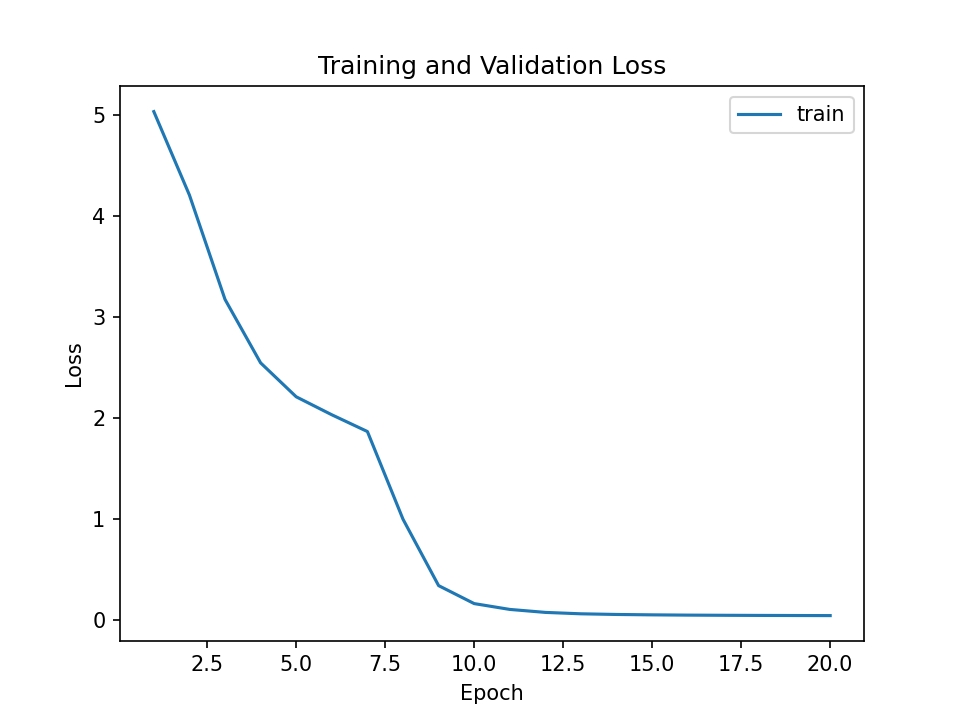
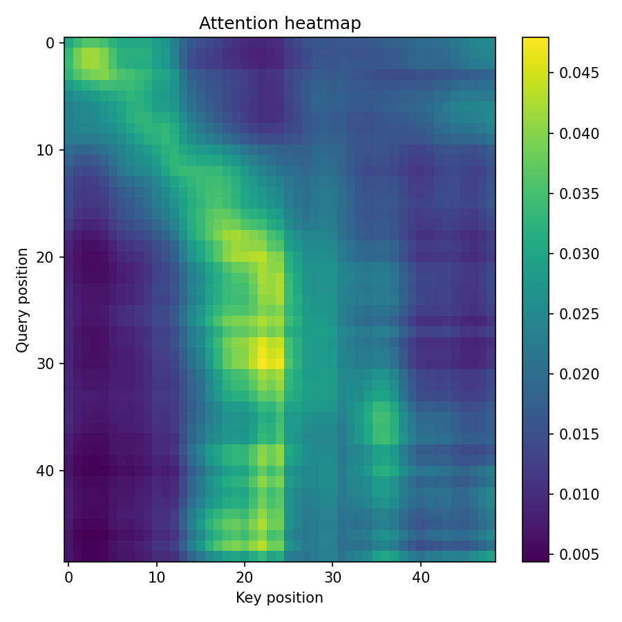
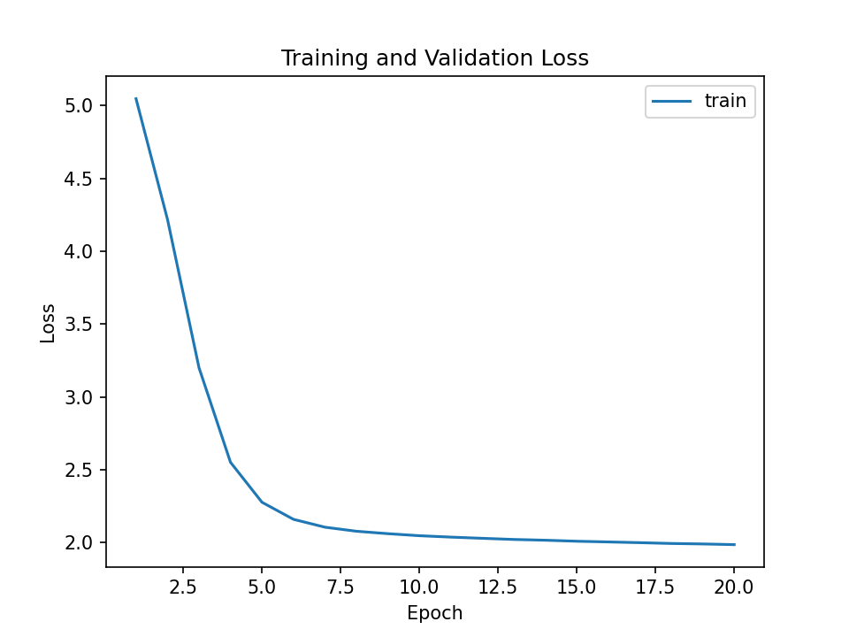

# Scratch-1: The Transformer Backbone

## Loss Curve


The model converged after around 10 iterations with final loss of 1.9277.

## Attention Visualization


The attention patterns show the causal mask has worked. The dark upper right triangle does not receive any attention, this demonstrates that because of the causal mask, the future tokens are masked and are not passed into the model. The bright diagonal shows that the model focuses most on the latest token in the input sequence. The attention reduces as we go away from the recent tokens, as expected.

### Sample output
```
Using device: cpu
Epoch 1 Batch 100: avg_loss = 4.142927
Epoch 1 Batch 200: avg_loss = 3.567831
Epoch 1/20 - Loss: 3.2584
Epoch 2 Batch 100: avg_loss = 2.299740
Epoch 2 Batch 200: avg_loss = 2.243028
Epoch 2/20 - Loss: 2.2111
Epoch 3 Batch 100: avg_loss = 2.099218
Epoch 3 Batch 200: avg_loss = 2.090066
Epoch 3/20 - Loss: 2.0819
Epoch 4 Batch 100: avg_loss = 2.046171
Epoch 4 Batch 200: avg_loss = 2.041124
Epoch 4/20 - Loss: 2.0388
Epoch 5 Batch 100: avg_loss = 2.021413
Epoch 5 Batch 200: avg_loss = 2.018425
Epoch 5/20 - Loss: 2.0147
Epoch 6 Batch 100: avg_loss = 2.001702
Epoch 6 Batch 200: avg_loss = 2.000735
Epoch 6/20 - Loss: 1.9991
Epoch 7 Batch 100: avg_loss = 1.989224
Epoch 7 Batch 200: avg_loss = 1.988070
Epoch 7/20 - Loss: 1.9868
Epoch 8 Batch 100: avg_loss = 1.981476
Epoch 8 Batch 200: avg_loss = 1.981199
Epoch 8/20 - Loss: 1.9792
Epoch 9 Batch 100: avg_loss = 1.971384
Epoch 9 Batch 200: avg_loss = 1.971669
Epoch 9/20 - Loss: 1.9706
Epoch 10 Batch 100: avg_loss = 1.963031
Epoch 10 Batch 200: avg_loss = 1.963841
Epoch 10/20 - Loss: 1.9645
Epoch 11 Batch 100: avg_loss = 1.956031
Epoch 11 Batch 200: avg_loss = 1.958478
Epoch 11/20 - Loss: 1.9595
Epoch 12 Batch 100: avg_loss = 1.950375
Epoch 12 Batch 200: avg_loss = 1.952415
Epoch 12/20 - Loss: 1.9539
Epoch 13 Batch 100: avg_loss = 1.945426
Epoch 13 Batch 200: avg_loss = 1.948742
Epoch 13/20 - Loss: 1.9498
Epoch 14 Batch 100: avg_loss = 1.942955
Epoch 14 Batch 200: avg_loss = 1.944969
Epoch 14/20 - Loss: 1.9462
Epoch 15 Batch 100: avg_loss = 1.941023
Epoch 15 Batch 200: avg_loss = 1.941831
Epoch 15/20 - Loss: 1.9429
Epoch 16 Batch 100: avg_loss = 1.936545
Epoch 16 Batch 200: avg_loss = 1.938385
Epoch 16/20 - Loss: 1.9388
Epoch 17 Batch 100: avg_loss = 1.931708
Epoch 17 Batch 200: avg_loss = 1.934831
Epoch 17/20 - Loss: 1.9356
Epoch 18 Batch 100: avg_loss = 1.929214
Epoch 18 Batch 200: avg_loss = 1.931722
Epoch 18/20 - Loss: 1.9326
Epoch 19 Batch 100: avg_loss = 1.926539
Epoch 19 Batch 200: avg_loss = 1.928762
Epoch 19/20 - Loss: 1.9301
Epoch 20 Batch 100: avg_loss = 1.923337
Epoch 20 Batch 200: avg_loss = 1.926616
Epoch 20/20 - Loss: 1.9277
Saved loss curve to /Users/soorejsnair/Documents/code/Course Folder/Spring 26/CSCI 7000/vla-foundations/content/course/submissions/scratch-1/images/loss_curve.png
Saved attention heatmap to /Users/soorejsnair/Documents/code/Course Folder/Spring 26/CSCI 7000/vla-foundations/content/course/submissions/scratch-1/images/attention_maps.png
```
## The Audit: Removing the Causal Mask

When I removed the causal mask, the following happened:

* Loss observed

We see that the loss converges quickly with a final loss of 0.0460 which is much lower than the one with the causal mask. This is because of data leak. Since we do not use causal mask the model uses the future tokens to train the model and causes accuracy to skyrocket since it is predicting tokens it is already trained on.


* Attention Map

The attention map also says the same thing, instead of the lower triangle alone, the attention is now spread over all the tokens (including the future tokens)

### Why the Model "Cheats"

* This behaviour shows that, the model makes a prediction using the future rokens, which is unlike the expected behavious of autoregressive models. The model knowing the future token, training on it and then making a prediction with very low loss is considered "cheating"


## Why RoPE Is Superior to Sinusoidal Positional Embeddings

In standard sinusoidal positional embeddings, absolute position vectors are added directly to token embeddings before attention is computed. This causes the dot-product attention score to entangle content and absolute position, making the model sensitive to when a pattern occurs rather than how tokens relate to each other.

Rotary Positional Embeddings (RoPE) instead apply a position-dependent rotation to the query and key vectors. This transforms the attention score as:

$ (R(i)q_i)^\top (R(j)k_j) = q_i^\top R(j - i) k_j $


This formula shows that attention depends explicitly on the relative difference between the tokens rather than on their absolute positions. For spatial and trajectory data, where motion patterns are translation-invariant, this is a more appropriate inductive bias.

### Ablation: RoPE vs Sinusoidal Embeddings

We trained two identical models differing only in their positional encoding scheme. The RoPE-based model converged faster and achieved lower final loss (1.9277) compared to the sinusoidal baseline(1.9858). This confirms that relative positional encoding improves learning efficiency and generalization for spatial robot trajectories.



## Code Highlights

* **Configurable Positional Encoding (RoPE vs. Sinusoidal).**
  * The implementation supports both Rotary Positional Embeddings (RoPE) and sinusoidal positional embeddings using the global variable SINUSOIDAL flag. When SINUSOIDAL is False, RoPE embeddings are used and when SINUSOIDAL = True, absolute sinusoidal embeddings are passed to the model.

* **KV caching for efficient inference.**

  * KV caching reduces inference complexity from O(T²) to O(T) by reusing key/value tensors across decoding steps. Empirically, generation latency per token drops significantly after the first token.

* **Causal mask control**
  * Causal masking is implemented explicitly using a lower-triangular attention mask and can be toggled via the CAUSAL_MASKING flag. This allowed direct inspection of the “causal cheating” behavior when the mask is disabled, making the effect of information leakage easy to observe both in loss curves and attention visualizations.

