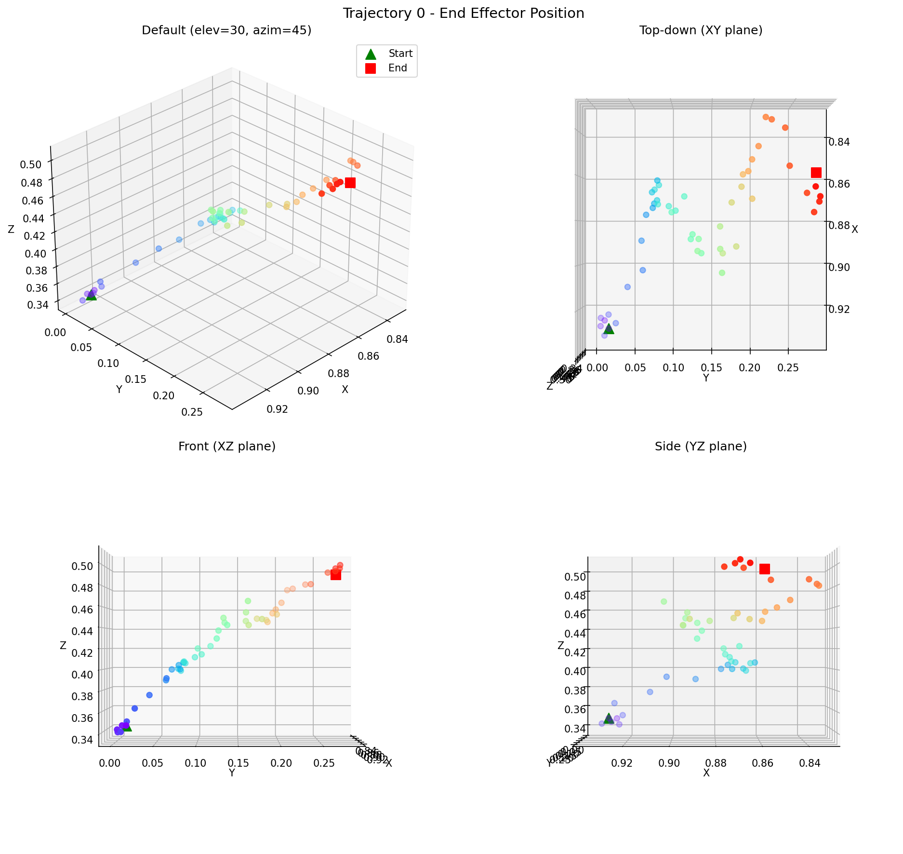
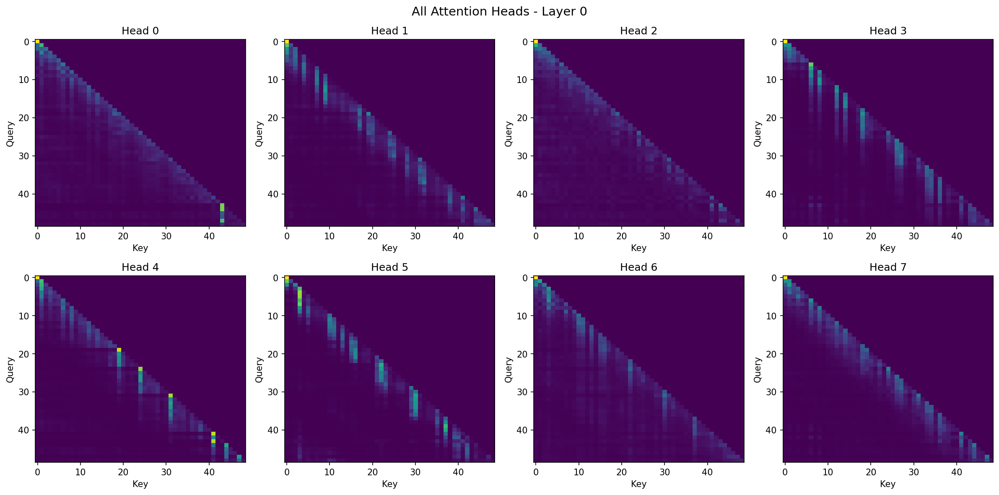
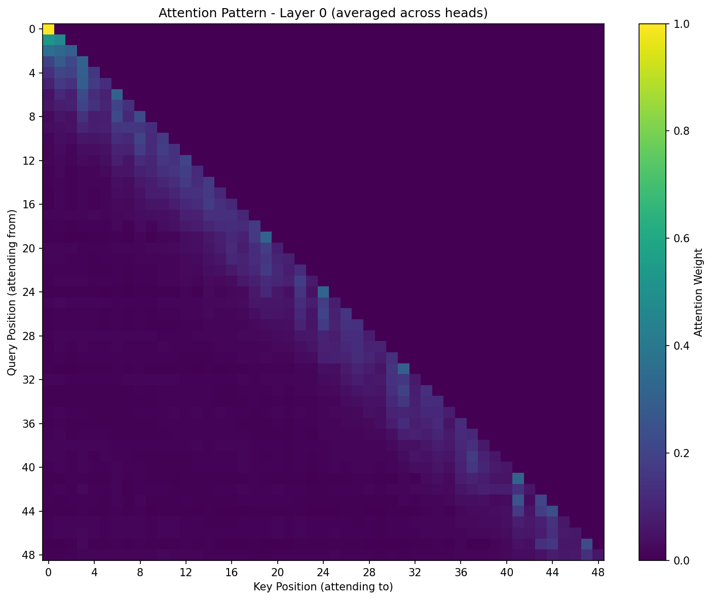
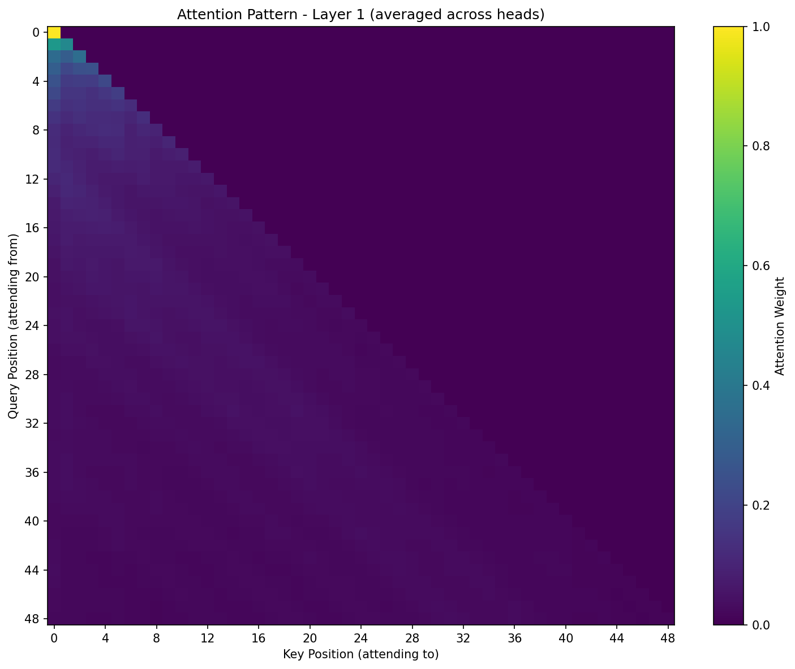
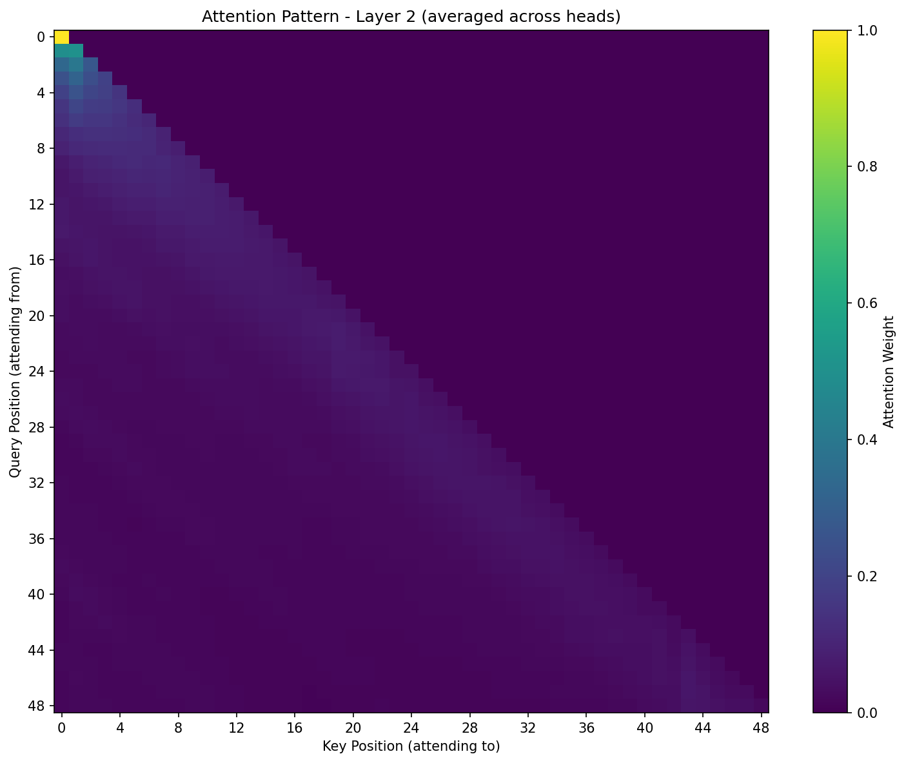
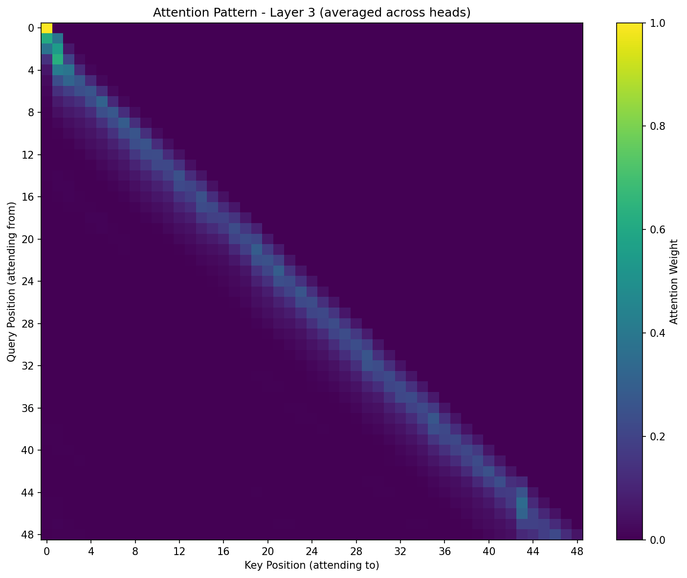

# Scratch-1: The Transformer Backbone

## Loss Curve

The model converged after 5922 iterations after 5 epochs with final loss of 1.9568. This was determined when the best model performed better than the last 5 models on the validation set. The best model is marked by the green star.

## Attention Visualization

The following trajectory is the one that corresponds with the produced attention maps.

I thought it would be important to understand the trajectory and what makes it unique when looking at the attention heads and layers.

Here is the attention maps for all 8 heads at layer 0 of the model.

This figures show the different aspects that each attention head was keying in on. The average of all these attention heads is shown below.

This shows the summation of all the individual heads. Overall, this first layer focuses on information primarily in the 5 to 10 timestamps following the current state (joints, position) in the trajectory.

This shows the summation of all the individual heads on layer 2 of the model. Overall, this second layer shows that as we move through the state, we consider things more gradually through longer amounts of the previous information.

This shows the summation of all the individual heads on layer 3 of the model. Similarly, this third layer shows that as we move through the state, we consider things more gradually through longer amounts of the previous information with slightly more importance on the 5 most recent timestamps. 

This shows the summation of all the individual heads on layer 4 of the model. The fourth layer centers its attention oon the time stamps following the current timestamp. Trying to recover information from the time directly proceding the current state.

## The Audit: Removing the Causal Mask

When I removed the causal mask, the following happened:

[Your analysis here]

### Why the Model "Cheats"

[Your explanation here]

## Code Highlights

[Optional: Highlight interesting implementation details]

## Challenges and Solutions

[Optional: Discuss difficulties you encountered]
