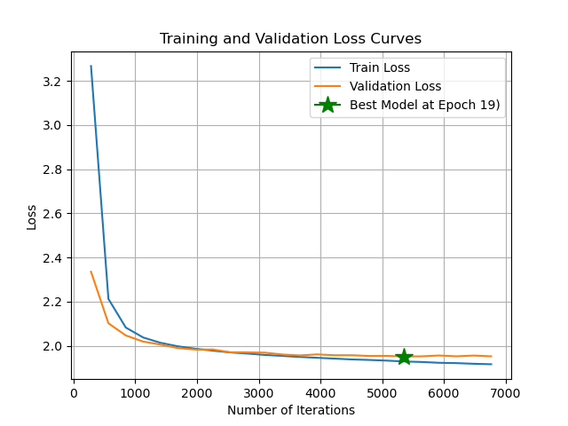
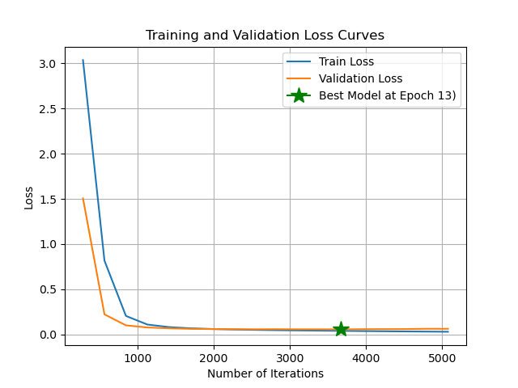
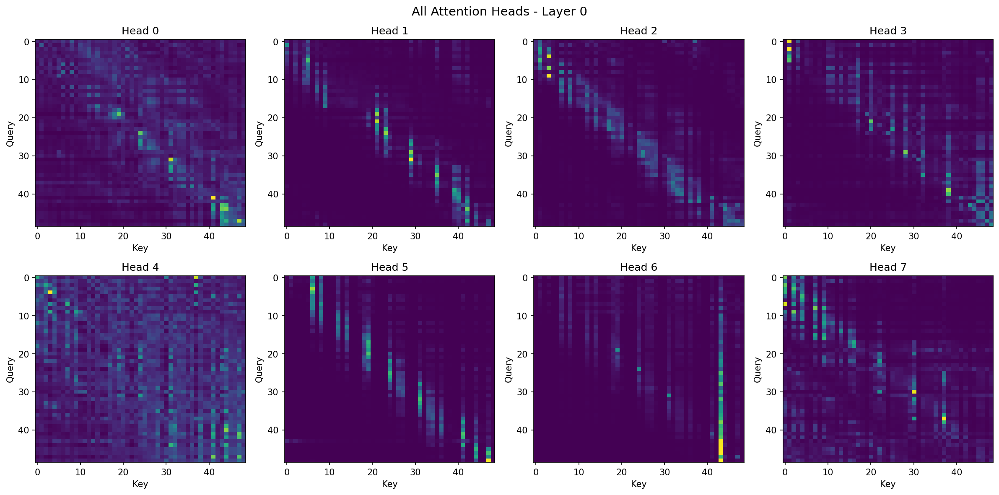

# Scratch-1: The Transformer Backbone

## Loss Curve

The model converged after 5358 iterations after 19 epochs with final loss of 1.9523. This was determined when the best model performed better than the last 5 models on the validation set. The best model is marked by the green star.

## Attention Visualization

The following trajectory is the one that corresponds with the produced attention maps.

I thought it would be important to understand the trajectory and what makes it unique when looking at the attention heads and layers.

Here is the attention maps for all 8 heads at layer 0 of the model.

This figures show the different aspects that each attention head was keying in on. The average of all these attention heads is shown below.

This shows the summation of all the individual heads. Overall, this first layer focuses on information primarily in the 5 to 10 timestamps following the current state (joints, position) in the trajectory.

This shows the summation of all the individual heads on layer 2 of the model. Overall, this second layer shows that as we move through the state, we consider things more gradually through longer amounts of the previous information.

This shows the summation of all the individual heads on layer 3 of the model. Similarly, this third layer shows that as we move through the state, we consider things more gradually through longer amounts of the previous information with slightly more importance on the 5 most recent timestamps. 

This shows the summation of all the individual heads on layer 4 of the model. The fourth layer centers its attention on the time stamps following the current timestamp. Trying to recover information from the time directly proceding the current state.

## The Audit: Removing the Causal Mask

When I removed the causal mask, the following happened:

The validation loss was able to reach much lower, all the way down to 0.0573. 

The attention maps show that the layers are finding correlations between the current state and future states that haven't occurred yet. The model is learning is gathering information from future events that haven't occurred yet.

### Why the Model "Cheats"

The model cheats because it can now see all the future states of the system. Therefore, it can drastically reduce its learning loss by learning the patterns in the trajectories. Essentially, it easily predicts the best next step because it knows where the trajectory was headed in the following timestamps. Therefore, it never learned the actual task, it just learned how to predict when it could copy from the future.

## Code Highlights

No special implementation highlights outside of some additional debugging stuff I did to visualize data better. Can add it by changing debug_info to true at top of backbone.py.

## Challenges and Solutions

Failed KV Caching Implementation and Inference Speed Comparison

Attempt is logged in git history and commits but removed from final PR.

This attempt is likely incorrect. I tried to explain the produced plots. I was able to learn about KV caching and see in principle how it would have been valuable to reduce inference time.

The figure above shows the difference in inference times with and without KV Caching. Here we see that preventing the recomputation of all previous timestamps K and V values and simply requiring a single computation of the current timestamps K and V values is incredibly advantageous. The furthest left plot shows inference time versus generation length with a fixed prompt of 5 tokens. The plot shows basically no speed increase for trajectory gernation lengths up to 50 points. The middle plot talks about inference time versus prompt length. Since our trajcetories were only 50 in length, I constrained them here. You can see that the amount of time to predict the remaining trajectory decreases as prompt length increases which makes sense (more provided, less to predict). The final plot shows the combination of computation gains based on prompt length and generation length.

## References

- [RMSNorm: Root Mean Square Layer Normalization](https://arxiv.org/abs/1910.07467) - Zhang & Sennrich, 2019
- [RMSNorm Implementation](https://github.com/bzhangGo/rmsnorm) - Reference implementation
- [RoFormer: Enhanced Transformer with Rotary Position Embedding](https://arxiv.org/abs/2104.09864) - Su et al., 2021
- [Rotary Embeddings: A Relative Revolution](https://blog.eleuther.ai/rotary-embeddings/) - EleutherAI
- [Let's build GPT: from scratch, in code, spelled out](https://www.youtube.com/watch?v=kCc8FmEb1nY) - Andrej Karpathy