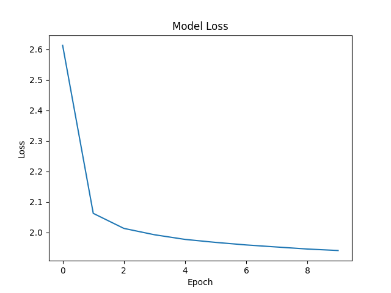
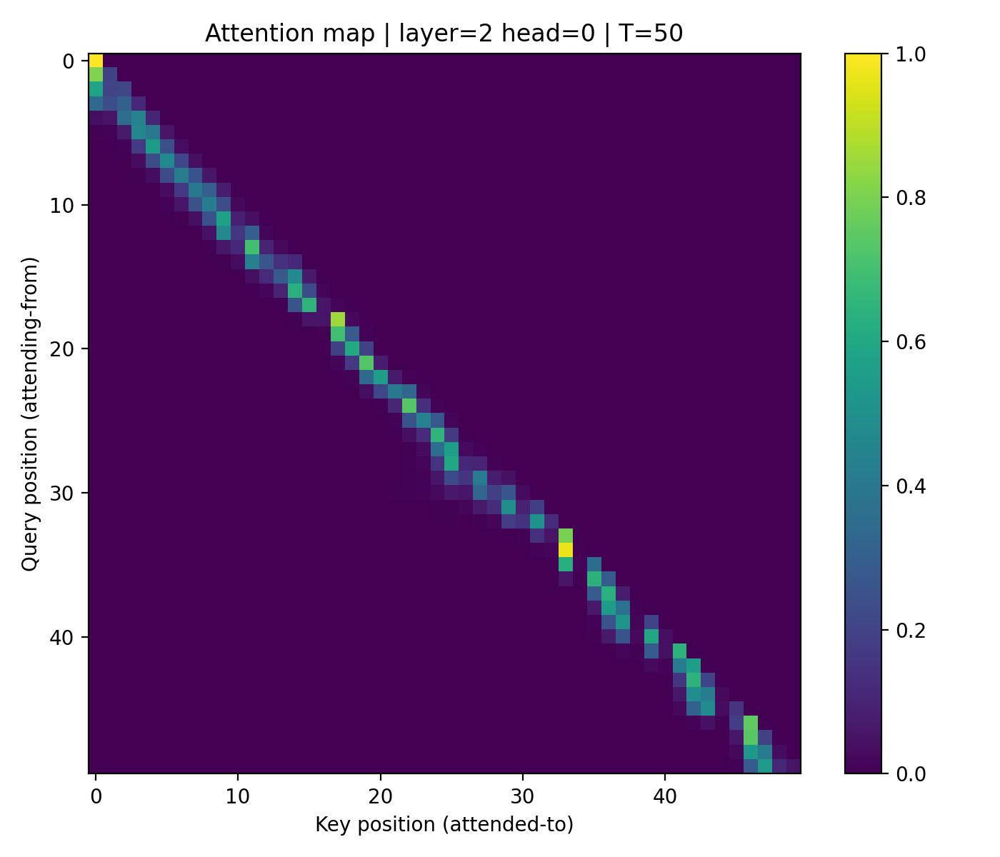

# Scratch-1: The Transformer Backbone

## Loss Curve

The vanilla transformer model converged after 8 iterations with final loss of 1.9451.

The transformer model that uses multi-headed latent attention converged after 9 iterations with a final loss of 1.9446.

## Attention Visualization

The attention patterns show that last few tokens are the ones that have the highest attention scores, and anything past that is basically not paid attention to, which makes sense in the context of robotics actions since there is a temporal correlation that likely doesn't matter past a couple tokens. It's also a triangular pattern due to the masking to ensure that the model can't attend to future tokens.

## The Audit: Removing the Causal Mask

When I removed the causal mask, the loss dramatically went to 0, in around only 2 epochs.

### Why the Model "Cheats"

Without the attention mask, the model is allowed to look at all the tokens, many of which also correspond to many of the output tokens (i.e. input $x_{t+1}$ is the same as output $x_t$). This then turns the model from a prediction model to a lookahead model based on its input.

## Code Highlights

I have implemented both KV-cache, as well as the Multi-Headed Latent Attention model by DeepSeek, which aims to lower the memory requirements for KV caches by a significant amount.

## Challenges and Solutions

I ran into a couple of challenges with KV-caching, and some for the MLA layer dimensions, but rereading and asking AI's for clarification I was able to implement it.

## Vanilla Attention with and without KV caching

---

**Device:** cuda  
**batch_size:** 8  
**prompt_len:** 50  
**gen_len:** 768  
**temperature:** 1.0  
**top_k:** None  
**attention_dim** 512

### Results

| Mode | Throughput (tok/s) | Std |
|---------------------------|------------------|-------|
| baseline (no cache) | 896.11 | 4.44 |
| generate_cached (KV) | 6122.47 | 44.24 |

**Speedup:** 6.83x  
**Cache size:** 102.12 MiB  

---

## Multi-Head Latent Attention with and without KV caching

> Uses much less cache size.  
> Due to RoPE, K and V must be cached separately.  
> For regular LLMs, consider the effective cache size as **half** of the value shown.

---

**Device:** cuda  
**batch_size:** 8  
**prompt_len:** 50  
**gen_len:** 768  
**temperature:** 1.0  
**top_k:** None  
**attention_dim** 512
**latent_dim** 128

### Results

| Mode | Throughput (tok/s) | Std |
|---------------------------|------------------|--------|
| baseline (no cache) | 1131.48 | 0.68 |
| generate_cached (KV) | 5885.69 | 196.96 |

**Speedup:** 5.20x  
**Cache size:** 25.53 MiB  

### References/AI usage

KV Caches:
https://magazine.sebastianraschka.com/p/coding-the-kv-cache-in-llms

MLA:
DeepSeek-AI, Liu, A., Feng, B., Wang, B., Wang, B., Liu, B., Zhao, C., Dengr, C., Ruan, C., Dai, D., Guo, D., Yang, D., Chen, D., Ji, D., Li, E., Lin, F., Luo, F., Hao, G., Chen, G., … Xie, Z. (2024). DeepSeek-V2: A Strong, Economical, and Efficient Mixture-of-Experts Language Model. https://arxiv.org/abs/2405.04434 

AI was used for part of the benchmarking and attention visualization code. Was not used to write any of the code in the backbone code.