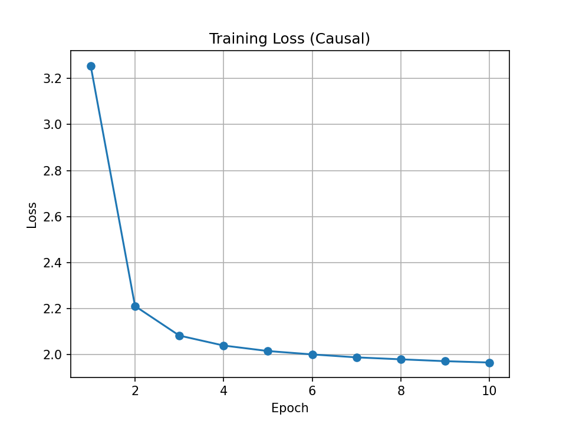
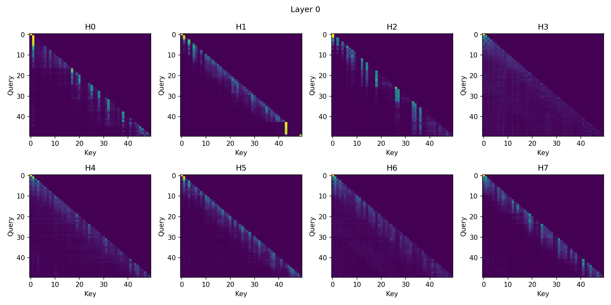
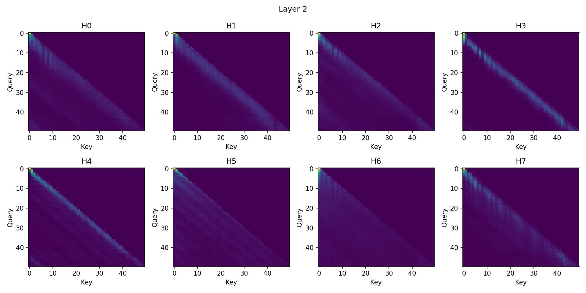
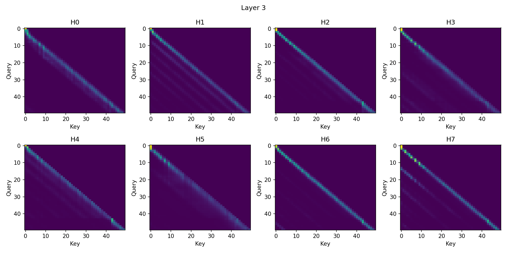
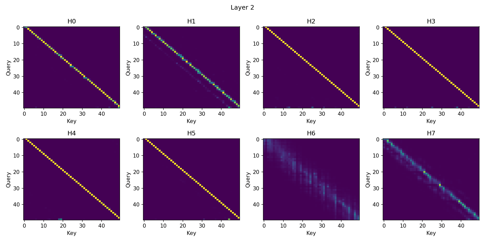

# Scratch-1: The Transformer Backbone

## Loss Curve

The model converged after 10 iterations with a final loss of ~1.96 with causal.

## Attention Visualization

The attention patterns show that, depending upon the attention-head, the model is focusing on different parts of the input sequence. But, they are all pretty much focusing on the previous couple of tokens.

## The Audit: Removing the Causal Mask

The model converged to a loss of 0.1 practically within 5 iterations. The jump in loss was very steep within 1 iteration. Looking at the attention maps when the mask was removed, we no longer had a triangle that was "cut off."

Without a causal mask to restrict the attention, the model can then attend to all tokens in the sequence. This gives the extremely high drop in loss, as the model just knows what tokens are coming next.

### Why the Model "Cheats"

The model "cheats" because it is able to look at the future tokens in the sequence. Essentially, if the model simply knows what tokens are expected to come next, the accuracy will jump up. The whole point of the causal mask is to use the current sequence of tokens to predict what possible tokens can occur next. If we already know what token is upcoming, then it becomes a memorization problem, rather than a prediction one. We can see in the attention images below, that the whole image lights up.

## Code Highlights

I've experimented with KV caching. We basically store the key and value of all the tokens seen so far. This allows the model to compute attention quicker. After running an ablation study, KV caching speeds up performance by around a factor of 2, when generating 1000 tokens. The benefits were much smaller whern I ran tests with smaller token counts. So as more tokens are generated, the benefits of KV caching should be higher.

## Challenges and Solutions

I faced a few issues with NOT adding a causal mask in the CausalSelfAttention class. Essentially, the mask is being passed in from DecoderOnlyTransformer block. So, I just had to ensure I wasn't re-doing the mask in the CausalSelfAttention block.
Implementing KV caching also required making changes to the RotaryPositionalEmbedding class. Also, the CausalMask essentially had to be simplified.