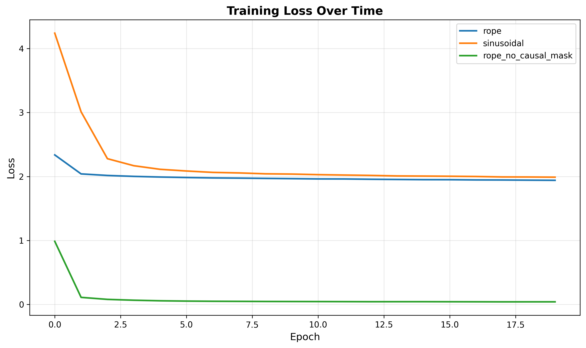
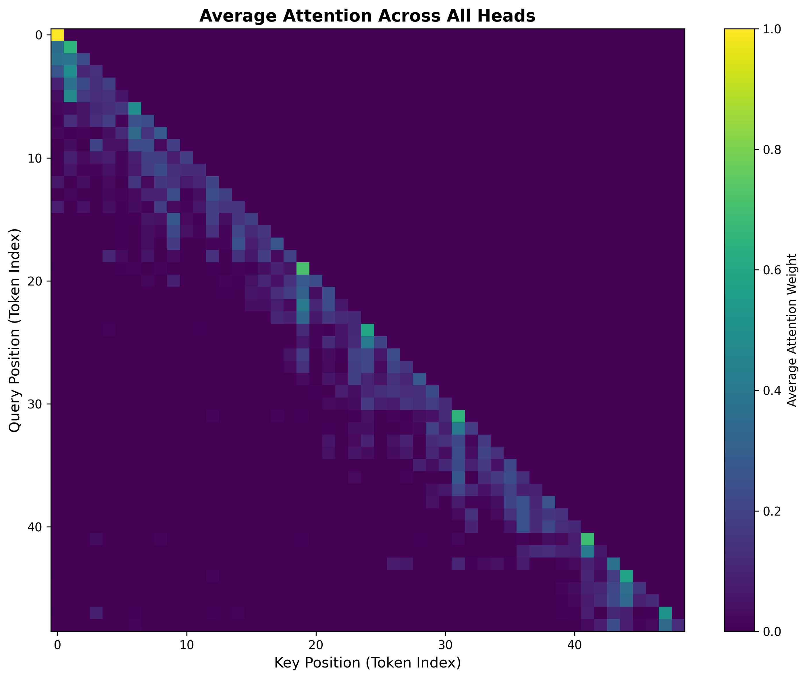
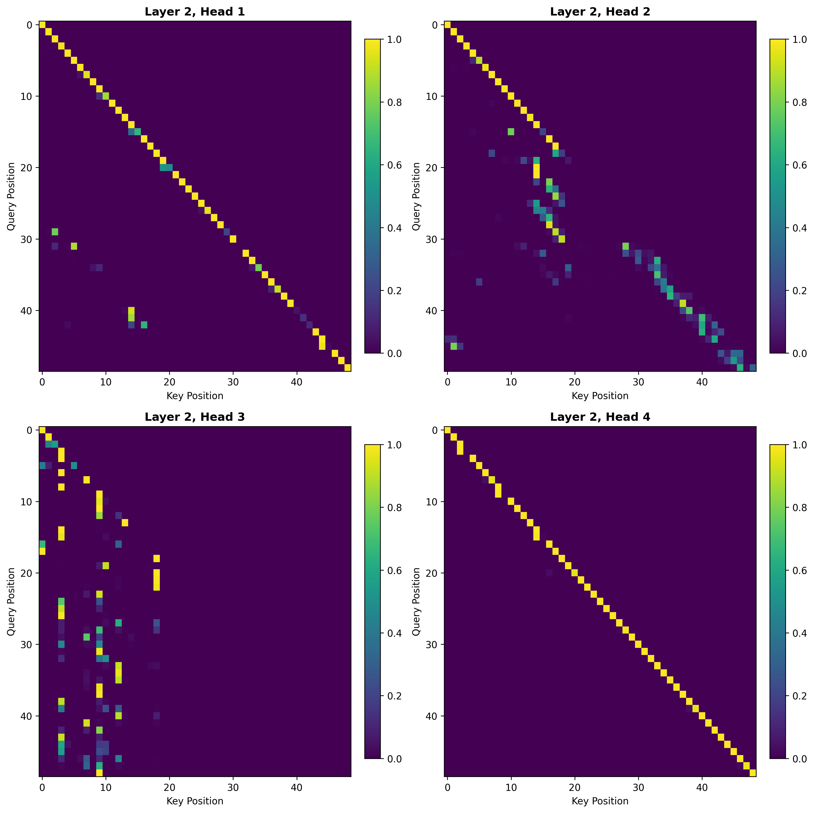

# Scratch-1: The Transformer Backbone

## Loss Curve



The model converged to a training loss of ~1.95 after approximately 5 epochs when using RoPE, with a final loss of 1.94 after 20 epochs. This is a significant improvement of convergence time and loss when compared to the sinusoidal positional embedding from "Attention is All You Need," (Vaswani et al., 2017) which converged to a loss of ~2.0 after 10 epochs.

### Mastery: Why RoPE outperforms Sinusoidal Positional Embeddings
RoPE outperforms sinusoidal positional embeddings because it allows the model to better capture relative positional information between tokens. In sinusoidal embeddings, each position is represented by a fixed vector, which can limit the model's ability to generalize to sequences of varying lengths or to understand the relationships between tokens that are far apart. RoPE, on the other hand, encodes positional information in a way that allows for more flexible interactions between token positions through rotation in the embedding space. This enables the model to learn more complex patterns and dependencies in the data, leading to improved performance and faster convergence during training.

RoPE treats the positional information of tokens as a complex conjugate pair of relative rotations. For example, the position $i$ is represented by the complex number $e^{i \theta_i}$, and the position $j$ is represented by the complex number $e^{i \theta_j}$, where $\theta_m$ is a non-zero constant defined from Vaswani et al. (2017) as $\theta_m = 10000^{-2(m-1) / d}$. The relative position $i - j$ is then represented by the complex number $e^{i (\theta_i - \theta_j)}$. Practically, this is implemented in matrix form using the rotation matrix $\mathbf{R}_{\Phi, i-j}^{d}$, which is a block diagonal matrix with blocks of size $d/2$ that are rotation matrices for the relative positions.

## Attention Visualization



The attention patterns attend strongly to recent tokens, indicated by the bright spots along the diagonal of the attention map for layer 0. 


If we look at the individual heads for a layer further in the chain, we can see that some heads attend to more distant tokens, suggesting that the model is learning to capture longer-range dependencies in the input sequence. Head 2 appears to be focused on key moments in the sequence, head 4 appears to be focused on either the starting token or last 25 tokens, and head 3 appears to be focused on the last token. This diversity in attention patterns across heads indicates that the model is leveraging multiple strategies to process the input data, and that the starting state and specific states are key information for the model's predictions. 

## The Audit: Removing the Causal Mask

When I removed the causal mask, the model is cheating and converges to a loss of ~0.5 after 6 epochs (Seen in Fig. 1), indicating that future tokens can strongly inform the predictions of the model. We prefer not to use a model that does not have a causal mask because future tokens would not be known at inference time.



Surprisingly, I was expecting the attention heads to attend more broadly across the sequence without the causal mask, but the attention maps (Seen in Fig. 2) still show a strong focus on recent tokens. This suggests that even without the causal constraint, the model still finds it beneficial to prioritize recent context for making predictions. There is a noticibley stronger weight on each of the heads compared to the fuzzier results from the causal masked version. Since the model can leverage information from future tokens, it can make more confident predictions and thus focus its attention more sharply on the most relevant tokens.

## Code Highlights

Additional helper files were made to generate the visualizations and ablations.
To visualize the attention heads for sample trajectory 42 (arbitrary):
```bash
python visualize_attention.py --checkpoint checkpoints/best_model.pt --sample_idx 42 
```

To train the ablations with rope, sinusoidal positional embeddings, and no causal mask:
```bash
python ablation.py
```

## Challenges and Solutions

After I implemented all of the TODOs in backbone.py, I was unable to train the model to converge to anything lower than 4.7 loss, even with rope and the causal mask. After some debugging, I realized that torch.rsqrt was the inverse square root function, not the base sqrt function. Despite learning, it was not converging well because the scaling factor in the RMSNorm layer was incorrect. After switching `x / rms` to `x * rms`, the model converged better, but still only reached >4.0 loss. After further investigation, I realized that I had only generated a small dataset of 1000 trajectories instead of the full 10,000, so the model was unable to generalize well. After generating the full dataset, the model was able to converge to ~1.95 loss with RoPE and the causal mask.