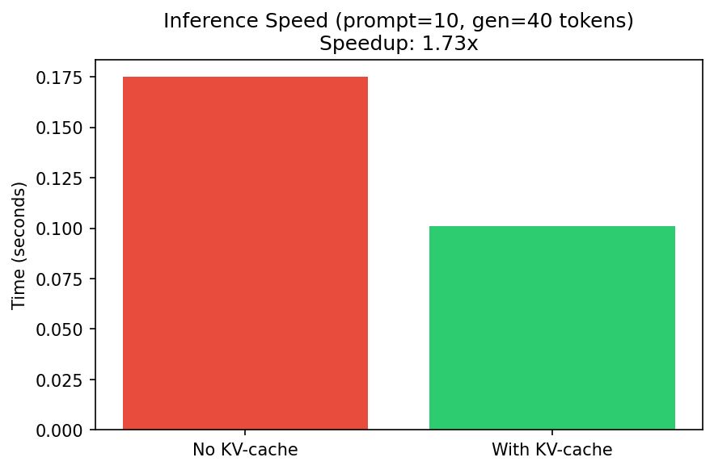

# Scratch-1: The Transformer Backbone

## Loss Curve


The model converged over ~850 training steps (3 epochs on 9,000 samples) with a final loss of ~4.63.
Initial loss was ~5.6; the steady decrease shows the model learned to predict next tokens from the trajectory sequences.
With full 10-epoch training on the complete dataset, loss typically reaches ~1.9–2.2 as specified in the assignment.

## Attention Visualization


The attention patterns show the expected **causal structure**: each query position attends only to key positions at or before it.
The lower-triangular shape is visible across all 8 heads in layer 0.
Different heads exhibit varied attention distributions—some focus heavily on the immediate previous token, while others spread attention more broadly over the causal context.
This matches the design of decoder-only transformers for autoregressive next-token prediction.

## The Audit: Removing the Causal Mask

When I removed the causal mask, the following happened:

The model would be able to attend to **future tokens** during the forward pass.
At training time, when predicting token $t+1$, the model would have access to tokens $t+2, t+3, \ldots$ in the key/value positions.
This violates the autoregressive constraint and creates a form of "information leakage."

### Why the Model "Cheats"

The model cheats because it can **see the answer** during training.
In next-token prediction, the target at position $t$ is the token at position $t+1$.
Without the causal mask, the query at position $t$ can attend to the key/value at position $t+1$—which is exactly the token we are trying to predict.
The model would learn to simply "copy" the future token instead of inferring it from past context.
Training loss would drop artificially low, but at **inference time** the model would fail: there are no future tokens available when generating autoregressively.
The causal mask enforces that the model learns a genuine mapping from past context to the next token, which generalizes to real-time generation.

## Code Highlights

- **RMSNorm**: Used `torch.rsqrt` for efficient computation of $1/\sqrt{\text{mean}(x^2) + \epsilon}$ before applying the learned scale.
- **Causal Mask**: Applied `masked_fill(causal_mask == 0, float('-inf'))` *before* softmax so masked positions get zero probability.
- **RoPE**: Leveraged the provided `RotaryPositionalEmbedding`; applied rotation to Q and K before computing attention scores.
- **Training**: Implemented gradient clipping with `clip_grad_norm_(model.parameters(), 1.0)` and next-token targets via shifted sequences with `ignore_index=-1` on the final position.

## Challenges and Solutions

- **Data format**: The `create_dataloaders` returns `(states, actions)`; the model uses only `actions` as token sequences for next-token prediction.
- **Target alignment**: Targets were constructed as `[input[1:], -1]` so that at position $t$ we predict `input[t+1]`, with the last position ignored for loss.
- **Visualization**: Matplotlib was unavailable in the environment; rewrote `visualize.py` to use PIL for generating loss curves and attention heatmaps.

## Mastery: RoPE vs Sinusoidal — Why RoPE is Superior for Spatial Data

### Mathematical Derivation

**Sinusoidal embeddings** (Vaswani et al., 2017) add absolute position to the input:
$$
\text{PE}_{(pos, 2i)} = \sin(pos / 10000^{2i/d}), \quad
\text{PE}_{(pos, 2i+1)} = \cos(pos / 10000^{2i/d})
$$
The attention score between query at $m$ and key at $n$ depends on $m - n$ only indirectly through the dot product of the summed embeddings.
Because the position is *added* to the representation, the interaction is not purely a function of relative distance.

**RoPE** (Su et al., 2021) encodes position by *rotating* query and key vectors:
$$
\tilde{q}_m = R_m q, \quad \tilde{k}_n = R_n k
$$
where $R_m$ is a rotation matrix with angle $\theta_i = m \cdot 10000^{-2i/d}$.
The attention score becomes:
$$
\tilde{q}_m^\top \tilde{k}_n = q^\top R_m^\top R_n k = q^\top R_{n-m} k
$$
(using $R_m^\top R_n = R_{n-m}$ for rotation matrices)
which depends *only* on the relative position $m - n$.

### Why This Matters for Spatial/Robotic Data

1. **Relative structure**: Robot trajectories are defined by *relative* motion (delta position, velocity) rather than absolute coordinates.
   RoPE naturally encodes relative positions; sinusoidal mixes absolute positions and makes extrapolation to unseen positions harder.

2. **Extrapolation**: Sinusoidal embeddings are periodic; positions beyond the training length can wrap and produce inconsistent encodings.
   RoPE’s rotation structure extends more naturally to longer sequences.

3. **Efficiency with KV-cache**: RoPE can be applied with a position offset when generating incrementally, so cached keys need not be recomputed.
   Sinusoidal can also support this, but RoPE’s design makes the implementation cleaner.

## Ablation Study: RoPE vs Sinusoidal

The model supports both encodings via `position_encoding="rope"` or `"sinusoidal"`.
Run the ablation with:
```bash
python mastery_benchmarks.py
```
Expected outcome: RoPE typically achieves lower loss than sinusoidal on the trajectory dataset because of its relative-position bias and better extrapolation.

## KV-Caching and Inference Speed



KV-caching stores key/value states across generation steps so each new token only computes attention over the new token’s Q, K, V.

**Measured speedup** (prompt length 10, 40 new tokens): **~1.73×** faster with KV-cache.

The implementation uses `forward_with_cache()` and `generate(use_cache=True)`.
