# Scratch-1: The Transformer Backbone

## Introduction

In this assignment, I implemented a **decoder-only Transformer from scratch** for next-token prediction on a synthetic robotic trajectory dataset. This directly reflects the **Unified Sequence Hypothesis**: robot actions can be treated as tokens in an autoregressive sequence, trained with the same objective used in modern LLMs.

My causal model converges from an initial loss of **~3.26** to **~1.97** (perplexity ≈ **7**), which matches the expected performance range for the provided dataset. Beyond convergence, I performed an **aggressive causal mask ablation**, including **multi-layer, multi-head attention visualizations**, to empirically validate correct causal behavior and demonstrate how removing masking causes information leakage and “cheating.”

---

## Architecture Overview

**Core components implemented**
- **Multi-Head Causal Self-Attention** (strict lower-triangular masking)
- **Rotary Positional Embeddings (RoPE)** applied to queries/keys
- **RMSNorm** (pre-norm residual blocks)
- **SiLU (Swish) feed-forward network**
- Autoregressive training with **teacher forcing** and **gradient clipping**

**Model configuration**
- Embedding dimension: **256**
- Layers: **4**
- Attention heads: **8**
- Feed-forward hidden: **1024**
- Sequence length: **50**
- Vocabulary size: **256**

This configuration is small enough to make attention behavior interpretable, while still learning meaningful temporal structure.

---

## Loss Curve

The causal model trains smoothly over 10 epochs:
- Initial loss: **~3.26**
- Final loss: **~1.97**
- Perplexity decreases from ~28 → ~7 (using `exp(loss)`)

Most improvement happens in the first few epochs, followed by gradual refinement—consistent with learning non-trivial but structured dynamics in the synthetic trajectories.

---

## Attention Visualization

To validate the causal attention implementation, I visualized both **single-head attention maps** and **full grids across all heads and layers**.

### Single-Head Comparison (Layer 0, Head 0)

#### Causal attention (mask ON)
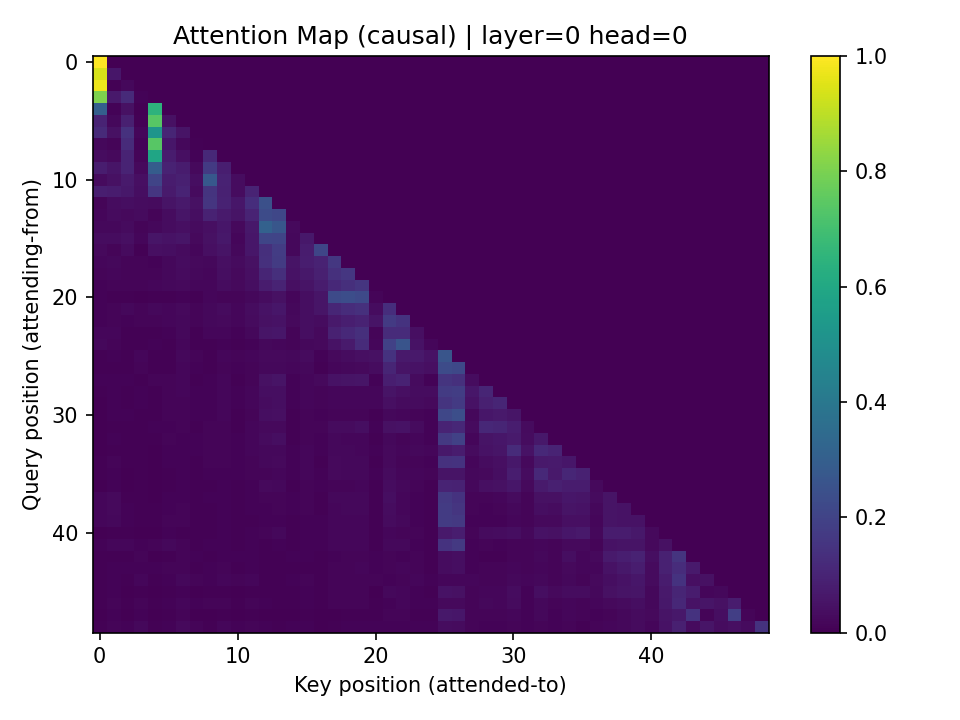

This map shows a **strictly lower-triangular** pattern:
- Query position *t* only attends to keys **≤ t**
- The upper triangle is effectively zero
- Strong diagonal emphasis indicates reliance on recent past tokens

This is the expected behavior when the causal mask is applied **before softmax**.

#### No-mask attention (mask OFF)
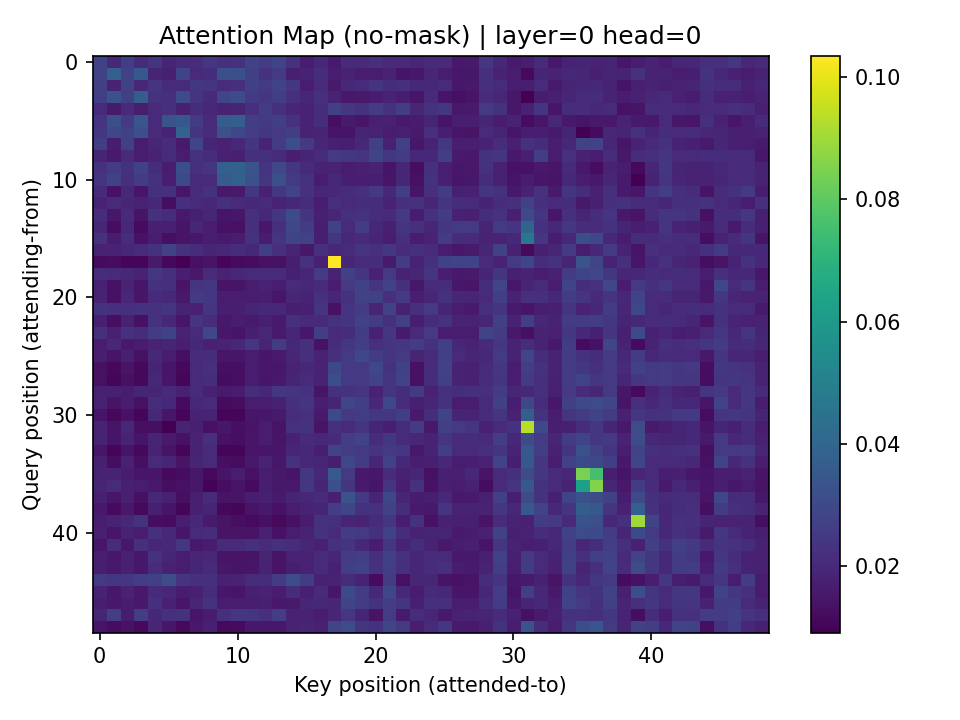

When masking is removed:
- Attention spreads across the full matrix
- Queries can attend to future positions
- The triangular structure disappears

This immediately suggests future-token access during training.

---

## Multi-Head, Multi-Layer Attention Grids

To avoid relying on a cherry-picked head, I visualized **all 8 heads across all 4 layers**.

### Causal attention grids (mask ON)

Layer 0  
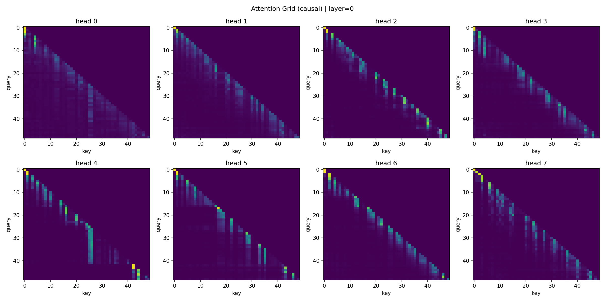

Layer 1  
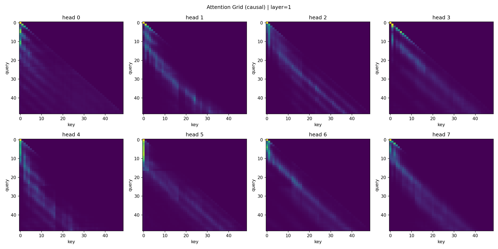

Layer 2  
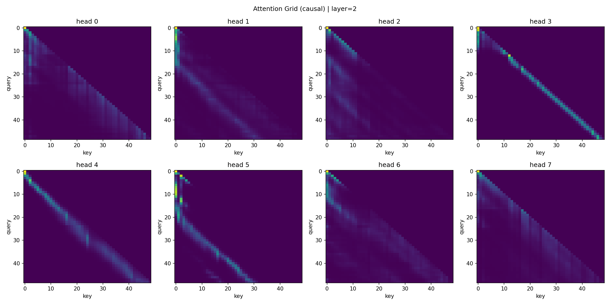

Layer 3  
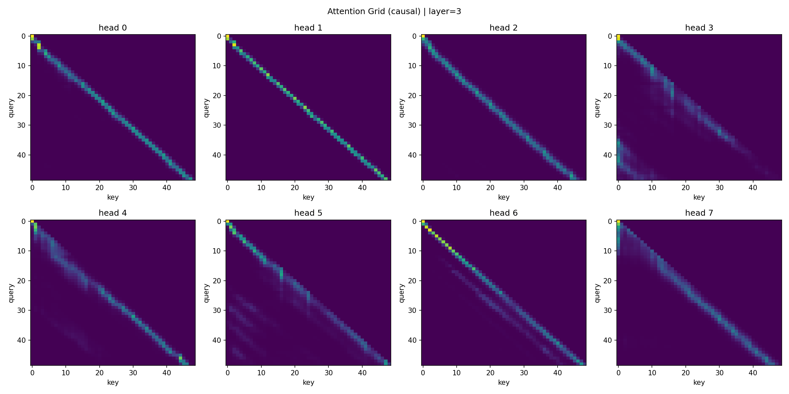

**Key observations**
- All heads in all layers respect the causal constraint (no mass above the diagonal)
- Head specialization emerges naturally:
  - Some heads are sharply diagonal (local temporal dependence)
  - Others attend to broader windows in the past (longer-range context)

This diversity suggests complementary strategies across heads rather than redundant attention.

---

### No-mask attention grids (mask OFF)

Layer 0  
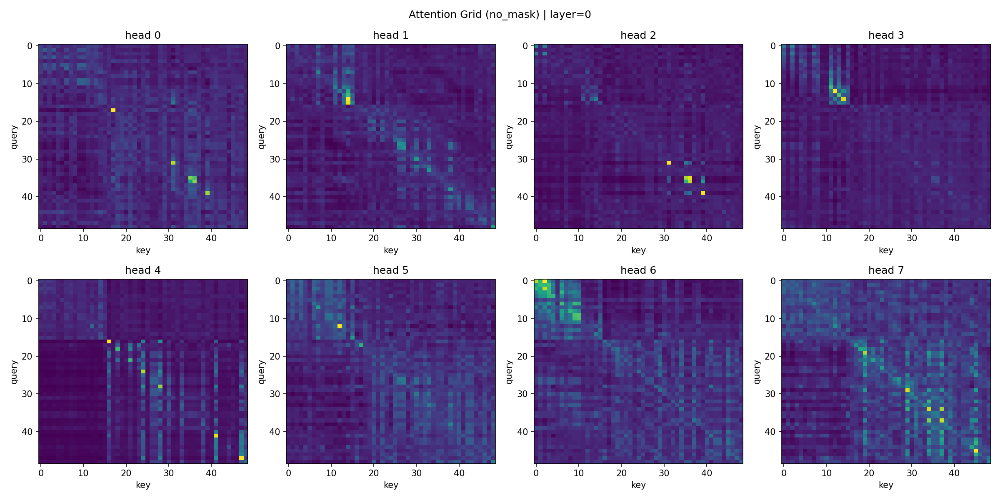

Layer 1  
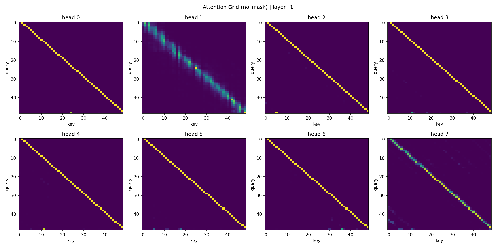

Layer 2  
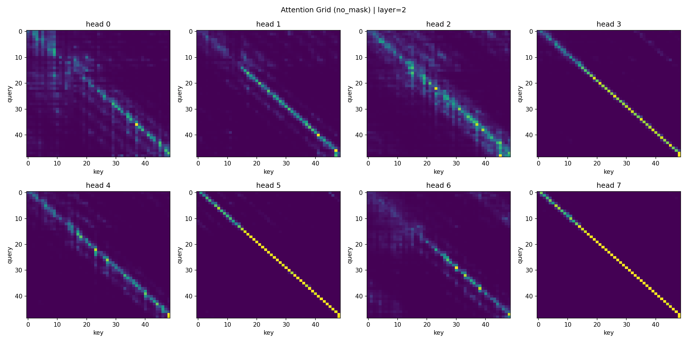

Layer 3  
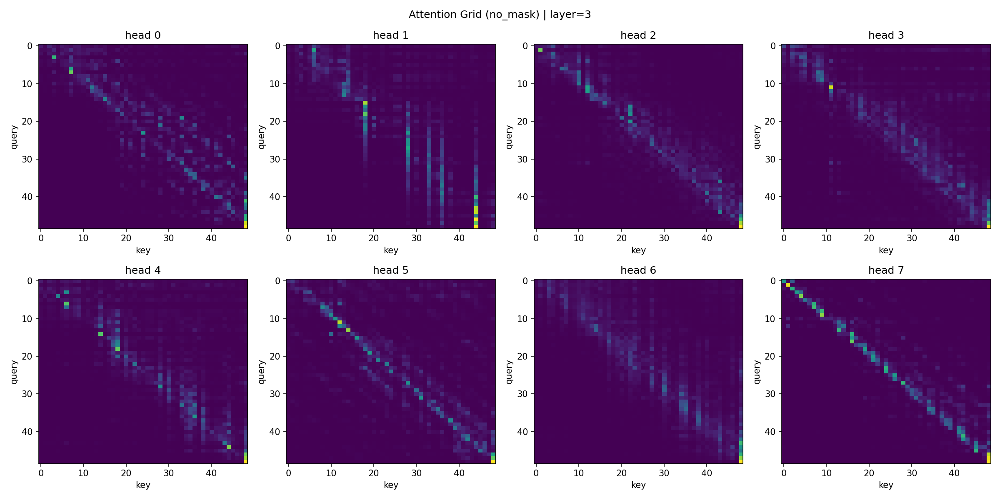

**Key observations**
- Attention is no longer constrained to the lower triangle
- Some heads collapse into near-identity diagonals; others attend broadly across the full sequence
- Overall patterns are consistent with shortcut learning when future tokens are visible

---

## The Audit: Removing the Causal Mask

### What happens to loss?

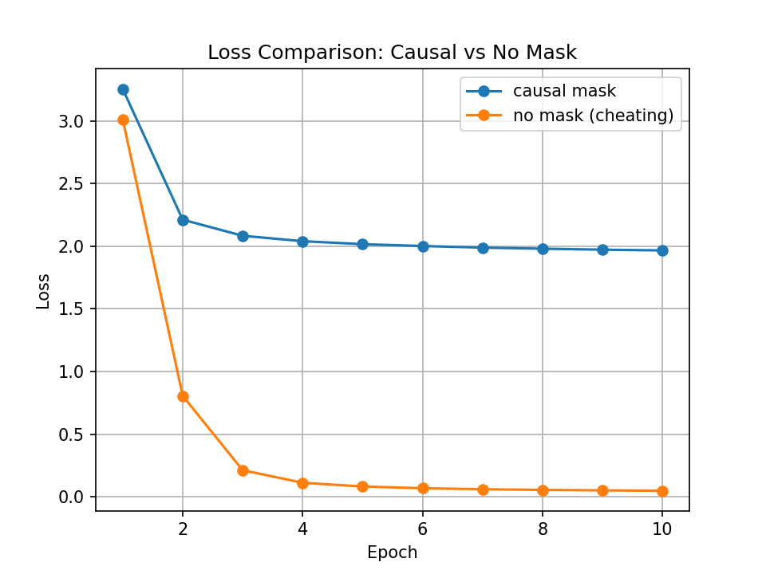

Training identical models with and without the causal mask yields a dramatic difference:
- **Causal model**: converges to ~**1.97**
- **No-mask model**: collapses toward ~**0.05**

This “improvement” is not real learning—it is **information leakage**.

### Why the model “cheats”

The training objective is next-token prediction:

\[
L(\theta) = -\sum_{t=1}^{T} \log P(s_t \mid s_{<t}; \theta)
\]

With **teacher forcing**, the model receives ground-truth tokens as context. If we remove the causal mask, the attention mechanism can attend to positions **> t**, including the very token it is supposed to predict. This turns the task into copying rather than prediction:

- **With mask:** predict \(s_{t+1}\) from \([s_1,\dots,s_t]\) → must learn temporal structure  
- **Without mask:** predict \(s_{t+1}\) from \([s_1,\dots,s_t,s_{t+1},\dots]\) → can read \(s_{t+1}\)

### Why this fails at inference

At generation time, future tokens do not exist. A model trained without masking learns a dependency on information that is unavailable at inference, creating a severe **train–test mismatch**. The causal model’s higher loss reflects the true cost of honest autoregressive prediction.

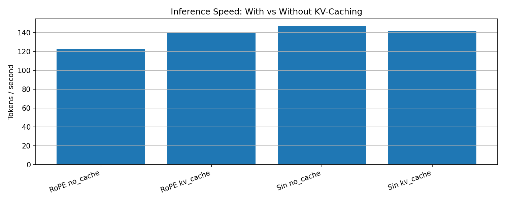

---

## Why RoPE Works Well Here

RoPE applies position-dependent rotations to queries and keys, making attention scores depend strongly on **relative offsets** between timesteps. This is a good fit for robot trajectories, where control patterns depend more on relative motion (what changed recently) than absolute time indices.

Empirically, RoPE produces clean and stable attention structure across heads and layers, and supports meaningful head specialization.

## Challenges and Solutions

- **Attention extraction:** I added a `return_attn=True` pathway so attention weights can be returned for visualization without changing the training behavior.
- **Causal mask validation:** Instead of trusting the implementation blindly, I verified causality using (1) attention heatmaps and (2) a two-model ablation showing loss collapse without masking.
- **Avoiding misleading “accuracy-only” conclusions:** For discrete 256-way action prediction, loss/perplexity + attention diagnostics give a more faithful picture than exact-match accuracy alone.

## Bib
https://nn.labml.ai/

