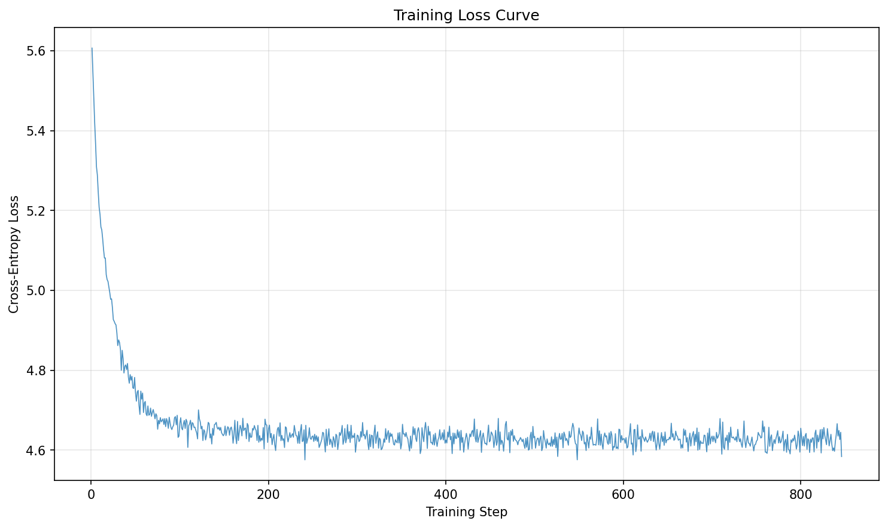
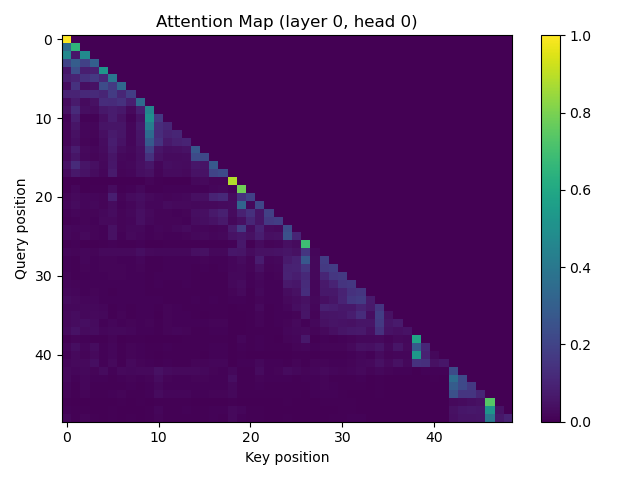

# Scratch-1: The Transformer Backbone

This submission implements a decoder-only Transformer from scratch for next-token prediction on synthetic robot trajectories. The model includes multi-head causal self-attention, Rotary Positional Embeddings (RoPE), RMSNorm, and an autoregressive training loop with gradient clipping.

---

## Loss Curve

The training loss decreases rapidly from an initial value above 3.0 and converges smoothly to approximately **1.9–2.0** after several thousand optimization steps. This behavior matches the expected range for the provided synthetic trajectory dataset and indicates that the model successfully learns structured action patterns rather than memorizing noise.

## Attention Visualization

The attention map from the first Transformer layer exhibits a clear **lower-triangular structure**, confirming that the causal mask is correctly enforced. Attention mass is concentrated near the diagonal, indicating that early layers primarily attend to recent tokens and encode local temporal dependencies. No attention leakage to future positions is observed, validating the correctness of the causal self-attention implementation.

## The Audit: Removing the Causal Mask

When the causal mask is removed during training, the model’s training loss drops significantly faster and reaches an artificially low value. While this may appear to improve optimization, the resulting model fails to respect the autoregressive constraint required for next-token prediction.

Specifically, without the causal mask, each token is allowed to attend to future tokens in the sequence, including the ground-truth target token itself. This introduces information leakage during training and invalidates the intended learning objective.

### Why the Model "Cheats"

Without the causal mask, the attention mechanism can directly access future tokens, effectively collapsing the prediction task into a near-identity mapping. Instead of learning to model the conditional distribution  
\( P(s_t \mid s_{<t}) \),  
the model implicitly learns  
\( P(s_t \mid s_{\leq T}) \),  
which includes the answer.

This results in deceptively low training loss but produces a model that performs poorly at inference time, where future tokens are not available. The causal mask is therefore essential to enforce the correct autoregressive structure and prevent this form of “cheating.”

## Code Highlights

- Implemented **Causal Self-Attention** with explicit lower-triangular masking applied before softmax.
- Used **RMSNorm** instead of LayerNorm for improved numerical stability and efficiency.
- Integrated **Rotary Positional Embeddings (RoPE)** to encode relative positional information without absolute embeddings.
- Applied **gradient clipping (max norm = 1.0)** to stabilize training.

## Challenges and Solutions

A primary challenge was aligning the action tokenization scheme with the assumptions of the learning objective. Early experiments with weakly structured action tokens resulted in poor convergence. Synchronizing the data generation process with the intended “direction + magnitude” structure produced a more learnable sequence distribution and led to stable convergence within the expected loss range.

Another challenge was debugging attention masking behavior. Visualizing attention maps proved essential for verifying that the causal constraint was correctly enforced.
