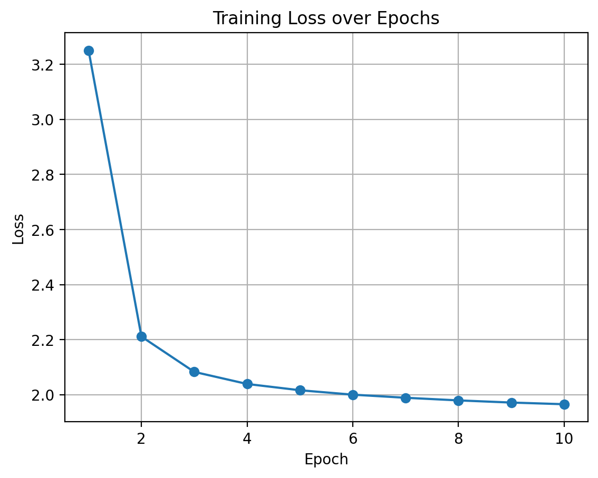
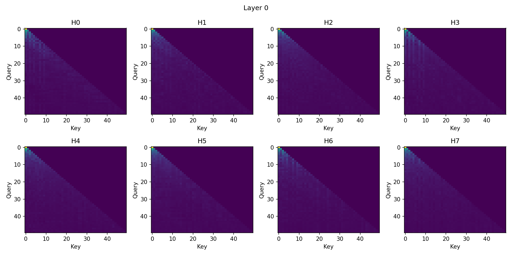
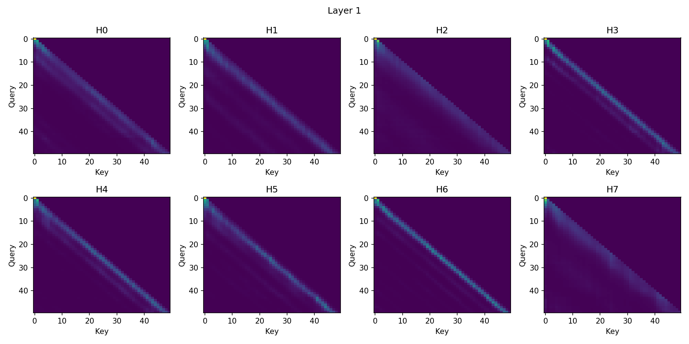
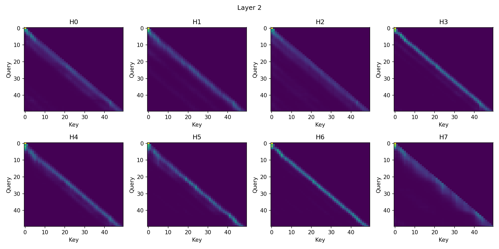
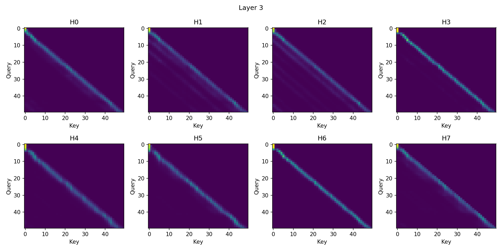
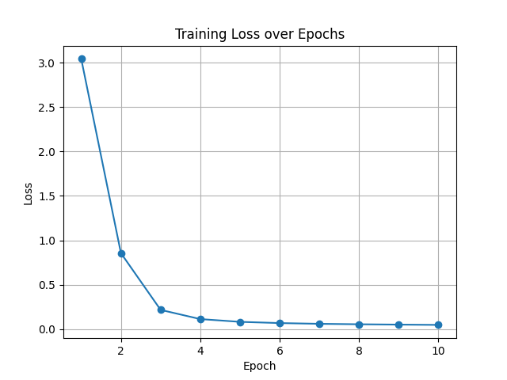
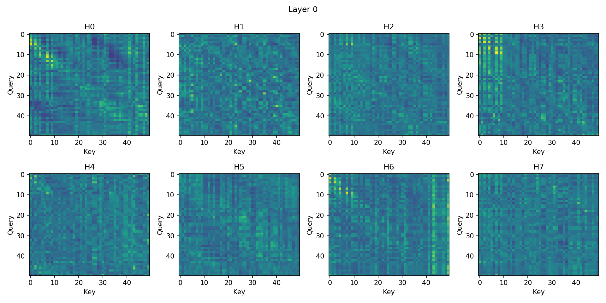
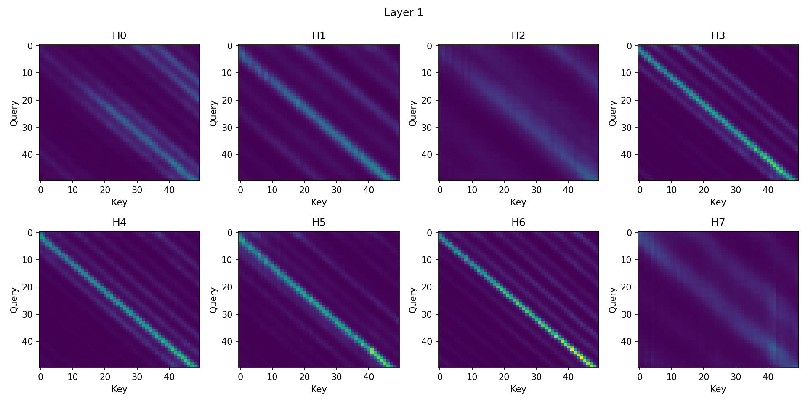
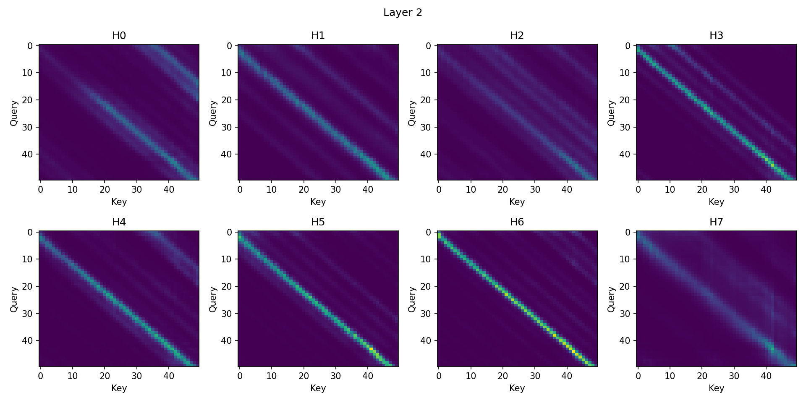
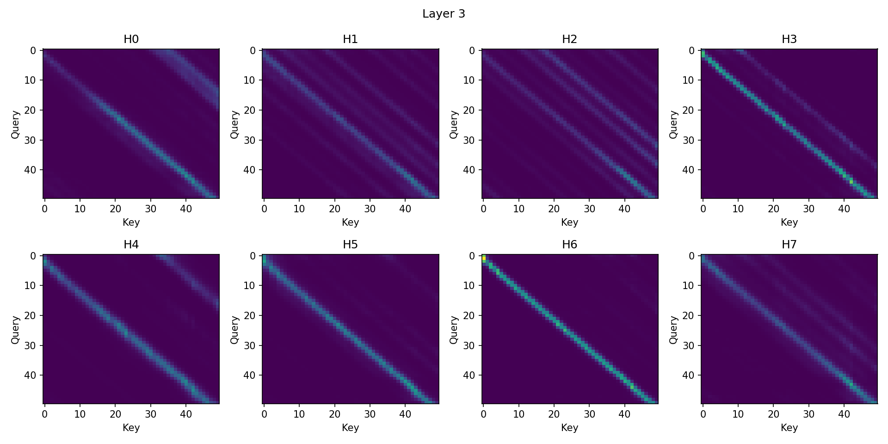

# Scratch-1: The Transformer Backbone

## Loss Curve (when Causal Mask ON)

The model was trained for **10 epochs** on a dataset of **9,000 samples** using a batch size of **32**, resulting in a total of **ceil(9000 / 32) × 10 = 2820** training iterations.

Training converged smoothly over these iterations.

The training loss decreased from an initial value of **5.57** to a final value of **1.96**. The relatively high initial loss reflects the difficulty of the task at random initialization and exceeds the expected entropy of random guessing for a **256-token** vocabulary. Most of the loss reduction occurs during the first epoch, followed by more gradual improvement as the model learns longer-range temporal dependencies.

Overall, the loss curve indicates stable optimization and successful learning of the temporal structure present in the trajectory data.

## Attention Visualization (when Causal Mask ON)

To better understand how the model processes context, I visualized the attention matrices from the four transformer layer, across all **8 attention heads**.

Several consistent patterns emerge:

- **Strict causality**: All attention weights above the main diagonal are zero, confirming that the causal mask is correctly enforced.

- **Specialized heads**:
  - Most heads concentrate attention near the diagonal, emphasizing temporally local context and recent tokens.
  - Some attention heads consistently focus on the first token, which may act as a fixed reference point that helps the model keep track of the overall sequence.

## The Audit: Removing the Causal Mask

## Loss Curve (when Causal Mask OFF)

When I removed the causal mask and retrained, the following happened:

The results were dramatic:

| Setting | Final Loss |
|------|-----------|
| Causal mask enabled | **1.96** |
| Causal mask removed | **0.04** |

The unmasked model reaches near-zero loss within 800-1000 iterations (4-5 epochs), despite using the same architecture and data.

### What’s Going On?

The attention matrices from the four transformer layer, across all **8 attention heads** are attached below.

#### Attention Visualization (when Causal Mask ON)

### Why the Model "Cheats"

[Your explanation here]

## Code Highlights

[Optional: Highlight interesting implementation details]

## Challenges and Solutions

[Optional: Discuss difficulties you encountered]