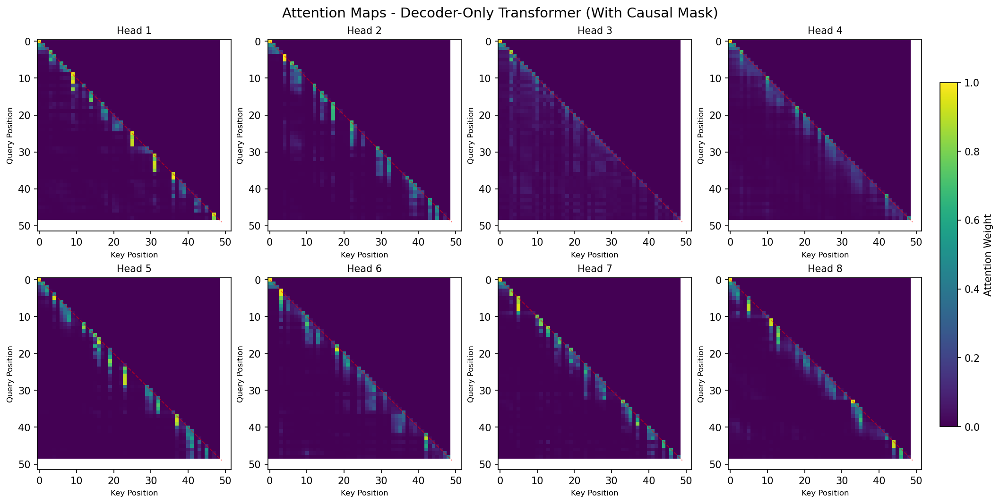

# Scratch-1: The Transformer Backbone

## Loss Curve

The model converged after X iterations with final loss of Y.

## Attention Visualization

The attention patterns show...

## The Audit: Removing the Causal Mask

When I removed the causal mask, the following happened:

[Your analysis here]

### Why the Model "Cheats"

[Your explanation here]

## Code Highlights

[Optional: Highlight interesting implementation details]

## Challenges and Solutions

[Optional: Discuss difficulties you encountered]