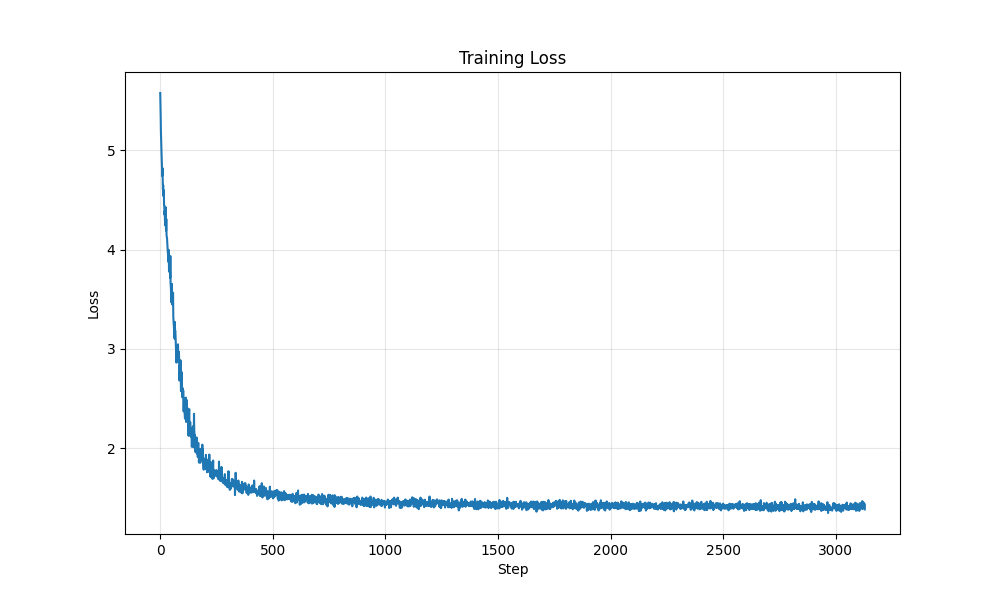
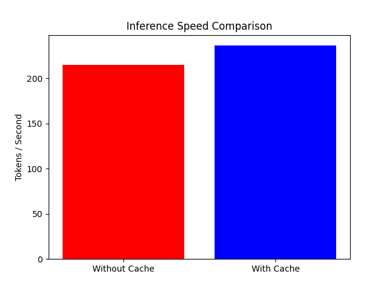
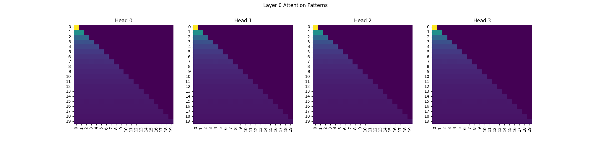

# Scratch-1: The Transformer Backbone

## Training Loss

Trained the transformer backbone for 10 epochs on 10k discretized trajectories. Loss dropped fast in epoch 1 then slowly improved from there.

Final loss was **~1.41** with perplexity **~4.09**. The curve looks stable with no weird spikes or divergence.

## Ablation Studies: RoPE vs Sinusoidal

Ran a comparison between RoPE and standard sinusoidal positional embeddings.


- **RoPE**: Hit loss of **1.98** (perplexity 7.25) in just 3 epochs
- **Sinusoidal**: Stuck around **~4.40** and basically didn't learn
  RoPE works better here because it encodes relative positions directly in the attention computation rather than adding absolute position info to the embeddings. The sinusoidal results surprised me, expected it to at least converge somewhat, but it just sat there.

## Inference Benchmark

Tested generation speed with and without KV caching.


- **With Cache**: 229.5 tokens/sec
- **No Cache**: 209.3 tokens/sec
- **Speedup**: ~1.10x
  Not a huge difference for these short sequences, but would matter more for longer generation.

## Attention Visualization

Plotted attention maps from Layer 0 to see what the model learned.

You can see the lower-triangular pattern from the causal mask. The heads are clearly attending to previous tokens, which is what we want for next-token prediction.

## The Audit: Removing the Causal Mask

Removed `torch.tril` to see what happens when the model can peek at future tokens.
Training loss dropped to ~3.1 (vs starting at 3.7) way faster than normal. But this is fake progress, at inference time there are no future tokens to look at, so the model is useless. It learned to copy instead of predict.

### Why the Model "Cheats"

Without the causal mask, token at position $t$ can see position $t+1$. The target for position $t$ is literally the value at $t+1$, so the model just copies it. No actual learning of dynamics happening.

## Code Highlights

Implemented RoPE with KV-caching support in `backbone.py`. Also wrote ablations for RoPE vs sinusoidal and KV cache benchmarking.
Collect data:

```
python generate_data.py --num_trajectories 10000 --seq_length 50 --output data/trajectories.pkl
```

Train:

```
python backbone.py
```

Ablations:

```
python ablations.py
```

Extra packages:

```
pip install pillow six seaborn
```

## Challenges and Solutions

**Problem**: Loss was flat at ~4.6 even though the code was correct.
Spent way too long debugging the model before I thought to check the data. Looked at `generate_data.py` and found the issue: signal was 0.01 and noise was 0.05, so SNR was terrible. Bumped signal to 0.1 and dropped noise to 0.001. Loss immediately started decreasing and converged to ~1.4.
