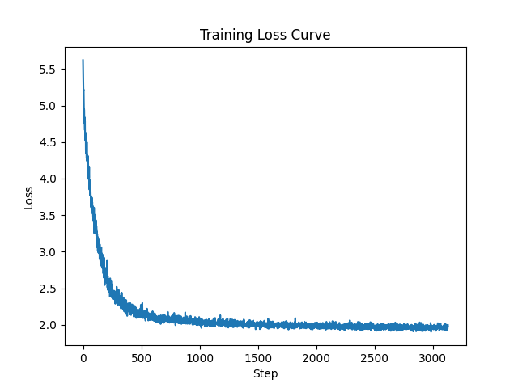
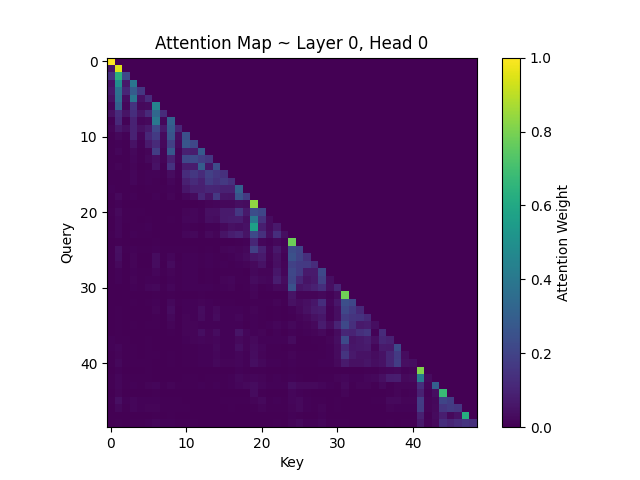
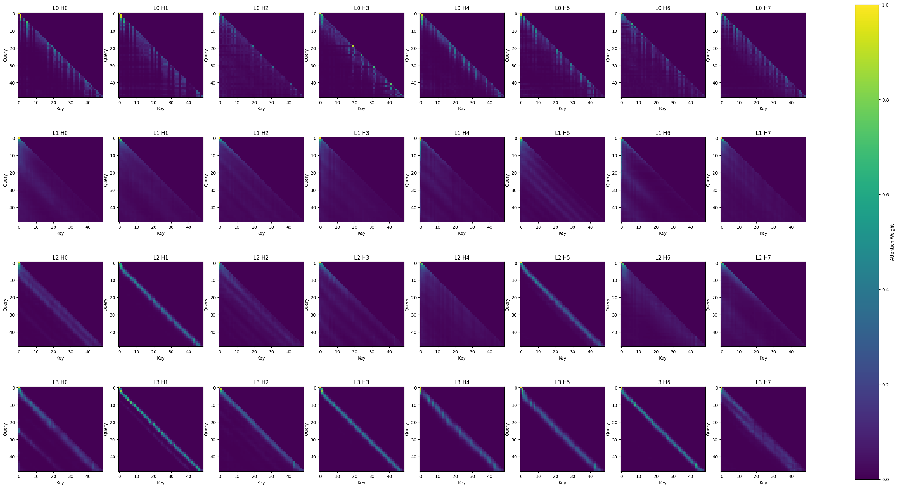
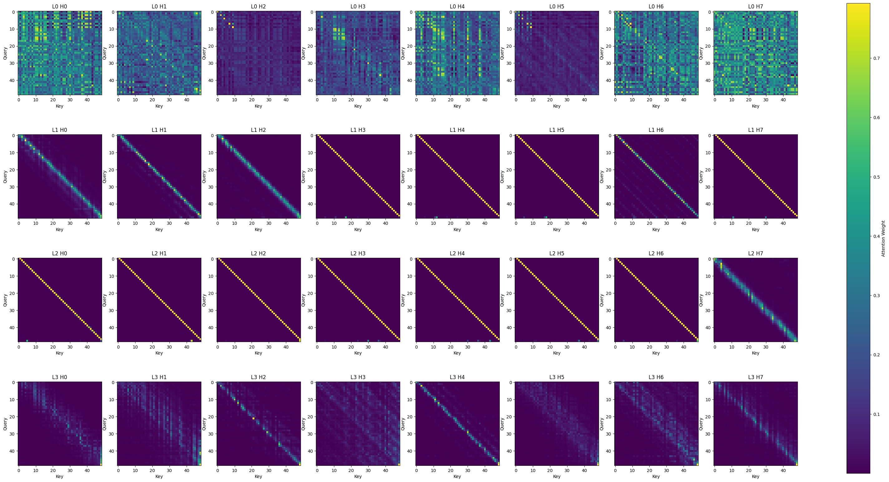
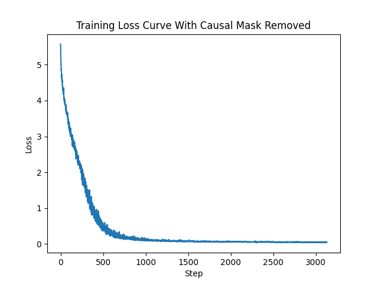

# Scratch-1: The Transformer Backbone

## Loss Curve

The model converged at around 1000 iterations (steps) into the training with final loss of 1.9610.

## Attention Visualization

Here is an example attention map for Layer 0, Head 0:

The plot has queries along the Y axis, and keys along the x axis - i.e. each row shows what keys the queries can attend to. Notably, the queries strongly attend to themselves and tokens in the immediate past, learning that relevant context is stuff that recently happened. Furthermore, there is a strong lower triangular pattern with no bright spots in the upper triangle of the plot.

This pattern can be seen across all the layers / heads:

It is interesting to see how the attention varies across the layers and heads, each learning different things (for example, some queries attend strongly to themselves only, shown by a bright diagonal stripe, whereas others attend more to actions in the past - L2 H3 is an interesting example where there are even multiple diagonal stripes as you go towards the bottom left corner of the plot).

## The Audit: Removing the Causal Mask

The most important feature of the maps shown in the previous section is that they show the causal mask in effect. The mask is applied via a lower triangular matrix that sets the rule that tokens can only attend to themselves and tokens in the past. In the attention maps, we can see that there are no bright spots in the upper triangular locations.

As an experiment, the same experiment was ran with the causal mask removed. The results can be seen below:

You can see in some of the plots that there are bright spots everywhere (notably the first row), and in the upper triangular regions of the plots.

Additionally, from the printed loss logs, we can see that the loss converges to almost 0, as if the training is yielding perfect results...

### Why the Model "Cheats"

When you remove the causal mask, you are effectively allowing tokens during training to view tokens ahead of the current position in the sequence. This effectively is the same as looking into the future, and you are training a model to predict what will happen with knowledge of what will happen already, instead of predicting purely based on the past and then punishing wrong predictions via the loss.

Consequently, you end up overfitting the learning, converging the loss to almost 0 because you are already giving the model the answers. This makes for poor generalization, as during inference time, the model can't look at these future tokens because they don't exist. The training loss converged upon might be low, but the model has not actually learned to 'predict' anything meaningful.

## Challenges and Solutions

KV-caching implementation was quite tricky. Aside from tracing the full pipeline to make sure old and new KVs were passed through correctly, I also had to figure out how to correctly add the old KVs to the context, as well as how this affected the RoPE implementation:

1. To add the KV cache to the context, I concatenated the old vs with the current k at each forward() call in CausalSelfAttention. The reasoning behind this was that typically, each iter would have to recompute previous tokens, but by concatenating the cache, we could skip all the previous recomputation, and build up the k list from our previous end position.
2. For RoPE, since we are using the KV cache, each time we run forward the effective seq_len for new stuff to process is always 1 (because past is already computed). This also meant that when we look into the cos and sin caches for the rotary encodings, we would need to offset by the positional offset created by the cache essentially skipping all previous lookups. Instead of having RoPE compute the positional encoding of token 20 per say thinking it is at position 0 (because it indexes from seq_len = 1 again).

Inference Speedup Statistics:
Inference speed for 100 tokens without KV-Caching: 0.852973222732544s
Inference speed for 100 tokens with KV-Caching: 0.7572641372680664s
Improvement: 1.1263879810943658

Our training example was relatively quite small so the inference times do not vary largely, but when scaled up, a 12.6% improvement is quite decent.

## Appendix

Here's the printed logs for the loss and perplexity during training, if of interest.

LOSS LOGS W/ CAUSAL MASK APPLIED:

Epoch 0 Batch 0 | Loss = 5.621799945831299 Perplexity = 276.3864163621974

Epoch 0 Batch 100 | Loss = 3.4291536808013916 Perplexity = 30.85052230880379

Epoch 0 Batch 200 | Loss = 2.7235934734344482 Perplexity = 15.23497045931452

Epoch 0 Batch 300 | Loss = 2.2950351238250732 Perplexity = 9.924784602561672

Epoch 1/10 - Loss: 3.1660

Epoch 1 Batch 0 | Loss = 2.338932991027832 Perplexity = 10.37016559763712

Epoch 1 Batch 100 | Loss = 2.1723785400390625 Perplexity = 8.779140764448437

Epoch 1 Batch 200 | Loss = 2.1760013103485107 Perplexity = 8.811003255347183

Epoch 1 Batch 300 | Loss = 2.0760562419891357 Perplexity = 7.972963391805606

Epoch 2/10 - Loss: 2.1777

Epoch 2 Batch 0 | Loss = 2.083113670349121 Perplexity = 8.02943103355336

Epoch 2 Batch 100 | Loss = 2.0584943294525146 Perplexity = 7.83416525377527

Epoch 2 Batch 200 | Loss = 2.0659492015838623 Perplexity = 7.892786188295013

Epoch 2 Batch 300 | Loss = 2.0524513721466064 Perplexity = 7.786966481333675

Epoch 3/10 - Loss: 2.0678

Epoch 3 Batch 0 | Loss = 2.001887083053589 Perplexity = 7.403013026275683

Epoch 3 Batch 100 | Loss = 2.021239995956421 Perplexity = 7.547678223920439

Epoch 3 Batch 200 | Loss = 2.0118277072906494 Perplexity = 7.476970580103136

Epoch 3 Batch 300 | Loss = 2.0801541805267334 Perplexity = 8.005703142674326

Epoch 4/10 - Loss: 2.0284

Epoch 4 Batch 0 | Loss = 2.02482271194458 Perplexity = 7.5747679097153675

Epoch 4 Batch 100 | Loss = 2.0029995441436768 Perplexity = 7.411253172788201

Epoch 4 Batch 200 | Loss = 2.0314865112304688 Perplexity = 7.625413200314876

Epoch 4 Batch 300 | Loss = 2.0237557888031006 Perplexity = 7.566690524282101

Epoch 5/10 - Loss: 2.0079

Epoch 5 Batch 0 | Loss = 1.9897551536560059 Perplexity = 7.3137427998777484

Epoch 5 Batch 100 | Loss = 1.9972920417785645 Perplexity = 7.369073911394256

Epoch 5 Batch 200 | Loss = 1.9918104410171509 Perplexity = 7.328790100983986

Epoch 5 Batch 300 | Loss = 2.004009485244751 Perplexity = 7.418741882919416

Epoch 6/10 - Loss: 1.9929

Epoch 6 Batch 0 | Loss = 1.973106861114502 Perplexity = 7.192989427947

Epoch 6 Batch 100 | Loss = 1.9741790294647217 Perplexity = 7.200705659365486

Epoch 6 Batch 200 | Loss = 2.0073976516723633 Perplexity = 7.443920445595824

Epoch 6 Batch 300 | Loss = 1.996062159538269 Perplexity = 7.360016389247731

Epoch 7/10 - Loss: 1.9823

Epoch 7 Batch 0 | Loss = 1.9710017442703247 Perplexity = 7.177863271491596

Epoch 7 Batch 100 | Loss = 1.9767338037490845 Perplexity = 7.21912535607846

Epoch 7 Batch 200 | Loss = 1.9385106563568115 Perplexity = 6.948394713042136

Epoch 7 Batch 300 | Loss = 1.959139108657837 Perplexity = 7.093217945972269

Epoch 8/10 - Loss: 1.9740

Epoch 8 Batch 0 | Loss = 1.9770660400390625 Perplexity = 7.221524209974744

Epoch 8 Batch 100 | Loss = 1.956404447555542 Perplexity = 7.073846897463741

Epoch 8 Batch 200 | Loss = 1.9431391954421997 Perplexity = 6.980630173547258

Epoch 8 Batch 300 | Loss = 1.9722265005111694 Perplexity = 7.186659790025185

Epoch 9/10 - Loss: 1.9667

Epoch 9 Batch 0 | Loss = 1.9712376594543457 Perplexity = 7.179556838187362

Epoch 9 Batch 100 | Loss = 1.9665113687515259 Perplexity = 7.145704227109287

Epoch 9 Batch 200 | Loss = 1.962205171585083 Perplexity = 7.11499957340786

Epoch 9 Batch 300 | Loss = 1.985507607460022 Perplexity = 7.2827432221459025

Epoch 10/10 - Loss: 1.9610

LOSS LOGS W/O CAUSAL MASK APPLIED:

Epoch 0 Batch 0 | Loss = 5.577812194824219 Perplexity = 264.49231467424596

Epoch 0 Batch 100 | Loss = 3.2819607257843018 Perplexity = 26.627931620604546

Epoch 0 Batch 200 | Loss = 2.4668314456939697 Perplexity = 11.785046071259794

Epoch 0 Batch 300 | Loss = 1.5561976432800293 Perplexity = 4.74076086695705

Epoch 1/10 - Loss: 2.8946

Epoch 1 Batch 0 | Loss = 1.3612812757492065 Perplexity = 3.9011885992804047

Epoch 1 Batch 100 | Loss = 0.7640960812568665 Perplexity = 2.147052736035056

Epoch 1 Batch 200 | Loss = 0.45873963832855225 Perplexity = 1.5820787364905498

Epoch 1 Batch 300 | Loss = 0.2088722288608551 Perplexity = 1.232287537688549

Epoch 2/10 - Loss: 0.6540

Epoch 2 Batch 0 | Loss = 0.23516570031642914 Perplexity = 1.2651183818821277

Epoch 2 Batch 100 | Loss = 0.18973952531814575 Perplexity = 1.2089346597714727

Epoch 2 Batch 200 | Loss = 0.12278410792350769 Perplexity = 1.1306402983145973

Epoch 2 Batch 300 | Loss = 0.10533075779676437 Perplexity = 1.1110780473129986

Epoch 3/10 - Loss: 0.1709

Epoch 3 Batch 0 | Loss = 0.11396008729934692 Perplexity = 1.1207073935327667

Epoch 3 Batch 100 | Loss = 0.09587235003709793 Perplexity = 1.1006185611080808

Epoch 3 Batch 200 | Loss = 0.10171611607074738 Perplexity = 1.107069147974632

Epoch 3 Batch 300 | Loss = 0.07040158659219742 Perplexity = 1.0729389726540657

Epoch 4/10 - Loss: 0.0982

Epoch 4 Batch 0 | Loss = 0.07052300125360489 Perplexity = 1.0730692510848372

Epoch 4 Batch 100 | Loss = 0.08407242596149445 Perplexity = 1.0877076692298677

Epoch 4 Batch 200 | Loss = 0.06748190522193909 Perplexity = 1.0698109014319332

Epoch 4 Batch 300 | Loss = 0.07344048470258713 Perplexity = 1.0762044841359075

Epoch 5/10 - Loss: 0.0754

Epoch 5 Batch 0 | Loss = 0.060231808573007584 Perplexity = 1.0620827178911934

Epoch 5 Batch 100 | Loss = 0.06567993760108948 Perplexity = 1.06788487266902

Epoch 5 Batch 200 | Loss = 0.06988625228404999 Perplexity = 1.0723861928363445

Epoch 5 Batch 300 | Loss = 0.06311798840761185 Perplexity = 1.0651525074656818

Epoch 6/10 - Loss: 0.0643

Epoch 6 Batch 0 | Loss = 0.06240464374423027 Perplexity = 1.0643929575514415

Epoch 6 Batch 100 | Loss = 0.05501963198184967 Perplexity = 1.0565613568652694

Epoch 6 Batch 200 | Loss = 0.050346702337265015 Perplexity = 1.0516356377122518

Epoch 6 Batch 300 | Loss = 0.05482431501150131 Perplexity = 1.0563550126539785

Epoch 7/10 - Loss: 0.0576

Epoch 7 Batch 0 | Loss = 0.047850996255874634 Perplexity = 1.0490143366149265

Epoch 7 Batch 100 | Loss = 0.05186012014746666 Perplexity = 1.0532284067747306

Epoch 7 Batch 200 | Loss = 0.0540614128112793 Perplexity = 1.0555494244221988

Epoch 7 Batch 300 | Loss = 0.049787744879722595 Perplexity = 1.0510479823824

Epoch 8/10 - Loss: 0.0528

Epoch 8 Batch 0 | Loss = 0.05014653131365776 Perplexity = 1.0514251517974824

Epoch 8 Batch 100 | Loss = 0.04243548959493637 Perplexity = 1.043348747352321

Epoch 8 Batch 200 | Loss = 0.04940074682235718 Perplexity = 1.0506413075512806

Epoch 8 Batch 300 | Loss = 0.05246330797672272 Perplexity = 1.0538638929706259

Epoch 9/10 - Loss: 0.0493

Epoch 9 Batch 0 | Loss = 0.052967771887779236 Perplexity = 1.0543956633900105

Epoch 9 Batch 100 | Loss = 0.0424678772687912 Perplexity = 1.0433825395384893

Epoch 9 Batch 200 | Loss = 0.046358078718185425 Perplexity = 1.047449413156004

Epoch 9 Batch 300 | Loss = 0.05805913731455803 Perplexity = 1.0597776662623966

Epoch 10/10 - Loss: 0.0466