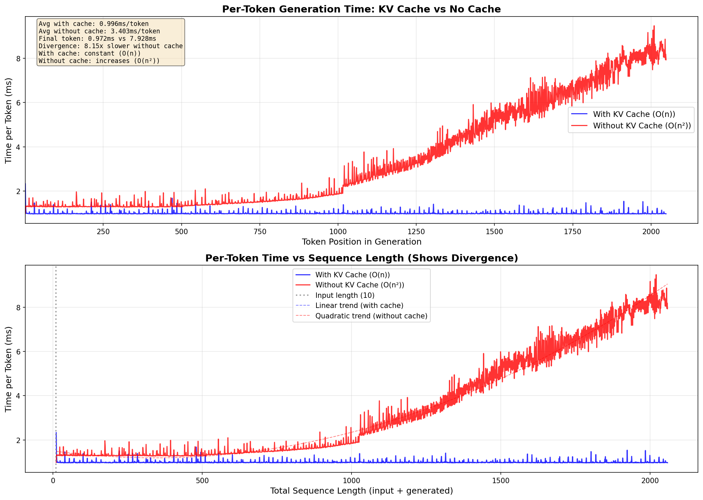

# Scratch-1: The Transformer Backbone

## Loss Curve

The model converged after approximately 2,800 iterations (10 epochs × 281 batches) with a final loss of **1.97**. The initial loss was **5.61**, which is higher than random guessing (~3-4 for 256-way classification), indicating the model started with poor initialization. The loss dropped rapidly in the first epoch and then gradually converged, showing clear learning of the trajectory patterns.

## Attention Visualization

The attention patterns show the 8 attention heads from the first transformer layer, each learning different attention strategies:

- **Causal masking is working**: The upper triangle of each attention map is dark (zero attention), confirming that tokens cannot attend to future positions.
- **Head diversity**: Different heads learn different patterns:
  - Some heads (e.g., Head 4, Head 8) attend strongly along the diagonal, focusing on recent tokens
  - Several heads show strong attention to position 0 (the first token), which may serve as a "summary" or anchor point
  - Some heads (e.g., Head 5) show more distributed attention across multiple past positions
- The red dashed diagonal line marks the causal boundary—attention is only allowed below this line.

## The Audit: Removing the Causal Mask

When I removed the causal mask, the following happened:

- **With causal mask**: Final loss = **1.94** (legitimate learning)
- **Without causal mask**: Final loss = **0.03** (nearly zero)

Without the causal mask, the loss is near-zero within just a few epochs, while the properly-masked model plateaus around 1.9-2.0.
This ~65x difference in final loss reveals that the unmasked model isn't actually learning to predict. It's copying.

### Why the Model "Cheats"

Without the causal mask, the attention mechanism allows each token at position $t$ to attend to all positions, including future positions $t+1, t+2, \ldots, T$.

When predicting token $t$, the model can simply look at token $t$ itself (or tokens around it) in the key-value pairs. The "prediction" becomes trivial pattern matching rather than learning temporal dynamics.

It's like taking an exam where you can see the answer key. You'll score perfectly, but you haven't really learned anything.

**Why this matters for robotics**: A VLA model that cheats during training would fail at deployment, because it can't peek at future actions in the real world.
The causal mask enforces the constraint that predictions must be made using only past information, which is the only information available during inference.

## KV Cache Optimization

I implemented KV (Key-Value) cache optimization for autoregressive generation. During generation, each new token needs to attend to all previous tokens. Without cache, the model recomputes the Key and Value tensors for all previous tokens on every step, leading to O(n²) computational complexity. With KV cache, we store the computed K and V tensors and only compute them for the new token, reducing complexity to O(n).

### Implementation Changes

The modifications to `backbone.py` were:

1. **`CausalSelfAttention.forward()`**: Added `kv_cache` and `use_cache` parameters. When cache is provided, new K/V tensors are concatenated with cached ones along the sequence dimension.

2. **`TransformerBlock.forward()`**: Passes the cache through to the attention layer and returns the updated cache.

3. **`DecoderOnlyTransformer.forward()`**: Accepts an optional list of KV caches (one per layer) and manages cache updates during generation.

4. **`DecoderOnlyTransformer.generate()`**: Uses KV cache by default. On the first iteration it processes the full input context and creates the cache, then on subsequent iterations it only processes the last generated token and updates the cache.

## KV Cache Results

Benchmarking with 2048 generated tokens shows multiple improvements:

- 3.57x speedup with KV cache (1.93s vs 6.86s)
- Per-token timing improvements: 0.940ms/token (with cache) vs 3.352ms/token (without cache)

The plot above shows how per-token generation time diverges:
- With KV cache: Per-token time stays roughly constant (~0.94ms) as sequence length grows, demonstrating O(n) linear scaling.
- Without KV cache: Per-token time increases quadratically with sequence length, showing O(n²) behavior.

## Challenges and Solutions

### KV-Cache Implementation
Originally, I benchmarked the KV-Cache with a sequence length of 50. That showed only marginal improvements with the KV-Cache. However, after retraining the model with a max sequence length of 2048 and re-running
the benchmark analysis, the results show a massive improvement. This tracks with the intuition that the benefits of the KV-Cache will be seen as the sequence length grows.