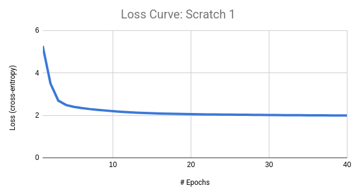
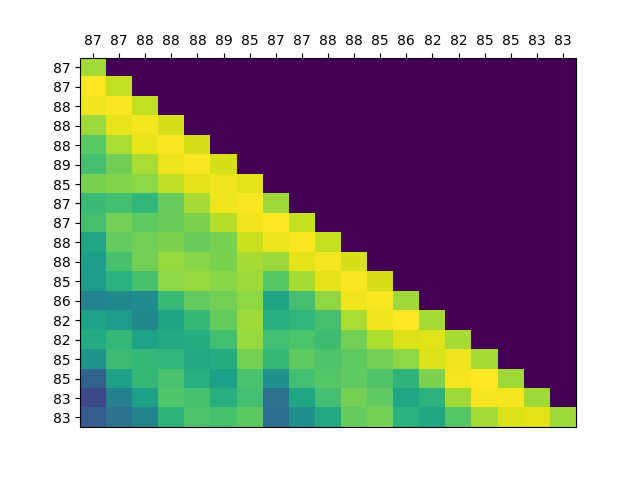
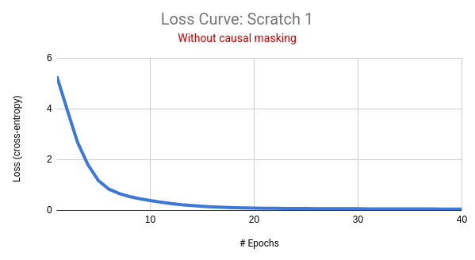
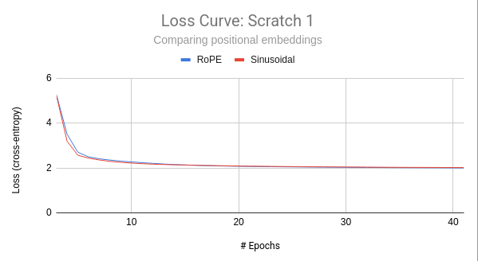

# Scratch-1: The Transformer Backbone

## BLUF: Required Components

### Loss Curve

Training for 40 epochs provided the following loss curve:

The model converged after a total of 5640 gradient steps.
The final loss was 1.9982 on the training data.
(There were 141 batches per epoch - I used a batch size of 64 as I did not lack VRAM.)

Rarely have I ever seen a loss curve so smooth and ideal... enough so that I was somewhat suspicious.
But I held out 1000 trajectories as test data and, over those, achieved a test loss of 1.9885 - comparable to the final training loss.

### Attention Visualization

I visualized the attention patterns of the last causal self attention block, using an arbitrary 20-step trajectory:

The attention patterns seem to indicate that the most recent actions are nearly always the most salient ones.
Unfortunately, with no intuition as to the meaning of these action tokens, it's not exactly easy to understand why we do or do not attend to particular tokens.
However, we do see desirable signs of deeper temporal dependencies on some tokens (e.g., the \[85\] action in position 7.)

### Removing the Causal Mask

If the causal mask is removed, we are met with a very different loss curve:

As suggested, the model "sees the future" to cheat: without causal masking, there is nonzero information flow between the tokens at positions $\geq t$ and the prediction for position $t$.
Causal masking allows us to predict (and train for) the "next" token given the past tokens, with respect to all positions of the input simultaneously.
This is substantially faster than proceeding step by step.
When the mask is removed, we predict the "next" token given _all_ input tokens, past or future - which is clearly incorrect.

## Mastery Challenges

### KV Caching

I implemented KV caching in a very basic way: each CausalSelfAttention block stores and uses its KV tensors if manually flagged to do so.
Generally we want this flag to be true when generating autoregressively, but not during training.

My implementation of KV caching is not particularly fast, but it's still enough to result in a marginal speed boost.
As a simple ablation, I tested autoregressive generation of 10 steps in a batch size of 64 (see `test_inference_time(...)`).
Without caching, this took on average (over steps and trials) **0.0454 seconds**, measured with `time.perf_counter()`.
With caching, it about **0.0435** seconds. 
I suspect that the savings would be much more substantial when used for more steps with a longer sequence length.

### Sinusoidal positional encodings

Much of the RoPE scaffolding already present can be applied to the original "Attention is All You Need"-style sinusoidal absolute encodings.
Rather than introduce unnecessary bloat I reused that code to test this alternative (see the commented code marked `ALTERNATIVE` in the RoPE implementation.)

Using this, I performed a simple ablation. 
However, plotting the loss curves, I did not notice much of a difference:

The final testing loss for the sinusoidal encodings was **2.0044**, performing only very slightly worse than RoPE.
The premise of RoPE points out an issue with this approach: ideally, a positional encoding is such that $Q \cdot K^\intercal$ is a function of the embeddings $x_m$ and $x_n$, and the _relative_ position $m-n$.
(That is, the exact values of $m$ and $n$ should not be considered.)
Barring a fully rigorous derivation at the moment (which would essentially be a summary of section 3.2 of the RoPE paper anyway), suffice it to say that the RoPE embeddings are designed to satisfy this property.