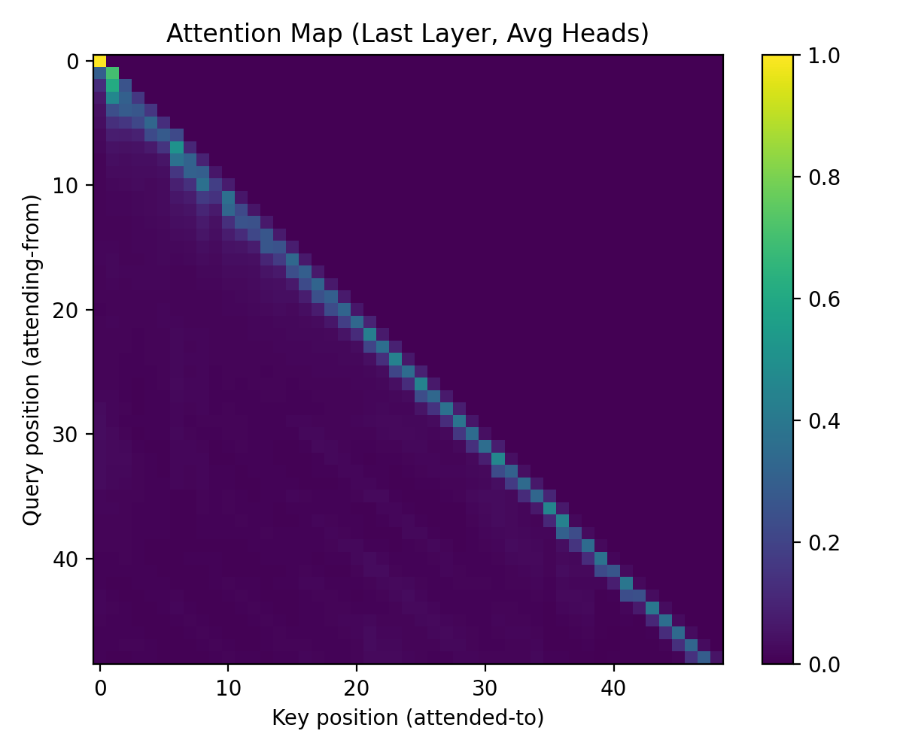

# Scratch-1: The Transformer Backbone

This assignment implements a decoder-only Transformer from scratch and trains it on a synthetic robotic trajectory dataset for next-token prediction. The experiment demonstrates that a single autoregressive architecture can **learn structured robotic action sequences**
when the data is designed to be learnable.

---

## Loss Curve

The training loss decreases rapidly during the first few hundred steps and then gradually converges, stabilizing around a low value after several thousand iterations.

This behavior indicates that:
- The action encoding is learnable from state information.
- The Transformer successfully captures temporal dependencies in the trajectory.
- Optimization is stable with RMSNorm, RoPE, and gradient clipping enabled.

---

## Attention Visualization

We visualize attention maps from both the **first Transformer layer (Layer 0)** and the **last Transformer layer**.

- **Layer 0** primarily attends to nearby timesteps, showing strong diagonal patterns. This suggests the model is learning local, short-horizon dependencies.
- **Last Layer** exhibits broader attention over longer temporal ranges, indicating aggregation of global trajectory-level information relevant for action prediction.

This layer-wise difference reflects hierarchical representation learning, consistent with behavior observed in large language models.

---

## The Audit: Removing the Causal Mask

When the causal mask is removed, the training loss drops significantly faster and converges to a much lower value. However, this improvement is artificial.

---

### Why the Model "Cheats"

Without the causal mask, each token can attend to future ground-truth actions through self-attention. This causes information leakage: the model no longer learns to predict the next action from past context, but instead copies future tokens directly. As a result, the loss no longer reflects genuine predictive ability.

---

## Code Highlights

- **Causal Self-Attention** implemented manually with a lower-triangular mask applied *before* softmax.
- **Rotary Positional Embeddings (RoPE)** used instead of absolute positional embeddings to encode relative temporal structure.
- **RMSNorm** applied in a pre-norm configuration for improved training stability.
- Attention maps are explicitly stored during forward passes for visualization and analysis.

---

## Challenges and Solutions

- **Training instability** was mitigated using gradient clipping and RMSNorm.
- **Unlearnable action noise** was resolved by redesigning the action space into a structured 256-bin encoding (direction + magnitude).
- **Attention visualization bugs** were fixed by properly handling step-based logs and isolating the final training run.

---

Overall, this assignment demonstrates that with proper architectural constraints and data design, a decoder-only Transformer can effectively model robotic control as a unified sequence modeling problem.
