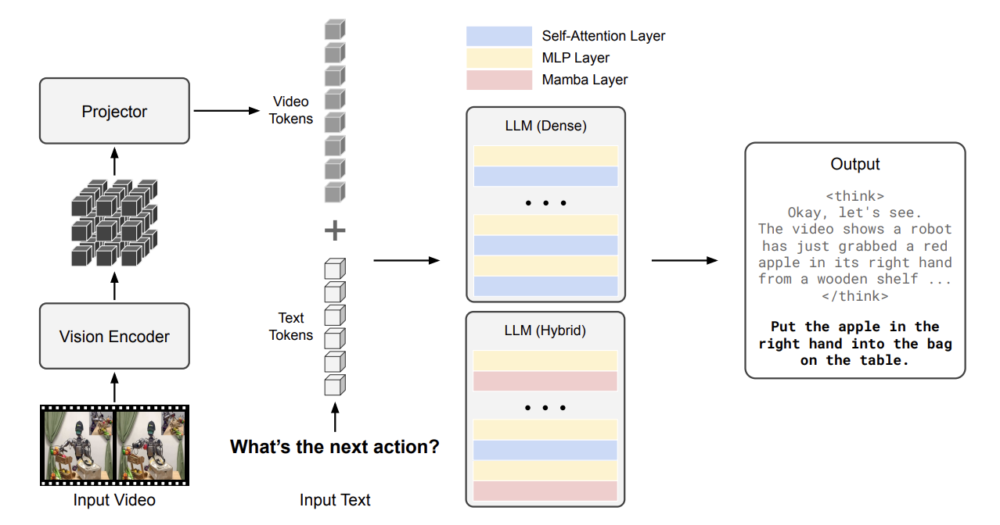
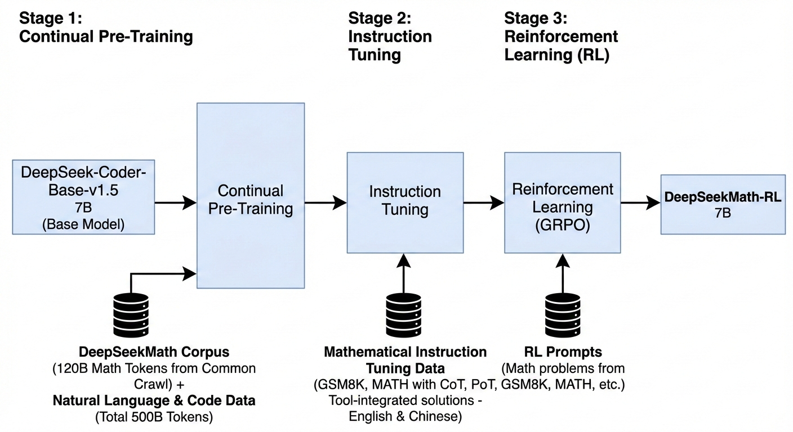
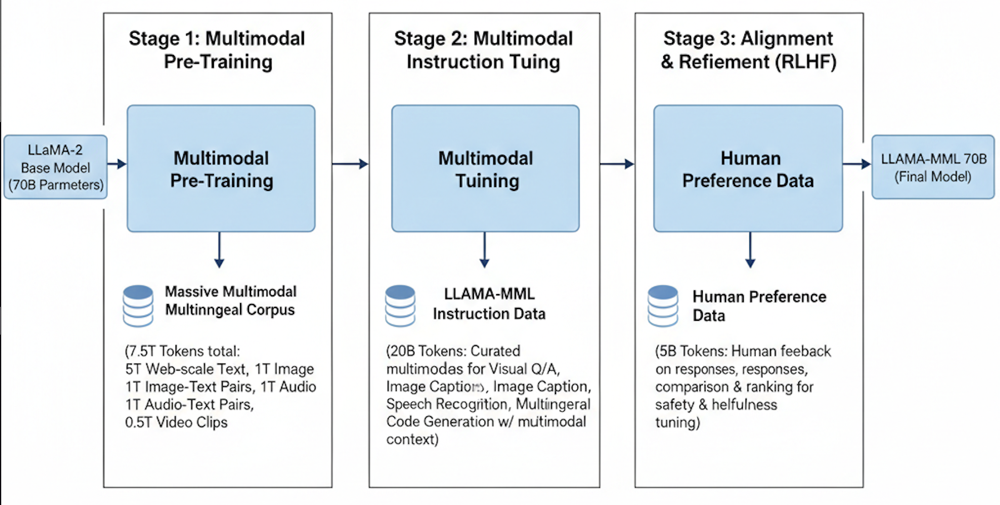

# Scaling and reasoning in Foundational Models

The training of an LLM model can be split into 2 stages. The **pre-training** and the **post-training**. Pre-training is the part we throw all the data we have at a transformer based model, and teach it to predict the next token based on internet data. Post-training is the stage where we train the model's reasoning capabilities. This step usually has SFT and RL stages. 

This document analyzes different methods in which we can scale the reasoning part of foundational models.

This document presents a technical audit of 3 contemporary approaches to scaling reasoning capabilities in foundation models: 

(1) Reinforcement learning (RL) driven symbolic reasoning using Group Relative Policy Optimization (GRPO).

(2)

(3) Physical AI systems trained using GRPO, Physical common-sense and Embodied reasoning.

# Problem Domain & Taxonomy

We define **reasoning** as the capacity to produce **structured, coherent intermediate chains** that reflect underlying domain abstractions:
- In symbolic domains (math, logic, code),
- In physics-informed domains (embodied interaction, world-state transition).

These papers try to approach this by objectively shaping reasoning, data and pretraining scaling, multimodal embodiment, bargaining between process complexity and context length etc.

## Taxonomy of approaches

1. **Objective Shaping for Reasoning Emergence:** This class of methods treats reasoning as an emergent property that can be induced through carefully designed optimization objectives rather than explicit symbolic structure. Reinforcement learning is used to bias the model toward generating longer, more coherent intermediate chains by rewarding correctness at the trajectory level. **GRPO** exemplifies this approach by replacing absolute reward estimation with group-relative advantage normalization, implicitly encouraging internal competition between candidate reasoning traces. The core assumption is that structured reasoning can be recovered purely through reward shaping over token sequences, without grounding in external state dynamics.

2. **Data & Pretraining Modality Scaling:** This line of work focuses on scaling reasoning capacity through domain-specialized pretraining data rather than changes to the objective. In this paradigm, reasoning improves as a function of exposure to large volumes of structured domain text. DeepSeekMath follows this strategy by aggressively curating large-scale mathematical corpora using Common Crawl and OpenWebMath and combining them with instruction tuning and RL. Here, reasoning is not explicitly enforced but statistically induced via data distribution shift toward problems that require multi-step abstraction. 

3. **Grounded Multimodal Embodiment:** Grounded embodiment approaches aim to scale reasoning by anchoring model representations to the physical world. Instead of optimizing purely over text trajectories, these methods incorporate visual inputs and action-relevant representations, with the goal of aligning semantic reasoning to physical common sense. Cosmos-Reason1 follows this paradigm by introducing ontologies for physical concepts and training multimodal models over vision-language inputs that proxy embodied interaction. The underlying hypothesis is that grounding reasoning in perceptual structure yields more robust abstractions than symbolic optimization alone, even if physical feedback remains indirect.

# Comparative Architectural Deep-Dive

## Objective Functions

Group Relative Policy Optimization (GRPO) is an improvement in the previously used Proximal Policy Optimization(PPO) method for Reinforcement Learning.

PPO uses an actor-critic model where a value function calculates the Advantage. Advantage (or Generalized Advantage Estimation / GAE) can be thought of as "How much better a specific action at is compared to an average action considering the current state st.

| Step | PPO | GRPO |
|----------|----------|-------| 
| Step 1  **Rollout/Sampling**| Freeze current policy $\pi$old   Sample output tokens o1, o2,... oT  | For each prompt, sample a set of G responses {y1, y2,.., yG}   Instead of tokens, we sample a group of completions per prompt |
| Step 2   **Reward Computation**| Reward model gives a score   KL penalty added to token   $r_t = r_\phi - \beta \log \frac{\pi_{\text{ref}}(o_t)}{\pi_\theta(o_t)}$ | Scalar Score is assigned to each response   ${r_1, r_2,..., r_G}$   No KL score added in this step. |
| Step 3   **Advantage Estimation**| Trained value mode $V_\phi$ is used to compute GAE   $\hat{A}_t = \sum_{l=0}^{\infty} (\gamma \lambda)^l ( r_{t+l} - V(s_{t+l}) )$ | Instead of a model, within group normalization based Advantage  $\hat{A}_t = \frac{r_i - \mu_r}{\sigma_r} $   Where $\mu_r$ is the average reward for the group.|
| Step 4   **Loss computation**| Loss is calculated as follows   $L^{\text{PPO}} = \mathbb{E}_t \Big[ \min \big( r_t(\theta)\,\hat A_t, \operatorname{clip}\big(r_t(\theta), 1 - \epsilon, 1 + \epsilon\big)\,\hat A_t \big) \Big]$    Where, $r_t(\theta) = \frac{\pi_\theta(o_t)}{\pi_{\theta_{\text{old}}}(o_t)}$| **Policy Loss** - For each token in response i   $r_{i, t}(\theta) = \frac{\pi_\theta(o_{i, t})}{\pi_{\theta old}(o_{i, t})}$   $L_{policy} = \mathbb{E}_{i, t}[\min(r_{i, t}(\theta)\hat{A}_t), \operatorname{clip}(r_{i, t}(\theta), 1-\epsilon, 1+\epsilon)\hat{A}_t] $    **KL Regularization loss**   $L_{KL} = \beta\cdot\mathbb{E}_{it}[\operatorname{KL}(\pi_\theta(\cdot \vert s_{i,t}) \vert\vert \pi_{ref}(\cdot \vert s_{i,t})]$    **Final GRPO loss** $L_{GRPO} = L_{policy} - L_{KL}$ |
| Step 5   **Optimization**| Run K epochs of SGD on same batch| Reuse same batch for K epochs |

GRPO replaces value-function-based advantages with group-relative rewards, and moves KL regularization out of the reward and directly into the loss. Since, value function is a separate model that needs to be trained, skipping that step helps training the reinforcement learning part faster and more efficient.

**Cosmos-reason1** also uses the GRPO model for the Physical AI RL part of their model.

## Backbone Scaling

The **DeepSeekMath** base is a standard decoder-only Transformer (similar to LLaMA/Qwen style) with autoregressive next-token prediction prior to RL training. 

**Cosmos-Reason1** uses a decoder-only multimodal LLM with two possible instantiations:
- Dense Transformer backbone
- Hybrid Mamba-MLP-Transformer architecture

| Aspect                   | **DeepSeekMath**                                | **Cosmos-Reason1**                                           |
| ------------------------ | ---------------------------------------------- | ------------------------------------------------------------ |
| **Backbone types**       | Pure decoder-only LLM (no vision)              | Multimodal: vision encoder + decoder-only LLM                |
| **Model sizes**          | 1.5B → 70B parameters                          | 8B and 56B variants                                          |
| **Vision modality**      | None                                           | Vision encoder integrated                                  |
| **Data focus**           | Text reasoning + RL rewards                    | Vision + Physical reasoning + RL                             |
| **Data volume emphasis** | Large pretrained LLM   RL via reasoning prompts | Large vision data + curated task-specific multimodal corpora |
| **Scaling effects**      | Bigger models show stronger reasoning          | Larger LLM + vision encoder yields better embodied reasoning |

Cosmos-Reason1-7B, uses Qwen2.5-VL as the pre-trained model and the Cosmos-Reason1-56B, uses InternViT-300M-V2.5 as the vision encoder and Nemotron-H as the LLM backbone.
Cosmos-Reason1 also uses a Hybrid-Mamba-MLP-transformer architecture unlike the standard transformer backbone architecture to avoid the quadratic time-complexity for the 56B model. For the 7B model, Qwen2.5L acts as the backbone.

## Interaction Mechanisms

Deepseek-R1 is a unimodel, self-attention based, decode-only model which improves its reasoning only through RL by GRPO rather than architectural changes.

Cosmos-Reason1 fuses the image and text modality using a Vision encoder + projection based fusion strategy. 
- For input images, we convert the image into tiles and a low-resolution thumbnail image to maintain full context. Then these tokens are concatenated with interleaved tile IDs.
- For input videos, we convert it into a maximum of 32 frames at a max rate of 2 frames per second. The vision encoder generates 1,024 visual tokens per $448 \times 448$ frame, which are then downsampled by a factor of $2 \times 2$ (using PixelShuffle) to 256 tokens per frame.

These tokens are then concatenated along with the text tokens and passed into the **Hybrid-Mamba-MLP-transformer** model. The LLM processes both text tokens and projected visual tokens using standard self-attention. This design choice of early fusion of image and text tokens makes sense for this model since this helps the model scale better (8B -> 56B). And also the hybrid architecture helps avoid the quadratic cost of repeated cross-attention at each decoding step.

# The Scaling Frontier & Empirical Trends

From the GRPO and the Cosmos-Reason1 papers, we see that the compute-optimal scaling frontier is less parameter focused and more data and algorithm focused. Moving away from the "Throw in more and more parameters and tokens at the model" idea, we start to focus more on the data clarity, reward based optimizations and modality grounding based model design. 

In the DeepSeekMath paper, the focus is on training the model on clean math corpus tokens fetched using different algorithms to focus the model only on math related problems in English and Chinese. The model is pretrained on 120B tokens from Common crawl and 500B tokens from Natural Language and code data. And during the instruction tuning and RL stage, the model is trained on GSM8K and Math data with Chain of thought(CoT) and Program of thought (PoT) with Tool-integrated solutions in English and Chinese. These exemplify the focus shift from model size, number of tokens, compute size etc to better reward systems, physical vs symbolic reasoning, balanced training data split between internet data and domain related data. 

In the Cosmos-Reason1 work, the focus shifts from text-based symbolic reasoning to multimodal physical and embodied reasoning. The model is trained using a multistage pipeline that includes large-scale vision pretraining followed by supervised fine-tuning and reinforcement learning on curated multimodal datasets targeting physical commonsense, spatial reasoning, and temporal understanding. Visual inputs are processed by a pretrained vision encoder and projected into the LLM embedding space using an MLP, allowing joint reasoning within a decoder-only language model. Experiments across the 8B and 56B model variants show that while increased model size improves performance, the primary gains come from domain-specific multimodal data and task-aligned reward signals, rather than additional generic image–text data or further scaling of parameters.

### Data Walls
#### **Language-only models (DeepSeekMath)**

* Internet-scale text saturates **surface-level reasoning**
* Gains increasingly come from:
  * structured reasoning prompts
  * rule-based or verifiable reward signals
* Raw text scale alone shows diminishing returns, we need custom RL or SFT modelling to extract the full potential reasoning capabilities.

#### **Multimodal / physical reasoning (Cosmos-Reason1)**
* Vision–language grounding hits a wall with:
  * generic image–caption datasets
* Requires:
  * curated physical commonsense data
  * task-specific embodied supervision
* Data scarcity is now the bottleneck, not model size

## Scaling Laws

- **Data Quality vs. Parameter Scale**: The authors show that DeepSeekMath-Base 7B (trained on 120B high-quality math tokens) achieves 64.2% on GSM8K, outperforming Minerva 540B. This suggests an empirical relationship where a **77x reduction in parameters** can be compensated for by a **7x increase in domain-specific data scale**.

| Paper          | Model                  | Benchmark                     | Reported Accuracy |
| -------------- | ---------------------- | ----------------------------- | ----------------- |
|DeepSeekMath | 7B (Base) | GSM8K | 64.2% |
|DeepSeekMath | 7B (Instruct (Basically Base + CoT+ PoT + Tool integration)) | GSM8K | 82.9% |
|DeepSeekMath | 7B (RL/GRPO) | GSM8K | 88.2% |
|Minerva | 540B | 78.5% |
|Cosmos-Reason1   | 7B (SFT) | Physical Common Sense | "75.4% (Average across Space, Time, Physics)" |
|Cosmos-Reason1   | 56B (SFT) | Physical Common Sense | "80.6% (Average across Space, Time, Physics)|

Increasing model size does improve the model performance in different benchmarks, but this increase is more incremental and modest rather than dramatic, indicating that parameter scaling alone does not introduce qualitatively new reasoning behavior. But introducing RL, improved the performance from the Minerva comparable model to 88.2% in GSM8K benchmark model.

## Diminishing Returns

### 1. **Model Scale**
- DeepSeekMath-Base 7B (64.2% on GSM8K) outperformed Minerva 540B (58.8%), demonstrating that a model 77x smaller can lead in reasoning if the data quality is sufficiently dense.
- In Cosmos-Reason1, the 56B model showed an average improvement of only 5.2% over the 7B model in physical common sense (80.6% vs 75.4%).
- Both of which show that without better objectives like long Chain-of-Thought (CoT), simply increasing parameters hits a wall in abstract and physical grounding.

### 2. **Data Scale**
- **Generic data plateaus** were found in DeepSeekMath where the paper found that even large-scale web data (Common Crawl) must be meticulously filtered through a specialized pipeline to be effective for reasoning 
- **Unstructured data plateaus** were seen when in the Cosmos-reason1 paper. They shifted from generic image-caption pairs to structured reasoning signals with Spatial Puzzles, VLM curation based arrow of time questions, reasoning based Multiple Choice Questions (MCQs) etc.

And in both GRPO and Cosmos-Reason1 we see that compute without structure hits a ceiling in both mathematical and physical learning. Hence, we use an SFT followed by RL refinement for both.

# Robotic Grounding & Physicality Gap

## The Precision Gap

* **DeepSeekMath**: This model does not directly address high-frequency control. It focuses on the logic of the thinking process. However, its GRPO framework is highly relevant. It reduces the computational overhead of RL by eliminating the value/critic model, which in a robotic context could free up memory and time for other computations or to improve the speed.

* **Cosmos-reason1**: This model helps bring high-level reasoning and low-level robotic movemennt execution closer. The model achieves this using the text-based Chain-of-thought mechanism. Instead of the high level solution, since we have a CoT solution, we can break a large action into reason-based micro-activities (Like grab the door handle from the left) which are executable by the robot while the model maintains a high level understanding of the model.

## Benchmark Critique

* **DeepSeekMath** - Heavily relies on static (though complex) reasoning benchmarks like GSM8K and MATH. It treats reasoning as a closed-loop symbolic problem.

* **Cosmos-reason1** - They consciously move away from static sources, and generate custom benchmarks designed for Physical AI modelling.
  * Data used during **SFT stage**
    * **Physical Common Sense Data**: Freeform VQA (Visual Question Answer) that is generated from 9.9K. high-quality video clips with detailed human-annotated captions
    * **Embodied Reasoning Data**: Curated from demonstrations of humans, robots, and vehicles performing goal-oriented tasks. (From AgiBot, BridgeData etc.)
    * **Intuitive Physics Data**: Data to understand the physical intuition of real world
        * Spatial puzzles: 3K videos where the model must reason about the correct orientation of shuffled image patches.
        * Arrow-of-Time (AoT): 30K video clips and their reversed versions used to identify temporal order.
        * Object Permanence: 10K clips synthesized robot simulation to evaluate the tracking of objects going out of scope.
  * Data used during **RL stage**
    * **Human-Annotation Based MCQs**: Traditional MCQs from the SFT curation process
    * **Self-Supervised MCQs**: Automatically generated based on the video data structure itself:
      * Temporal Puzzles: Solving puzzles with shuffled spatiotemporal video patches.
      * Arrow-of-Time Prediction: Determining if a video is playing forward or backward.

## Engineering Bottlenecks

### **Dimensionality & Information Decay:** 
Cosmos-reason1 uses a uniform sampling of up to 32 frames at a maximum rate of 2 frames per second. This could cause information decay during the tokenization stage. Also, to maintain long-term reasoning (time-steps), spatial resolution is often sacrificed. The paper notes that while general physics (gravity) is captured well, fine-grained spatial relationships (millimeter-level precision for grasping) are often lost during the compression into discrete visual tokens.

Also, the use of hybrid-Mamba-LLM architecture over the pure transformer architecture, eventhough could result in lower time complexity, could result in the model having a slightly lower context window resulting in information loss.

### **Semantic-Motor Gap:** 
High-level reasoning fail to ground in motor primitives in 
* **The Arrow of Time Problem**: Cosmos-Reason1 identifies that models struggle to perform above chance level with temporal causality.

* **Abstract vs. Physical decisions**: High-level reasoning often succeeds in saying what to do (e.g., "Pick up the bottle") but fails to understand the mechanical constraints (e.g., "The bottle is too heavy for this specific robot").

Solution to close this gap could be Environment Feedback. Without a reward signal that originates from a physical failure (e.g., a "Dropped a bottle" penalty in RL), the reasoning is still memorized logic rather than grounded physics.

# Critical Synthesis & The "Load-Bearing" Audit

## Load-Bearing Assumptions

Both the DeepSeekMath and the Cosmos-reason1 model focuses mainly on the reasoning density over the data volume. So if the internet data is over, the models focus more on structure.

Also, the GRPO model does not focus on a value function, this means that we can just have the model generate new completions, and score these with rule-based rewards to improve the model performance, rather than relying on human curated data.

Cosmos-Reason1 assumes physical reasoning can be scaled via self-supervised MCQs like Arrow-of-Time or Spatial Puzzles. This allows the model to continue learning from the real world (in video format) even if the data is exhausted.

## Foundational vs. Marginal Gains

- The DeepSeekMath paper is foundational in the introduction of GRPO, which changes the memory and computational efficiency of Reinforcement Learning models. It proved that the Critic model (A constant in earlier PPO implementations) is not necessary for reasoning tasks.

- Cosmos-Reason1 is foundational in the introduction of hierarchical physical ontologies (Space, Time, Physics). It provides the first systematic framework for moving LLMs from pattern matching to physical reasoning.

The use of Long CoT is largely incremental, building on existing trends established by OpenAI's o1 and DeepSeek-R1.

## Failure Modes

- The Arrow of Time Struggle: Despite specialized RL, reasoning about the irreversible nature of time (e.g., distinguishing forward vs. backward physics) remains a significant challenge.
- Ambiguity in Embodied Decisions: In embodied reasoning, models can still fail when choices are ambiguous. While RL teaches the model to reject all choices in such cases, the underlying failure mode is an inability to resolve high-uncertainty sensory input into a single motor plan.

## The Next 10,000 GPU-Hour Experiment

I would try to move the Cosmos-Reason1 model a step further by using a GRPO RL based environment-as reward feedback loop on a robot simulated in a physical environment instead of rule-based MCQs. This could help generate an environment/physical reward system that can be further extended to other robots or self-driving cars.

# References

1. Shao et al., "DeepSeekMath: Pushing the Limits of Mathematical Reasoning in Open Language Models", 2024.
2. NVIDIA et al., "Cosmos-Reason1: From Physical Common Sense To Embodied Reasoning,", 2025.