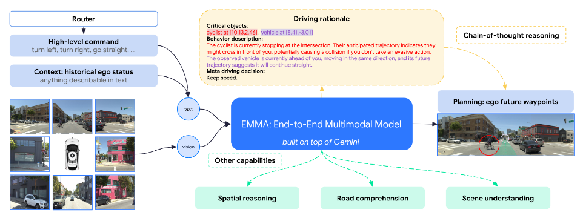
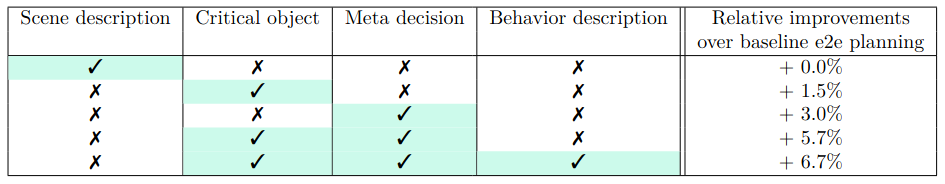
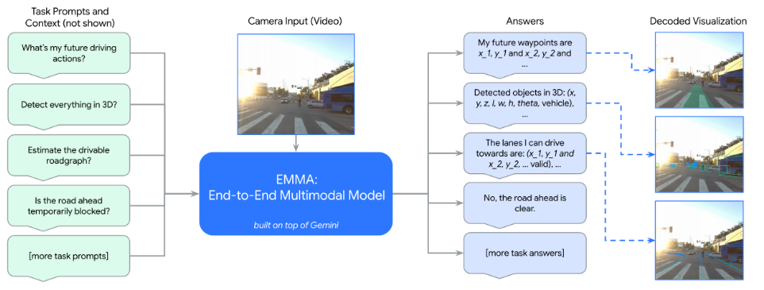
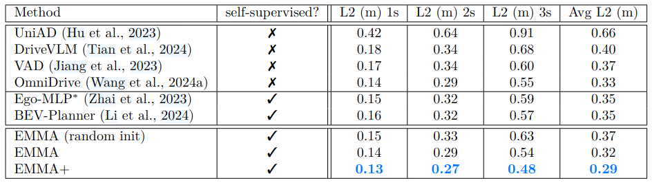
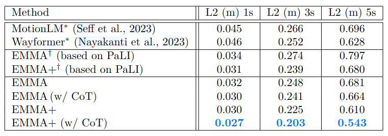
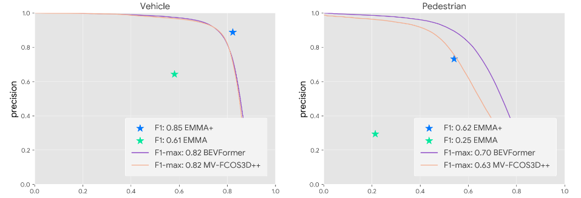
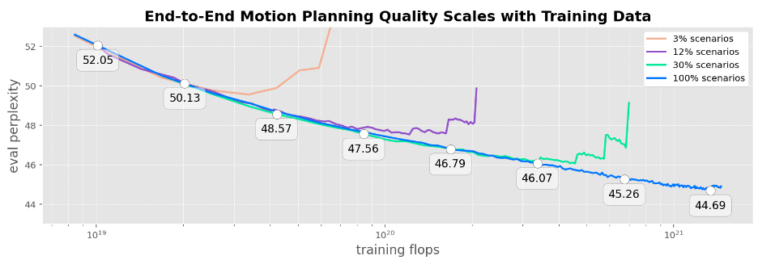

# Driving Reasoning Models at a Glance (AlphaDrive vs EMMA vs Alpamayo-R1)

## Problem Statement
Modern autonomy systems increasingly explore **VLM/MLLM-based planners** that map perception (images/video) plus context (routing/intent/ego state) into **driving decisions**.
Across real-world driving, (i) **multiple actions can be valid** for the same scene, (ii) decisions must satisfy **real-time constraints**, and (iii) developers often want **human-interpretable rationales**—ideally with some form of **consistency** between the rationale and the executed plan.  
These three papers share that motivation, but differ in **action representation**, **reasoning representation**, and **how training enforces correctness vs diversity vs causal consistency**.

---

## Model Highlights
- **AlphaDrive**: Fine-tunes a small VLM for **high-level planning** using **GRPO** reward design to support **multiple valid plans** and emphasize **safety-critical actions**.
- **EMMA**: Frames autonomy as a **multitask language interface** over an MLLM—planning, 3D detection, and road graph outputs are generated via prompts, with **coordinates/waypoints emitted as text**.
- **Alpamayo-R1**: Argues free-form CoT is often unreliable; introduces **Chain-of-Causation (CoC)** supervision and a **flow-matching trajectory decoder** for **real-time multimodal continuous planning** tied to structured reasoning.

---

## Core Pipeline Pattern (Unifying View)
All three can be summarized as:

**Perception → latent representation → reasoning/decision tokens → action output**

They differ mainly in:
- the *granularity* of the action output (meta-actions vs textual waypoints vs decoded continuous trajectories),
- whether reasoning is treated primarily as an **auxiliary explanation** or as a **structured decision-grounding signal**, and
- whether action generation is done **directly in text/discrete space** or via an additional **continuous decoder**.

---

# Features (Inputs / Outputs / What “Action” Means)

| Model | Primary Inputs | Primary Outputs | What “Action” is |
|---|---|---|---|
| **AlphaDrive** | Front-view image + prompt including speed + navigation instruction text | **Meta-actions** (lateral + longitudinal categories) and optionally structured reasoning | **Discrete high-level driving decision** (category-level) |
| **EMMA** | Camera video/images, routing/context, ego history (represented as text), plus task prompt | **Waypoints/trajectories as text**, plus detection + road-graph outputs depending on prompt | **Trajectory as language** (coordinates emitted as plain text) |
| **Alpamayo-R1** | Multi-camera images + egomotion; text context | **Structured reasoning + discrete trajectory tokens**, then **continuous trajectories via flow-matching decoder** | **Multimodal continuous trajectory**, efficiently decoded from tokens |

---

# Training & Supervision

| Model | Training Stages | Key Supervision Signal | What the objective emphasizes |
|---|---|---|---|
| **AlphaDrive** | (1) Distill reasoning from a larger teacher → **SFT** warm-start; (2) **GRPO RL** refinement | GT meta-actions + reward shaping | **Multimodal planning** (diversity), **safety-critical weighting**, and structured output constraints |
| **EMMA** | Multitask training with a unified language formulation; adds **CoT** prompting/training | **Future ego locations** from logs for planning; plus task-specific labels (detection/road-graph) | **Shared interface across tasks**; co-training yields cross-task gains |
| **Alpamayo-R1** | Multi-stage: add action modality → SFT for reasoning → **RL post-training**; plus **CoC dataset/pipeline** | Structured **Chain-of-Causation** + trajectory objectives | **Causal structure**, **reasoning/action consistency**, and high-quality multimodal trajectories under runtime constraints |

---

# Reasoning

| Model | Reasoning Form | Role of Reasoning |
|---|---|---|
| **AlphaDrive** | Structured “planning reasoning” text (format explicitly rewarded) | Improves planning quality via distillation + RL; reasoning is trained as part of the output distribution |
| **EMMA** | Chain-of-thought rationales (text) | Primarily an accompanying rationale paired with predicted outputs; leverages MLLM capabilities and unified prompting |
| **Alpamayo-R1** | **Chain-of-Causation (CoC)** (decision-grounded causal links) | Intended to provide *structured* decision grounding and improved alignment between reasoning and action generation |

---

# Real-Time + Deployment Story

| Model | Runtime Strategy | Notes |
|---|---|---|
| **AlphaDrive** | Uses a small backbone (Qwen2VL-2B) + discrete meta-action outputs | Latency-friendly partly because the output space is compact and discrete |
| **EMMA** | Reports a latency-optimized configuration (~3 FPS) via simplifying sequences and removing explicit reasoning chains | Frames runtime as a core constraint for MLLM autonomy and provides a speed-focused variant |
| **Alpamayo-R1** | Uses **flow-matching** with a small number of steps (e.g., 5) for fast continuous decoding | Claims real-time end-to-end (~99ms) and on-vehicle road tests |

---

# Trade-Offs (AlphaDrive vs EMMA vs Alpamayo-R1)

| Model | Excels at | Shortfalls / Risks | Why (mechanism-level) |
|---|---|---|---|
| **AlphaDrive** | **High-level planning robustness** under inherently multimodal supervision; explicitly promotes **diverse feasible plans** and **safety-sensitive decisions** via reward shaping | **Limited behavioral expressivity** if the action taxonomy/labels are coarse (harder to represent nuanced maneuvers if they are not in the meta-action set) | Predicts **discrete meta-actions**, then uses **GRPO** with rewards for accuracy, action-weighting, diversity, and format (this supports multimodality and safety emphasis, but constrains representable behavior to the chosen action set) |
| **EMMA** | **Unified multitask autonomy** (planning + detection + road graph) with a single promptable model; shows **co-training synergies** across tasks | Emitting **numeric geometry as text** can be brittle (format/token issues, numeric precision sensitivity); large MLLMs face **latency constraints**, motivating simplified variants | The design choice to express outputs (including coordinates) as **language** enables a unified interface and shared representations, but makes performance sensitive to **sequence formatting and length**; runtime constraints are acknowledged with a faster configuration |
| **Alpamayo-R1** | **Structured, decision-grounded reasoning** (CoC) paired with **high-quality multimodal continuous planning** and a strong **real-time** narrative via flow-matching decoding | **Higher system complexity**: structured-labeling pipeline + multi-stage training + specialized decoder; performance depends on CoC label quality/coverage; structured reasoning still inherits upstream perception/context failures | Adds (i) explicit **structured causal supervision** and (ii) a **continuous trajectory decoder** (flow matching) to combine controllability/consistency with efficient inference (gains come with more components and stronger assumptions about labeling schema and conditioning)  |

---

# References
\[1\] AlphaDrive: “AlphaDrive: Unleashing the Power of VLMs in Autonomous Driving via Reinforcement Learning and Reasoning,” arXiv 2025.

\[2\] EMMA: "End-to-End Multimodal Model for Autonomous Driving," arXiv 2024.

\[3\] Alpamayo-R1: "Bridging Reasoning and Action Prediction for Generalizable Autonomous Driving in the Long Tail," arXiv 2026.

---

# Technical Paper Audit: AlphaDrive

**Title**: AlphaDrive: Unleashing the Power of VLMs in Autonomous Driving via Reinforcement Learning and Reasoning  
**Authors**: Bo Jiang, Shaoyu Chen, Qian Zhang, Wenyu Liu, Xinggang Wang  
**Audit Author**: Aritra  
**Paper**: AlphaDrive (arXiv 2025)  
**Topic**: Vision Foundations

---

## 1. Summary

AlphaDrive is a **2B-parameter vision-language planner** for autonomous driving that outputs **high-level “meta-actions”** (speed + direction) along with an optional reasoning trace formatted in `<think>...</think>` and a final decision in `<answer>...</answer>`.

The core thesis is that **SFT-only VLM driving planners leave performance and data-efficiency on the table**, and that the RL + reasoning playbook that improved general LLMs can be adapted to driving *if* you redesign rewards for planning.
Specifically, AlphaDrive adapts **Group Relative Policy Optimization (GRPO)** and introduces a planning-specific reward suite: **planning accuracy (F1), action-weighting, diversity, and format regularization**, arguing this better reflects (i) unequal safety criticality across actions and (ii) multimodal “multiple-valid-solution” planning.

Because high-quality driving “chain-of-thought” data is scarce, they use a multi-stage reasoning strategy: generate a small batch of reasoning traces using a stronger cloud model (e.g., GPT-4o), manually filter it, SFT warm-up on that reasoning data for stability, then run **RL on the full dataset**.

On MetaAD (120k 3-second clips; 110k train / 10k val), AlphaDrive reports **77.12 overall planning accuracy**, outperforming fine-tuned baselines including a larger Qwen2VL-7B result (61.44).

They further claim **+25.52%** planning accuracy vs an SFT-trained model, and that with only 20% training data they outperform SFT by **35.31%**, emphasizing data-efficiency.

---

## 2. Problem Domain & Taxonomy

### 2.1 The Technical Challenge
**Core problem:** Train a VLM to produce a **safe, correct high-level plan** for the next short horizon (e.g., “next three seconds”), where:
- there are **two coupled decision axes** (lateral + longitudinal),
- different decisions have **different safety weights** (stop/brake ≫ keep speed), and
- many scenarios admit **multiple valid plans** rather than a single correct token.

The paper argues that naive “correctness reward” used in math/programming applications does not transfer cleanly to planning because there often isn't a single verifiable solution in driving; you need a reward that is robust early in training and resistant to shortcut solutions.

### 2.2 Context
- **End-to-end driving models** can output trajectories/controls directly from sensors, but they are “black-box” systems that struggle with the long-tail of driving cases because they lack explicit reasoning.
- **VLM-based planners** shift some of that burden: use vision + language prompting to decide higher-level actions, which can incorporate “commonsense” reasoning. The paper provides an example prompt where the model is asked to plan for the next three seconds using a speed + navigation command.
- The gap AlphaDrive tries to close is **training strategy**: applying RL and reasoning methods that have shown value in large LMs (DPO/GRPO, chain-of-thought, inference-time scaling), but tailored to the planning structure and evaluation realities in driving.

### 2.3 Approaches
A useful industry taxonomy for “VLMs in driving”:

1. **End-to-end control/trajectory networks**
   - Directly output controls/trajectories from sensors.
   - Critique in paper: black-box and long-tail brittle.

2. **VLM high-level planners (meta-actions)**
   - Output symbolic/linguistic decisions; a downstream system handles continuous control.
   - AlphaDrive sits here (meta-action F1 evaluation).

3. **RL-augmented VLM planners (AlphaDrive’s focus)**
   - Use RL to evaluate policies and improve planning performance.
   - The key: RL must be adapted to planning rewards and multi-solution outputs.

---

## 3. Architectural Overview (Pipeline-Level)

AlphaDrive’s “architecture” is best described as a **training + inference pipeline**.

### 3.1 Input/Output Contract

- **Input**: front-view image + planning prompt containing the vehicle’s current speed and navigation info.
- **Navigation**: derived from sparse navigation points (Google Maps-like) and converted into text (e.g., “Go straight for 100m, then turn right”).
- **Output format**: reasoning inside `<think>` and final answer (meta-action) inside `<answer>` tags; non-conforming outputs receive **format reward = 0** (hard penalty).

### 3.2 Base Model Choice

They use **Qwen2VL-2B** as the base model, motivated by:

- better meets latency requirements than larger variants, and
- better support for RL training (their claim).

**Training hardware**: 16 NVIDIA A800 GPUs.

---

## 4. Training Method & Objective Deep-Dive

### 4.1 GRPO as the RL Backbone

AlphaDrive uses **Group Relative Policy Optimization (GRPO)**. The paper defines GRPO as:

- sample a group of outputs $\{o_i\}_{i=1}^{G}$ from an old policy,
- optimize a PPO-style clipped objective with KL regularization,
- compute advantages using **normalized reward within the group**.

They justify GRPO with two reasons:

1. it showed strong stability/effectiveness in general domains (citing Deepseek R1), and
2. group-relative optimization suits planning because planning admits **multiple valid solutions**.

### 4.2 Planning Reward Modeling

AlphaDrive introduces **four rewards**, then combines them into the final RL signal, which is their key contribution.

#### Reward 1 — Planning Accuracy Reward
They found exact-match reward unstable early (format noise like case sensitivity/extraneous tokens), and “GT included among words” encourages a shortcut (eg. output all possible actions), causing collapse.
They adopt **F1-score** for lateral and longitudinal decisions separately for stability and shortcut resistance.

#### Reward 2 — Action-Weighted Reward
They argue different behaviors have different safety importance (e.g., decelerate/stop more critical than keep speed) and incorporate action weights into the reward.

#### Reward 3 — Planning Diversity Reward
They observe that during group-based RL, outputs converge to the same solution; since planning is multimodal, they want multiple feasible solutions.
Algorithmically, they compute frequency of each plan among group outputs and apply **up to 20% reduction**:
`plan_div_R = 1 - min(0.2, frequency)`

#### Reward 4 — Planning Format Reward
They enforce `<think>` and `<answer>` tags; if the output doesn’t conform, **format reward is 0**.

#### Reward Composition

They multiply accuracy × action-weight × diversity to compute a **planning quality reward**, separately for speed and direction planning, and combine with format reward for GRPO updates.

### 4.3 Reasoning Training

They tried incorporating reasoning steps directly into RL, but results were suboptimal due to:

- insufficient perception of key elements (e.g., traffic lights),
- disorganized reasoning with weak causal links,
- overly long and ineffective reasoning.

So they use a stronger cloud model (e.g., GPT-4o) to generate concise reasoning conditioned on real actions + state + nav, manually filter errors, and distill via SFT.

Finally, they train with:

- **SFT warm-up** on a small amount of data (dense supervision, stable), then
- **RL training** with the full dataset (exploration + reward shaping).

---

## 5. Data & Scaling

### 5.1 Dataset

They adopt **MetaAD** \[*NOTE: Could not find this dataset anywhere, neither could their reviewers at ICLR 2026*\] as the benchmark:

- **120k** real-world driving clips, each **3 seconds**,
- multi-sensor + perception annotations,
- balanced distribution over environments and planning actions,
- split into **110k train / 10k validation**.

### 5.2 Evaluation Metrics

- **Planning**: F1-score for all categories of lateral + longitudinal meta-actions, aggregated into overall planning accuracy.
- **Reasoning**: similarity between generated reasoning and annotated reasoning using BLEU-4, CIDEr, and METEOR.

### 5.3 Main Performance Results

From the main results table:

- AlphaDrive (2B) reports **77.12** overall planning accuracy.
- The strongest listed fine-tuned baseline Qwen2VL-7B (*fine-tuned on the Meta-AD dataset*) reports **61.44** accuracy.

They also state:

- planning accuracy improves by **25.5%** vs Qwen2VL-7B and improves key decisions like steering and accel/decel.

And in the contributions:

- **+25.52% vs SFT-trained model**, and
- **+35.31% with only 20% training data** compared to SFT-trained.

### 5.4 Data-Efficiency Scaling

They measure SFT vs RL vs SFT+RL at 20k, 50k, 110k training sizes:

- **20k**: SFT 41.12, RL 45.46, SFT+RL 55.64
- **50k**: SFT 53.02, RL 59.33, SFT+RL 70.83
- **110k**: SFT 65.40, RL 72.41, SFT+RL 77.12

### 5.5 Reasoning Strategy Ablation

They compare reasoning training modes and show the best overall score for the **SFT+RL with reasoning enabled** condition (77.12).

---

## 6. Robotic Grounding & Physicality Gap

### 6.1 The Precision Gap

AlphaDrive plans in a **low-frequency, discrete meta-action space** (speed + direction), which is intentionally easier than continuous control.

**Engineering trade-off:**

- **Pro:** avoids asking a VLM to output precise trajectories at high Hz.
- **Con:** shifts risk to the interface between **symbolic plan → downstream controller**. Need to prove that the downstream stack can **robustly** interpret “decelerate, left” in dense traffic.

### 6.2 Benchmark Critique

- The benchmark is 3-second clips (short horizon).
- The model’s prompt is explicitly “plan for the next three seconds,” which tightly bounds the problem and may not stress long-horizon negotiation.
Although a question of what exactly is "long-horizon" is important, as in driving scenarios, even 3 seconds can involve complex interactions (e.g., a pedestrian suddenly crossing, a car ahead braking).

### 6.3 “Emergent multimodal planning” claim

They state that after RL, AlphaDrive shows “emergent multimodal planning capabilities,” generating multiple reasonable plans, and that this could improve safety/efficiency.
This is consistent with the diversity reward motivation, but it creates a deployment question: **how do you select among multiple plans safely and consistently?**

---

## 7. Critical Synthesis

### 7.1 Load-Bearing Assumptions

1. **Reward alignment assumption**
   The 4-reward design (F1 accuracy + action weights + diversity + format) must correlate with “better driving,” not just better label matching.

2. **Multi-solution optimization assumption**
   GRPO’s group-relative ranking is assumed to be a good match for planning where multiple valid solutions exist.

3. **Reasoning usefulness assumption**
   Distilled reasoning is assumed to improve decisions, not merely produce nicer explanations; they explicitly found RL-only reasoning to be messy.
   But, how do we know that decisions are actually improving because of better reasoning, rather than just better reward optimization?

### 7.2 Reproducibility Assessment

**Pros:**

- Concrete equations for GRPO and explicit reward pseudo-code.
- Clean ablation studies on data size and reasoning strategies.

**Gaps:**

- Claims about latency motivation (2B chosen to meet latency requirements) are not paired here with actual runtime numbers.
- “Emergent multimodal planning” is asserted, but not fully closed-loop validated with a selection policy and safety metrics.
- The MetaAD dataset is not publicly available, which hinders reproducibility and external validation.

### 7.3 Failure Modes

1. **Perception-limited reasoning (traffic lights / key cues)**
   They explicitly note insufficient perception of key elements like traffic lights harmed direct RL reasoning.
   - Risk: confident but wrong plans when cues are present but not used.

2. **Diversity reward producing “diverse but unsafe” plans**
   Diversity is rewarded by penalizing frequency among sampled answers.
   - Risk: incentivize disagreement without feasibility grounding, making downstream selection harder.

3. **Format-induced brittleness**
   Format reward is hard-zero when tags fail.
   - Risk: rare formatting drift can be catastrophic in a production parser unless you robustify extraction.

### 7.4 The Next 10,000 GPU-hour Experiment

**Experiment A — “Causal reasoning validity” instead of BLEU/CIDEr**
- Problem: reasoning evaluation uses BLEU/CIDEr/METEOR similarity.
- Proposal: build a labeled eval slice with causal factor tags (red light present, pedestrian crossing, stopped lead vehicle, occlusion).
Score:
  - whether reasoning cites the correct causal factors
  - whether counterfactual masking flips the plan appropriately
- Success: improvement in causal correctness *and* planning F1.

**Experiment B — “Multimodal plan selection” in closed-loop**
- Motivation: they claim multimodal planning emerges post-RL.
- Proposal: generate K plans, run a safety/rule feasibility filter, select, then evaluate closed-loop safety proxies (hard-brake rate, time-to-collision proxy, rule violations).

### 7.5 Sign-Off Criteria

**Technical recommendation:**

- **Sign off for research adoption:** Yes — strong evidence that tailored RL (GRPO) + planning reward engineering + reasoning distillation improves a high-level VLM planner and yields better data-efficiency.
- **Sign off for production readiness:** Conditional No — missing inference reality metrics and closed-loop validation for multi-plan selection; format brittleness needs hardened parsing and fallback policies.

---

## References

\[1\] AlphaDrive: “AlphaDrive: Unleashing the Power of VLMs in Autonomous Driving via Reinforcement Learning and Reasoning,” arXiv 2025.

\[2\] DeepSeek-R1: "Incentivizing Reasoning Capability in LLMs via Reinforcement Learning," arXiv 2025.

\[3\] PPO: "Proximal Policy Optimization Algorithms," arXiv 2017.

\[4\] DPO: "Direct Preference Optimization: Your Language Model is Secretly a Reward Model," arXiv 2023.

\[5\] DeepSeekMath: "DeepSeek-Math: Pushing the Limits of Mathematical Reasoning in Open Language Models," arXiv 2024.

\[6\] CoT: "Chain of Thought Prompting Elicits Reasoning in Large Language Models," arXiv 2022.

\[7\] Qwen2-VL: "Qwen2-VL: Enhancing Vision-Language Model's Perception of the World at Any Resolution," arXiv 2024.

---

# Technical Paper Audit: EMMA

**Title**: EMMA: End-to-End Multimodal Model for Autonomous Driving  
**Authors**: Jyh-Jing Hwang, Runsheng Xu, Hubert Lin, Wei-Chih Hung, Jingwei Ji, Kristy Choi, Di Huang, Tong He, Paul Covington, Benjamin Sapp, Yin Zhou, James Guo, Dragomir Anguelov, Mingxing Tan  
**Audit Author**: Zack Allen  
**Paper**: EMMA: End-to-End Multimodal Model for Autonomous Driving (Transactions on Machine Learning Research, 07/2025)  
**Topic**: MLLM / Vision Foundations

---

## 1. Summary

EMMA is a **Gemini-powered end-to-end multimodal model** for autonomous driving that directly maps raw surround-view camera images into driving-specific outputs: **future ego trajectories**, 3D object detections, road graph elements, and scene understanding predictions. All non-sensor inputs (navigation commands, ego history) and all outputs (trajectory waypoints, bounding boxes) are represented as **plain text**, unifying every task within a single language space and allowing task-specific behavior to be selected at inference time via prompt variation.

The core thesis is that **large-scale multimodal foundation models carry world knowledge and reasoning capabilities that specialized modular autonomy stacks cannot replicate**, and that recasting driving tasks as VQA problems is sufficient to unlock those capabilities without specialized components. EMMA fine-tunes Gemini with self-supervised trajectory objectives (requiring only future ego locations, no human labels), optionally augmented with **chain-of-thought (CoT) reasoning** that produces a hierarchical driving rationale before outputting waypoints. The generalist variant co-trains across planning, 3D detection, and road graph estimation via instruction tuning.

On nuScenes, EMMA achieves **state-of-the-art open-loop planning**, outperforming prior supervised methods by 6.4% and self-supervised methods by 17.1% in average L2. On Waymo Motion Dataset, EMMA+ (EMMA trained on a 24 million example internal dataset) with Chain of Thought (CoT) reasoning surpasses MotionLM and Wayformer by **13.5% at the 5-second horizon**. EMMA Generalist co-training also outperforms single-task specialist models by up to **5.5%** across all three tasks simultaneously.

---

## 2. Problem Domain & Taxonomy

### 2.1 The Technical Challenge

**Core problem:** Train a single model to produce a **safe, accurate ego trajectory** from raw camera images alone, where:

- depth and 3D geometry must be **inferred implicitly** with no LiDAR,
- multiple driving tasks share interdependent representations and should ideally be solved jointly
- long-tail scenarios require **generalizable world knowledge** difficult to enumerate in training data
- the continuous waypoint output space is heterogeneous from the natural language space used for all other tasks

The paper argues modular pipelines with fixed symbolic interfaces are brittle at the long tail, and end-to-end imitation approaches trained on limited datasets fail to generalize. EMMA's resolution: leverage the pre-training scale and world knowledge of Gemini, fine-tuned within a unified language output space.

### 2.2 Context

Recent work \[6,12\] revealed that strong benchmark performance on prior end-to-end models could be achieved by simply extrapolating historical ego status — raising questions about genuine scene understanding. EMMA addresses this by ablating Gemini pre-trained weights (vs. random initialization) and showing that CoT scene reasoning substantively improves trajectories beyond what ego-status extrapolation supports. Unlike **VLM-augmented driving planners** (DriveGPT4, DriveVLM, OmniDrive\[7\]) that bolt an LLM onto a conventional autonomy stack as a post-hoc explainer, EMMA treats the MLLM as a first-class citizen that directly makes the driving decisions.

### 2.3 Previous Approaches and EMMA

| Approach | Description | Critique |
|---|---|---|
| Modular stacks + LLM augmentation | Specialized modules with LLMs for explainability/command | Fixed interfaces brittle to novel environments |
| End-to-end imitation planners | Direct sensor-to-trajectory mapping | Prone to ego-status shortcuts; limited generalization |
| **VLM-primary generalist (EMMA)** | MLLM as core compute; all tasks as VQA in unified language space | Closed-loop stability unvalidated |

---

## 3. Architectural Overview (Pipeline-Level)

EMMA's "architecture" is best described as a **fine-tuning and multi-task instruction-tuning pipeline** built on top of Gemini.

### 3.1 Input/Output Contract

- **Vision input ($V$):** Surround-view camera images (6–8 cameras, 360° coverage). No LiDAR, radar, or HD maps.
- **Language input ($T$):** A high-level intent command (e.g., "go straight") and historical ego waypoints as plain-text BEV coordinate pairs: $T_{ego} = \{(x_t, y_t)\}_{t=-T_h}^{-1}$.
- **Output format:** All outputs are natural language text — trajectory waypoints as floating-point pairs, bounding boxes as `[x, y, z, l, w, h, θ, class]`, road graph polylines as semicolon-delimited waypoint sequences with `valid`/`invalid` tagging.

The complete planning formulation is $O_{trajectory} = \mathcal{G}(T_{intent}, T_{ego}, V)$; with CoT: $(O_{rationale}, O_{trajectory}) = \mathcal{G}(T_{intent}, T_{ego}, V)$.

**Key design choice — text over special tokens:** EMMA uses direct floating-point text for coordinates rather than learned discretization (cf. MotionLM)\[4\]. This maximally reuses pre-trained weights at the cost of more output tokens per coordinate.

*Figure 1: EMMA takes 3 inputs (surround-view cameras, high-level command, historical ego status) and outputs future trajectories along with optional chain-of-thought rationale and perception outputs.*

### 3.2 Base Model Choice

Primary experiments use **Gemini 1.0 Nano-1** (1.8B-parameter)\[2\], with additional validation on **PaLI-X** (22B-parameter)\[3\] (EMMA†) confirming generalizability across MLLM architectures. No specialized driving components are added — the entire model is fine-tuned from Gemini weights using task-specific prompt-answer pairs from driving logs. Training hardware is not disclosed; the internal dataset scale implies industrial-level compute that makes external reproduction impractical.

---

## 4. Training Method & Objective Deep-Dive

### 4.1 Self-Supervised Planning Objective

EMMA's core training objective is **autoregressive next-token prediction** over text-encoded trajectory waypoints, conditioned on visual and language tokens. Self-Supervision requires only future ego locations from driving logs — no human annotation, perception labels, or HD map labels. This is a critical scalability property enabling training on Waymo's internal fleet data (24M sequences, 203K hours).

**Open-loop training, closed-loop gap:** Training is imitation learning on logged trajectories, so the model is never exposed to the distribution shift caused by its own compounding errors. This is a known failure mode of behavior cloning and is explicitly acknowledged as an unresolved limitation.

### 4.2 Chain-of-Thought Reasoning Structure

EMMA predicts a four-component **driving rationale** before outputting waypoints, structured coarse-to-fine:

| Component | Description | Planning Impact |
|---|---|---|
| R1 — Scene Description | Weather, time of day, road conditions | +0.0% (explainability only) |
| R2 — Critical Objects | On-road agents with 3D/BEV coordinates | +1.5% |
| R3 — Behavior Description | Status and predicted intent of critical agents | Additive with R2+R4 |
| R4 — Meta Driving Decision | High-level plan from 12 heuristic categories | +3.0% |
| **Full CoT (R2+R3+R4)** | | **+6.7%** |

Rationale captions are generated automatically using off-the-shelf Waymo perception/prediction models and Gemini prompting — no additional human labels required. Prediction order of rationale vs. trajectory does not significantly affect quality post-convergence, allowing early stopping on trajectory tokens at inference time.

*Table 1: Ablation on chain-of-thought components. Meta decision and critical object identification contribute the largest gains (+3.0% and +1.5%). Full CoT improves planning by +6.7%.*

### 4.3 Generalist Multi-Task Training

Three task families are co-trained via instruction tuning with task-specific prompts: **3D object detection** (7D bounding boxes sorted by depth), **road graph estimation** (lane polylines as BEV waypoints), and **scene understanding** (binary blockage detection). During each training iteration, batches are drawn from all task datasets simultaneously, with each dataset sampled at a frequency proportional to its size — so larger datasets like the 24M-sequence motion planning set naturally dominate training. Key road graph design choices — dynamic curvature-based waypoint sampling, ego-origin alignment, shuffled ordering, and padding — contribute **70–90% performance differences** on lane-level metrics, with language-like punctuation adding another ~10%.

*Figure 2: Task-specific prompts (left) drive EMMA to produce text predictions (middle) decoded into structured outputs and visualized on input images (right), across motion planning, 3D detection, road graph estimation, and scene understanding Q&A.*

---

## 5. Data & Scaling

### 5.1 Datasets

| Dataset | Hours | Training Examples |
|---|---|---|
| nuScenes | 6 | 18,686 |
| WOMD | 572 | 487,061 |
| **Internal Motion Planning** | **203,117** | **24,374,046** |
| WOD (detection) | 6 | 158,081 |
| **Internal Detection** | **6,250** | **11,765,140** |
| **Internal Road Graph** | **64,135** | **8,304,671** |

The internal motion planning dataset is ~355× larger than WOMD, comprising 30-second real-world clips sampled at one frame per scenario. This scale is the primary driver of EMMA+ performance.

### 5.2 Evaluation Metrics

- **Planning:** L2 displacement error (meters) at 1s, 2s/3s, and 5s horizons. Multiple trajectory sampling used on WOMD (Top-K up to K=24, selecting the "median" trajectory); single top-1 on nuScenes.
- **3D Detection:** LET-3D-AP\[13\] precision/recall and F1-score on WOD camera-primary benchmark.
- **Road Graph:** Lane-level and pixel-level precision/recall.
- **Scene Understanding:** Accuracy vs. human baseline on blockage detection.

### 5.3 Main Performance Results

**nuScenes** — EMMA: **0.32m avg L2** (self-supervised), outperforming all prior self-supervised methods (BEV-Planner: 0.35m)\[6\] and supervised methods (OmniDrive: 0.33m, despite HD-map labels). EMMA (random init): 0.37m, confirming Gemini pre-training weights drive the advantage. EMMA+: **0.29m**.

*Table 2: End-to-end motion planning on nuScenes. EMMA and EMMA+ achieve state-of-the-art, outperforming all prior supervised and self-supervised methods.*

**WOMD** — EMMA+ (w/ CoT): **0.027 / 0.203 / 0.543m at 1s/3s/5s**, outperforming MotionLM (0.696m at 5s) and Wayformer (0.628m at 5s) by 13.5–22.5%, while those baselines consume LiDAR-derived agent boxes, HD maps, and traffic light states as input.

*Table 3: End-to-end motion planning on WOMD. EMMA+ (w/ CoT) achieves best quality across all time horizons, outperforming MotionLM\[4\] and Wayformer\[5\] by 13.5–22.5% at the 5-second horizon.*

**WOD 3D Detection** — EMMA+: F1 **0.85** for vehicles (BEVFormer F1-max: 0.82), achieving **16.3% relative improvement in vehicle precision** at the same recall.

*Figure 3: Camera-primary 3D detection on WOD using LET matching. EMMA+ achieves 16.3% relative improvement in vehicle precision at the same recall vs. BEVFormer.*

### 5.4 Data Scaling & Generalist Co-Training

**Scaling:** Evaluation perplexity decreases monotonically with dataset size (3%→100% of internal data); performance has **not saturated at full scale**, consistent with neural scaling laws.

*Figure 4: Eval perplexity for end-to-end planning vs. training FLOPs at four dataset sizes (3%–100% of internal 24M dataset). Performance has not saturated at full scale.*

**Co-training gains:** Detection + planning: +2.4% detection, +1.6% planning. Road graph + planning: +3.5% road graph, +1.4% planning. All three together: **+5.5% detection, +2.4% road graph, +1.4% planning** vs. single-task specialists. Planning is the dominant anchor — detection + road graph without planning yields −1.4% planning.

*Table 4: Co-training across all three tasks yields the best results, outperforming single-task specialist models by up to +5.5%. Planning is the dominant anchor task — co-training detection and road graph without it yields −1.4% planning performance.*

---

## 6. Robotic Grounding & Physicality Gap

### 6.1 The Precision Gap

EMMA outputs continuous BEV waypoints as plain-text floating-point pairs discretized to two decimal places — an inherent quantization cost of the unified language representation. More critically, EMMA is **camera-only**: detection performance degrades sharply beyond 30m (F1: 0.93 at 0–30m vs. 0.73 at 50m+), precisely where objects must be detected earliest at highway speeds. The tradeoff is generalizability and simplicity vs. inherent depth precision.

### 6.2 Benchmark Critique

The paper explicitly acknowledges **nuScenes' limitations**: collision-rate metrics are sensitive to BEV grid resolution, and many scenarios can be trivially solved by ego-status extrapolation. The random-init ablation partially addresses this, but the more fundamental issue is that all evaluation is **open-loop** — predictions are scored against logged ground-truth without interactive feedback. Open-loop performance is a necessary but not sufficient condition for safe deployment. The paper identifies NAVSIM\[10\] and realistic sensor simulation as potential paths forward.

### 6.3 "Generalist World Model" Claim

EMMA shows a co-trained single model can match or surpass specialist models across three tasks simultaneously, suggesting the joint visual representation encodes a more complete scene model. However, the paper concedes there is "no guarantee that these outputs will be always consistent." When trajectory and detection outputs contradict each other (i.e. stopping for an agent that was never detected) there is no way to verify the model's reasoning. The paper acknowledges this risk but provides no metric to measure how often it occurs.

---

## 7. Critical Synthesis

### 7.1 Load-Bearing Assumptions

1. **Pre-training transfer is the performance driver, not scale alone.** EMMA's gains could come from Gemini's world knowledge or its 24M proprietary dataset. The paper tests them together, so their individual contributions can't be separated.

2. **Text coordinate representation is sufficient for safe planning.** Waypoints are generated token-by-token like prose. Small systematic errors may average out in L2 but still cause dangerous local failures (e.g. a stopping line).

3. **Self-supervised trajectory labels are sufficient to learn perception.** Only trained on ego waypoints — no perception labels. The model may be pattern-matching scenes rather than genuinely reconstructing them geometrically.

4. **Open-loop performance transfers to closed-loop behavior.** The broadest and most critical assumption — entirely unvalidated empirically.

### 7.2 Reproducibility Assessment

**Pros:** Clear input/output formulation; concrete prompts and model answers in Appendix A.4; thorough ablations on CoT, data scaling, road graph design choices, and co-training; public benchmark results reproducible in principle.

**Gaps:** Internal Waymo 24M-sequence dataset unavailable externally — EMMA+ is unreproducible. Gemini weights are proprietary **(PaLI-X variant non-trivially underperforms: 0.680m vs. 0.543m at WOMD 5s)**. Inference latency and memory footprint not systematically reported. Multi-task output consistency not measured despite acknowledged risk.

### 7.3 Failure Modes

1. **Camera-only perception degradation at range.** F1 drops from 0.93 (0–30m) to 0.73 (50m+). 
- **Risk**: Mislocalized or missed detections leading to confident but incorrect trajectories.

2. **One-frame detection delays in dynamic scenes.** (Figure 12) EMMA misses a distant oncoming vehicle for one frame, nudging the ego toward the oncoming lane before correcting.
- **Risk**: Unrecoverable at high speed.

3. **Road graph failures on degraded visual cues.** (Figure 12) EMMA misses an upcoming lane merge due to a worn painted arrow.
- **Risk**: Trajectory violations at merge points.

4. **Insufficient lateral clearance in proximity.** (Figure 12) Suboptimal offset from a nearby motorbike — acceptable in aggregate but locally unsafe.

5. **Closed-loop error compounding.** The central known risk of behavior cloning: systematic trajectory biases accumulate into out-of-distribution states not seen during training.

### 7.4 The Next 10,000 GPU-hour Experiment

**Experiment A — "Closed-Loop Stability via Sensor Simulation"**  
Leverage neural scene reconstruction (NeRF/Gaussian Splatting) to generate novel camera observations from perturbed ego states, enabling reactive closed-loop evaluation without a full physical simulator.
- **Metrics**: Closed-loop L2, hard-braking rate, near-miss rate (TTC < threshold), out-of-lane-boundary rate over 30-second episodes. 
- **Success**: Closed-loop rankings consistent with open-loop, or failure modes that directly inform the next architectural iteration.

**Experiment B — "Multi-Task Output Consistency Verification"**  
Define a consistency oracle: if a bounding box is predicted at $(x, y, \theta)$, the trajectory should respect that agent's right-of-way; if the road graph predicts a merge in 40m, the trajectory should respond within that horizon. Run on the full nuScenes validation set.
- **Success**: Consistency failure rate < 5% for safety-critical classes, or inconsistencies used to build a consistency-regularized training objective.

### 7.5 Sign-Off Criteria

- **Sign off for research adoption:** Yes — strong evidence that MLLM fine-tuning with self-supervised trajectory objectives achieves state-of-the-art open-loop planning while improving perception tasks. Co-training results and CoT ablations support genuine scene understanding. Unsaturated scaling curves indicate continued ROI on data and compute.

- **Sign off for production readiness:** Conditional No — missing closed-loop validation, no LiDAR integration, no formal multi-task consistency guarantee, and non-trivial inference latency (3 FPS optimized vs. ~20 FPS required). The path exists but requires: (1) closed-loop evaluation infrastructure, (2) LiDAR/radar fusion, (3) latency optimization, (4) formal consistency verification.

---

## References

\[1\] EMMA: Hwang et al., TMLR 07/2025.  
\[2\] Gemini: Gemini Team Google, arXiv 2023.  
\[3\] PaLI-X: Chen et al., CVPR 2024.   
\[4\] MotionLM: Seff et al., ICCV 2023.   
\[5\] Wayformer: Nayakanti et al., ICRA 2023.   
\[6\] BEV-Planner: Li et al., CVPR 2024.   
\[7\] OmniDrive: Wang et al., arXiv 2024.   
\[8\] UniAD: Hu et al., CVPR 2023.   
\[9\] Pix2Seq: Chen et al., ICLR 2022.   
\[10\] NAVSIM: Dauner et al., NeurIPS 2024.   
\[11\] CoT: Wei et al., NeurIPS 2022.   
\[12\] AD-MLP: Zhai et al., arXiv 2023.   
\[13\] LET-3D-AP: Hung et al., ICRA 2024.  

---

# Technical Paper Audit: Alpamayo-R1

**Title**: Alpamayo-R1: Bridging Reasoning and Action Prediction for Generalizable Autonomous Driving in the Long Tail  
**Authors**: (as listed in the paper)  
**Audit Author**: Aritra and Zack  
**Paper**: Alpamayo-R1 (NVIDIA, 2026)  
**Topic**: Autonomous Driving

---

## 1. Summary

Alpamayo-R1 (AR1) is a **vision–language–action (VLA)** based driving policy designed to improve **generalization** in safety-critical long-tail scenarios where pure imitation learning is brittle.
The paper’s central claim is that “reasoning” only helps driving if it is **(i) causally grounded, (ii) decision-aligned, and (iii) behavior-consistent**, and that you need both *data* (via a reasoning specific dataset) and *training* to make it possible.

AR1 couples two outputs:
a structured **Chain of Causation (CoC)** reasoning trace, and a **6.4s future ego trajectory** (controls/trajectory), so the model is trained to jointly predict the *action* and the *thought process* in one step.

The system is built on three core ideas:

1) **CoC dataset**: a large-scale reasoning dataset produced via *hybrid auto-labeling + human-in-the-loop* that ties each trace to:
   - a **closed-set driving decision** (longitudinal + lateral), and
   - explicitly identified **components** (causal factors) that justify the decision.

2) **Modular VLA architecture**:  
   - **Cosmos-Reason** provides the vision-language backbone and world understanding priors (Physical AI pretraining),  
   - A **diffusion / flow-matching trajectory decoder (“action expert”)** produces **dynamically feasible plans** efficiently.

3) **RL post-training for alignment** (GRPO-style):
   - improves CoC trace quality,
   - enforces reasoning–action faithfulness,
   - and optionally optimizes for safety.

---

## 2. Problem Domain & Taxonomy

### 2.1 The Technical Challenge

The paper is addressing a concrete deployment failure pattern:

> A policy can look good in open-loop trajectory metrics, yet still fail in closed-loop, interactive, long-tail scenarios.

{/* AC: I don't know how I feel about this line tbh, maybe some more detail? */}

AR1 frames this as three gaps:

1) **Long-tail supervision sparsity**  
   The rare, safety-critical cases (unusual merges, occlusions, aggressive agents, ambiguous right-of-way) are underrepresented in standard imitation learning data.
   
2) **Causal understanding gap**  
   Many “reasoning datasets” for AVs have explanations that are:
   - vague (“be cautious”),
   - not decision-committing (no explicit maneuver),
   - or have reasoning inconsistent with the action output.

3) **Inference feasibility gap**  
   For a VLA policy to be usable, it must produce:
   - smooth, physically plausible trajectories, and
   - do so under tight latency budgets as token-by-token action decoding is often too slow.

### 2.2 Context

AR1 is positioned in the “foundation model” branch for autonomous driving:

- *Scaling imitation* improves average performance, but long-tail brittleness persists.
- *Reasoning-augmented driving* is promising, but often fails due to ungrounded text that does not change behavior.
- *Closed-loop evaluation* is necessary because long-tail failures are interactive and compounding.

The paper argues that driving “reasoning” needs **behavioral anchoring** and **causal attribution**, otherwise it becomes decorative.

### 2.3 Approaches

Alpamayo-R1 is best understood as **trajectory prediction with structured reasoning supervision**.
The key design choice is that the model is trained to produce (1) a continuous future trajectory and (2) a causally grounded reasoning trace that is *tethered to a closed-set driving decision*.

#### Outputs
- **CoC reasoning trace**  
  A structured explanation aligned to a **closed-set driving decision** that is anchored to an *explicit* decision category.
- **Continuous future trajectory**  
  The model predicts a **future trajectory over a fixed horizon (6.4s)**.

---

## 3. Architectural Overview (Pipeline-Level)

### 3.1 Input/Output Contract

#### Inputs
- Multi-camera imagery (surround view)  
  The underlying setup is a **surround-view camera suite** (the paper’s data/interface assumes multi-view perception rather than a single monocular input).
- Route / navigation signals  

#### Outputs
- CoC reasoning trace anchored to a *closed-set driving decision*  
  The reasoning is supervised to match a structured “because-of” chain tied to an explicit decision category.
- *6.4-second future trajectory*  
  Continuous motion output over the fixed horizon.

### 3.2 Base Model Choice

AR1’s base model is **Cosmos-Reason**, which the paper treats as a Physical-AI prior: a backbone VLM already trained to understand physical interaction and spatiotemporal dynamics.

Then AR1 adds two domain-specific “heads”:

1) **Reasoning decoder** (language tokens) trained on CoC.  
2) **Action expert** that decodes trajectory+controls efficiently (diffusion / flow matching).

**Why this modularity is necessary:**
- A single autoregressive decoder that emits both reasoning and 100+ action tokens can be too slow.
- Separating the action generator allows a small number of denoising steps to produce smooth trajectories.

The paper includes a runtime comparison that illustrates this directly:
- **AR1 reasoning + flow-matching decode** ≈ **99ms** end-to-end,  
- vs **AR1 reasoning + autoregressive trajectory tokens** ≈ **312ms**.

---

## 4. Training Method & Objective Deep-Dive

AR1 is explicitly staged rather than “train everything end-to-end once.” The motivation is that they want:
- strong perception + physical priors,
- controllable action decoding,
- then structured reasoning,
- then alignment.

### 4.1 GRPO as the RL Backbone

For post-training, the paper uses a **GRPO-style** (Group Relative Policy Optimization) approach:

- Sample multiple rollouts per prompt/context.
- Score them with reward models / critics.
- Use relative advantages within the group to stabilize learning.
- Apply KL regularization to keep the policy near the SFT reference.

Why GRPO:
- It’s practical for LLM/VLM alignment where rewards are noisy and absolute calibration is hard.
- Group baselines reduce variance without requiring a perfect value function to be learned.

### 4.2 Planning Reward Modeling

Alpamayo-R1’s post-training reward is defined as a **3-component planning reward model** (with an optional safety extension in ablations).
The goal is to jointly optimize: **(i)** reasoning quality, **(ii)** reasoning–action alignment, and **(iii)** physically meaningful trajectory quality.

#### Reward 1 — Reasoning Quality Reward ($r_\text{reason}$)

A Large Reasoning Model (LRM) critic grades the generated CoC trace with a structured rubric (score range **0–5**).
This reward  explicitly pushes the trace to be:

- **behavior-consistent** with the chosen driving decision,
- **causally coherent** (reasons actually justify the maneuver),
- and grounded in the context of the observed scene.

This yields a scalar reward $r_\text{reason}$ that encourages *grounded* rationales rather than plausible-but-unfaithful explanations.

#### Reward 2 — CoC–Action Consistency Reward ($r_\text{consistency}$)

To prevent “good reasoning that doesn’t drive the car,” Alpamayo-R1 adds a binary **reasoning–action consistency** reward:

1. Convert the **predicted trajectory** into **meta-actions** (a closed-set label on **longitudinal** and **lateral** behavior).
2. Parse the generated CoC trace to infer the intended maneuver/meta-action.
3. Apply rule-based matching across both axes.

The reward is assigned as:
- $r_\text{consistency} = 1$ if the reasoning-implied meta-actions match the trajectory-derived meta-actions **for both longitudinal and lateral behavior**,
- otherwise $r_\text{consistency} = 0$ (including cases where the intent cannot be parsed reliably).

This term is crucial because it makes the model pay a direct penalty for producing rationales that “sound right” but do not correspond to the actual decoded plan.

#### Reward 3 — Low-Level Trajectory Quality Reward ($r_\text{traj}$)

Finally, Alpamayo-R1 includes a continuous trajectory reward that directly regularizes the physical plan by combining:

- **L2 imitation** to the expert trajectory (closeness to demonstrated behavior),
- a **collision indicator penalty** (safety constraint),
- and a **jerk penalty** (comfort / smoothness).

This reward anchors the policy so improvements in CoC reasoning do not come at the expense of degraded driving quality.

#### Optional Extension — Safety Reward (Ablation / Variant)

Beyond the core 3-component reward model, the paper also explores adding an explicit **safety reward** in post-training variants (e.g., to reduce close-encounter or unsafe interaction rates in closed-loop evaluation).
This an additional configuration studied in analysis, rather than part of the base reward-model definition.

#### Reward Composition

In Alpamayo-R1, the overall reward used for GRPO-style post-training is a weighted combination of the three core terms:

- $r_\text{reason}$ improves CoC reasoning quality under the rubric.
- $r_\text{consistency}$ enforces alignment between reasoning and the trajectory-derived decision.
- $r_\text{traj}$ preserves (and can improve) low-level plan quality, including safety/comfort.

Empirically, the paper’s analysis supports the qualitative takeaway that **reasoning-only optimization can drift actions**, and that adding *consistency + trajectory regularization* helps maintain behavior while still improving reasoning.

### 4.3 Reasoning Training

Before RL, AR1 does *supervised fine-tuning* on CoC.

The key technical point is that CoC is *decision-grounded*:

- Each sample includes a closed-set decision label (longitudinal + lateral).
- Each trace includes explicitly named causal factors (“critical components”).
- The trace must link these factors to the decision in a minimal, behavior-consistent way.

---

## 5. Data & Scaling

### 5.1 Dataset

AR1 training uses a large internal driving corpus and a dedicated reasoning corpus.

**Driving corpus ($\mathcal{D}_{overall}$)** (as described in the paper):
- ~**80,000 hours** of driving,
- spanning **>2,500 cities** across **25 countries**,
- with geo-fenced evaluation to reduce leakage.

**CoC reasoning corpus ($\mathcal{D}_{CoC}$)**:
- ~**700K** video segments with CoC traces,
- constructed via hybrid auto-labeling + human-in-the-loop.

Note: the auto-labeling prompts can condition on **future context and the executed trajectory** to disambiguate what the “correct” decision was in a multimodal scene.
This is how they avoid producing generic or incorrect explanations.

### 5.2 Evaluation Metrics

The paper uses both open-loop and closed-loop metrics.

**Open-loop:**
- minADE over a 6.4s horizon (e.g., minADE6@6.4s),
- other trajectory quality proxies (the paper includes multiple variants / splits).

**Closed-loop (AlpaSim):**
- close encounter rate (all and at-fault variants),
- off-road rate,
- composite AlpaSim score (scenario-level safety performance).

{/* AC: Maybe I should give an explanation of Open loop vs Closed Loop to make things easier to understand? */}

### 5.3 Main Performance Results

The results the paper focuses on most:

1) **CoC reasoning improves hard-case planning quality**  
On a challenging long-tail split (route enabled, 0.5B backbone), CoC reasoning improves minADE6 from **0.994 → 0.868** (~12.7% relative improvement).

2) **Closed-loop safety improves in curated interactive scenarios**  
In AlpaSim (75 curated scenarios), close encounter rate drops from **17% → 11%** (≈35% relative reduction), while off-road remains comparable.

3) **Scaling to larger models improves both open-loop and closed-loop**  
On the PhysicalAI-AV benchmark with a larger AR1 model, the paper reports improvements such as:
- minADE6@6.4s **0.913 → 0.849**, and
- at-fault close encounter rate **9% → 4%**,
with AlpaSim score improving **0.35 → 0.72**.

### 5.4 Data-Efficiency Scaling

The paper contains data scaling experiments where:
- increasing the number/diversity of segments improves minADE with diminishing returns,
- long-tail slices benefit from more diverse data.

### 5.5 Reasoning Strategy Ablation

The paper’s ablations support the view that “reasoning” has to be the *right* kind:

- **Meta-action-only supervision** helps somewhat but can remain inconsistent.  
- **CoC structured reasoning** yields larger gains because it forces attention to causal factors and commits to decisions.  
- **RL on reasoning reward alone** can degrade action metrics (reasoning becomes optimized independently).  
- **Adding reasoning–action consistency reward** mitigates this and improves faithfulness.

---

## 6. Robotic Grounding & Physicality Gap

### 6.1 The Precision Gap

The “precision gap” here is the mismatch between:
- language-level reasoning (“stop because pedestrian crossing”),
- and control-level execution (smooth braking, feasible curvature, comfort).

AR1’s main method for closing this gap is the **action expert**:
- it generates *dynamically feasible* trajectories (unicycle-style control parameterization is used in the paper),
- and does so with a small number of steps for latency.

The paper treats motion as a robotics problem, instead of relying on text generation.

### 6.2 Benchmark Critique

AR1’s implicit critique of common benchmarks is consistent with the trend:

- **Open-loop ADE** does not fully capture interactive failure modes.
- Long-tail failures are about compounding interaction and rare dynamics, which require **closed-loop** testing.

The paper’s closed-loop AlpaSim evaluation is therefore important, even if limited in size.

---

## 7. Critical Synthesis

### 7.1 Load-Bearing Assumptions

1) **CoC labels are sufficiently correct at scale**  
Even with human-in-the-loop, large-scale auto-labeling can drift; AR1 assumes the resulting reasoning traces are reliable enough to serve as supervision and RL targets.

2) **LLM/LRM critics are calibrated**  
Reasoning reward is computed by a large reasoning model judge; the approach assumes the judge scores correlate with true causal fidelity and not superficial templates.

3) **Closed-set decision taxonomy is expressive enough**  
CoC enforces decisions from a predefined set; AR1 assumes this is enough to capture the key maneuver choices relevant to long-tail safety.

4) **Diffusion decoding produces plans that are controller-compatible**  
AR1 assumes the produced plans remain feasible and stable under downstream tracking (they describe MPC tracking in AlpaSim).

### 7.2 Reproducibility Assessment

**Strong points:**
- Clear conceptual pipeline and staged training.
- Concrete dataset construction recipe (auto-labeling + human calibration).
- Runtime comparisons that highlight why architectural choices matter.

**Reproducibility gaps (typical for industry papers):**
- Many details depend on internal data and infrastructure (80k hours dataset, on-vehicle stack, exact scenario library).
- Judge prompts/rubrics and calibration details matter a lot for RL outcomes; the paper provides structure but full reproducibility would require more artifacts.

### 7.3 Failure Modes

1) **Reasoning–action mismatch**  
If the consistency mechanism fails, the model can produce plausible traces that don’t constrain behavior.

2) **Reward hacking / templating**  
Any RL stage with an LRM judge risks learning stylistic patterns that score well.

3) **Out-of-distribution causal factors**  
If a novel long-tail event includes a causal driver that is underrepresented in CoC, the model *may* default to generic explanations and unsafe behavior.

4) **Latency vs capability trade-offs**  
Richer reasoning and more cameras can increase token load; maintaining real-time constraints remains a hard design tension.

### 7.4 The Next 10,000 GPU-hour Experiment

If I were continuing this line of work, I would prioritize **causal faithfulness tests** that go beyond “the text looks right.”

1) **Counterfactual causal editing**  
Systematically remove/alter a critical component (mask a pedestrian, remove a stop sign, perturb a lead vehicle velocity) and check:
- does the CoC trace change appropriately?
- does the action change appropriately?
- does reasoning–action consistency remain high?

2) **Judge robustness audit**  
Randomize judge prompts / rubrics, measure variance, and test for template exploitation.

3) **Closed-loop breadth expansion**  
Scale from 75 curated scenarios to a substantially larger interactive suite, emphasizing:
- adversarial merges,
- occlusions,
- rare road geometry,
- unusual agent behaviors.

### 7.5 Sign-Off Criteria

**Sign off for research adoption:** Yes.  
AR1 is a strong blueprint for making “reasoning” operational in VLA driving: structured causal supervision + fast action decoding + alignment.

**Sign off for production readiness:** Conditional.  
The paper is persuasive on architecture and training, but a production safety case needs:
- broader closed-loop coverage,
- stronger evidence of judge/critic robustness,
- and systematic failure mode analysis under sensor/agent distribution shift.

---

## References

\[1\] Alpamayo-R1: Bridging Reasoning and Action Prediction for Generalizable Autonomous Driving in the Long Tail, NVIDIA, 2026.

\[2\] Chain-of-Thought Prompting Elicits Reasoning in Large Language Models, arXiv 2022.

\[3\] DeepSeek-R1: "Incentivizing Reasoning Capability in LLMs via Reinforcement Learning," arXiv 2025.

\[4\] Training language models to follow instructions with human feedback, OpenAI, 2022.

\[5\] DeepSeekMath: "DeepSeek-Math: Pushing the Limits of Mathematical Reasoning in Open Language Models," arXiv 2024.

\[6\] Flow Matching for Generative Modeling, arXiv 2022.

\[7\] Cosmos-Reason1: From Physical Common Sense To Embodied Reasoning, Nvidia, 2025.

---
