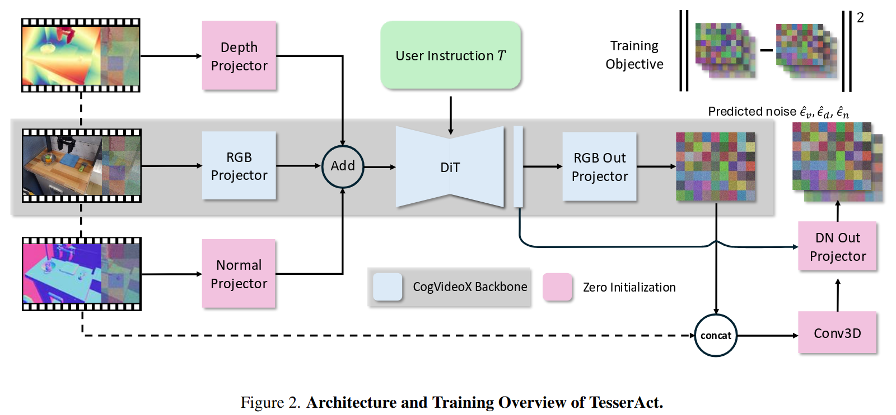

# Technical Paper Audit: GAIA-1

**Title**: GAIA-1: A Generative World Model for Autonomous Driving  
**Authors**: Lorin Achey  
**Paper**: GAIA-1 (Arxiv 2023)  
**Topic**: World Models  

---

## Summary

Autonomous driving requires the ability to predict future states of the world in order to plan safe actions, yet collecting real-world data for rare and dangerous scenarios is expensive, risky, and often impossible. GAIA-1 introduces a generative world model for autonomous driving that combines autoregressive sequence modeling with video diffusion decoding to generate controllable driving scenarios. The model accepts video, text, and action inputs, encoding them into discrete tokens and predicting future states autoregressively. GAIA-1 demonstrates the ability to generate coherent scenes with realistic object interactions that were not explicitly provided in the training data. However, the model does not run in real-time and lacks closed-loop evaluation, making its utility for actual autonomous driving control questionable.

---

## 1. Problem Domain & Taxonomy

### 1.1 The Technical Challenge

**Core Problem**: GAIA-1 addresses the challenge of building generative world models for autonomous driving that can predict future states of the environment while being controllable through both high-level commands (text) and low-level control signals (speed/curvature).

Autonomous driving requires a model that can imagine futures given a proposed action, generate synthetic training data for rare and dangerous scenarios that cannot be safely collected in the real world, and enable planning by evaluating multiple action sequences before committing to one. The authors claim that neither traditional world models (which capture dynamics but lack visual fidelity) nor generative video models (which achieve realism but lack dynamics understanding) can solve this problem alone.

**Traditional World Models and Realism.** Prior world models such as MuZero [9], Dreamer [13], and MILE [11] have demonstrated success in simulated environments but struggle to capture the full complexity of real-world driving. These approaches typically rely on labeled data—segmentation masks, depth maps, 3D bounding boxes—which is expensive to obtain and difficult to scale to the millions of hours needed for robust autonomous driving. Furthermore, models trained primarily on synthetic data suffer from a simulation-to-real gap, where the policies they learn fail when deployed on actual vehicles encountering real-world nuances like unusual lighting, weather, or road conditions. Perhaps most critically, these models compress visual scenes into low-dimensional latent representations (typically 256-512 dimensions), which cannot faithfully reconstruct fine details such as distant pedestrians or subtle road textures. VAE-based approaches in particular tend to produce blurry outputs due to optimizing a lower bound on the likelihood rather than the true distribution. For example, Dreamer-v3 achieves superhuman performance on Atari games but operates on 64×64 grayscale images which is far below the 1920×1080 RGB video resolution required for real-world driving perception.

**Generative Video Models and Dynamics Understanding.** Modern video generation systems like Imagen Video [16] and Make-A-Video [68] can produce photorealistic content, yet they fundamentally lack the world understanding necessary for autonomous driving. They can generate plausible-looking frames without modeling the causal structure of the world, potentially producing physics-violating scenarios where objects teleport or pass through each other. Generation is largely uncontrollable: one cannot easily specify "add a pedestrian crossing the street" or "change the weather to rain" to synthesize targeted training scenarios for edge cases. Most fundamentally, these models treat video as a sequence of images rather than as the evolution of a world state, lacking the ability to reason about object permanence, velocities, and interactions over time. Imagen Video can generate a compelling video of "a car driving through Tokyo," but it cannot answer the safety-critical question "what happens if that car brakes suddenly?"

**GAIA-1's Proposed Solution.** GAIA-1 addresses this dual challenge by using two specialized components: a world model that reasons about high-level scene components and dynamics (answering "what happens next?"), and a video diffusion decoder that translates these latent predictions into high-quality pixel-space video (answering "what does it look like?"). This architectural separation allows each component to benefit from its respective scaling paradigm.

### 1.2 Taxonomy of Approaches & Related Work

**Classical Planning Methods.** Early autonomous driving systems relied on rule-based approaches where engineers attempted to manually specify the complete set of driving behaviors. These systems encode expert knowledge as explicit if-then rules—for example, "if a pedestrian is detected within 10 meters, apply brakes." While interpretable, such approaches are fundamentally brittle: the complexity of real-world driving makes it impossible to anticipate every scenario in advance. Model Predictive Control (MPC) offered a more principled alternative by optimizing trajectories over a finite horizon using hand-crafted cost functions and dynamics models. However, MPC requires accurate models of vehicle dynamics and the environment, struggles with the computational demands of real-time replanning, and cannot easily incorporate learned priors about human behavior or scene semantics.

**Imitation Learning.** The advent of deep learning enabled a shift toward learning driving policies directly from human demonstrations.
Kendall et al. [1] demonstrated that an end-to-end neural network could learn to drive in a day by imitating expert behavior.
However, imitation learning suffers from distribution shift: the policy encounters states during deployment that differ from the training distribution, leading to compounding errors.
Additionally, imitation learning cannot imagine scenarios beyond those present in the training data. It learns to mimic expert actions but not to reason about predicted futures or recover from novel situations.

**World Models.** To address the limitations of pure imitation, researchers developed world models that learn to predict future states of the environment. Ha and Schmidhuber [7] introduced recurrent world models that enabled policy learning entirely within a learned "dream" environment. MuZero [9] demonstrated that planning with a learned model could achieve superhuman performance in games like Go, Chess, and Atari without access to ground-truth game rules. For autonomous driving specifically, MILE [11] combined model-based prediction with imitation learning for urban driving, while DayDreamer [15] showed that world models could enable sample-efficient learning on physical robots. Dreamer-v3 [13] unified these ideas into a general framework capable of mastering diverse domains through latent imagination. However, as discussed above, these approaches typically operate in low-dimensional latent spaces that sacrifice visual fidelity.

**Video Generation and World Models.** The most recent evolution casts world modeling as a video generation problem. This approach builds on two parallel developments: sequence modeling formulations that treat control as token prediction (Decision Transformer [19], Trajectory Transformer [10]), and large-scale video generation systems that produce photorealistic content (Imagen Video [16], Make-A-Video [68]). GAIA-1 synthesizes these paradigms, using autoregressive sequence modeling for world dynamics and diffusion models for high-fidelity rendering. Concurrent work includes DriveGAN [62], which uses GANs for controllable driving simulation, and DriveDreamer [87], which applies diffusion models conditioned on 3D scene layouts.

**Comparative Positioning.** GAIA-1 distinguishes itself from related work through scale (9.4B parameters vs. ~100M-1B for competitors), generation quality (video diffusion vs. VAE/GAN), and multimodal conditioning (text + action). However, it sacrifices real-time capability (unlike MILE, DriveGAN, Dreamer-v3) and closed-loop evaluation (unlike MILE, Dreamer-v3). MILE provides trajectory outputs evaluated on CARLA driving; GAIA-1 provides video outputs with qualitative evaluation only.

### 1.3 The "Initial Dissolve"

**Evolution of Problem Formulation (2021-2023)**:

1. **Representation Shift**: From pixel-level prediction to discrete token prediction
   - Enables scaling laws similar to LLMs
   - GAIA-1 uses VQ-VAE [28] with DINO [30] distillation for semantic tokenization

2. **Control Paradigm Shift**: From end-to-end driving to controllable generation
   - GAIA-1 separates "understanding the world" from "controlling the vehicle"
   - Enables synthetic data generation for downstream policy training

3. **Evaluation Shift**: From closed-loop performance to open-loop video quality
   - **Scene Quality vs. Driving Quality**: GAIA-1 provides only qualitative evaluation, largely focused on scene generation
   - No downstream driving policy is trained so it is unclear whether an autonomous system can drive better after being trained on GAIA-1 synthetic data
---

## 2. Architectural Overview

### 2.1 Model Architecture

GAIA-1 adopts a three-stage pipeline that separates perception (tokenization), reasoning (world model), and rendering (video decoder). This factorization allows each component to be optimized independently and benefit from domain-specific scaling paradigms: the tokenizer compresses visual information into a discrete vocabulary, the world model applies LLM-style autoregressive prediction over this vocabulary, and the video decoder uses diffusion to render high-fidelity output.

| Component | Parameters | Function |
|-----------|------------|----------|
| **Image Tokenizer** | 0.3B | Discrete image encoding (VQ-VAE [28] + DINO [30]) |
| **World Model** | 6.5B | Autoregressive next-token prediction |
| **Video Decoder** | 2.6B | Diffusion-based video rendering |


The data flow proceeds as follows: (1) Input video frames are encoded into discrete image tokens via the tokenizer; (2) Text descriptions are embedded via frozen T5-Large [24]; (3) Actions (speed, curvature) are projected via learned linear layers; (4) All modalities are interleaved into a single sequence and processed by the autoregressive world model to predict future image tokens; (5) Predicted tokens are decoded into video frames via the diffusion decoder.

### 2.2 Image Tokenizer (0.3B parameters)

**Architecture**: Fully convolutional 2D U-Net encoder-decoder with vector quantization

**Specifications**:
- Input resolution: $H \times W = 288 \times 512$ (9:16 aspect ratio)
- Downsampling factor: $D = 16$
- Tokens per image: $n = \frac{H}{D} \times \frac{W}{D} = 18 \times 32 = 576$ tokens
- Vocabulary size: $K = 8192$
- Bit compression ratio: $\frac{288 \times 512 \times 3 \times 8}{18 \times 32 \times 13} \approx 470\times$

**Key Innovation - DINO Distillation**:
The tokenizer incorporates inductive biases from DINO [30] (self-supervised vision transformer) to ensure tokens are semantically meaningful rather than dominated by high-frequency signals.

**Mathematical Formulation**:

For input image $x_t$, the encoder produces discrete tokens:
$$
z_t = E_\theta(x_t) \in \{1, ..., K\}^{n}
$$

where quantization uses nearest-neighbor lookup from learnable embedding table.

**Training Losses**:

$$
\mathcal{L}_{\text{tokenizer}} = \lambda_{L_1} \mathcal{L}_{L_1} + \lambda_{L_2} \mathcal{L}_{L_2} + \lambda_{\text{perceptual}} \mathcal{L}_{\text{perceptual}} + \lambda_{\text{GAN}} \mathcal{L}_{\text{GAN}} + \lambda_{\text{codebook}} \mathcal{L}_{\text{codebook}} + \lambda_{\text{DINO}} \mathcal{L}_{\text{DINO}}
$$

With weights: $\lambda_{L_1} = 0.2$, $\lambda_{L_2} = 2.0$, $\lambda_{\text{perceptual}} = 0.1$, $\lambda_{\text{GAN}} = 1.0$, $\lambda_{\text{codebook}} = 1.0$, $\lambda_{\text{DINO}} = 0.1$

### 2.3 World Model (6.5B parameters)

**Architecture**: Autoregressive Transformer with causal masking

**Token Interleaving**: The key design choice is how multimodal inputs are combined. Rather than using separate encoders with cross-attention, GAIA-1 interleaves all modalities into a single flat sequence processed with standard causal self-attention. For each timestep $t$, tokens are ordered as: **text to image to action**.

```
Sequence: [c₁ z₁ a₁] [c₂ z₂ a₂] ... [cₜ zₜ aₜ]
           ↑         ↑              ↑
        Frame 1   Frame 2   ...   Frame T

Where per frame:
  c = 32 text tokens (from T5-Large embeddings)
  z = 576 image tokens (from VQ-VAE discrete codes)  
  a = 2 action tokens (speed, curvature as continuous embeddings)
```

This interleaving enables the model to learn cross-modal dependencies: image tokens attend to preceding text (for conditional generation), and action tokens provide ego-motion context for predicting future frames.

**Per-Modality Specifications**:
- Text tokens: $c_t \in \mathbb{R}^{32 \times 4096}$ (T5-Large embeddings, frozen)
- Image tokens: $z_t \in \{1,...,8192\}^{576}$ (discrete VQ codes, learned embedding)
- Action tokens: $a_t \in \mathbb{R}^{2 \times 4096}$ (speed + curvature, linear projection)

**Sequence Scale**:
- Tokens per frame: $32 + 576 + 2 = 610$
- Video length: $T = 26$ frames at 6.25 Hz (4 seconds)
- **Total sequence length**: $26 \times 610 = 15{,}860$ tokens

**Training Objective**: Standard next-token prediction over image tokens only (text and action are conditioning inputs):

$$
\mathcal{L}_{\text{world model}} = -\sum_{t=1}^{T} \sum_{i=1}^{n} \log p(z_{t,i} | z_{<t}, z_{t,j<i}, c_{\leq t}, a_{<t})
$$

**Conditioning Dropout** (for multi-task generation): Unconditional 20%, Action-conditioned 40%, Text-conditioned 40%

### 2.4 Video Decoder (2.6B parameters)

**Architecture**: 3D U-Net with factorized spatial and temporal attention layers

**Specifications**: Sequence length $T' = 7$ frames, Resolution $288 \times 512$, Sampling rates 6.25/12.5/25 Hz

**Diffusion Formulation** (v-parameterization):

$$
\mathcal{L}_{\text{video}} = \mathbb{E}_{\epsilon, t'} \left[ \left\|\epsilon_\theta(x_{t'}, t', z, m) - \epsilon\right\|_2^2 \right]
$$

**Inference Pipeline**: Decode first 7 frames from tokens, autoregressively decode remaining frames (2-frame overlap), temporal upsample 6.25 Hz to 25 Hz, DDIM sampler with 50 steps.

### 2.5 Key Architectural Trade-Offs

GAIA-1's design makes three critical trade-offs that shape its capabilities and limitations:

**Discrete Tokens vs. Continuous Latents.** GAIA-1 uses discrete tokenization ($z \in \{1,...,K\}^n$) rather than continuous latent representations. This enables LLM-style next-token prediction and benefits from proven scaling laws, but introduces quantization error. Each image is compressed to 7,488 bits (576 tokens × 13 bits), a 470× compression that discards fine-grained spatial information. The DINO distillation loss biases tokens toward semantic categories over geometric precision—beneficial for high-level scene understanding but potentially harmful for safety-critical details like exact distances.

**Autoregressive vs. Parallel Decoding.** The world model generates tokens sequentially rather than in parallel (like MaskGIT or BERT [90]). This maximizes expressiveness—each token can depend on all previous tokens—but incurs 576 sequential forward passes per frame. A parallel decoder could achieve ~36× speedup but would sacrifice the ability to model complex inter-token dependencies. GAIA-1 prioritizes quality over inference speed, a choice aligned with research exploration rather than deployment.

**Temporal Resolution (6.25 Hz vs. 25 Hz).** The world model operates at 6.25 Hz (160ms between frames) to keep sequence length tractable, with the video decoder upsampling to 25 Hz. This reduces attention memory by ~15× compared to native 25 Hz, enabling 4-second context windows. However, 160ms between predictions means a vehicle at highway speed moves 4.8m between frames—fine-grained motion and sudden events may be aliased away before the model sees them.

---

## 3. Scaling

### 3.1 Training Scale

**Dataset**: 4,700 hours at 25 Hz (~420M images) from proprietary London driving data, with 400 hours held out for validation. Data balanced over (latitude, longitude, weather, steering, speed) with exponent 0.5.

**Compute**:

| Component | GPU-Hours | Hardware | Duration |
|-----------|-----------|----------|----------|
| Image Tokenizer | 3,072 | 32 × A100 80GB | 4 days |
| World Model | 23,040 | 64 × A100 80GB | 15 days |
| Video Decoder | 11,520 | 32 × A100 80GB | 15 days |
| **Total** | **~37,600** | - | ~34 days |

### 3.2 Scaling Laws & Limitations

**Empirical Finding**: GAIA-1 exhibits scaling laws analogous to LLMs. The paper reports that "the final performance of the GAIA-1 world model could be predicted with smaller models trained with less than 20× the compute." Models from 0.65M to 6.5B parameters (10,000× range) follow smooth power-law curves with no evidence of plateau.

**Training Compute Estimation**: Using the standard transformer approximation ($C \approx 6ND$), GAIA-1's world model training required approximately $9.4 \times 10^{21}$ FLOPs, with a tokens-to-parameters ratio of ~37 (slightly higher than Chinchilla-optimal ~20, suggesting the model may be over-trained relative to its size).

**What Doesn't Scale.** While world model perplexity improves with scale, several bottlenecks remain fixed:
- **Tokenizer resolution** (16× downsampling) bounds spatial detail regardless of world model size
- **Temporal resolution** (6.25 Hz) bounds dynamics capture regardless of context length  
- **Training distribution** (London-only, expert driving) bounds generalization regardless of model capacity
- **Inference latency** worsens with scale due to autoregressive generation

**Data Wall.** Unlike LLMs with near-infinite web text, driving video is scarce. GAIA-1's 4,700 hours represents ~94,000 miles—containing essentially zero safety-critical events (accidents occur at ~$10^{-6}$/mile). No amount of scaling can teach the model to predict scenarios absent from training.

---

## 4. Robotic Grounding & Physicality Gap

### 4.1 The Precision Gap

**Critical Admission** (from paper): "The autoregressive generation process, while highly effective, **does not yet run at real-time**."

For one world model forward pass predicting 576 tokens, each step requires full sequence attention over 15,860 tokens. Estimated inference: ~29 seconds per frame on A100, approximately **180× slower than real-time** at 6.25 Hz.

**Hardware Reality Check**: GAIA-1 requires ~$1.15 \times 10^{17}$ FLOPs per frame. Even an H100 (~2,000 TFLOPS) achieves only ~0.02 frames/sec. On automotive hardware (NVIDIA Orin, ~67 TFLOPS), the gap is 3-4 orders of magnitude.

### 4.2 Benchmark Critique

The paper provides no quantitative metrics: no FID, FVD, LPIPS, collision rate, or trajectory error. No comparison baselines against MILE, DriveGAN, or DriveDreamer. Evaluation consists entirely of qualitative video demonstrations.

**Missing validation**:
- Can a downstream policy trained on GAIA-1 generations actually drive?
- What is the failure rate for safety-critical scenarios?
- How does generation quality compare to existing methods?

### 4.3 Engineering Bottlenecks

**Information Decay.** The tokenizer compresses 3.5M bits to 7,488 bits (470×). Sub-pixel depth gradients, high-frequency textures, precise object boundaries, and small/distant objects may fall below tokenization resolution.

**The Semantic-Motor Gap.** GAIA-1 outputs video frames, not control commands. A complete system requires an additional perception-to-control policy that processes generated video, extracts state, plans trajectory, and outputs motor commands. As the authors state, GAIA-1 is intended as "a valuable neural simulator" for data generation—it is a **data augmentation tool**, not a **driving policy**.

---

## 5. Critical Synthesis & Sign-Off

### 5.1 Load-Bearing Assumptions

**Assumption 1: Discrete Tokenization Preserves Driving-Critical Information.** The 576 tokens with K=8192 vocabulary are claimed to sufficiently represent driving scenes, but DINO distillation biases toward semantic categories over geometric precision, and 16× downsampling destroys sub-16-pixel details. A pedestrian 50m away may occupy <16 pixels and be compressed away entirely.

**Assumption 2: Next-Token Prediction = World Understanding.** The paper claims emergent "understanding of geometry" and "scene dynamics," but provides no quantitative validation. Perceptual realism does not equal physical accuracy; the model may memorize dataset patterns rather than learn causal dynamics.

**Assumption 3: Proprietary UK Data Generalizes.** 4,700 hours of London driving (right-hand traffic, urban, UK climate) cannot cover left-hand-drive countries, highways, rural areas, or diverse driving cultures.

**Assumption 4: Generation Quality to Policy Performance.** No evidence that GAIA-1 generations improve downstream driving. Domain gap and generation artifacts may harm transfer.

### 5.2 Reproducibility Assessment

- Code publicly available? **No**
- Pre-trained models released? **No**  
- Dataset accessible? **No** (proprietary)
- Hyperparameters specified? **Yes**
- Quantitative evaluation? **No**

**Score: 1/5 - Not reproducible.**

### 5.3 Failure Modes

**Transparent/Reflective Objects**: Tokenizer has no explicit transparency representation; generated videos may show objects appearing/disappearing through glass or inconsistent reflections.

**High-Velocity Objects**: At 6.25 Hz, objects moving at 27 m/s cover 4.3m between frames; sudden appearances cannot be predicted.

**Multi-Vehicle Coordination**: Model generates plausible individual behaviors but may violate coordination rules at ambiguous intersections.

**Weather Transitions**: Text conditioning sets static weather; transitions (tunnel entry, sudden rain) may be abrupt or inconsistent.

### 5.4 The Next 10,000 GPU-Hour Experiment

**Proposed**: Closed-loop evaluation. Generate 1,000 hours of diverse scenarios with GAIA-1, train downstream policy on generated data, evaluate in CARLA/nuScenes [2] (collision rate, route completion, comfort metrics), compare to real-data-only baseline. This would quantify the actual utility of world model generations for policy training.

### 5.5 Foundational vs. Incremental

**Foundational**: First large-scale (9.4B) multimodal world model for real driving; demonstrates LLM scaling laws transfer; shows emergent properties (multi-agent reasoning, 3D geometry, extrapolation); architectural template likely influential.

**Incremental**: No quantitative evaluation or reproducible benchmarks; cannot run in real-time by orders of magnitude; proprietary and not reproducible; no demonstration of downstream utility.

**Verdict**: GAIA-1 is **foundational as a research direction** but **incremental as a deployable system**. It proves world models can scale but doesn't solve the grounding problem.

### 5.6 Sign-Off

**If this paper were a technical proposal at Zoox/Tesla, would I sign off?**

**For Production: CONDITIONAL NO**
- Cannot run in real-time on any foreseeable hardware
- Generates video, not control signals
- No safety validation or failure mode analysis
- Proprietary data prevents external validation

**For Research: YES, with conditions**
- Demonstrates scaling laws work for world models
- Architectural innovations worth pursuing
- Could be valuable for data augmentation (if validated)

**Conditions for eventual deployment**:
1. Real-time inference (≥10 Hz on automotive hardware)
2. Quantitative validation (FVD, downstream policy performance)
3. Safety certification (documented failure modes, edge case testing)
4. Generalization proof (performance on unseen domains)

---

## References

[1] A. Kendall et al. "Learning to drive in a day." ICRA 2019.

[2] H. Caesar et al. "nuScenes: A multimodal dataset for autonomous driving." CVPR 2020.

[7] D. Ha and J. Schmidhuber. "Recurrent world models facilitate policy evolution." NeurIPS 2018.

[9] J. Schrittwieser et al. "Mastering Atari, Go, Chess and Shogi by Planning with a Learned Model." Nature 2020.

[10] M. Janner et al. "Offline reinforcement learning as one big sequence modeling problem." NeurIPS 2021.

[11] A. Hu et al. "Model-Based Imitation Learning for Urban Driving." NeurIPS 2022.

[13] D. Hafner et al. "Mastering diverse domains through world models." arXiv 2023.

[15] P. Wu et al. "Daydreamer: World models for physical robot learning." CoRL 2023.

[16] J. Ho et al. "Imagen video: High definition video generation with diffusion models." arXiv 2022.

[19] L. Chen et al. "Decision transformer: Reinforcement learning via sequence modeling." NeurIPS 2021.

[24] C. Raffel et al. "Exploring the limits of transfer learning with a unified text-to-text transformer." JMLR 2020.

[28] A. van den Oord et al. "Neural discrete representation learning." NeurIPS 2017.

[30] M. Caron et al. "Emerging properties in self-supervised vision transformers." ICCV 2021.

[49] J. Kaplan et al. "Scaling laws for neural language models." arXiv 2020.

[62] S. W. Kim et al. "DriveGAN: Towards a controllable high-quality neural simulation." CVPR 2021.

[68] U. Singer et al. "Make-A-Video: Text-to-Video Generation without Text-Video Data." arXiv 2022.

[87] X. Wang et al. "DriveDreamer: Towards Real-world-driven World Models for Autonomous Driving." arXiv 2023.

[90] J. Devlin et al. "BERT: Pre-training of Deep Bidirectional Transformers for Language Understanding." NAACL 2019.

---

# Technical Paper Audit: TesserAct

**Title**: TesserAct: Learning 4D Embodied World Models  
**Authors**: Lorin Achey  
**Paper**: TesserAct (Arxiv 2025)  
**Topic**: World Models  

---

## Summary

Embodied agents require world models that capture the 3D structure of scenes to enable precise manipulation, yet existing world models operate in 2D pixel space, losing critical depth and pose information. TesserAct addresses this by learning a 4D embodied world model that predicts RGB-DN (RGB, Depth, Normal) videos, providing a compact yet geometrically rich representation of scene dynamics. The model fine-tunes CogVideoX on a curated dataset of ~285k robotic manipulation videos annotated with depth and normal maps, then reconstructs temporally and spatially consistent 4D point clouds via normal integration with novel consistency losses. TesserAct enables downstream action planning through an inverse dynamics model, outperforming 2D video-based approaches on RLBench manipulation tasks. However, the single-view RGB-DN representation captures only visible surfaces, and the approach inherits the inference cost limitations of video diffusion models.

---

## 1. Problem Domain & Taxonomy

### 1.1 The Technical Challenge

**Core Problem**: TesserAct addresses the fundamental limitation that existing world models operate in 2D pixel space, which fails to capture the 3D spatial relationships essential for robotic manipulation. Without accurate depth and 6-DoF pose estimations, robotic systems struggle to determine the exact position and orientation of objects.

**The 2D Representation Gap.** Prior video-based world models like UniPi [15], Genie [8], and Pandora [64] generate future video frames conditioned on actions and text, but their 2D outputs suffer from several critical limitations for embodied tasks. First, they cannot provide metric depth information needed to plan precise grasping motions—a robot arm must know not just where an object appears in the image but how far it is and at what angle. Second, 2D models can produce geometrically inconsistent outputs where object sizes and shapes vary across frames, violating physical constraints. Third, converting 2D predictions back to 3D control signals requires additional perception modules (depth estimators, pose estimators) that introduce error accumulation and latency. The paper notes that "without accurate depth and 6-DoF pose estimations, robotic systems struggle to determine the exact position and orientation of objects."

**The 4D Training Data Gap.** While 3D and 4D representations would better serve robotics, collecting large-scale datasets with ground-truth depth and normal maps is prohibitively expensive. Real-world depth sensors (LiDAR, structured light) have limited resolution and fail on reflective/transparent surfaces common in manipulation scenarios. Synthetic data provides perfect ground truth but suffers from sim-to-real gaps. This data scarcity has prevented prior work from training 4D world models at scale.

**TesserAct's Proposed Solution.** TesserAct addresses these challenges through three key innovations: (1) an RGB-DN representation that jointly predicts RGB, depth, and normal maps as a lightweight proxy for full 4D scenes; (2) a data annotation pipeline using off-the-shelf depth/normal estimators to augment existing robotic video datasets; and (3) a 4D reconstruction algorithm with novel consistency losses to convert RGB-DN videos into temporally coherent point clouds. This factorization leverages existing video diffusion priors while adding geometric structure needed for robotics.

### 1.2 Taxonomy of Approaches & Related Work

**Embodied Foundation Models.** Recent work has focused on constructing foundation models for general-purpose agents through two main approaches. Vision-Language-Action (VLA) models like RT-2 [6] and OpenVLA [34] directly output action tokens from image and text inputs, learning an end-to-end mapping from perception to control. Multimodal language models like PaLM-E [13] output text describing actions. Both approaches aim to construct foundation model policies but do not model world dynamics explicitly. In contrast, TesserAct constructs a foundation world model that can be used for downstream planning and policy synthesis.

**World Models for Control.** Learning dynamics models given control inputs has been studied extensively in model-based reinforcement learning and optimal control. Early approaches like Dreamer [22] learned world models in low-dimensional latent spaces, which are efficient but difficult to generalize across environments. Ha and Schmidhuber's [21] recurrent world models enabled policy learning in "dream" environments but operated on simple games. More recent work like UniPi [15] and Pandora [64] uses video diffusion models as world models, but these operate over 2D pixels. TesserAct extends this paradigm to 4D by jointly predicting depth and normal information.

**4D Video Generation.** The task of generating dynamic 3D content has gained attention through approaches combining diffusion models with NeRF [44] or Gaussian splatting [33]. However, these methods suffer from slow optimization due to hybrid frameworks and SDS loss convergence challenges. TesserAct sidesteps these issues by representing 4D scenes as RGB-DN videos, which are more efficient to generate and provide high-accuracy 3D information. The paper notes that "our approach is the first to directly predict 4D scenes from the current frame and the embodied agent's action described in text."

**Comparative Positioning.** TesserAct distinguishes itself from related work by: (1) providing explicit 3D geometry (depth, normal) rather than implicit 2D features; (2) enabling temporally consistent 4D reconstruction rather than frame-by-frame estimation; (3) demonstrating downstream utility for robotic manipulation rather than just generation quality. Compared to 3D-VLA [76] which predicts only goal states, TesserAct models the full trajectory. Compared to Aether [57] which trains on synthetic data without language grounding, TesserAct supports language-conditioned control on real data.

### 1.3 The "Initial Dissolve"

**Evolution of Problem Formulation (2023-2025)**:

1. **From 2D to 4D World Models**: Prior video world models treated scenes as sequences of images; TesserAct treats them as evolving 3D geometry.

2. **From Implicit to Explicit Geometry**: Rather than hoping 2D representations implicitly capture 3D structure, TesserAct explicitly predicts depth and normal maps that can be directly used for 3D reconstruction.

3. **From Generation to Reconstruction**: TesserAct's value proposition is not just generating plausible videos but reconstructing geometrically accurate 4D scenes that enable downstream robotic control.

---

## 2. Architectural Overview

### 2.1 Model Architecture

TesserAct extends CogVideoX [69], a latent video diffusion model, to jointly predict RGB, depth, and normal videos. The architecture preserves the pretrained video generation capability while adding geometric prediction heads.




The data flow proceeds as follows: (1) RGB, depth, and normal videos are separately encoded by the frozen CogVideoX 3D VAE; (2) Three separate input projectors extract embeddings for each modality; (3) The DiT backbone processes the sum of embeddings conditioned on text instruction and diffusion timestep; (4) RGB output uses the original CogVideoX projector; (5) Depth and normal outputs use additional Conv3D + MLP projectors that combine hidden states with RGB predictions.

### 2.2 RGB-DN Video Prediction

**Core Innovation**: Rather than predicting explicit 3D representations (meshes, point clouds, NeRFs [44]), TesserAct predicts RGB-DN (RGB, Depth, Normal) videos as a compact 4D proxy.

**Why RGB-DN?** This representation offers three advantages:
- **Computational efficiency**: Same dimensionality as standard video, enabling use of pretrained video models
- **Geometric completeness**: Depth provides metric distance; normals provide surface orientation—together sufficient for 3D reconstruction
- **Temporal modeling**: Video diffusion naturally captures dynamics, unlike per-frame 3D estimation

**Diffusion Formulation**: The model learns the joint distribution $p(v, d, n | v_0, d_0, n_0, T)$ where $v, d, n$ are the predicted RGB, depth, and normal video latents, and the conditions are the first frame's latents plus text instruction $T$.

**Training Objective**:
$$
\mathcal{L} = \mathbb{E}_{v_0, T, t, \epsilon} \left[ \left\| [\epsilon_v, \epsilon_d, \epsilon_n] - \epsilon_\theta(x_t, t, x_0, T) \right\|^2 \right]
$$

where noise is added jointly to all three modalities and the denoiser predicts all three noise components.

### 2.3 Input/Output Architecture

**Input Design**: Three separate projectors extract modality-specific embeddings that are summed before the DiT backbone:
```
f_z = InputProj(z_t, z_0)  for z ∈ {v, d, n}
h = DiT(Σ f_z, t, T)
```

**Text Conditioning**: Instructions are formatted as `[action instruction] + [robot arm name]`, e.g., "pick up apple google robot". This enables cross-embodiment generalization.

**Output Design**: RGB uses the original CogVideoX output projector. Depth and normal use additional modules:
$$
\epsilon^*_{d,n} = \text{DNProj}(h, \text{Conv3D}(\epsilon^*_v, [z_t; z_0]_{z \in \{v,d,n\}}))
$$

The Conv3D layer encodes the concatenation of input latents with predicted RGB output, enabling depth/normal predictions to condition on the RGB prediction.

**Zero Initialization**: All new modules are initialized with zeros, ensuring the model initially reproduces CogVideoX's RGB output before learning geometric predictions. This preserves pretrained knowledge.

### 2.4 4D Scene Reconstruction

After generating RGB-DN videos, TesserAct reconstructs temporally consistent 4D point clouds through a novel optimization procedure.

**Normal Integration**: Raw depth predictions are often coarse with tilted planes. Normal maps provide surface orientation constraints that refine depth via integration:
$$
\min_{\tilde{d}} \iint_\Omega (\tilde{n}_z \partial_u \tilde{d} + n_x)^2 + (\tilde{n}_z \partial_v \tilde{d} + n_y)^2 \, du \, dv
$$

This spatial consistency loss $L_s$ enforces that depth gradients align with normal predictions.

**Temporal Consistency Loss**: Frame-by-frame optimization lacks temporal coherence. TesserAct uses optical flow (RAFT [59]) to enforce consistency:
- **Static regions**: Pixels with small optical flow magnitude ($\left\|F^i\right\| \leq c$)
- **Dynamic regions**: Moving pixels
- **Background**: Static regions consistent across frames

The consistency loss enforces depth agreement for corresponding pixels across frames:
$$
L_c = \lambda_{cd} \left\| \tilde{D}^i \circ M^i_d - D^{i \to (i-1)} \circ M^i_d \right\|^2 + \lambda_{cb} \left\| \tilde{D}^i \circ M^i_b - D^{i \to (i-1)} \circ M^i_b \right\|^2
$$

**Regularization Loss**: Prevents optimized depth from deviating too far from the generated prediction:
$$
L_r = \lambda_{rd} \left\| \tilde{D}^i \circ M^i_d - D^i \circ M^i_d \right\|^2 + \lambda_{rb} \left\| \tilde{D}^i \circ M^i_b - D^i \circ M^i_b \right\|^2
$$

**Full Objective**: $\arg\min_{\tilde{D}} (L_s + L_c + L_r)$

### 2.5 Key Architectural Trade-Offs

**Joint vs. Separate Modality Prediction.** TesserAct predicts RGB, depth, and normal jointly through a shared backbone rather than using separate models for each. This enables cross-modal reasoning—depth predictions can leverage RGB texture cues, normals can condition on depth edges—but creates a more complex training objective. The alternative (separate estimators applied post-hoc) would lose temporal consistency and cross-modal coherence.

**Pretrained Video Model vs. Training from Scratch.** With only ~285k training videos (far less than the billions used for CogVideoX), training from scratch is infeasible. Fine-tuning preserves video generation priors while adding geometric capability. The trade-off is inheriting CogVideoX's biases and architecture constraints.

**RGB-DN vs. Full 3D Representation.** Point clouds, meshes, or NeRFs would provide more complete 3D information, but are computationally expensive to generate and lack mature pretrained models. RGB-DN is a middle ground: richer than 2D pixels, cheaper than full 3D, and compatible with video diffusion architectures.

---

## 3. Scaling

### 3.1 Training Scale

**4D Embodied Video Dataset**:

| Dataset | Domain | Depth Source | Normal Source | Embodiment | Videos |
|---------|--------|--------------|---------------|------------|--------|
| RLBench | Synthetic | Simulator GT | Depth2Normal | Franka Panda | 80k |
| RT1 Fractal | Real | RollingDepth | Marigold | Google Robot | 80k |
| Bridge | Real | RollingDepth | Marigold | WidowX | 25k |
| SomethingSomethingV2 | Real | RollingDepth | Marigold | Human Hand | 100k |
| **Total** | - | - | - | - | **~285k** |

**Synthetic Data (RLBench [26])**: 20 tasks × 1000 instances × 4 views = 80k videos with ground-truth depth. Normals estimated via depth2normal. Scene randomization (background, texture, lighting) via Colosseum [27] pipeline.

**Real Data Annotation**: RollingDepth [31] provides temporally consistent affine-invariant depth. Marigold [32] provides frame-consistent normal maps. This enables scaling to large real-world datasets without expensive sensor data.

**Compute**:
- Training: 40,000 iterations
- Batch size: 16
- Learning rate: 1e-4 with 1,000-step warmup
- Precision: bf16
- Output: 49 frames per video
- Sampling: 50 DDPM steps, CFG scale 7.5

### 3.2 Scaling Laws & Limitations

**No Explicit Scaling Analysis**: Unlike GAIA-1, TesserAct does not present scaling law experiments across model sizes. The paper focuses on demonstrating the RGB-DN representation's effectiveness rather than scaling behavior.

**Data Scaling Bottleneck**: The ~285k video dataset is orders of magnitude smaller than web-scale video datasets. Expanding requires either:
- More robotic video collection (expensive)
- Better depth/normal estimators for arbitrary videos
- Synthetic data generation (sim-to-real gap)

**What Doesn't Scale**:
- **Single-view limitation**: RGB-DN captures only the visible surface; occluded regions remain unknown regardless of model size
- **Estimator quality**: Real-world depth/normal annotations depend on RollingDepth [31] and Marigold [32] quality, introducing systematic biases
- **Temporal horizon**: 49-frame output limits long-horizon prediction

**Embodiment Diversity**: Training on 4 embodiments (Franka Panda, Google Robot, WidowX, Human Hand) enables some cross-embodiment transfer, but generalizing to novel robot morphologies remains unvalidated.

---

## 4. Robotic Grounding & Physicality Gap

### 4.1 Downstream Action Planning

Unlike pure generation models, TesserAct demonstrates downstream utility through an inverse dynamics model for robotic manipulation.

**Inverse Dynamics Architecture**:
1. Reconstruct 4D point clouds from RGB-DN predictions
2. Filter background/floor, sample 8192 points
3. Encode point cloud via PointNet [49]
4. Concatenate with instruction language embedding
5. 4-layer MLP outputs 7-DoF actions

**Evaluation on RLBench [26]** (success rate over 100 episodes):

| Method | close box | open drawer | open jar | open microwave | put knife | sweep dustpan | lid off | weighing off | water plants |
|--------|-----------|-------------|----------|----------------|-----------|---------------|---------|--------------|--------------|
| Image-BC | 53 | 4 | 0 | 5 | 0 | 0 | 12 | 21 | 0 |
| UniPi* | 81 | 67 | 38 | 72 | 66 | 49 | 70 | 68 | 35 |
| TesserAct | **88** | **80** | **44** | 70 | **70** | **56** | **73** | 62 | **41** |

TesserAct outperforms 2D baselines on 7/9 tasks, with largest gains on tasks requiring geometric understanding (close box, open drawer, open jar).

### 4.2 The Precision Gap

**Where 4D Helps**: Tasks requiring precise spatial reasoning benefit from explicit geometry:
- **Grasping**: Point cloud provides 3D object pose for grasp planning
- **Tool use**: Sweep dustpan, water plants require understanding tool-object relationships
- **Contact-rich tasks**: Close box, open jar need accurate surface geometry

**Where 4D Doesn't Help**: Open microwave and weighing off show comparable or worse performance than UniPi*. The paper suggests "these tasks already have sufficient information in the 2D front image." This reveals that 4D is not universally beneficial—some tasks are solvable from 2D cues.

### 4.3 Engineering Bottlenecks

**Single-Surface Limitation**: RGB-DN from a single viewpoint captures only visible surfaces. The paper acknowledges: "our RGB-DN representation of a 4D world model is cheap and easy to predict, it only captures a single surface of the world." For manipulation requiring reasoning about occluded regions or object backsides, this is insufficient.

**Depth Estimation Quality on Real Data**: Real-world depth annotations come from RollingDepth [31] (affine-invariant, not metric). Converting to metric depth for control requires scale disambiguation, which may introduce errors. The paper doesn't report metric depth accuracy on real data.

**Inference Latency**: Video diffusion models are slow. TesserAct requires 50 DDPM sampling steps for 49-frame generation. The paper reports novel view synthesis in "~1 min" vs Shape of Motion's [62] "~2 hours," but doesn't report end-to-end latency for closed-loop control. Real-time operation (10+ Hz) is likely infeasible.

**Action Space Mismatch**: The inverse dynamics model predicts 7-DoF actions from point clouds, but this requires knowing keyframes a priori. The paper notes they "predict and record all future keyframes" then "query the inverse dynamic model"—this open-loop execution precludes reactive control.

---

## 5. Critical Synthesis & Sign-Off

### 5.1 Load-Bearing Assumptions

**Assumption 1: RGB-DN is Sufficient for 4D Understanding.** The paper assumes that RGB, depth, and normal maps from a single viewpoint provide enough geometric information for manipulation. This fails for tasks requiring occluded geometry, multi-view reasoning, or volumetric understanding. The ~10% of tasks where TesserAct underperforms may reveal these limits.

**Assumption 2: Estimated Depth/Normal is Accurate Enough.** Real-world training uses RollingDepth and Marigold estimates, not ground truth. Systematic estimation errors will be learned by the model. No analysis of how estimation quality affects downstream performance is provided.

**Assumption 3: Cross-Embodiment Transfer Works.** Training on 4 robot types is claimed to enable generalization, but all evaluation is on seen embodiments (Franka Panda on RLBench). True cross-embodiment generalization to novel robots is unvalidated.

**Assumption 4: Video Diffusion Priors Transfer to Robotics.** CogVideoX was trained on web videos, not robotic manipulation. The assumption that its priors (object permanence, physics, motion) transfer to embodied scenarios is implicit but unverified.

### 5.2 Reproducibility Assessment

- Code publicly available? **Yes** (website linked)
- Pre-trained models released? **Unclear**
- Dataset accessible? **Partially** (annotations on public datasets)
- Hyperparameters specified? **Yes**
- Quantitative evaluation? **Yes** (FVD, depth metrics, success rates)

**Score: 3/5 - Partially reproducible.** The use of public datasets with annotation pipeline and provided metrics enables validation, though model weights and some implementation details may be missing.

### 5.3 Failure Modes

**Occlusion Failures**: Single-view RGB-DN cannot reason about occluded geometry. Tasks requiring reaching behind objects or reasoning about hidden surfaces will fail.

**Dynamic Scene Failures**: The optical flow-based consistency assumes distinguishable static/dynamic regions. Fast motions, motion blur, or scenes with large dynamic regions may break the reconstruction.

**Out-of-Distribution Embodiments**: Despite claiming cross-embodiment capability, no evaluation on truly novel robot morphologies is provided. A hexapod or humanoid would likely fail.

**Transparent/Reflective Objects**: Like most depth estimators, RollingDepth and Marigold struggle with non-Lambertian surfaces. Generated depth/normal for glass, mirrors, or metallic objects may be unreliable.

### 5.4 The Next 10,000 GPU-Hour Experiment

**Proposed**: Multi-view RGB-DN generation. Train a model to predict RGB-DN from multiple viewpoints simultaneously, enabling full 3D reconstruction rather than single-surface capture. This directly addresses the paper's stated limitation and would enable reasoning about occluded regions.

**Alternative**: Real-time distillation. Distill TesserAct into a smaller model capable of 10+ Hz inference for closed-loop control, then evaluate reactive manipulation performance.

### 5.5 Foundational vs. Incremental

**Foundational**: First demonstration that video diffusion models can be extended to 4D embodied world modeling with explicit geometry; RGB-DN representation as efficient 4D proxy; novel consistency losses for temporal coherence; demonstrated downstream utility for manipulation.

**Incremental**: Single-view limitation restricts true 4D understanding; inherits video diffusion inference costs; evaluation limited to seen embodiments and relatively simple tasks; no scaling analysis.

**Verdict**: TesserAct is **foundational for the RGB-DN representation and reconstruction pipeline** but **incremental for embodied AI capability**. It proves that adding geometry to video world models helps robotics, but the single-view limitation and inference cost prevent deployment.

### 5.6 Sign-Off

**If this paper were a technical proposal at a robotics company, would I sign off?**

**For Production: CONDITIONAL NO**
- Single-view RGB-DN insufficient for complex manipulation
- Inference latency incompatible with real-time control
- No evaluation on novel embodiments or real-world deployment
- Open-loop execution (predict-then-act) precludes reactive behavior

**For Research: YES, with conditions**
- RGB-DN representation is a promising direction worth pursuing
- Consistency losses for temporal coherence are novel and effective
- Demonstrated improvement over 2D baselines validates the approach
- Clear path forward (multi-view, faster inference)

**Conditions for deployment**:
1. Multi-view RGB-DN for complete 3D understanding
2. Real-time inference (10+ Hz) for closed-loop control
3. Validation on novel embodiments and real-world tasks
4. Metric depth estimation for precise manipulation

---

## References

[6] A. Brohan et al. "RT-1: Robotics transformer for real-world control at scale." arXiv 2022.

[8] J. Bruce et al. "Genie: Generative interactive environments." ICML 2024.

[13] D. Driess et al. "Palm-e: An embodied multimodal language model." arXiv 2023.

[15] Y. Du et al. "Learning universal policies via text-guided video generation." NeurIPS 2024.

[21] D. Ha and J. Schmidhuber. "Recurrent world models facilitate policy evolution." NeurIPS 2018.

[22] D. Hafner et al. "Mastering atari with discrete world models." ICLR 2021.

[26] S. James et al. "RLBench: The robot learning benchmark." IEEE RAL 2020.

[27] W. Pumacay et al. "The Colosseum: A benchmark for evaluating generalization for robotic manipulation." arXiv 2024.

[31] B. Ke et al. "Video depth without video models." 2024.

[32] B. Ke et al. "Repurposing diffusion-based image generators for monocular depth estimation." CVPR 2024.

[33] B. Kerbl et al. "3D Gaussian splatting for real-time radiance field rendering." ACM ToG 2023.

[34] M. J. Kim et al. "OpenVLA: An open-source vision-language-action model." arXiv 2024.

[44] B. Mildenhall et al. "Nerf: Representing scenes as neural radiance fields for view synthesis." Communications of the ACM 2021.

[49] C. R. Qi et al. "Pointnet++: Deep hierarchical feature learning on point sets in a metric space." NeurIPS 2017.

[57] Aether Team et al. "Aether: Geometric-aware unified world modeling." arXiv 2025.

[59] Z. Teed and J. Deng. "Raft: Recurrent all-pairs field transforms for optical flow." ECCV 2020.

[61] H. Walke et al. "BridgeData V2: A dataset for robot learning at scale." CoRL 2023.

[62] Q. Wang et al. "Shape of motion: 4d reconstruction from a single video." arXiv 2024.

[64] J. Xiang et al. "Pandora: Towards general world model with natural language actions and video states." arXiv 2024.

[69] Z. Yang et al. "CogVideoX: Text-to-video diffusion models with an expert transformer." arXiv 2024.

[76] H. Zhen et al. "3D-VLA: A 3D vision-language-action generative world model." arXiv 2024.

[77] Z. Zheng et al. "Open-Sora: Democratizing efficient video production for all." 2024.

---
