# Problem Domain & Framing

Modern language models demonstrate strong performance on reasoning tasks, yet this performance often emerges from implicit pattern matching rather than structured reasoning.
Traditional scaling approaches increase parameter count and data size, but these methods do not fundamentally change how reasoning is performed within the model.
In standard autoregressive decoding, all reasoning must be compressed into a single forward pass, forcing the model to approximate operations such as retrieval, arithmetic, and symbolic manipulation internally.
Chain-of-Thought prompting partially addresses this limitation by exposing intermediate reasoning steps, particularly improving performance on mathematical reasoning benchmarks such as GSM8K.
However, these reasoning traces remain internal and unverifiable, and the model continues to simulate computation rather than execute it.
This leads to failure modes including hallucination, arithmetic errors, and brittleness in multi-step reasoning.
The papers analyzed in this audit explore an alternative direction in which reasoning is externalized into interactions with tools, environments, or symbolic systems.
Rather than scaling parameters, these methods scale reasoning through system design, introducing feedback loops, tool usage, or program execution.
This reframes reasoning as a coordination problem between a language model and external components.
The central question becomes whether reasoning improves when computation is delegated outside the model.
Each paper provides a different answer, exploring interaction, self-supervised tool use, and program synthesis as mechanisms for scaling reasoning.

**Audit Focus**
> Do language models improve reasoning by scaling internal computation, or by delegating subproblems to external tools and specialized systems?

**Summary of Findings**
- Reasoning performance improves through system design, not just larger models
  - agentic architectures enable gains without increasing parameter count
- Language models act as orchestrators that decompose tasks and delegate computation
  - reasoning is distributed across tools rather than fully internal
- External tools provide reliable and verifiable computation
  - this reduces errors in domains requiring precision such as math and logic
- Iterative interaction with tools improves reasoning quality
  - feedback loops allow models to refine decisions instead of relying on one-pass outputs

---

# Paper 1: ReAct (Reason + Act)

## Summary

ReAct proposes a framework that integrates reasoning and action into a unified inference-time process, enabling language models to alternate between generating intermediate reasoning steps and interacting with external tools.
The central motivation is that Chain-of-Thought prompting, while effective for mathematical reasoning, remains limited because it performs reasoning entirely within the model’s latent space.
This often leads to hallucination or failure in tasks requiring external knowledge retrieval.
ReAct addresses this by introducing a reasoning-action loop in which the model generates "thought" tokens representing reasoning and "action" tokens that trigger tool use, such as Wikipedia search.
The headline experiments use PaLM-540B and GPT-3 with frozen weights and few-shot prompts only, without supervised finetuning on task trajectories.
The same paper also reports finetuning smaller PaLM checkpoints on roughly three thousand bootstrapped trajectories that include ReAct-style thoughts, actions, and observations.
Experiments are conducted on knowledge-intensive benchmarks such as HotPotQA and FEVER, as well as interactive environments such as ALFWorld and WebShop.
Results demonstrate that ReAct improves multi-hop reasoning accuracy by grounding reasoning in external observations.
The method effectively combines neural reasoning with symbolic interaction, where the external tool acts as a source of truth.
This approach shows that reasoning can be improved through structured interaction rather than larger models alone.
The framework is flexible and general, but its performance depends heavily on prompt design and tool reliability.

## Method Dissection

ReAct reformulates the standard autoregressive decoding process into an interleaved reasoning and action loop, where inference is no longer a single forward pass but a sequence of dependent decisions.
In a standard language model, the objective is to generate a sequence of tokens $x_1, x_2, \dots, x_T$ by maximizing:

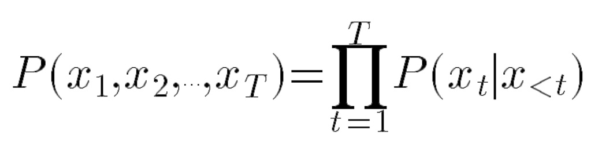

*Figure: Autoregressive factorization of the joint distribution over tokens (after Yao et al.).*

Chain-of-Thought prompting modifies this process by encouraging the model to generate intermediate reasoning tokens before producing a final answer, but the entire reasoning trajectory is still generated in one pass without external feedback.
ReAct extends this by introducing structured tokens that explicitly separate reasoning and interaction, transforming inference into a stepwise process:

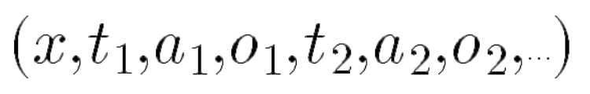

*Figure: Interleaved natural-language thoughts, actions, and observations in a ReAct rollout (after Yao et al.).*

At each step $t$, the model generates a reasoning trace $r_t$ (the "Thought"), followed by an action $a_t$ (the "Action"), which is executed by an external environment to produce an observation $o_t$.
This observation is appended to the context and conditions the next generation step.
This creates a closed feedback loop in which the model continuously updates its reasoning based on newly acquired information.
Conceptually, this can be viewed as a partially observable decision process, where the model iteratively refines its belief state through interaction.
It is no longer a single forward pass but a sequence of dependent decisions.

In a standard language model, maximum-likelihood training maximizes the log joint probability of $(x_1, x_2, \dots, x_T)$, which the chain rule decomposes into the next-token objectives below.
Teacher forcing supplies ground-truth prefixes during training so each conditional is scored against true history, even though free-running generation would compound errors.
At inference, decoding is still autoregressive—the model conditions on its own previously emitted tokens—and systems add temperature or other sampling rules that are not shown in the bare likelihood expression.

$$
\mathcal{L} = -\sum_{t} \log P(x_{t} \mid x_{1:t-1})
$$

The prefix $x_{1:t-1}$ denotes all tokens strictly before $x_t$, matching the usual autoregressive history.

ReAct augments this by introducing an action space $\hat{\mathcal{A}} = \mathcal{A} \cup \mathcal{L}$, where $\mathcal{L}$ is the space of language reasoning traces (thoughts).
- Reasoning Trace ($r_t$): Sourced from the model to decompose goals or track progress.
- Action ($a_t$): Sourced from the model to interact with the environment.
- Observation ($o_t$): Sourced from the environment (e.g., Wikipedia API) and appended to the context.

A key aspect of ReAct is that both reasoning and actions are represented in natural language rather than formal symbolic structures.
Actions are expressed as text strings that correspond to API calls, such as "Search[entity]" or "Lookup[keyword]" in the case of Wikipedia retrieval.
The environment executes these actions and returns textual observations, which are then incorporated into the model context.
Nothing in the interaction loop requires a new transformer architecture: behavior is shaped by what appears in the context and, optionally, by later weight updates if one chooses to finetune.
In the frozen-weight regime that Yao et al. emphasize for PaLM-540B and GPT-3, the Thought → Action → Observation pattern is induced entirely by few-shot prompting, so weights stay fixed while the rollout policy changes at inference time.
Separately, the authors finetune smaller PaLM models on model-generated trajectories so the model learns to emit full trajectories without carrying the original few-shot prompt, which is ordinary supervised finetuning on serialized interaction data.

The prompting strategy is central to the method’s effectiveness.
ReAct uses few-shot demonstrations that explicitly show sequences of Thought → Action → Observation steps.
These demonstrations encode a policy for when to reason and when to act, effectively teaching the model how to decompose tasks into iterative subproblems.
Unlike Toolformer, where Schick et al. finetune GPT-J on web-scale text augmented with API calls, the largest-model ReAct results in Yao et al. are prompt-only at inference time.
In that frozen-weight regime, prompt quality remains decisive.

From a reasoning perspective, ReAct introduces a hybrid form of reasoning that combines elements of natural language reasoning with implicit symbolic interaction.
While the reasoning traces are unstructured text, the sequence of actions and observations creates a structured trajectory that resembles a reasoning graph.
This is particularly effective for knowledge-intensive tasks such as HotPotQA and FEVER, where multi-hop reasoning requires retrieving and integrating information from multiple sources.
In these settings, ReAct reduces hallucination by grounding reasoning in retrieved evidence.

However, ReAct does not inherently improve mathematical reasoning, as it still relies on natural language for computation unless paired with tools such as calculators.
Its primary strength lies in retrieval-based and interactive reasoning rather than precise numerical computation.
Experimentally, the authors evaluate ReAct using PaLM-540B and GPT-3 models, comparing against standard prompting and Chain-of-Thought baselines.
In HotPotQA, the model uses a Wikipedia API to perform multi-hop retrieval, while in FEVER it retrieves evidence to verify claims.
In ALFWorld and WebShop, the model interacts with simulated environments, performing sequences of actions to achieve goals.

Those four settings are where Yao et al. report **aggregate success** using benchmark-appropriate metrics (accuracy, exact match, or success rate).
They also publish **annotated failure structure** on a random sample of HotpotQA trajectories.
The paper’s Table 2 compares ReAct and CoT on that slice.
Among trajectories judged successful, ReAct shows **fewer false positives driven by hallucinated facts** than CoT, which Yao et al. attribute to Wikipedia grounding.
Among errors, CoT is dominated by **hallucinated reasoning or facts**, whereas ReAct shifts probability toward **reasoning mistakes** and **unhelpful or empty search results**, with hallucination-labeled errors nearly absent in their tally.
Yao et al. read that pattern as a **trade-off between flexible free-form CoT steps and the rigidity of an interleaved act–observe loop**.
It motivates their **ReAct ↔ CoT-SC** hybrids that combine internal chains with retrieval when model confidence is low.

The following tables reproduce key reported numbers from Yao et al. for PaLM-540B with greedy decoding on HotpotQA and FEVER (exact match and accuracy, respectively), using the Wikipedia API as in the paper.
HotpotQA and FEVER evaluations in the paper use six-shot and three-shot prompts as specified there.

| Prompting method | HotpotQA (EM %) | FEVER (Acc %) |
| --- | ---: | ---: |
| Standard | 28.7 | 57.1 |
| CoT (reason only) | 29.4 | 56.3 |
| CoT-SC | 33.4 | 60.4 |
| Act | 25.7 | 58.9 |
| ReAct | 27.4 | 60.9 |
| CoT-SC → ReAct | 34.2 | 64.6 |
| ReAct → CoT-SC | 35.1 | 62.0 |
| Supervised SoTA (reference) | 67.5 | 89.5 |

On HotpotQA, ReAct trades some flexibility relative to CoT for grounded retrieval, so raw EM can sit slightly below CoT while reducing hallucination-heavy failures.
The hybrid ReAct + CoT-SC heuristics combine internal and external knowledge and achieve the strongest prompting results on these benchmarks in the paper.

Yao et al. also plot **HotpotQA exact match** for Standard, CoT, Act, and ReAct under **prompt-only** versus **finetuned** PaLM at 8B, 62B, and 540B (Figure 3 in the paper).
The raster below matches that figure for readers who prefer the original layout.

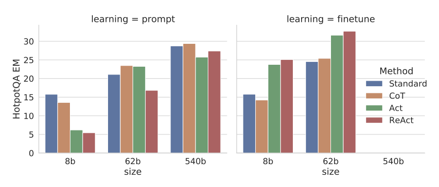

*Figure: HotpotQA EM for prompting vs. finetuning (reproduction of Yao et al., Figure 3).*

**Table 2** in the paper manually labels success and failure modes on a random HotpotQA sample for ReAct versus CoT; the scan below reproduces their table.

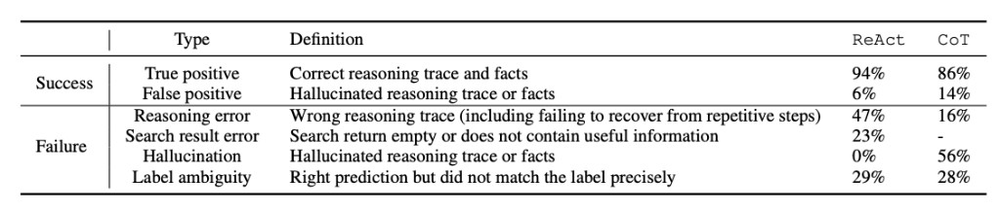

*Figure: HotpotQA failure taxonomy (reproduction of Yao et al., Table 2).*

On ALFWorld, the paper evaluates 134 held-out text games with task-specific prompts, where ReAct’s explicit thoughts improve over action-only prompting and imitation baselines.
**Table 3** reports per-task success rates (percent), including **ReAct (avg)** over six prompts, **ReAct-IM** (Inner Monologue–style ablation), and **BUTLER** baselines; the figure matches the published grid.

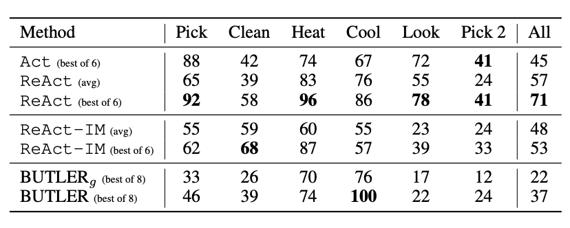

*Figure: ALFWorld task success rates (reproduction of Yao et al., Table 3).*

On WebShop (500 test instructions), the paper reports average score and strict success rate (SR) against IL and IL+RL agents from Yao et al. (2022); the scan reproduces **Table 4**.

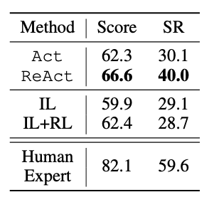

*Figure: WebShop score and success rate (reproduction of Yao et al., Table 4).*

Performance is measured using task-specific metrics such as answer accuracy and success rate.
The results show that ReAct improves both accuracy and interpretability, as the reasoning process can be traced through the sequence of thoughts and actions.
Importantly, the method allows for error correction, as incorrect reasoning can be revised in subsequent steps based on new observations.
This distinguishes ReAct from Chain-of-Thought, where errors in early reasoning steps cannot be corrected once generated.

Despite these advantages, the method introduces additional computational overhead, as each reasoning step requires a separate model invocation and potentially an external API call.
The effectiveness of the approach also depends heavily on the reliability of the external environment, as incorrect or irrelevant observations can mislead the reasoning process.
Nevertheless, ReAct demonstrates that reasoning can be significantly improved by structuring inference as an interactive process rather than a static generation task.

## Load-Bearing Assumptions

ReAct’s performance depends on a set of critical assumptions about the interaction between the language model, the prompting strategy, and the external environment.
The most fundamental assumption is that external tools provide accurate, relevant, and sufficiently complete information to support reasoning.
In tasks such as HotPotQA and FEVER, this corresponds to the assumption that Wikipedia retrieval returns the correct documents needed for multi-hop reasoning.
If retrieval is noisy, incomplete, or misleading, the model’s reasoning trajectory can be corrupted early, and because ReAct conditions each subsequent step on prior observations, these errors may propagate throughout the entire reasoning process.
Unlike Chain-of-Thought prompting, where errors are internal to the model, ReAct introduces an external dependency that can amplify failure modes.

A second assumption is that few-shot prompting is sufficient to induce a stable and generalizable reasoning-and-action policy when weights stay frozen, which is the regime the paper stresses for its largest models.
The prompt provides demonstrations of Thought → Action → Observation trajectories, effectively encoding a policy for when to reason and when to act.
If one does not adopt the paper’s auxiliary finetuning stage, that policy is inferred through in-context learning rather than through gradient updates on the interaction format itself.
This means that the model’s behavior is highly sensitive to the structure, wording, and diversity of the prompt examples.
Small variations in prompt design can lead to significantly different reasoning trajectories, raising concerns about reproducibility and robustness across domains.
Additionally, the prompt is typically constructed for a specific task distribution, and there is no guarantee that the induced policy will generalize to new tasks or environments with different dynamics.

Another assumption is that the model can correctly interpret and integrate observations into its reasoning process.
Observations returned by tools are typically unstructured natural language, which the model must parse and incorporate into subsequent reasoning steps.
This requires strong alignment between the format of tool outputs and the model’s language understanding capabilities.
If observations are ambiguous, contain irrelevant information, or require complex interpretation, the model may fail to update its reasoning correctly.
This is particularly important in multi-hop reasoning tasks, where each step depends on accurately extracting and combining information from previous observations.

ReAct also implicitly assumes that reasoning can be effectively decomposed into a sequence of independent steps, each consisting of a thought and an action.
This sequential decomposition is well-suited for tasks such as retrieval-based question answering and interactive environments, but may not align with tasks that require global reasoning or holistic planning.
For example, in mathematical reasoning tasks, where correctness depends on precise multi-step computation, the lack of explicit symbolic structure limits the effectiveness of the approach.
ReAct does not inherently provide mechanisms for exact computation, and therefore relies on external tools to achieve high accuracy in such settings.

Another load-bearing assumption is that action selection can be learned implicitly through prompting rather than explicitly optimized.
The model must decide when to act, which action to take, and when to terminate the reasoning process, all based on patterns observed in the prompt.
Without an explicitly learned policy or objective function guiding these decisions, the model may exhibit inconsistent or suboptimal behavior, particularly in unfamiliar contexts.
This contrasts with reinforcement learning approaches, where action policies are directly optimized for task performance.

Finally, ReAct assumes that the computational and latency costs of sequential reasoning are acceptable.
Each reasoning step requires a separate model invocation and, in many cases, an external API call.
This can significantly increase inference time compared to standard prompting methods.
While this overhead is manageable in offline or research settings, it may pose challenges for real-time applications or large-scale deployment.
The approach therefore assumes that the benefits of improved reasoning accuracy outweigh the costs of increased computational complexity.

These assumptions highlight that ReAct’s effectiveness depends not only on the capabilities of the language model, but also on the reliability of external tools, the quality of prompt design, and the alignment between reasoning structure and task requirements.
While the method demonstrates that interaction can improve reasoning robustness, it also introduces new dependencies that must be carefully managed in practice.

## Limitations

Despite its strong empirical performance, ReAct introduces several fundamental limitations that affect both scalability and robustness, particularly when viewed as a general framework for reasoning in language models.
The most immediate limitation is its dependence on external tools, such as Wikipedia search APIs, which introduces variability and instability into the reasoning process.
In tasks like HotPotQA and FEVER, the correctness of the final answer is tightly coupled to the quality of retrieved documents.
If retrieval results are incomplete, irrelevant, or misleading, the model’s reasoning trajectory can be corrupted early, and because ReAct conditions each step on previous observations, these errors can propagate and compound across multiple steps.
This creates a failure mode that is distinct from standard Chain-of-Thought errors, as it combines both model misreasoning and external system noise.

A second limitation is the reliance on few-shot prompting whenever one stays in the frozen-weight regime that the paper highlights for PaLM-540B and GPT-3.
Unlike reinforcement learning, which can optimize long-horizon returns, that prompt-only setup encodes the reasoning-and-action policy in demonstrations rather than in reward-shaped updates, and it remains highly sensitive to prompt structure, wording, and diversity of examples.
The paper’s finetuned smaller models partially relieve that dependence but still inherit data and objective limitations from bootstrapping off the same prompts.
Additionally, the prompt is typically tailored to a specific task distribution, and there is no guarantee that the induced behavior will generalize to new domains or environments.

Another limitation lies in the absence of an explicit reward-based optimization objective for action selection in the setups Yao et al. emphasize.
The model must implicitly learn when to act, which action to take, and when to terminate the reasoning process, all through in-context examples when weights are frozen.
The auxiliary finetuning stage still trains on teacher-forced trajectories rather than on task reward, so the system does not directly optimize long-horizon success the way reinforcement learning would.
As a result, it may take unnecessary actions, fail to explore relevant information, or terminate prematurely.
This is particularly problematic in more complex environments, such as ALFWorld and WebShop, where reasoning requires multi-step planning and decision-making.

ReAct’s improvements are primarily in retrieval-based and interactive reasoning, rather than mathematical or symbolic reasoning.
While the method reduces hallucination by grounding reasoning in external evidence, it does not inherently improve the model’s ability to perform precise computation.
Without access to tools such as calculators, ReAct still relies on natural language reasoning for arithmetic tasks, which remains error-prone.
Additionally, although the sequence of actions and observations introduces a form of structure, this structure is not formally enforced, and the reasoning process remains largely unstructured compared to program-based approaches like PAL.

The iterative nature of ReAct also introduces significant computational overhead.
Each reasoning step requires a separate model invocation and, in many cases, an external API call.
This increases latency and cost compared to single-pass inference methods such as standard prompting or Chain-of-Thought.
While this overhead is acceptable in research settings, it may limit the practicality of ReAct in real-time applications or large-scale deployments.

Finally, the evaluation in the paper focuses primarily on aggregate metrics such as accuracy and task success rate, without providing a detailed analysis of failure modes or reasoning trajectories.
This makes it difficult to understand how and why the method fails in certain cases, particularly under noisy or adversarial conditions.
Overall, these limitations suggest that while ReAct is an important step toward interactive reasoning, it is not yet a fully scalable or general solution.

## Future work

Yao et al. chiefly use few-shot prompting on frozen checkpoints, together with multi-step inference, tool calls, and an optional small-scale finetuning study on smaller PaLM models.

A next step for ReAct is to move from prompt-induced behavior to learned policies for reasoning and action selection.
One promising direction is to integrate reinforcement learning, where the model is trained to optimize long-term task performance over sequences of Thought → Action → Observation steps.
This would allow the model to learn when to act, which actions to take, and how to balance exploration and exploitation, rather than relying on fixed prompt demonstrations.
Such an approach could significantly improve generalization to new tasks and environments.

Another important direction is to incorporate uncertainty estimation into the interaction loop.
Currently, ReAct treats all observations as equally reliable, but in practice, retrieved information may be noisy or ambiguous.
By modeling uncertainty, the system could decide when to query additional sources, verify information, or revise previous reasoning steps.
This would make the reasoning process more robust, particularly in open-domain settings where information quality varies.

Scaling ReAct to more complex environments is also a critical area for future work.
While the paper demonstrates success in relatively constrained settings such as HotPotQA and simulated environments, real-world tasks often involve larger action spaces, longer horizons, and partial observability.
Extending the framework to handle these challenges would require more sophisticated planning and memory mechanisms, potentially drawing from research in reinforcement learning and decision-making.

Another direction is to integrate ReAct with methods that learn tool usage, such as Toolformer.
In such a hybrid system, the model could learn when to invoke tools during training, while still using an interactive reasoning loop at inference time.
This would combine the strengths of learned tool selection with dynamic feedback, enabling more efficient and adaptive reasoning.
Similarly, integrating ReAct with program-based approaches like PAL could introduce more structured forms of reasoning, allowing the model to switch between natural language reasoning, tool use, and symbolic execution depending on the task.

Future work could also explore how to extend ReAct to better support mathematical and symbolic reasoning.
This might involve incorporating specialized tools for computation or developing intermediate representations that enforce structure in reasoning steps.
Finally, expanding evaluation to include more diverse and challenging benchmarks, along with detailed analysis of reasoning trajectories and failure cases, would provide a clearer understanding of the method’s strengths and limitations.

---

# Paper 2: Toolformer

## Summary

Toolformer is often summarized as letting a language model teach itself tool use.
The evaluated system is nevertheless **supervised finetuning** of **pretrained GPT-J (6.7B)**, not the frozen checkpoint alone.
Schick et al. sample API call candidates on **CCNet** text, execute real tools, and keep only calls that reduce next-token loss on the continuation.
They then **finetune GPT-J** on the resulting corpus so tool invocations become part of the weight-level policy.
Unlike ReAct, that capability is installed during **training**, not only at inference time through prompts.
Downstream numbers focus on arithmetic, factual, and related zero-shot tasks.
The paper also reports language modeling perplexity on plain text to show the finetuned model does not forget how to behave as an LM.

## Method Dissection: Self-Supervised API Learning

Toolformer extends the standard language modeling paradigm by introducing tool usage as a learned behavior during training, rather than an externally imposed prompting strategy at inference time.
The core idea is to augment training data with tool calls that improve the model’s ability to predict future tokens.
Schick et al. spell out the **CCNet** starting text and **per-tool sampling heuristics**.
The paper defines a **perplexity gate** and per-tool thresholds $\tau_f$ that accept or reject calls; this is not task-reward hill climbing.
Reported metrics are mostly **zero-shot** QA, temporal probes, math, multilingual items, plus **LM perplexity** controls on plain text.
Their limitations double as a **failure catalogue** (no tool chains, single-shot search, sparse calculator positives, API-agnostic filter).
The subsections below unpack each layer before contrasting that 2023 setup with **Claude Code**-class IDE agents.

### Dataset construction and API surface

Schick et al. visualize the full loop from a CCNet span through sampled API calls, tool execution, **perplexity-based filtering**, and the final augmented string that becomes supervision for finetuning.

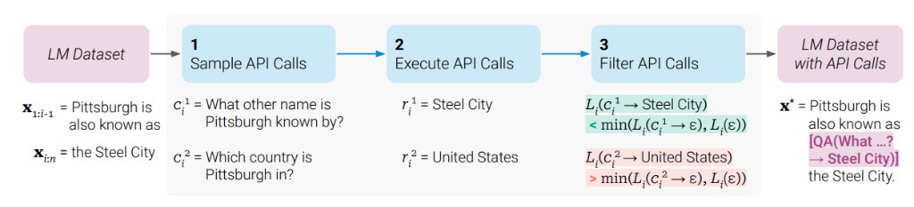

*Figure: Self-supervised Toolformer dataset construction (reproduction of Schick et al., Figure 2).*

The paper instantiates a fixed tool set with simple string I/O; the scan reproduces their worked examples (**Table 1**).

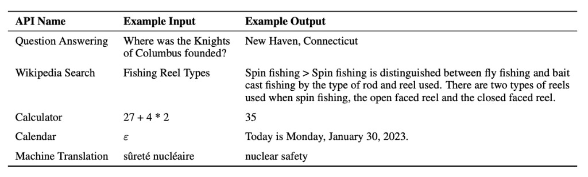

*Figure: Example Toolformer APIs (reproduction of Schick et al., Table 1).*

### The Filtering Heuristic

For any API call $c$ and its result $r$, Toolformer only retains the call in the training data if it reduces the weighted cross-entropy loss $L$ for the subsequent tokens $x_i \dots x_n$:

$$
L_i(z) = - \sum_{j=i}^{n} w_{j-i} \cdot \log p_M(x_j \mid z, x_{1:j-1})
$$

The model is fine-tuned to generate the call $c$ only if:

$$
L_i^+ = L_i(e(c_i, r_i))
$$

$$
L_i^- = \min \big( L_i(\epsilon),\; L_i(e(c_i, \epsilon)) \big)
$$

where $\epsilon$ is the loss of the sequence without any tool call.
This ensures the model learns a statistical policy for tool use based on predictive gain.
The pipeline begins with **pretrained GPT-J (6.7B)**, which is used to propose candidate locations where a tool call might be useful.
For each candidate position, the model generates a potential tool invocation, such as a calculator query or a search API call.
The tool is then executed, and its output is inserted into the sequence.
The key filtering step evaluates whether this augmented sequence improves the likelihood of the ground-truth continuation compared to the original sequence without the tool call.

Only tool invocations that improve likelihood are retained, creating a filtered dataset that serves as implicit supervision for tool usage.
This process effectively teaches the model both *when* to use a tool and *how* to incorporate its output into the surrounding text.
Unlike the prompt-only ReAct runs for PaLM-540B and GPT-3 in Yao et al., Toolformer internalizes tool use through fine-tuning on filtered LM data (Schick et al.).
As a result, the model can invoke tools in a zero-shot setting without explicit instruction.

### Training corpus, filtering, and relation to “hill climbing”

Schick et al. build the augmented corpus from a **subset of CCNet** plain text, using **GPT-J (6.7B)** as both the proposal model and the model that is later finetuned on the filtered data.
They first use a few human-written demonstrations per API so the LM can **sample many candidate calls** at sampled positions, **execute** them, then **discard** any call whose insertion does not beat a no-call baseline on the weighted LM loss over following tokens.
Per-tool thresholds $\tau_f$ control how aggressively calls are pruned; Table 2 in the paper shows that stricter thresholds keep fewer examples (for instance, useful calculator calls drop from thousands to hundreds as $\tau_f$ tightens).

This procedure is **not** gradient-based hill climbing on a task reward.
It is closer to **greedy, self-supervised data selection**: each kept call is a local improvement to next-token loss on that document, not a guarantee of downstream correctness or global optimality.
The paper notes that filtering **changes the data distribution** and assumes the remainder stays close enough to preserve core LM ability, which they check with perplexity on WikiText-103 and a 10k-sample CCNet subset.

### Evaluation protocol

Downstream evaluation is **zero-shot prompting** without task-specific in-context tool demonstrations, unlike much prior tool-learning work.
Reported tasks include closed-book QA (e.g., Natural Questions, TriviaQA, WebQuestions), temporal and factual probes (LAMA variants, TEMPLAMA), math-style benchmarks, multilingual Winograd, and perplexity checks so that tool learning does not destroy general LM quality.
At decode time Schick et al. also bias the model toward actually firing tools by allowing an API span to start whenever it is among the **k = 10** most likely next-token continuations instead of only the greedy argmax, which changes observed tool usage relative to plain greedy decoding.
Baselines include plain GPT-J, GPT-J finetuned on the same CCNet text **without** API inserts (“GPT-J + CC”), and comparisons to much larger models such as OPT-66B and GPT-3 on selected tasks.

The **SQuAD**, **Google-RE**, and **T-REx** columns are **LAMA** probe accuracies (Petroni et al.); Schick et al. block Wikipedia search on those splits so the model cannot read out the same Wikipedia sentences the probes were mined from.
**Toolformer (disabled)** is the same finetuned checkpoint evaluated with tools switched off at decode time.
The scan reproduces **Table 3** (LAMA subsets).

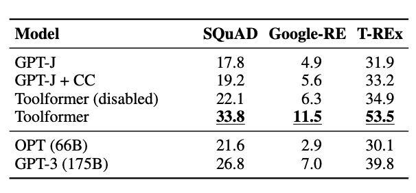

*Figure: Factual QA / LAMA-style scores (reproduction of Schick et al., Table 3).*

On math word problems, the same pattern holds: enabling the calculator and search heads in **Toolformer** dominates GPT-J baselines and larger frozen LMs on **ASDiv**, **SVAMP**, and **MAWPS**.
The scan reproduces **Table 4**.

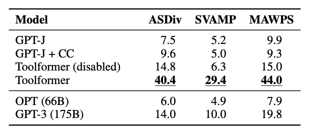

*Figure: Math reasoning scores (reproduction of Schick et al., Table 4).*

### Failure modes and limits of the fine-tuning recipe

The authors highlight concrete failure modes that matter for reviewers comparing early tool learning to modern agents.
**No tool chains:** API calls for different tools are generated independently, so the finetuning data rarely teaches **multi-hop tool pipelines** (passing one tool’s output into another).
**Non-interactive tools:** search is a single shot; the model cannot browse, reformulate queries, or recover from noisy SERPs the way WebGPT-style or ReAct-style loops do.
**Input sensitivity:** like many LMs, the policy is brittle to paraphrases when deciding whether to call an API.
**Sample inefficiency:** processing over a million documents can yield only a small set of surviving calculator calls, so the calculator head sees sparse supervision.
**No cost model:** the filter ignores latency, rate limits, or dollar cost of real APIs.

These limits are partly why early Toolformer-style **self-supervised LM-loss filtering** is best read as a proof of concept that LMs can **stably emit** tool syntax, while systems such as **Claude Code** (and other IDE agents) sit on a different stack: **long-horizon orchestration**, **filesystem and shell tools**, **human preference and task-specific finetuning**, and emerging **tool-description standards** (e.g., Model Context Protocol) that were not part of the 2023 Toolformer benchmark suite.

Toolformer improves mathematical reasoning by delegating computation to external tools such as calculators, which provide exact results.
This eliminates the need for the model to approximate arithmetic operations through token prediction, which is a common source of error in Chain-of-Thought reasoning.
However, the method does not construct explicit reasoning structures such as programs or action sequences.
Instead, tool usage is embedded within natural language, making the reasoning process implicit rather than explicitly symbolic.
The approach is most effective for single-step reasoning tasks, where a single tool call can resolve the computation.
Experimental results show improved performance on arithmetic and factual question answering tasks, demonstrating that learned tool usage can enhance reasoning without requiring architectural changes.

## Load-Bearing Assumptions

Toolformer’s effectiveness relies on several key assumptions that underpin its training and evaluation methodology.
The most critical assumption is that improvements in next-token prediction likelihood correspond to improvements in reasoning quality.
This assumption allows the model to use likelihood as a proxy signal for determining whether a tool call is beneficial.
However, likelihood is a local objective that does not necessarily capture global correctness, particularly in multi-step reasoning tasks.
A tool call that improves token prediction in the short term may not lead to a correct final answer.

Another important assumption is that the set of predefined tools used during training is sufficient to cover the types of reasoning required at inference time.
Toolformer does not learn to discover or adapt to new tools dynamically; instead, it operates within a fixed set of APIs such as calculators and search engines.
This constrains its ability to generalize to new domains where different forms of computation may be required.
The method also assumes that tool outputs can be seamlessly integrated into natural language sequences without introducing ambiguity or formatting inconsistencies.
In practice, mismatches between tool outputs and textual context can lead to degraded performance.

Additionally, Toolformer assumes that single-step tool usage is sufficient for improving reasoning.
The training process does not explicitly model sequences of tool calls or multi-step reasoning chains, which limits its ability to handle more complex tasks.
The data augmentation pipeline itself relies on heuristic sampling and filtering, which introduces potential biases in the training data.
Finally, the approach assumes that fine-tuning on augmented data is sufficient to generalize tool usage behavior across tasks, without requiring task-specific supervision.

## Limitations

Despite its elegant formulation, Toolformer exhibits several limitations that constrain its impact on reasoning more broadly.
The most significant limitation is the reliance on likelihood-based filtering as a proxy for reasoning quality.
While this signal is effective for improving local token prediction, it does not guarantee correctness of the final output.
This creates a mismatch between the training objective and the desired behavior, particularly in tasks requiring multi-step reasoning or global consistency.
As a result, Toolformer may learn to use tools in ways that improve fluency rather than correctness.

Another limitation is the restriction to predefined tools.
The model cannot dynamically discover or adapt to new tools, which limits its flexibility and scalability in real-world applications.
The approach also primarily supports single-step tool usage, meaning it lacks the ability to compose multiple tool calls into a coherent reasoning chain.
This is a significant limitation compared to approaches like ReAct, which explicitly model multi-step interaction, or PAL, which constructs structured programs.

From a reasoning perspective, Toolformer improves mathematical reasoning through exact computation, but it does not significantly enhance symbolic reasoning.
The model does not produce structured representations such as programs or logical forms, and therefore lacks the ability to enforce constraints on reasoning steps.
Additionally, the training process is computationally expensive, as it requires executing tools for many candidate sequences during data generation.
The evaluation in the paper is also relatively narrow, focusing on arithmetic and factual tasks, which may not reflect performance on more complex reasoning benchmarks.
Finally, the method does not provide strong interpretability, as tool usage is embedded within natural language rather than explicitly structured.

Taken together, those bullets describe one higher-level issue: **reasoning control in Toolformer stays implicit inside the LM**.
Tool calls are linearized into ordinary text, gated by a **local** likelihood surrogate, constrained to a **fixed** tool menu, and rarely **composed** into inspectable multi-step workflows, so the model never manipulates an explicit plan graph the way PAL-style programs or ReAct-style Thought–Action traces do.
Until control becomes **explicit and checkable**, improvements risk tracking **fluency-shaped tool inserts** more than **reliable long-horizon reasoning**.

## The Next 10,000 GPU-Hour Experiment

A next step for Toolformer is to extend its framework to support multi-step reasoning and more flexible tool usage.
One promising direction is to train the model to generate sequences of tool calls, rather than single invocations, enabling it to perform more complex reasoning tasks that require iterative computation.
This could involve augmenting the training objective to account for longer-term dependencies, rather than relying solely on local likelihood improvements.

Another important direction is dynamic tool discovery, where the model learns to identify and integrate new tools without explicit supervision.
This would significantly improve the scalability of the approach, allowing it to adapt to new domains and tasks.
Integrating Toolformer with interaction-based methods such as ReAct could also enable richer reasoning behaviors, combining learned tool usage with dynamic feedback loops.
For example, a model could use Toolformer to learn when to call tools and ReAct to determine how to sequence those calls in a multi-step process.

Incorporating structured representations such as programs or graphs could enhance the model’s ability to perform complex reasoning.
This would bridge the gap between Toolformer and approaches like PAL, enabling both learned tool usage and explicit reasoning structure.
Finally, expanding evaluation to more diverse benchmarks, including multi-hop reasoning and planning tasks, would provide a clearer picture of the method’s strengths and limitations.
These directions suggest that Toolformer is a strong foundation, but not a complete solution for scaling reasoning in language models.

---

# Paper 3: PAL (Program-Aided Language Models)

## Summary

PAL introduces a framework for solving mathematical reasoning tasks by generating executable programs instead of natural language reasoning.
Chain-of-Thought requires models to simulate computation internally, which can lead to errors.
PAL externalizes computation by generating code executed in an interpreter.
The method uses models such as Codex and GPT-3 and evaluates on GSM8K.
Results show improved accuracy due to precise execution.
The approach demonstrates that symbolic reasoning via programs is more reliable than natural language reasoning for structured tasks.

## Method Dissection: Symbolic Offloading

PAL reframes reasoning as a two-stage process consisting of program synthesis followed by program execution, rather than relying on natural language reasoning alone.
Instead of approximating arithmetic or logical operations through token prediction, the model delegates these operations to a symbolic interpreter, which guarantees correctness when the program is valid.
The prompting strategy is few-shot, where the model is provided with examples that map natural language problems to executable Python code.
These demonstrations are critical, as they teach the model how to structure control flow, define variables, and decompose problems into computational steps.
The primary model used in the paper is Codex, which has been pretrained on large-scale code corpora and is therefore well-suited for program generation tasks.
GPT-3 variants are also evaluated, though they are generally less reliable for producing syntactically correct code.

The model is prompted to generate:
1. Comments: High-level natural language reasoning.
2. Code: The programmatic implementation of that reasoning.

The answer $y$ is not generated by the model, but by the interpreter:

$$
y = \text{Interpreter}(\text{LLM}(\text{code} \mid \text{input}))
$$

This creates a deterministic boundary where the Information Decay is purely a factor of code-generation accuracy (syntax) rather than calculation ability.

Gao et al. treat **Codex** (`code-davinci-002`) as the primary backend: a **code-pretrained** decoder whose prior matches PAL’s “emit Python” interface far better than the text-only GPT-3 variants they also report.
Headline GSM8K-style numbers should therefore be read as **Codex plus an interpreter**, not as a claim that any frozen LM of equal parameter count would get the same lift without a strong coder backbone.

Effectiveness is demonstrated **few-shot**: fixed in-context exemplars pair word problems with comment–code programs, the model **greedily** decodes one program (temperature zero in the paper’s main setup), Python executes it, and scores are **functional checks** of the runtime output against dataset labels.
The paper aggregates roughly **thirteen** math, symbolic, and algorithmic suites, including **GSM8K**, MAWPS-family splits, **SVAMP**, **ASDiv**, the **GSM-HARD** variant with large literals, and selected **BIG-Bench Hard** puzzles.
PAL with Codex **beats** CoT on the same backbone on those tabulations and, on headline math rows, can **outrank** much larger CoT models such as **PaLM-540B**.

Largest gains track settings where **exact numeric execution** dominates: on **GSM8K** the paper reports **72.0%** top-1 PAL versus **56.9%** CoT **PaLM-540B**, and on **GSM-HARD** direct and CoT accuracies **collapse** while interpreter-backed PAL stays comparatively **stable**.
Selected symbolic BBH tasks such as **COLORED OBJECTS** and **PENGUINS** show **double-digit** point lifts over strong Codex CoT in the same table groupings.

The GSM8K charts below summarize Gao et al.: on **code** checkpoints, PAL’s interpreter-backed answers improve solve rate over CoT at every scale they plot, with the largest gap on mid-sized `code-davinci-001`.
On **text** checkpoints the story is non-monotonic: PAL lags CoT on `text-davinci-001` but overtakes it once `text-davinci-002` and `text-davinci-003` gain enough latent coding competence to emit runnable programs.

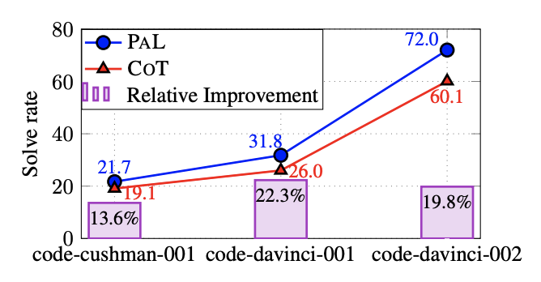

*Figure: GSM8K solve rate on OpenAI code models, PAL vs. CoT (reproduction of Gao et al.).*

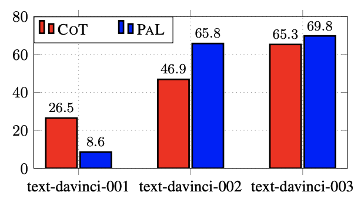

*Figure: GSM8K accuracy on OpenAI text models, PAL vs. CoT (reproduction of Gao et al.).*

On symbolic **BIG-Bench Hard** slices (**Colored Objects**, **Date**, **Penguins**), PAL again beats CoT, and the yellow and green bars show that removing natural-language comments or descriptive variable names from generated programs cuts accuracy—sometimes below the CoT baseline—so the NL scaffolding is load-bearing rather than cosmetic.

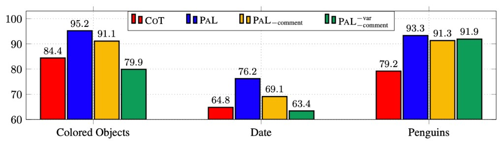

*Figure: BIG-Bench Hard symbolic tasks: PAL vs. CoT and ablations without comments or descriptive variable names (reproduction of Gao et al.).*

PAL **does not** finetune on a blended corpus of “tool” versus “non-tool” documents the way Toolformer does.
The only deliberate **mix** is **prompt-level**: exemplars interleave **natural-language comments** for intent with **executable code** for operations, so contextualized reading stays in the LM while **deeper** computation is delegated to the **runtime** rather than to a second training phase on mixed web data.
This is an important distinction, as it shifts evaluation from language modeling quality to functional correctness.
Compared to Chain-of-Thought prompting, which generates intermediate reasoning steps in natural language, PAL enforces a structured and executable representation of reasoning.
This results in improved accuracy, particularly for multi-step arithmetic problems where internal simulation often fails.
In terms of reasoning type, PAL represents the most explicit form of symbolic reasoning among the approaches considered, as it constructs formal programs that can be verified through execution.
This makes it particularly strong for mathematical reasoning tasks, but also introduces dependencies on the correctness of program generation.

## Load-Bearing Assumptions

PAL relies on several critical assumptions that enable its performance gains but also constrain its applicability.
The most important assumption is that the language model is capable of generating syntactically correct and semantically valid programs.
This is non-trivial, as program generation requires adherence to strict syntax rules, correct variable usage, and proper control flow.
While models like Codex are specifically trained on code and perform well in this setting, general-purpose language models may struggle to meet these requirements consistently.
Another key assumption is that the problem domain can be naturally expressed as executable code.
This holds for many mathematical reasoning tasks, such as those in GSM8K, but does not generalize to open-ended reasoning problems involving commonsense, ambiguity, or subjective judgment.

The approach also assumes that deterministic execution is sufficient to capture the reasoning process.
Once a program is generated, its execution produces a single output without uncertainty, even if the underlying reasoning is flawed.
This contrasts with probabilistic reasoning approaches that can represent multiple candidate solutions.
Additionally, PAL depends on the availability of a reliable execution environment, typically a Python interpreter, which introduces external system dependencies.
The method further assumes that few-shot prompting is sufficient to teach the mapping from natural language to programs, without requiring fine-tuning.
While this works well in the evaluated benchmarks, it may not generalize to more complex programming tasks.
These assumptions collectively enable PAL’s strong performance but also define the boundaries of where it can be applied effectively.

## Limitations

Despite its strong performance on mathematical reasoning tasks, PAL exhibits several important limitations that affect its robustness and generality.
The most significant limitation is its sensitivity to program generation errors.
Unlike natural language reasoning, where small mistakes may still lead to partially correct answers, errors in generated code often result in complete failure, either through syntax errors or incorrect execution.
This creates a brittle failure mode where the entire reasoning process collapses if any part of the program is incorrect.
Additionally, while PAL excels at mathematical reasoning, it is not well-suited for tasks that cannot be easily expressed as programs.
Open-ended reasoning tasks, such as those involving commonsense or qualitative judgment, do not naturally map to executable code, limiting the method’s applicability.

Another limitation is the lack of interpretability in intermediate reasoning steps.
While the final program is interpretable, the model’s internal process for generating that program is not explicitly represented, making it difficult to diagnose errors.
The approach also does not model uncertainty or alternative reasoning paths, as execution produces a single deterministic output.
Furthermore, PAL relies on external interpreters, which introduces dependencies on execution environments and raises potential issues related to security and reproducibility.
The evaluation in the paper is primarily focused on mathematical benchmarks such as GSM8K, which may overstate its general reasoning capabilities.
Finally, the method does not integrate well with other forms of reasoning, such as retrieval or interaction, limiting its effectiveness as a standalone solution in more complex settings.

## The Next 10,000 GPU-Hour Experiment

An extension of PAL would involve improving the reliability and flexibility of program generation through additional training and system design.
One promising direction is to incorporate reinforcement learning or execution-based feedback, where the model is trained to generate programs that not only compile but also produce correct outputs.
This could reduce the brittleness associated with syntax and semantic errors.
Another avenue is to extend PAL beyond simple, single-function programs to more complex program structures involving loops, conditionals, and modular components, enabling it to handle more sophisticated reasoning tasks.

Additionally, integrating PAL with tool-based and interactive approaches could create hybrid reasoning systems that combine the strengths of multiple paradigms.
For example, a model could use ReAct-style interaction to gather information, Toolformer-style tool usage for computation, and PAL-style program execution for precise reasoning.
This would allow the system to handle a broader range of tasks, from knowledge retrieval to mathematical problem solving.
Another important direction is to explore how program-based reasoning can be applied beyond mathematics, potentially by developing new intermediate representations that capture symbolic structure without requiring full program synthesis.
Finally, scaling experiments to more diverse benchmarks would provide a better understanding of the method’s generalization capabilities and limitations.

---

# Comparison

Mathematical reasoning refers to the ability of a system to perform precise numerical computation, multi-step arithmetic, and quantitative problem solving, as evaluated on benchmarks such as GSM8K.
In standard language models, this is approximated through token prediction, which often leads to errors in intermediate calculations.
Methods that improve mathematical reasoning typically do so by delegating computation to systems that guarantee correctness, such as calculators or program execution environments.

Symbolic reasoning refers to the manipulation of structured representations such as variables, logical relationships, or programs.
Unlike natural language reasoning, symbolic reasoning enforces constraints on how operations are performed, often leading to more reliable and interpretable outputs.
Approaches that explicitly represent reasoning as programs or structured actions exhibit stronger symbolic reasoning capabilities than those relying purely on natural language.

| Paper      | Models Used           | Benchmarks / Tasks                      | Reasoning Type           | Math Strength | Symbolic Reasoning | Key Strength                                           | Key Limitation                         |
|------------|----------------------|-----------------------------------------|--------------------------|--------------|--------------------|--------------------------------------------------------|----------------------------------------|
| ReAct      | PaLM-540B, GPT-3     | HotPotQA, FEVER, ALFWorld, WebShop      | Interactive + CoT         | Medium       | Implicit           | Dynamic reasoning with external feedback               | Sensitive to tool reliability          |
| Toolformer | GPT-J (fine-tuned)   | Arithmetic tasks, QA benchmarks         | Tool-augmented LM         | High         | Minimal            | Learns when to use tools during training               | Limited to single-step tool usage      |
| PAL        | Codex, GPT-3         | GSM8K, math reasoning benchmarks        | Program-based execution   | Very High    | Explicit           | Exact computation via executable programs              | Fails if code generation is incorrect  |

---

## Conclusion

ReAct demonstrates that reasoning improves when models can interact with external environments, but it does not fundamentally solve mathematical reasoning.
While it can retrieve information and update reasoning dynamically, it still relies on natural language for computation, which limits precision.
Its symbolic reasoning is implicit, as actions resemble operations but are not formally structured.

Toolformer improves mathematical reasoning by introducing external computation through tools such as calculators.
Because these tools return exact results, the model avoids common arithmetic errors.
However, Toolformer does not represent reasoning as a structured sequence of operations, and its symbolic reasoning remains minimal.
It learns when to call tools, but not how to compose them into multi-step reasoning processes.

PAL represents the strongest form of both mathematical and symbolic reasoning among the three approaches.
By translating problems into executable programs, it enforces a structured reasoning process and guarantees correct computation when the program is valid.
This makes it particularly effective for tasks like GSM8K, where precise arithmetic is required.
However, this strength comes at the cost of flexibility, as the method depends on the model’s ability to generate correct code and is less applicable to open-ended reasoning tasks.

Reasoning performance improves when computation is externalized rather than simulated internally.
Each method represents a different level of this externalization.
ReAct introduces interaction, Toolformer introduces learned tool usage, and PAL introduces full symbolic execution.
The progression suggests that scaling reasoning is not simply a matter of larger models, but of designing systems that integrate neural generation with reliable external computation.

This implies that future advances in reasoning will likely come from hybrid systems that combine interaction, tool use, and symbolic execution, rather than relying on scaling alone.

# References

1. Shunyu Yao et al., "ReAct: Synergizing Reasoning and Acting in Language Models", ICLR 2023.
   https://arxiv.org/pdf/2210.03629
2. Timo Schick et al., "Toolformer: Language Models Can Teach Themselves to Use Tools", 2023.
   https://arxiv.org/pdf/2302.04761
3. Luyu Gao et al., "PAL: Program-aided Language Models", 2023.
   https://arxiv.org/pdf/2211.10435