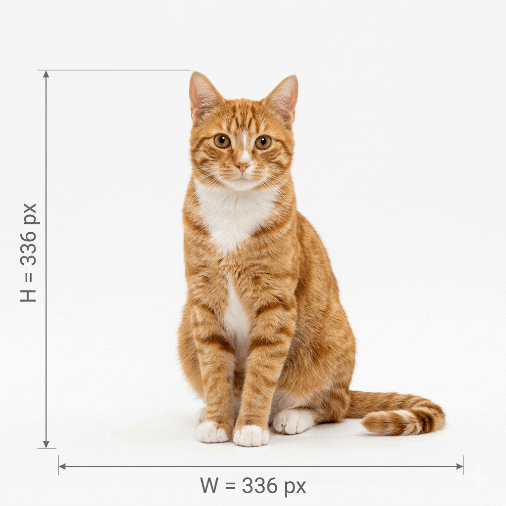

# Multi-Modality Evolution (LLaVA to Qwen3-VL)

## Introduction: The Multimodal Trajectory (2023–2025)

[LLaVA (2023)](#ref-llava-1) demonstrated that GPT-4 can bootstrap multimodal instruction data without human labeling, projecting [CLIP](#ref-clip) features into the LLM's token space.
**[Prismatic](#ref-prismatic)** (2024) audited the design space and fused semantic ([SigLIP](#ref-siglip)) and geometric ([DINOv2](#ref-dinov2)) encoders to reduce information decay at the vision-language interface.
**[Qwen3-VL](#ref-qwen3vl)** (2024) pushes this further: a unified multimodal token stream for text, images, and video at 256K-native context, with a "thinking mode" (CoT reasoning activated via SFT, then refined through RL).

---

## Part I. LLaVA: Visual Instruction Tuning

### Problem Domain & Taxonomy

#### Context

Before 2023, vision-language alignment was bottlenecked by data cost.
The dominant recipe required either expensive annotation pipelines or narrow domain-specific datasets.
LLaVA's contribution is to replace that bottleneck entirely: given a language-only GPT-4 and text descriptions of an image ([COCO](#ref-coco) captions and bounding boxes), the model bootstraps multimodal instruction-following data **without any human labeling of the instruction set**.
The resulting **LLaVA-Instruct-158K** corpus became the template the modern VLM field inherits.

**The pipeline.**
GPT-4 never sees the image.
Each image's COCO caption(s) and bounding-box annotations are serialized into text and passed to GPT-4 with a small set of seed in-context examples; GPT-4 then generates instruction-following data *as if* it had viewed the image.
Three response types are collected, totaling **158K samples**:

- **Conversation (~58K)** — multi-turn Q&A about visible content.
- **Detailed description (~23K)** — paragraph-length descriptions.
- **Complex reasoning (~77K)** — multi-step reasoning chaining visual facts.

#### Taxonomy of Approaches

LLaVA sits in one of three families of vision-language fusion that coalesced around 2023.
The families differ in how visual features enter the language model:

| Family | Representative | Fusion mechanism | Trade-off |
|--------|----------------|------------------|-----------|
| Cross-attention | Flamingo (DeepMind) | Dedicated gated cross-attention layers inserted between LM blocks; LM attends to visual features as a separate key/value stream | Preserves LM capacity; bolted-on — non-uniform with text attention |
| Query-based bottleneck | BLIP-2 (Q-Former) | A small set of learnable query tokens extracts image features via cross-attention, then concatenated as a prefix | Compact (32 tokens); loses spatial detail |
| Patch-as-token concat | **LLaVA**, LLaVA-1.5 | Visual patches projected into LM token space, concatenated directly with text tokens, processed by the LLM's own self-attention | Simple, reuses LM infrastructure; no spatial bottleneck; expensive in tokens (576 per image) |

LLaVA's lineage runs directly into [InstructBLIP](#ref-instructblip), Prismatic's SFT mixture, and Qwen-VL's instruction stage — all inherit the GPT-4-bootstrapped VIT pipeline.
Qwen3-VL (Part III) retains patch-as-token concat as its backbone strategy; Prismatic (Part II) stays inside this family but upgrades the encoder side.

### Comparative Architectural Deep-Dive

#### Objective Functions

LLaVA's training objective is a standard autoregressive language-modeling loss applied to the concatenated `[image-tokens, instruction, response]` sequence:

$$\mathcal{L}_{\text{LLaVA}} = -\sum_{t} \log P_\phi(x_t \mid X_v, X_q, x_{\lt t})$$

In LLaVA-1.5, the parameters $\phi$ being updated are the projection module $W$ and the LLM; the vision encoder stays frozen and its objective is not re-optimized.

But the vision encoder itself was trained under a contrastive objective — CLIP:

$$\mathcal{L}_{\text{CLIP}} = -\log \frac{\exp(\text{sim}(v_i, t_i)/\tau)}{\sum_j \exp(\text{sim}(v_i, t_j)/\tau)}$$

This objective only preserves information useful for matching images to text descriptions, systematically discarding:

- Fine-grained geometric relationships (not typically described in captions)
- Physical properties (friction, mass, transparency)
- Metric scale information
- High-frequency texture details beyond category-level discrimination

We can formalize this information loss.
The mutual information between the raw image $X_v$ and the CLIP features $Z_v$ is bounded by the entropy of the representation:

$$I(X_v; Z_v) \leq H(Z_v) \leq 576 \times 1024 \times \log_2(\text{precision})$$

This upper bound looks generous (576 tokens × 1024 dimensions × bit precision), but the **effective information** is far lower.
CLIP features lie on a low-dimensional manifold shaped by the text-matching objective — the discarded properties above never enter this manifold, and no downstream LM loss can recover them.

#### Backbone Scaling

LLaVA consists of three primary components:

1. **Vision Encoder** $g(\cdot)$: Pre-trained CLIP ViT-L/14-336px (frozen; ~304M params)
2. **Projection Module** $W$: 2-layer MLP (upgraded from a single linear layer in the original LLaVA, improving cross-modal alignment)
3. **Language Model** $f_\phi(\cdot)$: Vicuna-v1.5 (fine-tuned LLaMA-2), 7B or 13B parameters

State space:

- $X_v \in \mathbb{R}^{H \times W \times 3}$: the input image (336×336 for LLaVA-1.5)
- $X_q = (x_1, x_2, \ldots, x_L)$: language instruction (tokenized)
- $Z_v \in \mathbb{R}^{(N_p + 1) \times d_v}$: visual feature representation from CLIP

**Patch calculation.** Both the patch size and input resolution are inherited from the pretrained backbone.
LLaVA-1.5 uses OpenAI's **CLIP ViT-L/14-336px** — a 336×336 fine-tune of CLIP ViT-L/14.
The patch size (`/14`) is fixed by the pretrained weights; 336 is a clean multiple of 14 (336 = 14 × 24), avoiding padding at tokenization.
The higher-resolution checkpoint was chosen for finer-grained visual understanding; Prismatic later systematically ablates this axis (Part II, RQ6) and finds 384px is the sweet spot with diminishing returns beyond.

For ViT-L/14 with patch size $p = 14$ and input resolution 336×336:

$$N_p = \left(\frac{H}{p}\right) \times \left(\frac{W}{p}\right) = \frac{336}{14} \times \frac{336}{14} = 24 \times 24 = 576 \text{ patches}$$

**Training data.** LLaVA-1.5 trains in two stages: (a) a 595K-pair image-caption alignment stage that trains the projector only, and (b) a 665K-sample instruction-tuning stage that unfreezes the LLM.
The 158K LLaVA-Instruct corpus is the core of the instruction-tuning mixture; additional academic-task data (VQAv2, OKVQA, etc.) is folded in to broaden coverage.

#### Interaction Mechanisms

The projection maps visual features to the LLM's embedding space via a 2-layer MLP:

$$H_v = W_2 \cdot \text{GELU}(W_1 \cdot Z_v)$$

where $W_1 \in \mathbb{R}^{1024 \times 4096}$ and $W_2 \in \mathbb{R}^{4096 \times 4096}$.
GELU follows transformer-era defaults (ViT, GPT-2/3, BERT); the LLaVA-1.5 paper doesn't mention GELU or activation choice at all — it's inherited standard practice, not an ablated design decision.

##### [CLS] Token: Why It's Standard, and Why LLaVA Drops It

**What is a learnable token?** In a transformer, tokens are $d$-dimensional embedding vectors.
Text tokens index into a fixed vocabulary; image patch tokens are projected from pixels on-the-fly.
A *special* token like `[CLS]` is a single learnable vector (its own row in the embedding table, updated by gradient descent) prepended to every sequence as a placeholder that attention can write into.

Transformer vision encoders (ViT, CLIP, DINO) prepend `[CLS]` at position 0; it attends to every patch, aggregating a global image-level summary.
In CLIP, the contrastive loss is computed on `[CLS]`, so the encoder is trained to compress image semantics into one vector.

**Why LLaVA drops it.** LLaVA's default `vision_feature_select_strategy="default"` excludes `[CLS]` and feeds only the 576 spatial patch tokens into the LLM:

$$Z_v \in \mathbb{R}^{576 \times 1024}$$

A chat/instruction model doesn't want one global label — it needs many spatially-grounded tokens the LLM can attend to when resolving questions about specific regions ("what's on the left?").
Mechanically: by the final encoder layer, the `[CLS]` vector is a weighted blend of information from all 576 patches, and the spatial index that tells you *which* patches contributed is destroyed by aggregation.
The patch tokens, in contrast, retain position-specific information — each one is still anchored to its 14×14-pixel region of the input.

**Not settled doctrine.** DINOv2 adds *register tokens* to absorb attention-sink artifacts; some ViT variants replace `[CLS]` with global average pooling; Prismatic's SigLIP + DINOv2 fusion sidesteps the question by pulling patch-level features from two encoders with different training objectives.

See **Appendix A** for the token-count arithmetic.

##### The Projection: Dimensionality Without Information

The mapping $W: \mathbb{R}^{1024} \rightarrow \mathbb{R}^{4096}$ appears to increase dimensionality, but this does **not** increase information content.

Three numbers define this step:

- **576** patch tokens (from the 24×24 grid at 336px),
- **1024** CLIP feature dimensions per token,
- **4096** LLM hidden dimensions per token (Vicuna/LLaMA-2).

$W$ is applied **per token**: the visual tensor $Z_v$ has shape (576, 1024) going in, and $H_v$ has shape (576, 4096) coming out.
It *looks* like we gained capacity (4× more coordinates per token), but a linear map can rotate and stretch its input into a larger ambient space — it cannot manufacture new linearly independent directions.
The 576 projected tokens still lie on a (≤)576-dimensional manifold inside $\mathbb{R}^{4096}$; the extra axes are unused.

**Theorem (Rank Bound):** The effective rank of $W \cdot Z_v$ satisfies:

$$\text{rank}(W \cdot Z_v) \leq \min(\text{rank}(W), \text{rank}(Z_v)) \leq \min(1024, 576) = 576$$

*Proof:* For any matrices $A \in \mathbb{R}^{m \times n}$ and $B \in \mathbb{R}^{n \times p}$, $\text{rank}(AB) \leq \min(\text{rank}(A), \text{rank}(B))$.
Since $Z_v \in \mathbb{R}^{576 \times 1024}$, we have $\text{rank}(Z_v) \leq 576$.
The projection is injective but maps to a low-dimensional manifold embedded in $\mathbb{R}^{4096}$.

### The Scaling Frontier & Empirical Trends

#### Scaling Laws

LLaVA's primary scaling move is input resolution: LLaVA-1.0 used CLIP ViT-L/14-224px, LLaVA-1.5 upgraded to CLIP ViT-L/14-336px.
The paper does not report a resolution-vs-performance curve, but downstream work — Prismatic RQ6 (Part II) — does ablate the axis and finds 384px is the sweet spot with diminishing returns beyond.
Patch granularity (14×14) is fixed by the pretrained CLIP weights and is not explored in LLaVA.

LLM scaling is evaluated only coarsely: Vicuna-7B vs Vicuna-13B, with the 13B variant consistently winning but without a reported exponent or fit.

#### Diminishing Returns

At fixed 336px resolution and 14×14 patch size, the token budget is pinned at 576.
This is the information ceiling for the visual stream: more capacity in the LLM (13B vs 7B), more instruction-tuning data, or a better connector cannot push through it.
LLaVA-1.6 ("Next") explored resolution tiling as a next step; downstream VLM families (GPT-4V, Claude 3 vision, Qwen-VL) have retained higher-resolution encoders as their primary visual-scaling axis.

### Robotic Grounding & Physicality Gap

#### The Precision Gap

LLaVA is a batch-offline VLM.
The paper reports no FLOPs/token, no latency figures, no tokens-per-second on common accelerators.
Fine in principle — but the silence is significant: LLaVA's recipe (frozen CLIP ViT-L + 576-token projection + 7–13B LLM decode) is sized for chat-style VQA, not 10–200 Hz closed-loop control.
Anything downstream that needs real-time control has to either (a) distill LLaVA into a smaller decoder, (b) cache visual features, or (c) replace the backbone with something sized for the task.

#### Benchmark Critique

LLaVA is evaluated entirely on static benchmarks (POPE, CHAIR, VQAv2, GQA, ScienceQA, TextVQA, MM-Vet).
None of these probe contact dynamics, multi-step object manipulation, temporal grounding, or failure recovery under perturbation.
The practical consequence is already visible in the downstream VLA literature — [OpenVLA](#ref-openvla) chose Prismatic (not LLaVA) as its backbone because Prismatic's fused SigLIP + DINOv2 features beat LLaVA by ~10% absolute success rate on BridgeData V2 language-grounding tasks (Part II, §3.3).
The LLaVA recipe is a starting point for robotics-grade VLMs, not an endpoint.

#### Engineering Bottlenecks

The following failure modes are directly attributable to LLaVA's architecture, not its training data:

| Failure Mode | Root Cause | Evidence | Potential Fix |
|--------------|------------|----------|---------------|
| Transparent objects | CLIP texture bias | [Chen et al. (2024)](#ref-chen-vlm) | Depth sensors, specialized training |
| Dynamic obstacles | Single-frame input | Architectural limitation | Video backbone (Video-LLaVA) |
| Causal chains | No physics model | [Huang et al. (2024)](#ref-huang-devils) | Physics engine, world models |
| Fine localization | 14×14 patch resolution | 24×24 grid for 336px | Higher-res encoder (LLaVA-1.6) |
| Object hallucination | Co-occurrence bias | [POPE benchmark (Li et al.)](#ref-pope) | DPO training (HALVA, oDPO) |

### Critical Synthesis & The "Load-Bearing" Audit

#### Load-Bearing Assumptions

LLaVA's story rests on three assumptions that deserve scrutiny:

1.
**A language-only GPT-4 can generate *useful* multimodal instruction data from text descriptions alone.**
The COCO captions + bounding-box serialization gives GPT-4 object identities, rough spatial layout, and counts — but not texture, material, lighting, or camera geometry.
The generated instructions inherit the representational blindness of the input.
This matters when downstream users expect the model to answer questions GPT-4 was never prompted to hallucinate.
2.
**A linear projection of CLIP features carries enough information for language-scale reasoning.**
Bounded above by rank ≤ 576 (per the theorem in §2).
This is true in dimensionality — but "enough" is task-dependent; it's the reason Prismatic's fused SigLIP + DINOv2 encoder wins on localization and OpenVLA's robotic policies prefer Prismatic to LLaVA.
3.
**An autoregressive language-modeling loss is sufficient to align visual and linguistic representations.**
True for chat-style VQA; less so for grounded tasks.
The CLIP contrastive loss already discarded fine-grained geometry; no downstream LM loss recovers it.

#### Foundational vs. Marginal Gains

**Foundational.** Visual Instruction Tuning is the foundational move.
The GPT-4 data-bootstrap pattern — use a strong language model to generate supervised instruction data that a smaller multimodal model can then train on — is now the dominant pipeline for modern VLMs (InstructBLIP, Prismatic's SFT mixture, Qwen-VL's instruction stage).
Without VIT, modern VLM training would still be bottlenecked by human-annotator cost.

**Marginal.** The 1.0 → 1.5 architectural deltas (linear projection → 2-layer MLP, 224px → 336px) are engineering refinements, not conceptual advances.
Each gives a few points on downstream benchmarks; neither changes what the model can fundamentally do.
Prismatic's subsequent design-space audit (Part II) shows that within this architectural family the biggest remaining wins come from **encoder choice and fusion**, not connector width.

#### Failure Modes

The quantitative failure-mode analysis LLaVA reports is hallucination.
Two benchmarks dominate the VLM hallucination literature: POPE (probing) and CHAIR (captioning).

**POPE (Polling-based Object Probing Evaluation; Li et al., EMNLP 2023).**
Probes object hallucination by asking the model yes/no questions of the form *"Is there a &lt;object&gt; in the image?"*
A balanced set of present and absent objects is sampled under three splits that stress different failure modes:

- **Random** — absent objects sampled uniformly from the COCO vocabulary (easiest).
- **Popular** — absent objects sampled from the most frequent COCO categories (stresses frequency bias).
- **Adversarial** — absent objects sampled from categories that co-occur with present objects (stresses co-occurrence bias — the failure mode this section is about).

Scores are F1 over the yes/no answers; higher is better.

| Model | Random | Popular | Adversarial | Avg F1 |
|-------|--------|---------|-------------|--------|
| LLaVA | 88.0 | 79.3 | 72.3 | 79.9 |
| InstructBLIP | 88.6 | 82.5 | 76.6 | 82.6 |
| [MiniGPT-4](#ref-minigpt4) | 79.7 | 69.0 | 65.2 | 71.3 |

**CHAIR (Caption Hallucination Assessment with Image Relevance; [Rohrbach et al., EMNLP 2018](#ref-chair)).**
Measures how often a model mentions objects that aren't actually present, using COCO ground-truth object annotations as reference.
Two variants:

- **CHAIR$_I$** (instance-level): fraction of *mentioned objects* that are hallucinated.
- **CHAIR$_S$** (sentence-level): fraction of *captions* containing at least one hallucinated object.

Lower is better on both.

| Model | CHAIR$_I$ | CHAIR$_S$ |
|-------|-----------|-----------|
| LLaVA | 15.4% | 32.7% |
| InstructBLIP | 8.9% | 21.9% |

LLaVA hallucinates ~15% of the objects it mentions, and ~33% of its captions contain at least one hallucinated object.
Both numbers are worse than InstructBLIP's.
The Q-Former family holds up better on hallucination benchmarks, though the source of that advantage (Q-Former bottleneck, instruction data, or hyperparameters) isn't cleanly isolated in the literature.

#### The Next 10,000 GPU-Hour Experiment

If I were scoping a follow-up to LLaVA-1.5 with a 10,000 GPU-hour budget, I'd put it here: **replace the single CLIP encoder with a fused SigLIP + DINOv2 + depth-supervised third stream, keep the GPT-4 VIT data pipeline, and add a localization-supervised auxiliary loss.**

Concretely:

1. Use Prismatic's fused-encoder recipe as the visual backbone (already shown to transfer to robotics via OpenVLA).
2. Augment the VIT corpus with grounded-language instructions that reference bounding boxes explicitly, forcing the projector + LLM to learn spatial tokens rather than global summaries.
3. Add a lightweight dense-depth head co-trained from a monocular depth teacher (DPT, Marigold, or similar) so the token stream carries scale information CLIP discards.

The goal is to close the exact gap that surfaces on POPE Adversarial (co-occurrence hallucination) and CHAIR (mentioned-but-absent objects) — both symptoms of underconstrained spatial grounding.

**Success metric:** POPE Adversarial F1 ≥ InstructBLIP (76.6) **and** CHAIR$_I$ ≤ 10% **and** no regression on VQAv2.
If the pipeline hits all three without scaling the LLM, the LLaVA-style recipe is vindicated on its own terms.

---

## Part II. Prismatic: Investigating the Design Space

### Problem Domain & Taxonomy

#### Context

By 2024, the VLM literature had converged on a broad template — vision encoder + projector + LLM, trained with a language-modeling loss on instruction data — but each paper (LLaVA, InstructBLIP, IDEFICS, MiniGPT-4, Fuyu-8B) held different axes fixed.
No controlled ablation existed over the axes themselves, so the field was publishing isolated design points without knowing which choices were load-bearing.
Prismatic positions itself as that controlled audit.
Its contribution is less a new architecture than a *methodology*: a reproducible sweep over the VLM design space with every choice made explicit.
The headline result, the **PRISM** model family outperforming LLaVA-1.5 across 12 VLM benchmarks, is a byproduct.
The actual addition to the field is the ablation itself.

#### Taxonomy of Approaches

Prismatic organizes the VLM design space along five axes and tests each in a controlled setting against a shared evaluation harness:

| Axis | Question | Prismatic's finding (preview) |
|------|----------|-------------------------------|
| Optimization | Single vs. multi-stage; freeze or fine-tune encoder | Single-stage wins (−20–25% compute); freeze wins on VLM benchmarks |
| Visual representation | Contrastive (CLIP/SigLIP), self-supervised (DINOv2), or fusion? | Fusion wins across the board. |
| Language backbone | Base LLM (Llama-2) vs. instruct-tuned (Vicuna)? | Roughly tied; base hallucinates less. |
| Image preprocessing | Resize-and-crop, letterbox pad, or naive warp? | Naive warp wins by a small margin. |
| Scale | What resolution? What LLM size? How much data? | 384px is the sweet spot; diminishing returns above. |

Structurally, the claim this audit makes is partly **negative**: several popular choices (instruct-tuned LLMs, letterbox padding, multi-stage training) turn out not to matter or actively hurt, and at least one (fine-tuning the vision encoder) turns out to hurt on their benchmarks.
The positive claims (fusion wins, 384px wins, single-stage wins) are the headline; the negative claims reset defaults for the next generation of VLMs.

### Comparative Architectural Deep-Dive

#### Objective Functions

Prismatic keeps the LLaVA-style single objective: next-token cross-entropy over the concatenated `[visual tokens || text tokens]` sequence.
No contrastive loss, no region-level auxiliary losses, no Q-Former bottleneck.
This is a deliberate choice.
If the loss is held fixed across every ablation, any performance delta across the five axes is attributable to architecture, data, or optimization procedure rather than to the objective itself.
It is also the choice that limits the paper's scope (see §5 Load-Bearing Assumptions — every conclusion is conditioned on the patch-as-token autoregressive family from Part I's taxonomy).

#### Backbone Scaling

##### Ensemble visual representations: SigLIP + DINOv2 fusion

Prismatic's central architectural bet is that no single vision encoder captures everything a VLM needs.
CLIP and SigLIP are trained with a vision-language contrastive objective and excel at semantic alignment but discard information orthogonal to text matching.
DINOv2 is trained self-supervised, with no text, and retains dense pixel-level geometry but has no grounding to language.
Prismatic fuses them by concatenation along the feature axis:

$$Z_{\text{sem}} = f_{\text{SigLIP}}(X_v), \quad Z_{\text{geo}} = f_{\text{DINOv2}}(X_v)$$
$$Z_{\text{fused}} = [Z_{\text{sem}} \parallel Z_{\text{geo}}] \in \mathbb{R}^{N \times (D_{\text{sem}} + D_{\text{geo}})}$$

SigLIP (contrastive) provides text grounding but discards fine spatial detail; DINOv2 (self-supervised) preserves dense local features but lacks text alignment.
The fusion preserves **local pixel correspondences** essential for:
- Object localization (RefCOCO)
- Spatial reasoning (VSR)
- Robotic manipulation ([OpenVLA](#ref-openvla) uses the Prismatic backbone)

This directly addresses the information-decay bottleneck flagged in Part I — the LLaVA rank-bound theorem showed that a single CLIP encoder's feature dimensionality (1024) caps the information the projector can deliver to the LLM.
Prismatic's fusion bypasses that cap by *widening* the input channel before projection rather than by adding projector rank.

##### RQ3: Which visual representation?

Prismatic ablates visual backbones systematically across VQA, localization, and challenge benchmarks (see Tables 2–4 in the paper's Appendix B.3 for exhaustive results).
The pattern is clear: DINOv2 alone excels at localization (RefCOCO, OCID-Ref) but lags on VQA; SigLIP alone does the reverse.
Fusing DINOv2 + SigLIP wins across the board, with the largest gains on localization tasks.
This confirms the semantic-vs-geometric split the fusion is designed to resolve — contrastive encoders (SigLIP) provide text grounding, self-supervised encoders (DINOv2) preserve spatial structure, and neither alone captures both.

##### RQ4: Base vs. instruct-tuned LLM?

Llama-2 (base) ≈ Vicuna v1.5 (instruct) on benchmarks, but **base has lower hallucination on POPE**.
This is a small, under-advertised finding with real downstream implications: Vicuna's instruction tuning was imported into LLaVA-1.5 as a default, but Prismatic shows it adds hallucination without adding accuracy.
Prismatic's RQ4 suggests instruct-tuned LLMs provide no advantage, potentially simplifying future VLM recipes.

#### Interaction Mechanisms

##### Projector architecture

Prismatic inherits LLaVA-1.5's MLP projector and concatenation-into-LLM-context pattern — the "patch-as-token" family from Part I's taxonomy.
There is no cross-attention, no Q-Former, no register tokens, no architectural variant that would place the paper outside that family.
The paper explicitly flags this as a scope limitation (see §5).

##### RQ2: Freeze or fine-tune vision encoder?

**Freeze wins.**
Full fine-tuning significantly degrades performance, especially on spatial tasks (RefCOCO, OCID-Ref).
Prismatic notes this contradicts closed-source work like Fuyu-8B that fine-tunes the backbone successfully, and the paper does not fully resolve the disagreement.
It offers two candidate explanations: (a) the scale and diversity of their vision-language training data may be insufficient to support fine-tuning without overfitting, and (b) a pure language-generation objective may discourage the fine-grained perceptual features a vision backbone needs to retain.
Both explanations remain live — §4 revisits this tension through OpenVLA Table 10, which **inverts** the finding once the downstream target is action generation rather than text.

##### RQ5: Image preprocessing?

Naive resize (warp to square, with aspect-ratio distortion) outperforms both letterbox padding (+0.5% over baseline) and resize-and-crop, winning by +1.2%.
The finding is small in magnitude but conceptually interesting: LLaVA-1.5 paid engineering cost to preserve aspect ratio via letterboxing on the grounds that distortion should hurt downstream reasoning.
Prismatic shows the VLM is robust to distortion, and likely robust to it *because* the training data also contains it.

### The Scaling Frontier & Empirical Trends

Prismatic's contribution to the scaling frontier is not about parameter count — they hold model size roughly constant at 7B / 13B LLMs — but about **training-recipe compute efficiency**.
Two of the five design-space axes are scaling-flavored (optimization procedure, resolution), and both yield actionable compute-optimal findings.

#### Scaling Laws (training-recipe edition)

##### RQ1: Multi-stage vs. single-stage?

LLaVA-1.5 splits training into two stages: stage 1 trains the projector only on 558K caption pairs (vision encoder + LLM frozen); stage 2 trains the projector and LLM together on 665K instruction-tuning samples.
Prismatic compares this against a single-stage recipe (projector + LLM trained jointly from the start, vision encoder frozen throughout) and finds **no benefit from multi-stage**.
Single-stage saves **20–25% of training cost** with no accuracy loss (Karamcheti et al., §4.1).
The multi-stage pipeline was a load-bearing assumption imported from BLIP-2 / InstructBLIP without empirical justification — Prismatic is the paper that broke it.

##### RQ6: Resolution scaling?

384px significantly outperforms 224px (+3–5% across benchmarks).
Diminishing returns beyond 384px for standard tasks.
This mirrors LLaVA-1.5's 336px finding from Part I: both papers converge on the observation that **spatial resolution is under-exploited** in the default 224px contrastive-pretrained backbone, and both pay a roughly quadratic token-count cost for the gain (336² vs 224² ≈ 2.25× tokens; 384² vs 224² ≈ 2.94×).

#### Diminishing Returns

The ablation tables show the familiar plateau pattern on every axis:
- **Encoder fusion:** +4–6% over any single encoder; no further encoders tested.
- **Resolution:** +3–5% for 224→384px; minimal gains above 384px.
- **Single-stage compute savings:** 20–25% saved with no accuracy cost — pure Pareto improvement.
- **Preprocessing:** ~1% between the worst and best of three tested methods.
- **LLM choice:** base vs instruct-tuned is within noise on VQA-style metrics.

Two of these matter (fusion, resolution); two are small (preprocessing, LLM choice); one is free money (single-stage).
The paper's lasting contribution is that it forces the field to stop treating the small ones as important and the free one as unreachable.

### Robotic Grounding & Physicality Gap

#### The Precision Gap

Prismatic itself is evaluated only on static VLM benchmarks, not on a robot.
The paper makes no claims about inference latency, action-space output, or closed-loop control.
Its robotic relevance is established *downstream*, through [OpenVLA](#ref-openvla)'s adoption of the Prismatic backbone as its vision-language front-end.
This matters for how the paper's claims should be read: RQ3 says "fusion wins" on static localization benchmarks, not on closed-loop manipulation; the downstream transfer is an empirical question, not a given.

#### Benchmark Critique

The 12-benchmark suite behind the PRISM-beats-LLaVA headline is drawn from static VLM evals: VQAv2, GQA, VizWiz, TextVQA, POPE, MM-Vet, MMBench, SEED, RefCOCO, OCID-Ref, VSR, and AI2D.
These probe image understanding, grounding, and hallucination in a static, one-turn setting.
**None of them require closed-loop motor action, temporal reasoning across frames, or physical interaction.** The same evaluation critique from Part I applies, inherited.
The downstream-side evaluator (OpenVLA's policy-success on BridgeData V2) is the closest the Prismatic backbone ever gets to a physicality-aware benchmark, and even that is a policy-level comparison rather than a pure VLM eval.

#### Engineering Bottlenecks

##### Inference reality (dual-encoder overhead)

The SigLIP + DINOv2 fusion doubles the vision forward pass.
Estimated combined cost is ~400–500 GFLOPs for the dual encoder alone (each ViT-L-class encoder at 384px runs ~200–250 GFLOPs).
On Jetson AGX Orin (~67 TFLOPS FP16 peak), the vision encoders alone could theoretically run at 100+ FPS, but real-world efficiency (memory bandwidth, utilization) typically drops this to 10–30 FPS.
The bottleneck is the 7B LLM: decoding even a short response adds 1–2 TFLOPs, pushing full-model throughput well below the ~10 Hz typical robotic-control budget.
This is the engineering cost of buying the localization gains documented in RQ3.

##### Downstream robotic use (OpenVLA BridgeData V2)

[OpenVLA](#ref-openvla) (Kim et al., 2024) uses Prismatic as its vision-language backbone.
Their §3.1 VLM-backbone ablation compared Prismatic, LLaVA, and IDEFICS-1 — each fine-tuned as a policy — on five language-grounding tasks in the **BridgeData V2 sink environment**, scored as **absolute success rate**:

- LLaVA beat IDEFICS-1 by ~35% on multi-object grounding.
- Prismatic beat LLaVA by **~10%** across both single- and multi-object tasks.

OpenVLA attributes the Prismatic gain to the fused SigLIP + DINOv2 backbone's improved spatial reasoning (echoing Prismatic §4.2's ensembling result) and does not provide a failure-mode breakdown.
Caveat: this is a policy-level comparison, not a pure VLM eval — Prismatic's advantage here bundles vision-grounding with OpenVLA's separate action tokenization, proprioceptive integration, and temporal modeling.

##### Fine-tune vs. freeze across scale and objective

OpenVLA also ablates fine-tuning vs. freezing the vision encoder, and the finding **inverts Prismatic's RQ2**.
Fine-tuning the encoder is crucial for policy performance (**80.0% avg success** vs. **46.7% frozen**), with some frozen runs discontinued for near-zero success and unstable robot behavior.
Prismatic §4.1 ablated this on VLM benchmarks and found the opposite, flagging the disagreement with prior work as unresolved.
OpenVLA Table 10 is a concrete piece of that resolution from the downstream side — the recipe flips at the point where the model has to produce *actions*, not just text.
This is the audit's cleanest case of a static-benchmark conclusion failing to transfer to embodied deployment, and it invalidates the simpler reading of Prismatic's methodology (run the sweep once, apply the recipe everywhere).

Part III's [Qwen3-VL](#ref-qwen3vl) provides the **scale-side** resolution.
Its pretraining runs four stages: S0 trains only the merger (vision encoder + LLM frozen, 67B tokens); S1 **unfreezes the full stack** and trains on ~1T multimodal tokens; S2 and S3 continue with all parameters unfrozen through 32K and 256K context, adding ~1.1T more tokens.
The objective is language-generation throughout — the same objective Prismatic used and held fixed across its design-space sweep.
The only variable that changes is data scale: Prismatic trained at the LLaVA-1.5 data scale (~1.2M VL pairs); Qwen3-VL's full-fine-tune phase (S1–S3) exceeds 2T tokens.
Under a pure language-generation objective, at that scale, fine-tuning the vision encoder is not merely viable — it is the default.
This is the cleanest empirical support for Prismatic's own candidate explanation (a) from RQ2: insufficient scale and diversity of their vision-language training data as the reason freezing won in their setup.
Qwen3-VL doesn't resolve the question by contradiction; it resolves it by removing the data-starved regime that made freezing the right answer.

Taken together: Prismatic freezes (small VL data, text objective) and freezing wins; OpenVLA fine-tunes (action objective, ~970K [OpenX](#ref-openx) episodes) and fine-tuning wins; Qwen3-VL fine-tunes (text objective at trillion-token scale) and fine-tuning is the default.
The regime finding: **freezing is a conclusion of a data-starved, text-output regime**.
Swap the objective to action generation (OpenVLA) or scale the data by ~10³× (Qwen3-VL), and the recipe flips.
For 2025/2026-era projects, Prismatic's RQ2 is guidance bounded by its training-data scale.

### Critical Synthesis & The "Load-Bearing" Audit

#### Load-Bearing Assumptions

- **Static VLM benchmarks capture what matters.**
The entire controlled sweep is adjudicated by VQA-style metrics on the 12-benchmark suite.
If instruction-tuned chatbots measure the wrong thing for downstream use, then "which encoder wins?" answers a question that doesn't transfer — exactly the failure mode OpenVLA Table 10 surfaces for RQ2.
- **Patch-as-token is the right frame.**
§3.1 of the Prismatic paper explicitly admits no cross-attention variant was tested.
If the cross-attention family (Flamingo, BLIP-2) has different sensitivities to the ablated axes, every conclusion in the paper is conditioned on a single architectural family — and the methodology's generality claim collapses.
- **Freezing the encoder generalizes.**
This assumption is inverted downstream (see regime analysis above).

#### Foundational vs. Marginal Gains

Prismatic's **foundational** contribution is the methodology: a reproducible, controlled sweep over the VLM design space, with every choice made explicit.
The individual RQ findings split along a familiar axis — some surface real asymmetries (RQ1 compute savings, RQ3 fusion wins, RQ6 resolution sweet spot), others surface choices that don't matter (RQ4 base-vs-instruct, RQ5 preprocessing).
The most consequential result in retrospect is **not** an architectural ablation; it's the procedural one — **single-stage training works** — which changed the default recipe for every VLM that cited Prismatic and turned out to be free compute for the entire field.

#### Failure Modes

##### Acknowledged limitations (§3.1 of the Prismatic paper)
1. **Architecture scope:** Only explores "patch-as-token" fully autoregressive architecture (no cross-attention variants).
2. **Evaluation scope:** Limited to established benchmarks; no human evaluation or real-world interaction studies.
3. **TextVQA regression:** DINOv2 fusion hurts Optical Character Recognition (OCR)-heavy tasks (mitigated but not eliminated by SigLIP).
4. **Compute overhead:** 2× vision encoder cost may be prohibitive for resource-constrained deployment.

##### Inherited failure modes

From the vision encoders:
- **SigLIP:** Same contrastive-training limitations as CLIP — discards information orthogonal to text matching.
- **DINOv2:** No text grounding; may retain irrelevant low-level detail.

From the LLM:
- **Hallucination:** Still present (though reduced vs. instruct-tuned LLMs, per RQ4).
- **Single-frame:** No temporal reasoning (addressed downstream by OpenVLA and Qwen3-VL).

#### The Next 10,000 GPU-Hour Experiment

If I were scoping a follow-up to Prismatic with a 10,000 GPU-hour budget, I'd put it here: **run a parallel design-space sweep that extends the architectural-family axis and replaces the static-benchmark adjudicator with a downstream robotic evaluator.**

This directly tests the two load-bearing assumptions Prismatic cannot interrogate: (1) does "patch-as-token" generalize across architectural families, and (2) do VLM-benchmark winners survive the static to closed-loop transition?
The RQ2 inversion in OpenVLA Table 10 is the clearest evidence: freezing wins on static benchmarks, fine-tuning wins on policy success.
A follow-up sweep should make that inversion systematic rather than incidental.

**Concretely:**

1. **Extend the architecture axis (~3,000 GPU-hours).**
Add at least one cross-attention variant (BLIP-2-style Q-Former) and one register-token variant (DINOv2 + registers) to the existing patch-as-token family.
Train each under Prismatic's single-stage recipe with the same data mixture.
This fills the gap §3.1 explicitly flags: "no cross-attention variant was tested."

2. **Replace the adjudicator (~2,000 GPU-hours).**
Swap the 12-benchmark static VLM suite for a downstream robotic evaluator: OpenVLA-style policy fine-tuning on BridgeData V2 (5 language-grounding tasks) plus a held-out sim environment (SIMPLER or LIBERO) to test generalization.
Score by absolute success rate, not VQA accuracy.

3. **Ablate freeze-vs-fine-tune across both axes (~4,000 GPU-hours).**
For each architecture variant × \{freeze, fine-tune\} × \{static benchmarks, policy success\}, record the full matrix.
This isolates whether the RQ2 inversion is specific to action-generation objectives (OpenVLA's explanation) or generalizes to any closed-loop evaluator.

4. **Measure inference latency (~1,000 GPU-hours for profiling).**
For each variant, report tokens/sec on Orin-class hardware and estimate maximum control frequency.
The dual-encoder overhead (§Engineering Bottlenecks: ~350–400 GFLOPs, &lt;1 Hz on Orin) is a first-order constraint for robotics; the sweep should quantify whether cross-attention or register-token variants change this tradeoff.

**Success metrics:**

| Metric | Target | Rationale |
|--------|--------|-----------|
| BridgeData V2 avg success | ≥ OpenVLA baseline (~80% with Prismatic backbone) | Confirms architectural variant doesn't regress policy transfer |
| SIMPLER/LIBERO generalization | ≥ 60% success on held-out tasks | Tests sim-to-sim transfer, not just BridgeData overfitting |
| Freeze-vs-fine-tune delta | Quantified ± for each (architecture, evaluator) cell | The main deliverable: a regime map, not a single recommendation |
| Inference on Orin | ≥ 5 Hz for at least one variant | Minimum viable for low-frequency manipulation; flags which variants are edge-deployable |

**What this resolves:** If cross-attention variants show a different freeze/fine-tune sensitivity than patch-as-token, Prismatic's RQ2 finding is family-specific, not universal.
If the inversion replicates across all families but only under policy evaluation, the field learns that static VLM benchmarks are fundamentally misaligned with robotic deployment — a stronger negative result than OpenVLA's single data point.

## Part III. Qwen3-VL: Native Multimodality & Reasoning

### Novelty & Contribution
As of early 2026, **Qwen3-VL** exemplifies the *native multimodality* paradigm at scale, treating images and videos as interleaved tokens in a massive **256K-token window**.

Its "Thinking Mode" builds on DeepSeek-R1's chain-of-thought paradigm but differs architecturally:

**Unified weights, switchable modes.**
Unlike Qwen2.5 (which required swapping to a dedicated reasoning model like QwQ-32B), Qwen3 integrates *non-thinking* and *thinking* modes in one checkpoint.
In thinking mode, the model generates inside `<thinking>` tags; a *thinking budget* allocates compute adaptively based on query complexity.

**Multimodal extension.**
Qwen3-VL extends thinking mode to vision-language: multimodal reasoning, spatial/video understanding, and visual coding.
This is the focus of this audit.

**Agentic deployment.**
Qwen3-VL optimizes thinking mode for tool-augmented tasks (GUI interaction, multi-tool routing, coding).
Benchmarks: strong on SWE-Bench (coding), Tau2-Bench (agentic control), and advanced math reasoning.
The architecture scales from 4B dense to 235B-A22B MoE without structural changes.

### Architectural Summary: DeepStack & MRoPE
Qwen3-VL replaces the MLP bridge with a unified "Omni-architecture":
* **[DeepStack](#ref-deepstack) Integration**: Injects visual tokens from multiple intermediate layers of the ViT into the LLM to preserve multi-level abstractions.
* **Interleaved-MRoPE**: An enhanced Rotary Positional Embedding that allows for full-frequency allocation over width, height, and time, enabling unified spatial-temporal modeling.
* **Thinking Mode**: A unified reasoning capability (inspired by DeepSeek-R1) that runs CoT traces internally, optionally invoking tools (e.g., `image_zoom_in_tool`) to verify visual details before outputting a final answer.
The same weights serve both reasoning and fast-response modes.
Training is three-stage: (1) SFT with CoT-format data activates reasoning, (2) strong-to-weak distillation transfers capabilities from a teacher model, (3) RL refines alignment.
For "thinking with images," the pipeline adds cold-start SFT on ~10K grounding examples followed by multi-turn tool-integrated RL with three reward signals (answer accuracy, reasoning coherence, appropriate tool usage).

**Chosen sub-domain:** **Ultra-long context multimodal transformers for video + document reasoning**
**Primary paper:** Qwen3-VL technical report 
**Thesis of the audit:** Qwen3-VL is a strong *long-context multimodal reasoner* enabled by (i) frequency-balanced positional encoding, (ii) multi-level cross-layer visual injection, and (iii) textual time grounding—**but** it leaves several load-bearing engineering questions unanswered (latency/FLOPs, token budgets vs resolution, fusion alignment details), and it does **not** close the semantic→motor gap required for robotics-grade physicality.

---

### Problem Domain & Why It Matters

**Problem:** Build a *single* autoregressive multimodal model that can reason over **interleaved text+images+video** at **256K tokens** natively, and extrapolate to **~1M tokens** (~2h video) without catastrophic decay in temporal localization, document retrieval, or language performance.
Qwen3-VL explicitly frames "maintaining strong pure-text capabilities" as part of the goal.  

**Why it’s hard (first principles):**

* **Long context** amplifies compute cost and attention memory quadratically.
Standard self-attention scales as $O(n^2)$: at 8K tokens the attention matrix is 67M entries; at 256K it's 69B entries (1024× larger).
At FP16, a 256K×256K attention matrix alone consumes ~128GB — exceeding single-GPU memory and requiring sharding, KV-cache compression, or sparse attention variants.
* **Video** adds a time axis → positional encoding becomes a failure point.
* **Vision tokens** can drown the LLM, both compute-wise and representationally (information bottleneck).
* **Temporal grounding** tends to become either (a) positional-ID hacks that don’t extrapolate, or (b) symbolic tokens that don’t preserve continuous dynamics.

---

We can classify long-context multimodal systems along four axes:

#### Positional encoding for space–time (t,h,w)

**Camp A: Factorized rotary encoding (MRoPE-style).**
Classic MRoPE partitions embedding dimensions into temporal/spatial subspaces.
Qwen3-VL claims this creates an **imbalanced frequency spectrum** that degrades long-video understanding. 

**Camp B: Frequency-balanced / interleaved rotary.**
Qwen3-VL’s **Interleaved MRoPE** interleaves the t/h/w components across embedding dimensions so each axis spans both low and high frequencies.

#### Fusion mechanism: how vision enters the LLM

**Camp A: Single-shot prefix (all visual tokens at the front).**
Simple but often shallow (one-time conditioning), and can be expensive.

**Camp B: Cross-layer injection (DeepStack-like).**
Qwen3-VL injects visual tokens into multiple early LLM layers, using intermediate vision features from multiple levels. 

#### Temporal grounding strategy for video

**Camp A: Time-synchronized positional IDs.**
Qwen3-VL argues this yields **large and sparse temporal position IDs** for long videos, and requires heavy fps-diverse sampling, raising data construction cost. 

**Camp B: Textual time tokens.**
Qwen3-VL adopts timestamp tokens like `&lt;3.0 seconds&gt;` and also trains with HMS formats. 

#### Long-context training

Qwen3-VL uses staged context growth (Table 1): S2 trains at 32K, S3 extends to 256K.
The curriculum interleaves 32K and 256K samples within S3 to preserve short-context performance.

**Are textbooks and videos combined?**
The report lists “entire textbooks” and “videos up to two hours” as long-context data but doesn't clarify whether they appear in the *same* sequences.
More likely: they're separate training examples within the same stage.
The architecture supports interleaved multimodal tokens, so combining them is possible — but the training recipe doesn't confirm it.

**Limitations in the 32K–256K window:**

| Limitation | Evidence |
|------------|----------|
| 256K is the native ceiling | Beyond requires YaRN extrapolation; needle-in-haystack shows 99.5% at 1M tokens |
| Retrieval tested, not complex generation | Needle-in-haystack is a localization task, not open-ended reasoning at long context |
| No curriculum ablation | §5.12 ablates vision encoder and DeepStack, but not the S2→S3 mixing schedule |
| Dynamic visual budget, undisclosed ratio | Per-sequence visual/text split is “dynamically adjusted” (§5.12.3) but the specific allocation isn't reported |

---

### Qwen3-VL Implementation
Qwen3-VL adopts a **three-module architecture**:
(1) **vision encoder**, (2) **MLP vision–language merger**, (3) **Qwen3 LLM backbone**. 

#### Model variants and parameter activation

Qwen3-VL ships across a wide parameter range: dense models at **2B, 4B, 8B, and 32B**, plus MoE variants up to the flagship **235B-A22B** (22B activated per token).
The smaller dense models (2B, 4B) are explicitly sized for edge deployment; the flagship is a cloud-scale research checkpoint, not an edge target.

> **Audit implication:** The model family covers edge-to-cloud, but the report provides no latency benchmarks or FLOPs-per-token figures across variants.
> For robotics deployment, the missing data point is: at what model size does inference hit 10–50 Hz on Orin-class hardware?

#### Vision encoder choice and dynamic resolution

Qwen3-VL uses the **[SigLIP-2](#ref-siglip2)** architecture as the vision encoder, initialized from the official pretrained checkpoints, and continues training with **dynamic input resolutions** using **2D-RoPE** and interpolated absolute position embeddings (following [CoMP](#ref-comp)).
The report defaults to **SigLIP2-SO-400M** and substitutes **SigLIP2-Large (300M)** for small-scale LLMs (2B and 4B).
The split follows an implicit capacity-matching rule — smaller LLM, smaller encoder — but the paper gives no explicit rationale beyond the assignment, and no ablation isolating the SO-400M / Large-300M choice.

The paper *does* ablate the vision backbone on a different axis (Table 11): the authors' **Qwen3-ViT** — SigLIP-2 enhanced by continued dynamic-resolution training — vs. the original SigLIP-2.
At the CLIP pretraining stage, Qwen3-ViT is roughly parity on ImageNet-1K/V2/A/R (within ±0.4), regresses on ImageNet-S (76.2 → 74.5), and gains substantially on OmniBench (36.9 → 45.5), the authors' in-house world-knowledge eval.
When paired with a 1.7B Qwen3 LLM and trained for 1.5T tokens, Qwen3-ViT pulls ahead on the downstream VLM suite as well: RealWorldQA 58.7 → 66.1, AI2D 74.1 → 76.2, OCRBench 77.2 → 78.7, InfoVQA 65.3 → 67.0, Omni 50.1 → ~53.
The ablation establishes that the *additional* dynamic-resolution training on top of SigLIP-2 helps; it does not establish which variant size is the right starting point.

> **Load-bearing missing detail:** without an SO-400M vs Large-300M comparison, the variant-to-LLM assignment cannot be distinguished from "SO-400M is the right default at scale" vs. "SO-400M is what they had compute to run on the flagship." The visual-token budget feeding the 2×2 merger bottleneck (§2.3) depends on the variant choice, so this gap propagates forward into the information-decay story.

#### Vision–language merger: the information bottleneck

They compress **2×2 visual features into one visual token** using a **two-layer MLP**, aligned to the LLM hidden dimension. 

> **Information Decay checkpoint:** This merger is a *hard spatial compression*.
> In robotics or fine manipulation, this is exactly where contact-relevant micro-geometry can vanish unless compensated by (a) higher-resolution token budgets, (b) geometry-aware features, or (c) downstream policy training.

---

### Formal Model: State, Latents, and Transitions

We model the system as an autoregressive decoder over an **interleaved multimodal token stream**.

#### Tokenization and latent state

Let the interleaved input sequence be:

* text tokens ($x_{1:T}$)
* visual tokens ($v_{1:K}$) derived from images/video patches.

The LLM maintains hidden states:

$$h_t^{(\ell)} \in \mathbb{R}^{d}, \qquad \ell = 1,\dots,L$$

The vision encoder produces multi-level features for video frames/images (I):

$$E^{(m)} = f_{\theta}^{(m)}(I), \qquad m \in \mathcal{M}$$

Qwen3-VL explicitly selects features from **three distinct levels** of the vision encoder. 

A merger projects (and compresses) features into visual tokens:

$$v_i^{(m)} = g_{\phi}^{(m)}\left(\text{pool}_{2\times2}(E^{(m)})\right)$$

where $\text{pool}_{2\times2}$ denotes the 2×2 compression described in the report. 

#### Autoregressive objective

Qwen3-VL is a decoder that predicts the next token conditioned on prior tokens and visual context:

$$P(x_{1:T} \mid v_{1:K}) = \prod_{t=1}^{T} P\left(x_t \mid x_{\lt t}, v_{1:K}\right)$$

#### DeepStack-style cross-layer injection

Qwen3-VL injects visual tokens into **the first three LLM layers**, using three vision-feature levels; projected tokens are “added directly to the corresponding hidden states.” 

A minimal formalization:

$$h_{t}^{(\ell)} \leftarrow h_{t}^{(\ell)} + \Delta^{(\ell)}(v), \qquad \ell \in \{1,2,3\}$$

Where $\Delta^{(\ell)}(\cdot)$ is an alignment/projection operator mapping visual tokens into the LLM hidden space.

#### Relation to other skip/injection schemes

The "DeepStack-style" framing invites comparison with classical skip-connection patterns.
**ResNet** uses addition-based identity shortcuts within a single network for gradient flow.
**U-Net** uses concatenation-based shortcuts at matched resolutions for spatial detail preservation.
DeepStack borrows ResNet's addition operation but applies it **cross-network** (vision encoder → LLM), and borrows U-Net's multi-resolution intuition but indexes by encoder *depth* (low/mid/high-level features) rather than spatial resolution.

Three cross-network injection patterns dominate VLMs:
- **LLaVA / prefix** — visual tokens concatenated at layer 0 only; information propagates via self-attention.
- **Flamingo / cross-attention** — learned cross-attention layers interleaved every $k$ LLM blocks; expressive but expensive.
- **DeepStack** — projected vision features added directly to hidden states at multiple shallow LLM layers; cheaper than cross-attention, richer than single-point prefix.

DeepStack is the middle ground: multi-level vision features at multiple LLM depths, injected via addition rather than attention.

**Innovation or marketing?**
DeepStack-the-concept is from [DeepStack (Meng et al., 2024)](#ref-deepstack), not this paper.
Qwen3-VL's contribution is the specific instantiation (three vision levels → first three LLM layers, projection-then-add), not a new primitive.

**Ablation results:** See §Comparative Deep-Dive below for the full ablation table (+1.3 AVG, gains concentrated on fine-grained visual tasks).

> **Information Decay checkpoint (load-bearing):** the report does not fully specify **token-to-position alignment**, **gating/scaling**, or **how “corresponding” is defined** under dynamic resolutions and variable visual token lengths.
> This is crucial for reproducibility and for diagnosing failure modes.

---

### Comparative Architectural Deep-Dive

#### The comparison set
This audit treats Qwen3-VL as the “primary,” and compares against:
- **[Qwen2-VL](#ref-qwen2vl)** (MRoPE + dynamic resolution)
- **[Qwen2.5-VL](#ref-qwen25vl)** (improved long-video/doc understanding; time-synced variant referenced by Qwen3-VL)
- **DeepStack** (layer-distributed visual tokens)
- **SigLIP 2** (encoder + objectives for dense/localization features)
- **COMP / CoMP** (continual multimodal pretraining with resolution-handling and alignment loss)
- **[TimeMarker](#ref-timemarker)** (Video-LLM focusing temporal localization)
- **[YaRN](#ref-yarn)** (RoPE context window extension)
- **Robotics grounding baselines:** [RT-2](#ref-rt2), [Open X-Embodiment](#ref-openx), [Octo](#ref-octo), OpenVLA

#### Architecture deltas (Qwen family)

| Work | Long context | Position/time | Fusion | Visual encoder |
|------|--------------|---------------|--------|----------------|
| Qwen3-VL | Native 256K; ~1M via YaRN | Interleaved MRoPE + timestamp tokens | DeepStack-style injection | SigLIP 2 |
| Qwen2.5-VL | Long video + doc focus | time-synced MRoPE | Improved alignment | Qwen vision stack |
| Qwen2-VL | Dynamic resolution | MRoPE (factorized) | Prefix-style | Qwen vision stack |

#### Robotics baselines (different axes)

Robotics policies don't fit the long-context / position-time / fusion schema above — their comparable axes are VLM backbone, action interface, and whether the backbone is fine-tuned or frozen.
The last column connects directly to Part II §4's freeze-vs-fine-tune analysis.

| Work | VLM backbone | Action interface | Horizon | Training data | Backbone fine-tuned? |
|------|--------------|------------------|---------|---------------|----------------------|
| [RT-2](#ref-rt2) | PaLI-X / PaLM-E | Discretized action tokens in VLM output vocab | Single-step | Web-scale VLM + RT-1 robot data | Yes (co-fine-tuned) |
| [Octo](#ref-octo) | None (T5 text encoder only) | Diffusion head over action chunks | ~4-step chunks | [OpenX](#ref-openx) subset (~800K traj.) | N/A (no VLM backbone) |
| [OpenVLA](#ref-openvla) | Prismatic (SigLIP + DINOv2 + Llama-2 7B) | Discretized action tokens in LLM vocab (256 bins × 7 dims) | Single-step | [OpenX](#ref-openx) (~970K traj.) | Yes — see Part II §4 Table 10 |

---

#### Interleaved MRoPE: balancing the frequency spectrum

The report claims original MRoPE splits dims into (t,h,w) subspaces with distinct rotary frequencies, creating spectral imbalance and harming long-video benchmarks. 
Qwen3-VL “redesigns frequency allocation by interleaving” t/h/w across embedding dims, ensuring each axis is represented across low/high frequency bands. 

A conceptual formalization:

Let $d$ be embedding dimension and $\Omega = \{\omega_1,\dots,\omega_{d/2}\}$ rotary frequencies.
Classic factorization:

$$\mathcal{D} = \mathcal{D}_t \cup \mathcal{D}_h \cup \mathcal{D}_w,\quad \mathcal{D}_t \cap \mathcal{D}_h = \emptyset,\dots$$

Interleaving instead defines a mapping $\pi$ over dimensions so that:

$$\forall \text{ axis } a \in \{t,h,w\},\quad \pi(\mathcal{D}_a) \text{ spans both low and high } \omega$$

> **Information Decay checkpoint:** Qwen3-VL states the interleaving idea but does not provide the exact permutation/schedule in the exposed text; exact implementation affects extrapolation.

#### Video timestamp tokens: symbolic vs positional time

Qwen3-VL argues time-synced MRoPE produces sparse/huge temporal IDs for long videos and requires costly fps-uniform sampling. 
They adopt textual timestamps such as `&lt;3.0 seconds&gt;` and train with both seconds and HMS formats. 

Let each temporal patch be prefixed with a tokenized timestamp $\tau_i$:

$$\text{input} = [\tau_1, v_1, \tau_2, v_2, \dots]$$

> **Audit critique:** This likely improves time-localization tasks (grounding, dense captioning), but it makes time **linguistic** rather than a continuous latent tied to dynamics.
> Great for QA; potentially weak for control.

#### Alternatives the field has explored

The linguistic-time choice isn't forced — two concrete alternatives sit closer to a continuous-time representation, each addressing a different layer of the stack:

1.
**Continuous-time positional encoding ([Qwen2.5-VL](#ref-qwen25vl)'s time-synced MRoPE).** The immediate predecessor encoded actual video time via rotary frequencies.
Qwen3-VL's own justification for moving away is sparsity at long horizons ("sparse, huge temporal IDs" and costly fps-uniform sampling — §4.2 opening).
The tradeoff is explicit in the report: linguistic time trades temporal-resolution fidelity for compute scalability.
That is a scalability argument, not a control-fidelity argument.

2.
**Continuous-time action heads ([Octo](#ref-octo) / [RT-2](#ref-rt2) / [OpenVLA](#ref-openvla)).** The VLA family inherits the VLM backbone's tokenization on the input side but handles time continuously on the *output* side: action chunks, learned step embeddings, horizon-conditioned rollout.
This pattern concedes Qwen3-VL's input-side discretization and pays for continuous time at the point that actually matters for motor control.

Neither fully resolves the semantic-motor gap on its own.
The practical pattern post-2024 has been to pair a linguistic-time VLM backbone with a continuous-time action head (option 2) — which makes Qwen3-VL's input-side choice compatible with eventual robotic deployment, but only if the action-head adaptation happens downstream.
This is the same structural argument Part II §4 makes via OpenVLA: the VLM isn't the policy, and bolting a continuous-action interface on is the step the report defers.

#### DeepStack ablation: does cross-layer injection pay off?

Qwen3-VL's §5.12.2 Table 12 ablates DeepStack vs. single-layer injection using an internal 15B-A2B LLM pretrained on 200B tokens.
The reported deltas:

| Benchmark | Baseline | + DeepStack | Δ |
|---|---|---|---|
| AVG | 74.7 | 76.0 | **+1.3** |
| InfoVQA | 71.9 | 74.2 | +2.3 |
| DocVQA | 89.5 | 91.1 | +1.6 |
| OCRBench | 81.0 | 83.6 | +2.6 |
| AI2D | 81.8 | 83.2 | +1.4 |
| ChartQA | 81.5 | 83.3 | +1.8 |

The largest gains cluster on document/OCR-heavy benchmarks (OCRBench +2.6, InfoVQA +2.3) — consistent with the architectural story that multi-level features preserve fine-grained spatial detail that a single-point prefix loses.
What this establishes: **cross-layer injection helps, with the gain concentrated where multi-scale spatial features matter.** What it does *not* isolate: whether the gain comes from (a) multi-level vision features, (b) multi-depth LLM injection, or (c) the combination.
A finer-grained ablation — varying just the vision-encoder levels tapped, or just the LLM layers injected into, while holding the other fixed — would pin down which of the three design choices is actually load-bearing.
The ablation also runs on a surrogate 15B-A2B model, not the flagship MoE, so the +1.3 AVG gain transfers to the shipped system only under the assumption that the architectural signal is scale-invariant — a reasonable guess but not a tested one.
The reported ablation is consistent with DeepStack-as-architecture-improvement but does not validate the specific hyperparameter choice (three levels / first three layers) as compute-optimal.

---

### Training Details

Qwen3-VL's four-stage pretraining curriculum is easy to read as an implementation detail, but the numbers encode substantial empirical claims about long-context VLM training at frontier scale — the sort of claims that only emerge after running the full sweep and that the audit should foreground rather than transcribe:

* **S0 (Alignment):** train only the merger, freeze vision encoder + LLM; **67B tokens** at **8,192**. 
* **S1 (Full multimodal):** unfreeze all; **~1T tokens** at **8,192**. 
* **S2 (Long context):** all params; **~1T tokens** at **32,768**. 
* **S3 (Ultra-long):** all params; **100B tokens** at **262,144 (256K)**. 

Three load-bearing findings sit inside these numbers.
**First, the token allocation is ~3% / 46% / 46% / 5%** (67B + 1T + 1T + 100B ≈ 2.17T total): the substantive training happens at 8K and 32K context; 256K is a curriculum capstone, not a volume-dominant stage.
The empirical claim is that you do not need 256K-native training for most of the run to get 256K-native behavior — a load-bearing result for any 2025/2026 project trying to build long-context VLMs at lower compute than Qwen's own.
**Second, S0 alone is ~67B tokens**, dwarfing the VL-pair-scale corpus Prismatic trained on (Part II §4 documents the scale gap).
The alignment stage is no longer a "warmup" — at frontier scale it is where the merger learns to align independently-trained encoders, and its size is itself a finding.
**Third, the S3 interleaving recipe** — one epoch at 32K then one at 256K with 32K samples interleaved (including "videos up to two hours") — preserves short-context performance while extending to 256K native, a problem the pre-2024 literature typically handled post-hoc via [YaRN](#ref-yarn)-style extrapolation rather than native training (Qwen3-VL uses YaRN only to extrapolate past its 256K native window to ~1M).

Note that S1–S3 all train with the full stack unfrozen — the opposite of Prismatic's RQ2 "freeze wins" recipe.
Part II §4 frames this as the scale-side resolution of the freeze-vs-fine-tune debate; see there for the three-point comparison against OpenVLA's action-objective flip.

> **Load-bearing missing detail:** the report presents this curriculum as a recipe but does not publish the ablations that would justify the specific allocations (67B / 1T / 1T / 100B, or the 32K-interleave ratio).
> The *numbers* are the finding; without sensitivity analysis, we cannot distinguish "this is compute-optimal" from "this is what Qwen3-VL shipped."
> For a 2025/2026-era project that wants to replicate the long-context behavior at lower scale, the curriculum is a starting point, not a proven optimum.

---

### Robotic Grounding & The Physicality Gap

The report positions Qwen3-VL as an engine for “embodied AI agents.”
The architecture does not support that framing without downstream adaptation.

#### Precision gap: Hz and latency constraints

Flagship MoE activates **22B parameters per token**. 
For robotics, you often need 10–200 Hz control depending on the stack.
Without explicit FLOPs/token or measured latency at different context lengths, we cannot validate feasibility.

**Load-bearing missing details:**

* FLOPs/token or tokens/sec on common accelerators
* latency vs context length (8K vs 32K vs 256K)
* end-to-end frame→token→action timing

> **Audit conclusion:** you cannot sign off on this for edge real-time control (e.g., Orin-class) based on this report alone.

#### Dimensionality & Information Decay: the merger bottleneck

The merger compresses 2×2 SigLIP-2 patch features into **one visual token** via MLP — a 4× per-image token-count reduction that compounds per video frame.
The audit's concern here is narrow and specific: **the report never ablates this compression ratio.** DeepStack-style cross-layer injection (§3.3) partially compensates by delivering multi-level features to the first three LLM layers, but the merger still sets the hard upper bound on spatial resolution reaching the LLM.
For tasks where affordance-level geometry lives below the merger's effective resolution, this is where the model loses information that a policy downstream would need.

The testable prediction this sharpens to: **at fixed LLM and fixed input resolution, downstream spatial-grounding accuracy (RefCOCO / OCID-Ref) is a monotonic function of the merger compression ratio, and the 2×2 default is chosen without empirical justification.** Prismatic established that merger-style design axes routinely get assumed rather than ablated across the VLM literature (Part II §2); this is a direct instance, and the missing ablation is what would turn "bottleneck concern" into a quantified risk.

#### Semantic-motor gap: reasoning ≠ motor primitives

The report frames Qwen3-VL as an "engine for embodied AI agents" (§6 opening), but the architecture it describes emits a stream of text tokens.
There is no action head, no action-tokenization scheme, and no embodied policy training stage in the four-stage pretraining curriculum (§5).
The GUI-agent data in the training mix demonstrates that Qwen3-VL can operate over *discrete, symbolic* action spaces (click targets, key events) — that is not the same interface as the *continuous motor commands* a physical robot needs, and the report does not bridge the two.

Part II §4 is where this audit already established what closing that gap costs: OpenVLA's fine-tune-vs-freeze inversion (80.0% vs. 46.7%) showed that turning even a strong VLM backbone into a policy requires separate action tokenization and policy-level fine-tuning, and the training recipe flips at that transition.
Qwen3-VL inherits none of that adaptation work — it ships as a text-output model.
Any "embodied agent" framing of Qwen3-VL therefore depends on a *downstream* OpenVLA-style adaptation that the report does not specify or evaluate.

> **Audit takeaway:** The report's embodiment framing runs ahead of its architecture.
> Qwen3-VL is a state-of-the-art multimodal reasoner with text output; becoming a robot policy is deferred work, and Part II §4 quantifies the cost.

---

### Critical Synthesis: Load-Bearing Assumptions

#### Long-context retrieval implies long-horizon physical understanding

Needle-in-a-haystack (99.5% at 1M tokens) shows long-range retrieval.
But retrieving *where* a frame occurred is not the same as predicting *what happens next* given contact, occlusion, or perturbation.
The architecture has no physics prior, no dynamics head, and no contact model — it predicts text tokens, not trajectories.

#### Timestamp tokens create “precise temporal grounding”

The report claims “perceive temporal information more effectively and precisely” for grounding/dense captioning. 
But textual time can become symbolic manipulation unless grounded in dynamics.
Similarly, cross-layer injection (DeepStack) is plausible and supported by ablations, but the exact alignment mechanism is under-specified.

#### Foundational vs. Marginal Gains

**Foundational contributions:**

1. **Interleaved MRoPE** — The frequency-balanced positional encoding that distributes t/h/w axes across the full embedding dimension range (§Interleaved MRoPE above).
This directly addresses the spectral imbalance that degraded long-video understanding in Qwen2-VL's factorized scheme.
The architectural change is simple but the downstream effect — native 256K context with extrapolation to ~1M — is load-bearing for the entire long-context multimodal paradigm.

2. **Textual timestamp grounding** — Replacing time-synced positional IDs with linguistic tokens (`<3.0 seconds>`, HMS formats) is a design pivot, not an iteration.
It trades continuous-time fidelity for scalability at long horizons, enabling the 2-hour video regime without the sparse/huge temporal ID problem (§Video timestamp tokens).
Whether this tradeoff is *correct* for robotics is contested (see §Robotic Grounding), but it is foundational to Qwen3-VL's scaling story.

3. **Four-stage curriculum with 256K capstone** — The finding that ~95% of training can happen at 8K–32K context while still achieving 256K-native behavior (§Training Details) is an empirical contribution the field inherits.
This is a recipe, not an architecture, but it's foundational for any 2025/2026 project attempting long-context VLMs at lower compute.

**Marginal gains (engineering refinements):**

1. **DeepStack cross-layer injection** — The +1.3 AVG gain (Table 12) is real but concentrated on OCR/document tasks.
The architectural idea is borrowed from Meng et al. (2024), and the specific hyperparameter choice (three levels → first three LLM layers) is unablated.
This is a well-motivated instantiation, not an innovation.

2. **SigLIP-2 over SigLIP** — Qwen3-ViT's continued dynamic-resolution training yields gains on OmniBench and downstream VLM benchmarks (Table 11), but the delta over vanilla SigLIP-2 is incremental encoder tuning, not a new representation paradigm.

3. **Thinking mode** — Unified weights for thinking/non-thinking is an engineering convenience (no model swap needed), but the underlying CoT-with-budget idea is inherited from DeepSeek-R1.
The multimodal extension is valuable but derivative.

#### Failure Modes

The following failure modes are predictions derived from Qwen3-VL's documented architectural limitations:

| Failure Mode | Root Cause | Architectural Evidence | Potential Fix |
|--------------|------------|------------------------|---------------|
| **Sub-patch affordances** (e.g., button edges, insertion slots, contact points smaller than ~28×28 px at native resolution) | 2×2 merger compression discards spatial detail below its effective resolution | §Merger bottleneck: “the report never ablates this compression ratio”; 4× token reduction per frame | Higher-resolution visual tokens; skip the merger for policy-critical frames; auxiliary dense-prediction head |
| **Continuous-time dynamics** (e.g., catching a thrown object, predicting collision timing, velocity-dependent grasps) | Linguistic timestamps discretize time into symbolic tokens, losing sub-second continuous dynamics | §Video timestamp tokens: “time becomes linguistic rather than a continuous latent tied to dynamics” | Continuous-time action head (Octo/OpenVLA pattern); hybrid encoding with both symbolic and rotary time |
| **Closed-loop motor control** (any task requiring >1 Hz action feedback) | No action tokenization, no policy head; model emits text tokens only | §Semantic-motor gap: “no action head, no action-tokenization scheme”; 22B activated params/token with no latency benchmarks | Downstream adapter (proposed in §Next 10K GPU-hours); distillation to smaller action-specialized decoder |

**Concrete scenario predictions:**

1. **Transparent/reflective object manipulation:** Contrastive-trained encoders (CLIP, SigLIP, SigLIP-2) learn representations optimized for text-matching, which correlates strongly with texture and color patterns — cues that transparent and reflective surfaces lack.
Combined with the 2×2 merger compression, Qwen3-VL will likely struggle to localize glass edges or mirrored surfaces where affordance geometry depends on specular cues.
This is an inference from the training objective, not a documented benchmark result; SigLIP-2's paper does not evaluate transparent-object performance.

2. **High-velocity interception:** A task like “catch the ball” requires sub-100ms action latency and continuous trajectory prediction.
Qwen3-VL's linguistic timestamps (`<0.5 seconds>`) cannot represent the 50ms precision needed, and the 22B-activated MoE has no published latency that would confirm real-time feasibility.
Prediction: the model can *describe* the catch but cannot *execute* it.

3. **Long-horizon causal chains with physical state change:** The 256K context enables retrieval (“what happened at minute 47?”) but not simulation.
A task like “the cup was knocked over earlier; where is the spill now?” requires physical state propagation the architecture has no mechanism for — no dynamics model, no world-state tracking beyond token attention.
Prediction: correct retrieval of the knock-over event, incorrect inference about current spill location.

---

### The Next 10,000 GPU-hour Experiment

**Goal:** Convert Qwen3-VL from a long-context multimodal reasoner into a **closed-loop embodied system** without destroying its strengths.

#### Experiment design: Action chunk adapter on Qwen3-VL

* Freeze most of Qwen3-VL.
* Add a lightweight adapter that consumes:

  * low-rate video tokens (or selected frames),
  * language goal,
  * proprioception (robot state),
* Output:

  * **action chunks** (e.g., 0.5–1.0s trajectory primitives) rather than token-by-token actions.

#### Evaluation

* contact-rich manipulation tasks (insertions, grasps in clutter),
* perturbation tests (lighting, occlusion, calibration drift),
* strict latency budgeting (measure tokens/sec; enforce real-time constraints).

#### Success metric

* closed-loop success under perturbations **at fixed Hz**, not QA accuracy.

---

### Sign-Off Verdict

#### Production robotics proposal?

**No—**not as-is.
Missing: latency/FLOPs data, action tokenization, policy-level training.
The embodiment framing runs ahead of the architecture.

#### Research platform foundation?

**Yes—**for long-horizon multimodal understanding, planning, and retrieval (document/video reasoning workflows). 

---

## Cross-Cutting Gap: What Happens When Internet-Scale Data Runs Out?

The LLaVA → Prismatic → Qwen3-VL trajectory implicitly assumes continued access to internet-scale multimodal data.
This assumption has a shelf life.

**The bottleneck isn't raw images — it's paired data.**
Static images are abundant (billions on the web), but *high-quality instruction-following pairs* are scarce.
LLaVA's GPT-4-bootstrapped VIT corpus (158K samples) and Prismatic's SFT mixture (~1.2M pairs) are orders of magnitude smaller than the image pool they draw from.
Video is worse: captioned video at the quality level Qwen3-VL trains on (dense timestamps, multi-turn grounding) is far rarer than raw footage.

**Scaling laws bend when data saturates.**
Qwen3-VL's 2T+ token pretraining budget already approaches the frontier of public multimodal corpora.
The Chinchilla-optimal regime (compute ≈ data) assumes data is elastic; if it isn't, additional compute buys diminishing returns or overfitting.
The field has no published study on VLM behavior past this saturation point.

**Potential mitigations (unvalidated at frontier scale):**

- **Synthetic data augmentation** — generate pairs from unlabeled images/video (LLaVA's original move, scaled up); risks distribution collapse.
- **Active data mining** — prioritize rare/hard examples; risks selection bias and diminishing returns.
- **Embodied data generation** — robots generate trajectories (OpenX-style); expensive, domain-specific.
- **Cross-modal transfer** — leverage language-only data; limited evidence for strong transfer at scale.

**Audit conclusion:** The 2023–2025 VLM trajectory rode a data abundance wave that cannot continue indefinitely.
No paper in this audit addresses what happens when the curve flattens — the question is deferred, not answered.

---

## Appendix A: [CLS] Token Arithmetic

CLIP ViT-L/14 prepends a learnable `[CLS]` token, so the full encoder output is 577 tokens:
$$Z_v^{\text{full}} = g(X_v) \in \mathbb{R}^{577 \times 1024}$$

LLaVA drops index 0, leaving the 576 spatial patch tokens used by the LLM:
$$Z_v = Z_v^{\text{full}}[1:] \in \mathbb{R}^{576 \times 1024}$$

---

## References

### LLaVA: 
1. Liu, H., et al. (2023). "Visual Instruction Tuning." NeurIPS 2023.
2. Liu, H., et al. (2023). "Improved Baselines with Visual Instruction Tuning." (LLaVA-1.5)
3. Li, Y., et al. (2023). "Evaluating Object Hallucination in Large Vision-Language Models." EMNLP 2023.
4. Chen, Y., et al. (2024). "Effectiveness assessment of recent large vision-language models." Visual Intelligence.
5. Huang, Z., et al. (2024). "Devils in Middle Layers of Large Vision-Language Models." arXiv:2411.16724.
6. Radford, A., et al. (2021). "Learning Transferable Visual Models From Natural Language Supervision." ICML 2021.
7. Yao, H., et al. (2024). "LLaVA-Mini: Efficient Image and Video Large Multimodal Models with One Vision Token."
8. Dai, W., et al. (2023).
"InstructBLIP: Towards General-purpose Vision-Language Models with Instruction Tuning." NeurIPS 2023.
9. Zhu, D., et al. (2023).
"MiniGPT-4: Enhancing Vision-Language Understanding with Advanced Large Language Models." arXiv:2304.10592.
10. Rohrbach, A., et al. (2018). "Object Hallucination in Image Captioning." EMNLP 2018.
11. Lin, T.-Y., et al. (2014). "Microsoft COCO: Common Objects in Context." ECCV 2014.

### Prismatic: 
1. Karamcheti, S., et al. (2024).
"Prismatic VLMs: Investigating the Design Space of Visually-Conditioned Language Models." ICML 2024.
2. Liu, H., et al. (2023). "Improved Baselines with Visual Instruction Tuning." (LLaVA-1.5) — see LLaVA #2 above.
3. Oquab, M., et al. (2023). "DINOv2: Learning Robust Visual Features without Supervision." TMLR.
4. Zhai, X., et al. (2023). "Sigmoid Loss for Language Image Pre-training." (SigLIP) ICCV.
5. Kim, M., et al. (2024). "OpenVLA: An Open-Source Vision-Language-Action Model." arXiv:2406.09246.

### Qwen3-VL: 
* Qwen3-VL Technical Report (arXiv:2511.21631v2)
* DeepStack (Meng et al., 2024), referenced and adapted by Qwen3-VL
* SigLIP-2 (Tschannen et al., 2025), used as vision encoder
* CoMP (Chen et al., 2025), used for dynamic resolution positional handling
* TimeMarker (Chen et al., 2024b), timestamp-token grounding inspiration
* Wang, P., et al. (2024).
"Qwen2-VL: Enhancing Vision-Language Model's Perception of the World at Any Resolution." arXiv:2409.12191.
* Bai, S., et al. (2025). "Qwen2.5-VL Technical Report." arXiv:2502.13923.
* Peng, B., et al. (2023). "YaRN: Efficient Context Window Extension of Large Language Models." arXiv:2309.00071.
* Brohan, A., et al. (2023). "RT-2: Vision-Language-Action Models Transfer Web Knowledge to Robotic Control." CoRL 2023.
* Open X-Embodiment Collaboration (2023). "Open X-Embodiment: Robotic Learning Datasets and RT-X Models." arXiv:2310.08864.
* Octo Model Team (2024). "Octo: An Open-Source Generalist Robot Policy." RSS 2024.
