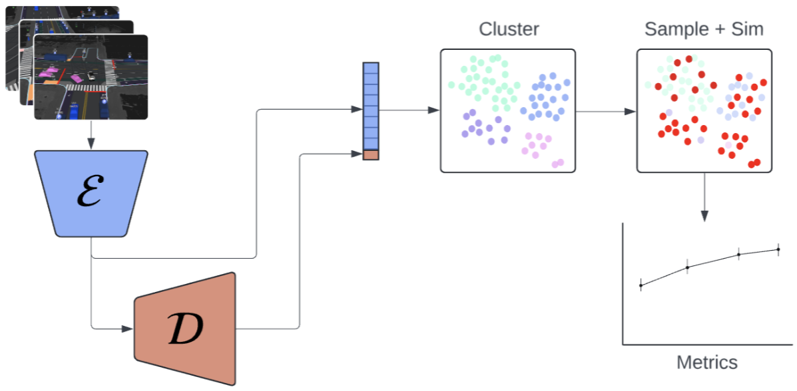
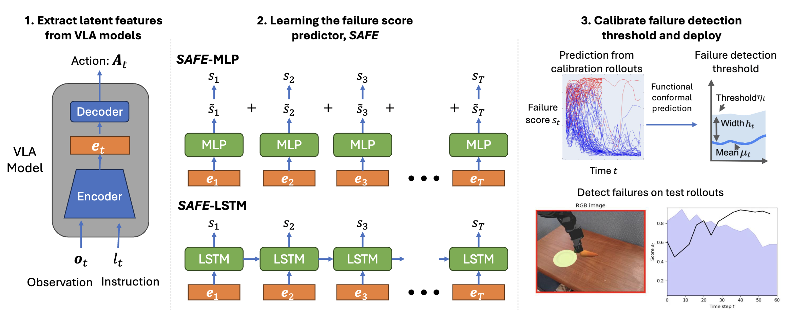
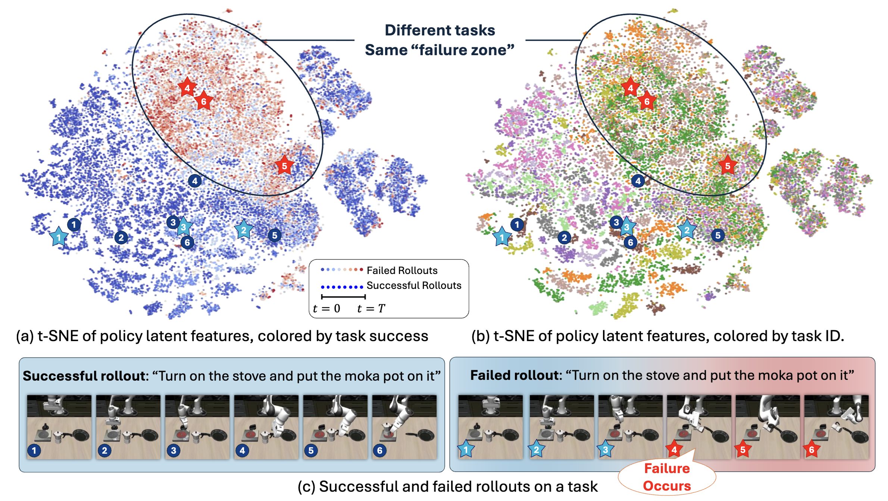
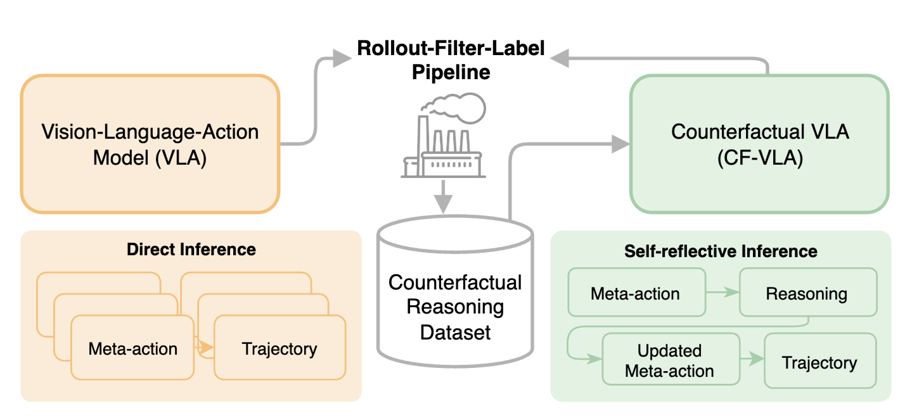
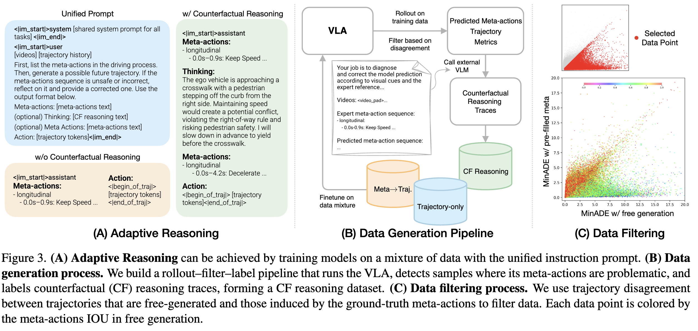

# Safety and Uncertainty in VLA Systems: Validation, Detection, and Self-Reflective Control

## Problem Statement

Vision-Language-Action (VLA) models aim to unify perception, reasoning, and control in a single learned system: 

$\pi_\theta(a_t \mid o_{1:t}, x_{1:t})$

where $o_t$ is observation (images/video), and $x_t$ encodes context (language, route, ego-state) at time $t$.

However, unlike classical robotics pipelines, these models:

* lack explicit metric state estimates, reducing introspectability,
* rely on learned representations under distribution shift,
* and produce decisions that are difficult to verify through formal methods or are not guaranteed to be safe by construction.

This introduces a central question:

> **How can safety be enforced in VLA systems when perception, reasoning, and control are learned, and what guarantees, if any, do these approaches actually provide?**

We analyze three recent works through a **systems-level safety lens**, identifying where safety is introduced in the pipeline and what guarantees (if any) are provided.
  
---

# A Unifying Safety Decomposition

## Pipeline View

All three papers can be mapped to:

$$
\text{Perception} \rightarrow \text{Latent Representation} \rightarrow \text{Reasoning} \rightarrow \text{Action} \rightarrow \text{Safety Layer}
$$

Safety can be injected at three distinct stages:

| Layer              | Paper                                           | Mechanism                                    |
| ------------------ | ----------------------------------------------- | -------------------------------------------- |
| **Pre-deployment** | Foundation Models for Rapid Autonomy Validation | Scenario generation + coverage expansion     |
| **Inference-time** | SAFE                                            | Failure prediction with conformal guarantees |
| **Policy-level**   | Counterfactual VLA                              | Self-reflective reasoning + action selection |

---

# Paper 1: Foundation Models for Rapid Autonomy Validation
**Authors**: Alec Farid, Peter Schleede, Aaron Huang, Christoffer Heckman  

## 1. Summary

This paper reframes autonomy validation as a **subset selection problem under severe computational constraints**.
Evaluating the performance of a VLA policy across all testing scenarios is both computationally and monetarily expensive, making it impractical to perform exhaustive validation over large-scale driving logs after every policy change. 

To address this, the authors propose selecting a small subset of scenarios that can stand in for the full dataset.
Their approach clusters scenarios in a learned embedding space to preserve diversity and prioritizes those with higher estimated failure likelihood to increase evaluation efficiency.
The resulting pipeline trades exhaustive validation for **statistical estimation**, aiming to approximate full-dataset safety metrics from a carefully chosen subset of simulations.

At its core, the work replaces “validate everything” with “validate enough and extrapolate”, placing the entire validation pipeline at the mercy of how well the selected subset represents the true distribution of driving scenarios.

*Figure 1: System diagram illustrating the validation pipeline and subset selection process.*

---

## 2. Reframing the Problem

At its core, the paper addresses autonomy validation as a **computationally constrained estimation problem**.

Let $D = \{x_1,x_2, \ldots,x_N\}$ denote a large dataset of real-world driving logs.
For each scenario $x_i$, evaluating a policy requires running a high-fidelity simulation to obtain an outcome $y_i = f(x_i)$, where $f(\cdot)$ captures metrics such as collision occurrence or task success.
The true objective is to estimate a global performance metric over the dataset, for example:  

$$ 
\mu = \frac{1}{N} \sum_{i=1}^N f(x_i).  
$$

However, evaluating $f(x_i)$ for all $x_i \in D$ is computationally prohibitive.
The system is therefore restricted to evaluating only a subset $S \subset D$, with $|S| \ll N$, and must instead construct an estimator:  

$$  
\hat{\mu} = \frac{1}{|S|} \sum_{x_i \in S} w_i f(x_i),  
$$

where $w_i$ are weights used to approximate the full-dataset metric.

Under this formulation, the problem reduces to:

> **How should one choose a subset $S$ such that $\hat{\mu}$ is a reliable estimate of $\mu$ under a strict simulation budget?**

The proposed method answers this by introducing a structured sampling strategy.
First, each scenario is embedded into a latent space $z_i = \phi(x_i)$, where proximity is assumed to reflect scenario similarity.
The dataset is then partitioned into clusters in this embedding space to preserve diversity.
Finally, scenarios are prioritized based on an estimated difficulty score—typically derived from simulated failure likelihood—so that higher-risk cases are more likely to be included in $S$.

This reframing reveals that the method is fundamentally a form of **biased Monte Carlo estimation**, where sampling is no longer uniform but guided by learned representations and difficulty scores.
The quality of the final estimate $\hat{\mu}$ therefore depends critically on two factors:  
(i) whether the embedding and clustering preserve the structure of the scenario distribution relevant to safety, and  
(ii) whether the sampling and weighting scheme correctly compensates for the induced bias.

In this sense, the central challenge is not merely computational—it is statistical.
The method trades exhaustive evaluation for an estimator whose validity hinges on how well a small, structured subset can represent the safety-critical properties of the full dataset.

## 3. Method Dissection

The proposed pipeline constructs a biased estimator of full-dataset performance by combining learned representations, clustering, and difficulty-aware sampling.
Each component introduces a structural assumption about how scenario similarity and risk should be measured.

----------

### Scenario Representation (Learned Embedding)

Each driving scenario $x_i$ is mapped to a latent representation $z_i = \phi(x_i)$ using an encoder trained with a **masked autoencoding objective**.
By reconstructing partially observed inputs, the encoder is encouraged to capture the dominant structure of scenes, including spatial layout, agent configurations, and temporal context.
This embedding serves as the foundation for all downstream operations.

> **Implicit Assumption:** A reconstruction-trained embedding preserves the aspects of a scenario that are relevant for validation and safety.

However, masked autoencoding optimizes for **reconstruction fidelity**, not **causal or safety-critical features**.
As a result, the embedding may emphasize visually or statistically dominant patterns while underrepresenting rare but safety-critical configurations.
Two scenarios that are visually similar but causally distinct (e.g., different intent of nearby agents) may be mapped close together, while causally similar but visually different scenarios may be separated.

----------

### Difficulty Score Modeling

On top of the learned embedding, a separate **MLP predictor** is trained to estimate a **difficulty score** $d(x_i)$, corresponding to the likelihood of failure (e.g., collision) under simulation.
This predictor is trained using outcomes from simulated rollouts, learning a mapping:  

$$  
d(x_i) \approx \mathbb{P}(\text{failure} \mid x_i).  
$$

This score is used as a proxy for scenario importance, enabling the system to prioritize scenarios that are more likely to expose policy weaknesses.

> **Implicit Assumption:** Failure likelihood under the current policy is a reliable indicator of scenario importance.

This introduces a strong **policy dependence**. 
The difficulty model reflects the behavior of a specific policy, biasing the selection process toward known failure modes while potentially neglecting scenarios that are not currently problematic but may become critical after future policy updates.

----------

### Clustering and Subset Construction

The dataset is partitioned into clusters to ensure coverage over the scenario distribution.
Two clustering strategies are considered:

-   **Embedding-only clustering (Algorithm 1):** scenarios are grouped based on $z_i$, preserving diversity in the learned representation space.
-   **Joint clustering (Algorithm 2):** scenarios are clustered in a combined space $(z_i, d(x_i))$, incorporating both similarity and estimated difficulty.

This design integrates coverage and prioritization directly into the clustering step, allowing the selected subset to reflect both the structure of the dataset and the estimated risk of scenarios.

> **Implicit Assumption:** The embedding space and, in the joint case, the augmented space $(z_i, d(x_i))$, organizes scenarios in a way that is meaningful for validation.

However, clustering operates on learned representations rather than causal structure.
As a result:

-   embedding-only clustering may group scenarios that look similar but fail for different reasons or split scenarios that share the same underlying risk factors,
-   joint clustering may further bias grouping based on **policy-specific failure patterns**, reinforcing existing weaknesses rather than revealing new ones.

----------

### Subset Selection

A subset $S \subset D$ is constructed by sampling from clusters, with selection influenced by cluster structure and, in the joint case, difficulty.
This produces a **non-uniform sampling distribution**, concentrating simulation effort on regions of the dataset deemed both representative and challenging.

> **Implicit Assumption:** A combination of clustering and difficulty-aware grouping is sufficient to capture both typical and safety-critical scenarios.

In practice, this introduces a tradeoff.
Emphasizing difficult scenarios improves failure discovery but skews the sample away from the true data distribution, while enforcing uniform coverage may dilute attention on rare but critical events.

----------

### Metric Estimation

Performance metrics are computed on the selected subset (S) and then aggregated to approximate full-dataset performance using the distribution of scenarios across clusters.
In effect, the method estimates performance at the cluster level and combines these estimates based on how frequently each cluster appears in the original dataset.

> **Implicit Assumption:** Scenarios within a cluster are sufficiently homogeneous that a small number of sampled scenarios can represent the behavior of the entire cluster.

This assumption is strong.
If there is significant variability within clusters—particularly in terms of failure outcomes—then cluster-level estimates may be misleading.
Rare but critical scenarios within a cluster may be entirely missed, leading to overly optimistic performance estimates.

----------
Collectively, the method transforms validation into a structured sampling problem, where representation learning, clustering, and difficulty estimation jointly define what is considered “important.” 
The effectiveness of the approach therefore depends less on the number of simulated scenarios and more on whether these learned structures align with the true, safety-critical geometry of the data.

----------

## 4. Information Decay and Failure Points

The pipeline reduces a large validation dataset to a small subset through a sequence of learned transformations.
While each step appears reasonable in isolation, their composition introduces a systematic loss of information about the underlying data distribution, particularly along dimensions that are critical for safety.

### Loss of Causal Structure

The combination of embedding, difficulty prediction, and clustering groups scenarios based on **learned similarity**, not underlying causal mechanisms.
As a result, scenarios that differ in why they fail (e.g., perception error vs interaction failure) may be treated as equivalent, while scenarios with similar failure causes may be separated. 
This is a fundamental limitation.
Validation requires understanding _why_ failures occur, but the method only preserves _how similar they look_ in representation space.

----------

### Suppression of Tail Events

Safety-critical failures are inherently rare and often reside in the tails of the data distribution.
However, the combination of clustering and subset selection assumes that a small number of samples can represent each region of the dataset.

This assumption breaks down in precisely the regimes that matter most:

-   rare edge cases may be diluted within clusters,
-   difficulty prediction may fail to identify previously unseen failure modes,
-   sampling may omit low-frequency but high-impact scenarios entirely.

----------

### Policy-Dependent Bias

The use of a learned difficulty score introduces a feedback loop: scenarios are prioritized based on how the _current policy_ performs.
This makes the validation process inherently **policy-dependent**.

As a result:

-   the selected subset reflects known weaknesses,
-   scenarios that are currently safe but fragile are deprioritized,
-   the validation set evolves with the policy rather than remaining a stable benchmark.

----------

### Cluster-Level Averaging and Hidden Variance

By aggregating performance at the level of clusters, the method assumes that scenarios within each cluster are sufficiently homogeneous.
In practice, clusters may contain significant internal variability, particularly in terms of failure outcomes. 
Cluster-level averages obscure worst-case behavior.
A small number of sampled scenarios cannot reliably capture rare failures within a cluster, leading to overly optimistic estimates of system performance.

----------

Crucially, these failures are systematic.
The same representation that enables efficient sampling also defines what failures are even _visible_ to the validation process.

----------

## 5. Load-Bearing Assumptions

The validity of the proposed approach depends on several critical assumptions.
These are not peripheral, but structural. If any of them fail, the reliability of the validation pipeline is compromised.

-   **Embedding Fidelity:** The learned representation preserves the aspects of scenarios that determine safety-relevant outcomes.
-   **Cluster Representativeness:** Scenarios within a cluster are sufficiently homogeneous such that a small number of samples can represent the entire cluster.
-   **Difficulty Generalization:** The learned difficulty score accurately reflects intrinsic scenario risk, rather than being tied to the current policy’s behavior.
-   **Coverage Sufficiency:** Sampling across clusters, combined with difficulty-aware prioritization, is sufficient to capture both typical and rare safety-critical scenarios.

> None of these assumptions can be independently verified without performing the very exhaustive validation that the method seeks to avoid.

----------

## 6. Verdict

This work addresses a real and important bottleneck: the prohibitive cost of large-scale autonomy validation.
At scale, exhaustive evaluation is often economically infeasible (potentially on the order of $100M per full evaluation), making some form of selective validation necessary in practice.

By reframing validation as a subset-selection problem, the method provides a practical mechanism for scaling evaluation within limited computational and monetary budgets.
In particular, it enables the system to avoid low-value scenarios (e.g., idle or trivial driving) and redirect resources toward more informative cases.

However, the approach replaces exhaustive validation with a structured approximation whose reliability is fundamentally assumption-dependent.
It provides no explicit mechanism for ensuring coverage of rare or worst-case events, does not preserve causal structure, and introduces policy-dependent biases into the validation process.

> **I would not rely on this in isolation as a primary validation pipeline for safety-critical systems.**

That said, the method is valuable as a component of a broader validation strategy.
It can significantly improve efficiency in identifying likely failure modes and allocating simulation resources, particularly during iterative development.

Its effectiveness can be strengthened by pairing it with:
- explicit coverage auditing for rare scenarios,
- validation of representation quality,
- distribution shift testing, and
- targeted or adversarial scenario generation.

> **The method is best viewed not as a replacement for validation, but as a mechanism for prioritizing where validation effort should be spent.**

---

# Paper 2: SAFE — Multitask Failure Detection
**Authors**: Qiao Gu, Yuanliang Ju, Shengxiang Sun, Igor Gilitschenski, Haruki Nishimura, Masha Itkina, Florian Shkurti  

## 1. Summary

This paper addresses the problem of **failure detection in Vision-Language-Action (VLA) models**, where the objective is to identify, at runtime, whether a policy is likely to fail given its current state and observations.
Rather than relying on task-specific heuristics or hand-engineered safety rules, the authors propose a **learned, model-agnostic framework** for detecting failures across multiple tasks.

The core approach maps the agent’s state at time $t$, denoted by $x_t$, to a latent embedding $e_t = \phi(x_t)$ derived from a pretrained VLA model, and then computes a scalar failure score:  

$$  
s_t = f_\theta(e_{0:t}),  
$$

where $f_\theta$ is a neural network trained to predict the likelihood of failure (e.g., task termination or unsafe outcome).
This scalar score serves as a unified signal for failure detection across diverse environments.

To provide statistical guarantees, the method incorporates a **functional conformal prediction (CP)** framework.
Using a held-out calibration dataset, a threshold $\tau$ is computed such that, for a chosen significance level $\alpha$, the probability of failing to detect a failure is bounded.
At inference time, a state is flagged as unsafe whenever:

$$
s_t \geq \tau.
$$

This yields guarantees of the form:

$$
\mathbb{P}(\text{failure not detected}) \leq \alpha,
$$

under standard exchangeability assumptions.

A key empirical observation motivating the approach is that failure states tend to **cluster in the learned representation space**, even across different tasks.
The authors visualize this using t-SNE, suggesting that failures share common structure that can be captured by a unified scoring model.

Overall, the method constructs a pipeline that combines:
- a shared representation of states across tasks,
- a learned scalar failure predictor,
- and a conformal calibration layer for statistical guarantees,

with the goal of enabling **general-purpose, real-time failure detection** for VLA systems without task-specific design.

*Figure 2: The proposed failure detector, SAFE, has three major components: (1) SAFE extracts
the latent feature from the last layer of a VLA model; (2) SAFE sequentially processes the latent
feature and predicts a failure score, using an MLP or an LSTM backbone; and (3) SAFE determines
a time-varying threshold using functional conformal prediction (CP) on a hold-out calibration set.
If the predicted score exceeds the threshold during testing, SAFE confidently detects a failure.*

---

## 2. Reframing the Problem

At its core, the paper formulates failure detection as a **prediction problem over trajectories**, using learned representations from a pretrained VLA model.

Let a trajectory be:

$$
\tau = (x_0, x_1, \ldots, x_T),
$$

where $x_t$ denotes the agent’s state at time $t$, including observations, context, and task information.
Instead of operating directly on $x_t$, the method first maps each state into a latent embedding:

$$
e_t = \phi(x_t),
$$

where $\phi(\cdot)$ is derived from the VLA model (specifically, the final hidden representation before tokenization).
This produces a sequence of embeddings:

$$
(e_0, e_1, \ldots, e_t),
$$

which serves as the input to the failure detection model.

The objective is to predict whether the trajectory will result in failure ($y=1$), ideally by estimating:

$$
\mathbb{P}(y = 1 \mid \tau_{0:t}),
$$

which depends on the full history and the future evolution of the system.

The proposed method approximates this through a learned scoring function:

$$
s_t = f_\theta(e_{0:t}),
$$

where the form of $f_\theta$ depends on the model variant:
- **SAFE-MLP:** $f_\theta$ operates on the current embedding $e_t$, effectively ignoring temporal structure.
- **SAFE-LSTM:** $f_\theta$ processes the sequence $(e_0, \ldots, e_t)$, incorporating temporal information through recurrent state.

The output is a scalar score $s_t \in \mathbb{R}$, intended to reflect the likelihood of failure at time $t$.
A decision rule is then applied:

$$
\hat{y}_t =
\begin{cases}
1 & \text{if } s_t \geq \tau, \\
0 & \text{otherwise,}
\end{cases}
$$

where $\tau$ is obtained via conformal calibration to enforce a desired error rate.

Under this formulation, the problem reduces to:

> **How can one map a sequence of high-dimensional embeddings $(e_0, \ldots, e_t)$ into a scalar score $s_t$ such that thresholding $s_t$ reliably detects failure events?**

This reframing reveals that the pipeline performs a sequence of reductions:

1. **State-to-Embedding Reduction:**  
   Raw states $x_t$ are mapped to embeddings $e_t$ using a pretrained VLA model, which is not explicitly optimized for failure detection.

2. **Temporal Aggregation:**  
   The sequence $(e_0, \ldots, e_t)$ is summarized by $f_\theta$, either by:
   - using only $e_t$ (MLP), or  
   - compressing the sequence into a recurrent hidden state (LSTM).

3. **Scalar Reduction:**  
   The resulting representation is collapsed into a single scalar score $s_t$.

4. **Thresholding:**  
   A binary decision is made by comparing $s_t$ to a calibrated threshold $\tau$.

This reframing exposes the central challenge:

> **Failure detection depends on structured, temporal, and potentially multimodal dynamics, yet the method ultimately reduces this information to a thresholded scalar prediction.**

The effectiveness of the approach therefore hinges on whether these successive reductions, from raw state to embedding, from sequence to summary, and from summary to scalar, preserve the aspects of the trajectory that are critical for identifying safety-relevant outcomes.

---

## 3. Method Dissection

The proposed pipeline combines pretrained VLA representations, a learned failure predictor, and a conformal calibration layer to produce failure detection signals with statistical guarantees.
Each component introduces specific assumptions about how failure can be represented and detected.

---

### Scenario Representation (VLA Embeddings)

At each time step $t$, the agent state $x_t$ is mapped to an embedding:

$$
e_t = \phi(x_t),
$$

where $\phi(\cdot)$ is derived from the pretrained VLA model (specifically, the final hidden representation prior to tokenization).
This embedding is not trained for failure detection, but for general perception and control tasks.

The failure detector operates on the sequence:

$$
(e_0, e_1, \ldots, e_t),
$$

which serves as a compressed representation of the trajectory.

> **Implicit Assumption:** The VLA embedding preserves the aspects of the state that are predictive of failure.

However, this representation is optimized for task performance, not for identifying failure modes.
As a result, safety-relevant features may be underrepresented or entangled with task-specific variations.

---

### Failure Score Prediction

A learned model $f_\theta$ maps embeddings to a scalar score:

$$
s_t = f_\theta(e_{0:t}),
$$

with two variants:
- **SAFE-MLP:** $s_t = f_\theta(e_t)$ (no temporal modeling),
- **SAFE-LSTM:** $s_t = f_\theta(e_{0:t})$ (sequence processed via recurrent state).

The score $s_t$ is trained to reflect the likelihood of failure, typically using supervised labels derived from trajectory outcomes.

> **Implicit Assumption:** A scalar score $s_t$ is sufficient to represent the risk of failure at time $t$.

This maps potentially complex and multimodal failure mechanisms into a one-dimensional signal.

---

### Conformal Calibration and Thresholding

To provide statistical guarantees, the method applies a **functional conformal prediction (CP)** framework on top of the learned scores $s_t$.

Rather than using a single global threshold, the method constructs a **time-dependent prediction band** over scores:

$$
C_\alpha = \\{ [ -\infty, \mu_t + h_t ]   :  t = 1, \ldots, T \\}
$$

where:
- $\mu_t$ is the time-varying mean of the score distribution,
- $h_t$ is a bandwidth term that determines the width of the conformal band.

This band is calibrated using scores from **successful trajectories** in a held-out calibration dataset.
Under exchangeability assumptions, the conformal construction ensures that a new successful trajectory will satisfy:

$$
s_t \leq \mu_t + h_t \quad \text{for all } t
$$

with probability at least $1 - \alpha$.

The failure detection rule is then defined as:

$$
s_t \geq \delta_t,
$$

where the threshold is given by:

$$
\delta_t = \mu_t + h_t.
$$

Thus, failure is detected whenever the observed score exceeds the upper bound of the conformal band.

Unlike standard conformal prediction, which produces a single global threshold, this formulation yields a **time-dependent threshold $\delta_t$**, allowing the detector to adapt over the course of a trajectory.

> **Implicit Assumption:** The distribution of scores on successful calibration trajectories accurately characterizes future behavior, such that the conformal band remains valid under deployment conditions.
---

### Time-Dependent Guarantees

The method computes $\delta_t$ for each time step, enabling guarantees of the form:

$$
\mathbb{P}(\text{missed failure at time } t) \leq \alpha.
$$

This allows the detector to adapt sensitivity over time, reflecting that failure risk evolves along a trajectory.

> **Implicit Assumption:** The distribution of scores is stable across time and trajectories, allowing per-time-step calibration to generalize.
---

### Overall Pipeline

The complete method can be summarized as:

$$
(e_0, \ldots, e_t) \xrightarrow{f_\theta} s_t \xrightarrow{\text{CP}} \delta_t = \mu_t + h_t \xrightarrow{\text{threshold}} \hat{y}_t.
$$

Each stage progressively reduces the structure of the original trajectory:
- high-dimensional state $\rightarrow$ embedding,
- sequence $\rightarrow$ summarized representation,
- representation $\rightarrow$ scalar score,
- score $\rightarrow$ binary decision.

The conformal layer provides statistical guarantees on the final decision, but operates entirely on the scalar score produced by $f_\theta$.

---

---

### Empirical Evidence: Representation Structure

The paper provides empirical evidence that failure states exhibit structure in the learned embedding space.
Specifically, using t-SNE visualizations, the authors show that latent representations of states cluster according to failure outcomes, with failure states forming coherent regions even across different tasks.

This observation suggests that the VLA-derived embeddings capture features that are correlated with failure, and motivates the use of a shared failure predictor across tasks.

> **Implicit Assumption:** Clustering of failure states in a low-dimensional visualization implies that the representation is sufficient for reliable failure detection.

However, this evidence is limited in scope.
The visualization reflects only observed data under the training distribution and does not guarantee that all safety-critical scenarios—particularly rare or unseen ones—are similarly captured in the embedding space.

*Figure 3: The internal features of a VLA capture high-level information about task success and
failure.
When the VLA is failing, the features, even those from different tasks, fall into the same
“failure zone”.
This motivates SAFE, an efficient multitask failure detector that is based on VLA
internal features and can generalize to unseen tasks.
Plot (a) visualizes the latent features of π0-FAST model on the LIBERO-10 dataset using t-SNE.
For successful rollouts, features are colored in blue.
For failed rollouts, features follow a blue-to-red gradient based on timestep progression, with red corresponding
to later timesteps that often coincide with failure.
Plot (b) visualizes the same set of t-SNE features, colored by task ID.
In (c), they show two example rollouts over time and mark their corresponding projected features in (a) and (b).*

---

## 4. Information Decay and Failure Points

The proposed pipeline transforms a trajectory into a binary failure decision through a sequence of learned reductions.
While each step is computationally convenient, their composition introduces a systematic loss of structure, particularly along dimensions that are critical for safety.

---

### Loss of Task-Relevant Structure in Embeddings

The method relies on embeddings $e_t = \phi(x_t)$ extracted from a pretrained VLA model.
These embeddings are optimized for perception and control, not for identifying failure modes.

As a result:
- safety-relevant features may be **underrepresented**,
- task-specific variations may dominate the representation,
- failure-relevant signals may be **entangled** with irrelevant features.

While the paper provides evidence that failure states cluster in this embedding space,  this observation is limited to **observed failures under the training distribution**. 

---

### Temporal Compression and Loss of Dynamics

Failure is inherently a **temporal phenomenon**, often emerging from the evolution of a trajectory rather than a single state.

The method handles temporal information in two ways:
- **SAFE-MLP:** ignores temporal structure entirely by using only $e_t$,
- **SAFE-LSTM:** compresses $(e_0, \ldots, e_t)$ into a recurrent hidden state.

In both cases, temporal structure is **compressed into a fixed-dimensional representation**, which limits the ability to:
- capture long-horizon dependencies,
- distinguish between trajectories with similar current states but different futures,
- represent multiple possible evolutions of the system.

This reduction is particularly problematic for failure detection, where subtle differences in timing or interaction can determine the outcome.

---

### Scalar Collapse of Multimodal Failure Modes

The core of the method is the mapping:

$$
s_t = f_\theta(e_{0:t}),
$$

which reduces the trajectory representation to a scalar score.

This introduces a fundamental bottleneck:

- multiple failure mechanisms (e.g., perception error, interaction failure, control instability) are **collapsed into a single dimension**,
- distinct risk profiles become indistinguishable if they produce similar scores,
- uncertainty and ambiguity are not explicitly represented.

As a result, the model effectively learns an **average notion of failure likelihood**, rather than a structured understanding of failure modes.

---

### Thresholding and Loss of Uncertainty

The conformal prediction layer produces a time-dependent threshold:

$$
\delta_t = \mu_t + h_t,
$$

and declares failure whenever $s_t \geq \delta_t$.

While this provides statistical guarantees, it operates entirely on the scalar score $s_t$.
Any structure lost in earlier stages cannot be recovered.

In particular:
- the decision is based on a **point estimate**, without explicit representation of uncertainty,
- the system has no mechanism to identify **novel or out-of-distribution failure modes**.

---

### Reliance on Observed Failure Structure

The empirical evidence (t-SNE visualization) shows that failure states cluster in the embedding space.
However, this clustering reflects only the **observed dataset**.

This introduces a critical limitation:

- the detector is calibrated on known failure patterns,
- unseen or rare failure modes may not lie within these clusters,

Thus, the method inherits a form of **dataset-induced blindness**, where only failures represented in the training and calibration data are reliably detectable.

---

### Guarantees on a Reduced Representation

The conformal prediction framework provides guarantees of the form:

$$
\mathbb{P}(\text{missed failure}) \leq \alpha.
$$

However, these guarantees apply to the **thresholded scalar score**, not to the underlying trajectory.

As a result:
- the guarantees are valid with respect to the distribution of $s_t$ on the calibration data,
- however, they operate entirely on this scalar score,
- if the embedding or score function is poor, conformal prediction may yield overly conservative or uninformative thresholds, limiting its practical utility.

> **The system provides statistical guarantees on the correctness of its decision rule, but not on the adequacy of the representation on which that decision is based.**

---

Collectively, these failure points are not independent.
Each stage of the pipeline reduces the structure of the original trajectory, and the final decision operates on a highly compressed signal.

> **The same reductions that enable efficient, general-purpose failure detection also define what failures are visible to the system—and which ones are systematically ignored.**

---

## 5. Load-Bearing Assumptions

The reliability of the proposed failure detection pipeline depends on several critical assumptions.
These are structural: if any of them fail, the validity of the detection mechanism and its guarantees is compromised.

---

- **Embedding Fidelity:**  
  The VLA-derived embeddings $e_t = \phi(x_t)$ preserve the aspects of the state that are predictive of failure.
In particular, safety-critical features—such as interaction dynamics, occlusions, or near-collision configurations—must be represented in a way that is accessible to the downstream predictor.

---

- **Temporal Sufficiency:**  
  The function $f_\theta(e_{0:t})$ captures all relevant temporal dependencies required to predict failure.
This assumes that either:
  - the current embedding $e_t$ is sufficient (SAFE-MLP), or  
  - the recurrent summary (SAFE-LSTM) retains all necessary information from the trajectory.

---

- **Scalar Adequacy:**  
  A single scalar score $s_t$ is sufficient to represent failure risk.
This assumes that diverse failure mechanisms and varying levels of uncertainty can be meaningfully collapsed into a one-dimensional signal without loss of critical information.

---

- **Calibration Representativeness:**  
  The distribution of scores on successful trajectories in the calibration dataset accurately reflects future deployment conditions.
This is required for the conformal band:
  
$$
\delta_t = \mu_t + h_t
$$

to provide valid guarantees.

---

- **Exchangeability:**  
  Calibration and test trajectories are exchangeable (i.i.d. or sufficiently similar). Without this, the conformal guarantee:
  
$$
  \mathbb{P}(\text{missed failure}) \leq \alpha
  $$

no longer holds.

---

- **Failure Coverage:**  
  The set of observed failures used during training and calibration sufficiently spans the space of possible failure modes.
This assumes that unseen or rare failures will map to regions of the score space that are already associated with failure.

---

> None of these assumptions can be verified without access to the full distribution of possible trajectories, including rare and safety-critical edge cases.

---

## 6. Verdict

This work tackles an important and practical problem: enabling real-time failure detection for VLA systems without task-specific engineering.
By leveraging shared embeddings and conformal calibration, it presents a scalable and model-agnostic approach with appealing statistical guarantees.

However, the method ultimately relies on a **thresholded scalar prediction**, introducing an information bottleneck that limits its ability to capture safety-critical behavior.
The conformal prediction layer provides guarantees on this scalar signal, but does not address errors introduced by representation, temporal compression, or the collapse of diverse failure modes.

> **I would not rely on this method as a primary safety mechanism in a real-world system.**

The approach is best understood as a **failure likelihood estimator with calibrated thresholds**, useful for:
- early warning signals,
- monitoring and debugging,
- prioritizing intervention during deployment.

But it does not provide a comprehensive solution to safety.
In particular, it lacks mechanisms to:
- detect novel or out-of-distribution failure modes,
- reason about uncertainty beyond a scalar score,
- ensure coverage of rare but critical events.

> SAFE is a **runtime safety filter**, not a control policy.
**The method provides guarantees on when it will flag failure, but not on whether it is looking in the right place.**

---

# Paper 3: Counterfactual VLA
**Authors:** Zhenghao “Mark” Peng, Wenhao Ding, Yurong You, Yuxiao Chen, Wenjie Luo, Thomas Tian, Yulong Cao, Apoorva Sharma, Danfei Xu, Boris Ivanovic, Boyi Li, Bolei Zhou, Yan Wang, Marco Pavone  

## 1. Summary

This paper introduces a framework for incorporating **counterfactual reasoning into Vision-Language-Action (VLA) policies** by operating at the level of **meta-actions**, i.e., the intermediate reasoning or decision traces produced by the model.

Rather than explicitly evaluating multiple candidate actions at inference time, the method trains the policy to **revise its internal reasoning** when it leads to undesirable outcomes.
Given an observed trajectory, the model constructs counterfactual examples that provides corrected alternatives to the model’s generated meta-actions, encouraging the policy to produce better reasoning that leads to safer actions.

At a high level, the approach augments standard behavior cloning with **counterfactual supervision over meta-actions**.
The model is not trained to simulate future trajectories online, but instead to internalize patterns of “what should have been done differently” directly within its reasoning process.

This results in a pipeline where:
- the model produces a meta-action that guides behavior,
- counterfactual data provides corrected versions of this meta-action,
- and training encourages the policy to generate reasoning that aligns with better outcomes.

In effect, the method attempts to embed **self-reflective correction inside the policy**, enabling it to implicitly account for alternative decisions without explicit planning or environment interaction at test time.

However, this design relies on the assumption that modifying meta-actions through counterfactual supervision is sufficient to encode the causal consequences of actions, despite the model never performing true interventions or explicit trajectory evaluation.

*Figure 4: The framework of CF-VLA.
A base VLA is finetuned on a counterfactual reasoning dataset generated by a rollout–filter–label pipeline.
The resulting CF-VLA supports both direct inference and self-reflective inference, in which counterfactual reasoning edits meta-actions before trajectory generation.*

---

## 2. Reframing the Problem

At its core, the paper reformulates action generation as a problem of **meta-action correction under counterfactual supervision**.

In standard VLA policies, actions are generated directly from observations and context:

$$ 
a_t \sim \pi_\theta(a_t \mid o_{1:t}, x_{1:t}), 
$$

where the model maps multimodal inputs to control outputs without explicitly reasoning about alternative decisions.

Many modern VLA systems additionally produce intermediate reasoning or **meta-actions** (e.g., language tokens, plans, or structured outputs) that guide action selection.
This can be expressed as:

$$ 
m_t \sim \pi_\theta(m_t \mid o_{1:t}, x_{1:t}), \quad a_t \sim \pi_\theta(a_t \mid m_t), 
$$

where $m_t$ represents the model’s internal decision trace.

The proposed method operates at this intermediate level.
Rather than modifying the action selection process directly, it introduces supervision over meta-actions using **counterfactual corrections**.

Given an observed trajectory with meta-action $m_t$ and outcome $y_t$, the method constructs an alternative meta-action $\tilde{m}_t$ corresponding to a better outcome $\tilde{y}_t$.
Training is performed using supervised learning on corrected meta-actions, where the model is trained to predict $\tilde{m}_t$ given the same context.

Under this formulation, the problem becomes:

> **How can a model learn to generate better decisions by observing how its reasoning should have been different?**

Crucially, these counterfactuals are not generated through true interventions in the environment.
Instead, they are derived from dataset and rollout-generated trajectories, rather than from controlled interventions that isolate the effect of individual decisions.

This reframing shifts the burden of decision-making:

- from **explicit planning over actions and dynamics**,  
- to **learning corrections over internal reasoning representations**.

As a result, the policy does not evaluate “what would happen if I take action $a$” at inference time.
Instead, it attempts to internalize patterns of **how reasoning should change** to produce better outcomes.

In this sense, the method replaces explicit counterfactual evaluation with a form of **amortized self-correction**, where the model learns to generate improved meta-actions without ever directly observing the consequences of its own interventions.

---

## 3. Method Dissection

The proposed method augments a VLA policy by introducing counterfactual supervision over a **multi-stage decision pipeline**.
Rather than directly mapping observations to actions, the model generates and refines an intermediate meta-action through an explicit reasoning process before producing the final behavior.

----------

### Meta-Action Generation (Initial Proposal)

The policy first produces an initial meta-action $m_t$ from observations and context:

$$ 
m_t \sim \pi_\theta(m_t \mid o_{1:t}, x_{1:t}). 
$$

This meta-action represents the model’s initial plan or reasoning trace.

> **Implicit Assumption:** The initial meta-action $m_t$ captures a meaningful proposal that can be improved through reasoning.

However, this proposal is generated without explicit verification, and may already encode flawed assumptions about the environment or task.
In practice, meta-actions are learned representations without explicit grounding in system dynamics.
The mapping from $m_t$ to $a_t$ may be complex and nonlinear, meaning that small changes in reasoning can lead to disproportionate or unintended changes in behavior.

----------

### Adaptive Reasoning (Self-Reflection)

The model then performs a reasoning step, conditioned on the initial meta-action:

$$ 
r_t \sim \pi_\theta(r_t \mid m_t, o_{1:t}, x_{1:t}). 
$$

This reasoning stage is invoked adaptively and is intended to identify potential issues in the initial proposal and suggest improvements.

> **Implicit Assumption:** The model can reliably diagnose errors in its own reasoning based on internal representations.

Since this reasoning is produced by the same model, it is susceptible to the same errors as the initial meta-action.
There is no external mechanism to verify whether the reasoning correctly identifies failure modes.

----------

### Meta-Action Refinement (Counterfactual Correction)

Based on the reasoning $r_t$, the model produces an improved meta-action:

$$ 
\tilde{m}_t \sim \pi_\theta(\tilde{m}_t \mid m_t, r_t, o_{1:t}, x_{1:t}). 
$$

Training supervises this refinement using ground-truth meta-actions from the dataset, encouraging the model to transform flawed reasoning into corrected alternatives.

> **Implicit Assumption:** The refinement process $m_t \rightarrow \tilde{m}_t$ captures meaningful counterfactual corrections.

While $\tilde{m}_t$ is grounded in demonstrated trajectories, the refinement is not validated through explicit comparison of outcomes under identical conditions.
The model learns to imitate corrected reasoning patterns, rather than explicitly evaluating the consequences of alternative decisions.

----------

### Action / Trajectory Generation

The refined meta-action $\tilde{m}_t$ is then used to generate the final trajectory or control action:

$$ 
a_t \sim \pi_\theta(a_t \mid \tilde{m}_t). 
$$

This completes the decision pipeline.

> **Implicit Assumption:** Improved meta-actions reliably translate into improved physical behavior.

However, the mapping from meta-actions to actions is learned and potentially unstable.
There is no explicit guarantee that improvements in reasoning lead to consistent improvements in execution.

----------

### Training Objective

Training is performed using supervised learning on the refined meta-actions:

$$ 
\mathcal{L} = - \sum_{t} \log p_\theta(\tilde{m}_t \mid o_{1:t}, x_{1:t}). 
$$

This corresponds to an imitation objective over corrected reasoning traces.

> **Implicit Assumption:** Imitating refined meta-actions is sufficient to internalize the reasoning process.

The model is optimized to reproduce corrected outputs, but is not explicitly trained to ensure that the intermediate reasoning $r_t$ or the refinement process is causally valid or consistent across environments.

----------

Collectively, the method introduces a a self-reflective reasoning process within the policy, where reasoning is used to iteratively improve internal representations before action execution.
The effectiveness of this approach depends on whether this learned refinement process truly captures the consequences of alternative decisions, or merely reproduces patterns present in the training data.

*Figure 5: (A) Adaptive Reasoning can be achieved by training models on a mixture of data with the unified instruction prompt. 
(B) Data generation process.
They build a rollout–filter–label pipeline that runs the VLA, detects samples where its meta-actions are problematic, and
labels counterfactual (CF) reasoning traces, forming a CF reasoning dataset.
(C) Data filtering process.
They use trajectory disagreement between trajectories that are free-generated and those induced by the ground-truth meta-actions to filter data.
Each data point is colored by the meta-actions IOU in free generation.*

---

## 4. Information Decay and Failure Points

The proposed pipeline introduces a self-reflective loop within the policy, where initial reasoning is revised through an internal correction process before execution.
While this structure appears to approximate counterfactual reasoning, it relies on a sequence of learned transformations that progressively abstract away the underlying causal structure of the environment.

### Reasoning Without Controlled Intervention

The refinement process $m_t \rightarrow \tilde{m}_t$ is framed as counterfactual correction.
The rollout–filter–label pipeline does generate alternative trajectories by simulating different decisions, providing the model with examples of improved behavior.

However, these do not constitute **controlled counterfactual comparisons** in the causal sense.
The generated trajectories are subject to stochasticity in the environment and variations in agent behavior, meaning that differences in outcomes cannot be attributed solely to changes in the meta-action.

As a result, the model is not trained on clean comparisons of the form:

- same initial state,  
- identical environment dynamics,  
- only the decision differs.

Instead, it learns from **selected trajectories** that exhibit desirable outcomes after filtering.
This leads to a fundamental shift:

> the model learns from curated examples of successful behavior, rather than from explicit evaluation of how outcomes change under isolated interventions.

Consequently, the notion of counterfactual reasoning in this pipeline is approximate.
It reflects patterns in simulated data, but does not guarantee that the learned corrections capture the true causal effect of alternative decisions.

----------

### Error Propagation Through Language Conditioning

The meta-action $m_t$, reasoning $r_t$, and refined meta-action $\tilde{m}_t$ are all generated by the same language model as sequential outputs.
In practice, this corresponds to conditioning on previously generated tokens:

$$ 
r_t \sim p_\theta(r_t \mid m_t, o_{1:t}, x_{1:t}), 
$$

$$ 
\tilde{m}_t \sim p_\theta(\tilde{m}_t \mid m_t, r_t, o_{1:t}, x_{1:t}). 
$$

As a result, both the reasoning and refinement stages depend directly on the initial meta-action through the model’s input context.

> **Implicit Assumption:** Conditioning on intermediate reasoning allows the model to correct earlier mistakes.

However, since all stages are generated by the same model and share the same underlying representations, errors in the initial meta-action can propagate through the sequence:

- flawed assumptions in $m_t$ become part of the context for $r_t$,  
- the reasoning $r_t$ may reinforce these assumptions rather than reliably correct them,  
- the refined meta-action $\tilde{m}_t$ is generated conditioned on both.

There is no external mechanism that evaluates whether the reasoning or refinement is correct with respect to the environment.
The model can only adjust its outputs based on patterns learned from data, not by verifying the consequences of its intermediate decisions.

As a result, correction is limited by the model’s ability to override its own prior tokens, rather than by any explicit grounding in causal outcomes.

----------

### Representation-Level Supervision

Supervision is applied to meta-actions $\tilde{m}_t$, which are representations rather than directly observable physical outcomes.
This introduces a layer of abstraction between training signals and real-world behavior.

As a result:

- the model is optimized to match **reasoning traces**,  
- not to minimize **task-level failure** directly.

This creates a gap where:

- the model is optimized to match **reasoning traces correlated with success**,  
- but is not explicitly trained to ensure that these traces remain valid under distribution shift.

As a result, correctness is mediated through the dataset, rather than enforced through direct evaluation of task-level outcomes.

----------

### Dataset-Limited Counterfactuals

All corrections are derived from the dataset, which contains a finite set of demonstrated behaviors.
This constrains the space of counterfactuals the model can learn.

In particular:

- the model only learns corrections that are represented in the data,  
- rare or novel failure modes may not have corresponding corrective examples,  
- reasoning generalization is limited to patterns seen during training.

This is especially problematic for safety-critical systems, where failures often arise in **out-of-distribution or edge-case scenarios**.

----------

### Absence of Online Correction

At inference time, the model generates a single refined meta-action and executes it.
There is no mechanism to:

- evaluate alternative refinements,  
- simulate outcomes, or  
- revise decisions based on predicted consequences.

All correction must be internalized during training.

This creates a rigid system where:

- errors in reasoning cannot be corrected at test time,  
- and safety depends entirely on the model’s ability to generalize its learned refinement process.

----------

Crucially, these failure modes are not independent.
The reliance on dataset-derived corrections, representation-level supervision, and autoregressive reasoning leads to a system where:

> counterfactual reasoning is not performed, but **amortized into learned patterns of reasoning and correction**.

As a result, the pipeline may produce convincing reasoning traces while lacking the ability to reliably evaluate the consequences of alternative decisions in novel settings.

---

## 5. Load-Bearing Assumptions

The validity of the proposed approach depends on several structural assumptions.
These are not peripheral design choices, but fundamental to whether the method produces reliable behavior.

- **Meta-Action Fidelity:** The intermediate meta-action $m_t$ is a faithful and sufficient representation of the decision process, such that improving it leads to predictable improvements in execution.

- **Corrective Supervision Sufficiency:** Ground-truth meta-actions $\tilde{m}_t$ provide meaningful corrective signals that capture not just better outcomes, but the underlying reasons for those improvements.

- **Counterfactual Approximation Validity:** The rollout–filter–label pipeline produces counterfactual examples that are sufficiently representative of true intervention effects, despite being derived from stochastic simulations and filtering.

- **Reasoning Generalization:** The model can generalize learned reasoning corrections beyond the distribution of the dataset, including to rare or safety-critical scenarios not explicitly represented in training.

- **Reasoning-to-Action Consistency:** Improvements in meta-action quality reliably translate to improved physical behavior, despite the learned and potentially unstable mapping from reasoning to control.

> None of these assumptions are explicitly enforced or verified by the method, yet the reliability of the entire pipeline depends on them holding in practice.

----------

## 6. Verdict

This work introduces a compelling idea: embedding a self-reflective correction mechanism within VLA policies through counterfactual supervision over meta-actions.
By operating at the level of reasoning, it provides a scalable way to improve policy behavior without requiring explicit planning or online simulation.

However, the approach replaces explicit evaluation of action consequences with **imitation of corrected reasoning traces**.
While the rollout–filter–label pipeline provides useful training signals, it does not yield controlled counterfactual comparisons, and the learned reasoning process is not grounded in explicit causal evaluation at inference time.

As a result, the method’s effectiveness depends heavily on dataset coverage, the quality of simulated corrections, and the model’s ability to generalize learned reasoning patterns.
It provides no mechanism for verifying decisions online, no guarantees of robustness under distribution shift, and no explicit handling of rare or adversarial scenarios.

> **I would not rely on this as a primary safety mechanism in real-world autonomous systems.**

That said, the method is valuable as a **representation-level improvement technique**.
It can help shape better internal reasoning patterns and improve performance in-distribution, particularly when high-quality corrective data is available.

> **The method is best viewed not as true counterfactual reasoning, but as amortized imitation of corrected reasoning.**

---

# Cross-Paper Technical Comparison

| Property                   | Validation     | SAFE        | Counterfactual VLA |
| -------------------------- | -------------- | ----------- | ------------------ |
| Safety stage               | Pre-deployment | Runtime     | Policy             |
| Guarantee type             | None           | Statistical | None               |
| Handles distribution shift | Partial        | Weak        | Weak               |
| Action correction          | ✗              | ✗           | ✓                  |
| Closed-loop evaluation     | Limited        | None        | Partial            |

---

# The Next 10,000 GPU-Hour Experiments

## 1. Closed-Loop Evaluation

Evaluate policies in a **closed-loop setting**, where actions are executed in the environment and directly influence future states:

$$
s_{t+1} = f(s_t, a_t), \quad a_t \sim \pi_\theta(s_t)
$$

This captures long-horizon behavior where errors can accumulate over time.

**Metrics:**

* collision rate  
* time-to-collision  
* intervention frequency  
* task success rate  

---

## 2. Distribution Shift Robustness

Train on:

$$
\mathcal{D}_{\text{train}}
$$

Evaluate on:

$$
\mathcal{D}_{\text{OOD}}
$$

where $\mathcal{D}_{\text{OOD}}$ contains novel environments, agent behaviors, or rare edge cases.

**Measure:**

* breakdown in SAFE calibration under shift  
* degradation in counterfactual reasoning quality  
* increase in closed-loop failure rates  

---

## 3. Safety Composition

Combine all three approaches into a unified pipeline:

$$
\text{Validation} \rightarrow \text{Detection} \rightarrow \text{Correction}
$$

**Test:**

* Does safety improve cumulatively under composition?  
* Are failure modes reduced or simply redistributed across components?  
* Do interactions between modules introduce new failure modes?  

---

# Final Synthesis

## Key Insight

> Safety in VLA systems is inherently **multi-layered**

* Validation identifies potential failures  
* Detection flags imminent failures  
* Reasoning attempts to avoid failures  

Each layer addresses a different point of failure, but none provides complete coverage in isolation.

---

## Final Verdict

| Paper              | Strength           | Weakness              |
| ------------------ | ------------------ | --------------------- |
| Validation         | Coverage scaling   | No guarantees         |
| SAFE               | Statistical rigor  | No control authority  |
| Counterfactual VLA | Adaptive reasoning | Model-dependent       |

---

## Production Perspective

> No single method is sufficient

A real system requires:

* redundancy across safety layers  
* closed-loop evaluation under deployment conditions  
* robustness to perception errors and distribution shift  

---

## Final Insight

> Safety does not emerge from any single component — it emerges from how the system composes them.

---

# References

1. Foundation Models for Rapid Autonomy Validation  
2. SAFE: Multitask Failure Detection for Vision-Language-Action Models  
3. Counterfactual VLA  

---
