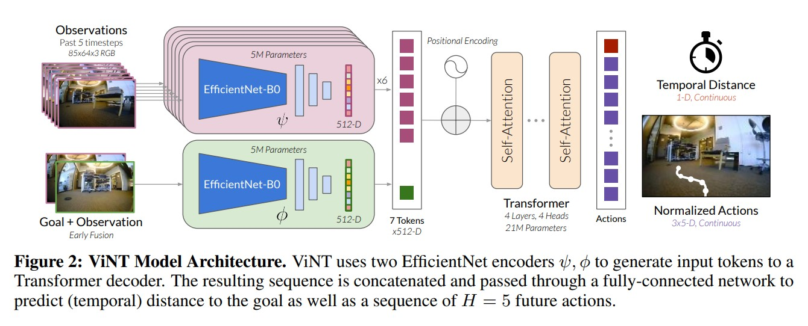
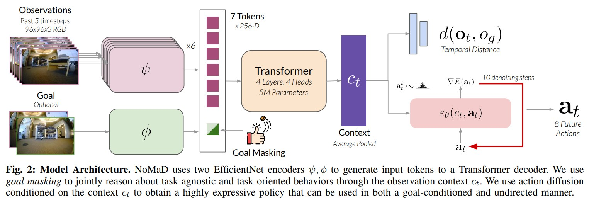
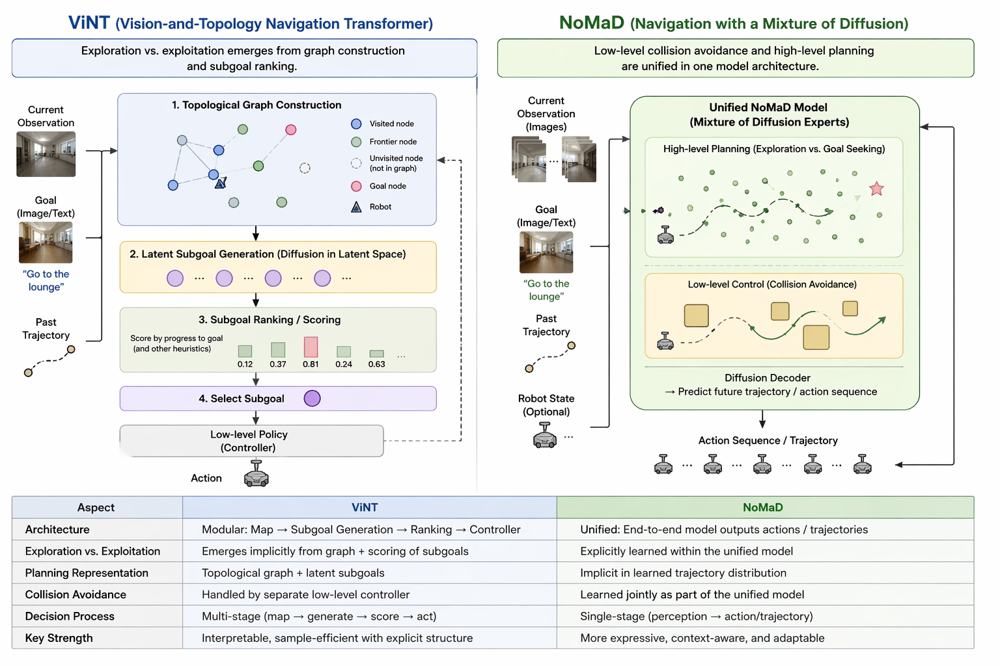
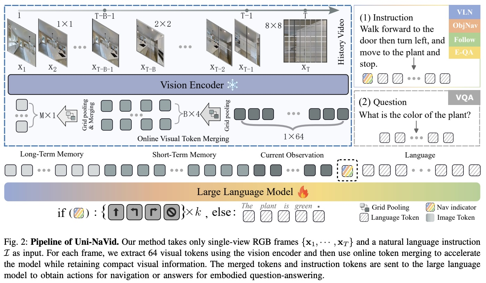

# Vision-Language Navigation under Real-World Constraints

## Introduction

Robotic navigation has traditionally been structured around a modular sense–think–act pipeline, where perception, mapping, planning, and control are explicitly defined and engineered.
While this paradigm has proven reliable, it relies heavily on metric representations--reducing spatial understanding to precise measurements that lack semantic or contextual grounded.
Unlike natural decision-making, which operates on qualitative cues (e.g. turn right at the red building, avoid crowded hallway), classical approaches compress rich environmental information into measureable quantities and hand-designed representations that require prior knowledge of the environment and how it might interact with the task at hand.

Recent advances in large-scale data collection and representation learning have driven a shift toward end-to-end navigation models, where visual and language observations are directly mapped to actions.
This transition reduces the need for explicit intermediate representations, but introduces new challenges in generalization, temporal consistency, and physical executability.

This audit examines three representative approaches—ViNT, NoMaD, and Uni-NaVid—as incremental attempts to relax prior assumptions while preserving navigational competence.
Rather than proposing a single unified solution, these works decompose the problem of generalized robot navigation into different sub-problems within the robot navigation space. 
ViNT introduces a foundation model for navigation that replaces explicit geometric maps with a semantic topological representation, enabling robot-agnostic navigation while retaining coarse spatial structure.
NoMaD addresses the subsequent challenge of goal-directed behavior under complete environmental uncertainty, explicitly modeling the trade-off between exploration and exploitation during navigation.
Uni-NaVid further extends this paradigm by incorporating language grounding, allowing navigation policies to condition their search and execution strategies on semantic instructions across diverse datasets.

This trajectory represents a significant departure from the early days of zero-shot prompting of frontier models.
The key insight observed across the three papers exaamined in this audit is that while training better models that directly learn vision-language-action mappings from large scale labelled trajectory data has been a large proponent of demonstrating immediate improvements to `generalization,' there still exists a bottleneck at the interface between these high-level semantic goals and temporally consistent control outputs.
We can teach or learn semantic behaviors that extend well to novel environments within some domain, but the linking between grounded reasoning and action execution still remains to be unseen, hidden behind the layers of the increasingly complex models being trained.
For example, the model can learn to take a wider path around a moving pedestrian, but if it placed in a scene where there are moving agents that do not resemble pedestrians, would it know to avoid the agents in the same manner?

## Part 1: ViNT

### Main Contributions

The main purpose behind the paper was to develop a cross-embodiment foundation model (agnostic to robot type as well as task specifications - exploration versus goal seeking as well as distance scales).
Training data for every type of individual subcomponent of robot vision tasks is costly, so the authors wanted to define a unified model that can handle the general case, and can be minimally adapted to a diverse range of tasks.
Two features of their approach that stood out were:

1. **Action space normalization**: ViNT tries to be embodiment agnostic through using relative waypoints.
To account for the different speeds and sizes of the robots, the waypoints were normalized by scaling them by their top speed.
This way the model wouldn't have to be trained on specific robot types, and the outputs can then just be scaled via robot-specific controllers for deployment.
To be clear, the outputs are not low level controls - they are just positional offsets (e.g. dx, dy, dtheta) that are normalized, ultimately allowing for a single policy head to work with the varying dynamics of any robot type.
While this approach in theory generalizes to robot modality, in practice, size and top speed are not fully telling of how a robot should act.
For example, a small quadruped the size of a large drone might be equivalent in speed, but their learned behaviors fundamentally need to be different because of how each modality interacts with the world (drone being in the air, quadruped being on the ground, each has different operational requirements).

2. **Semantic topological map**: No explicit map building was done either, but instead a topological graph was built, where waypoints were recorded on the graph as nodes (with corresponding image or feature - learned visual embeddings of visited locations), and the nodes were connected by temporal sequences of actions.
This allows for long horizon planning and exploration versus exploitation handling without any explicit SLAM.
While ViNT does not explicitly set a hard line between when to explore or when to seek goal (which will be explored more in NoMaD), its diffusion-based subgoal and scoring system encoded into the topological map produced behavior that resembles exploration-exploitation balancing. 
Subgoals that might not yet exist in map but are scored high for progress to goal are preferentially selected, causing the robot to venture into new regions. 
This emergent behavior was noted by the authors, but not explicitly planned for, and just came about as a result of their scoring heuristic.

### Architecture

1. **Inputs**: Current observation, past observations, and goal images are all encoded via a pair of EfficientNet-B0 encoders.

   a. **Observation encoder** (denoted $\psi$ in the paper): Encodes current observation as well as context window of past observation (attention).
   Takes in 85x64x3 images, and outputs a flattened feature vector from last convolutional layer.
   Output is 5 512-dim vectors ($P_t$ and $P_{t-i}$ for $i = [1, 4]$), resized to model dimension.

   b. **Goal encoder** (denoted $\phi$ in the paper): Processes goal images into the sequence as spatial pairing between observations and goal.
   Findings in paper mentioned that this step shouldn't just extract features from goal image, as this would lead to stuff in image sometimes being ignored (temporal inconsistencies).
   Instead, this encoder encodes the difference between current observation and the goal - just stack observations and goal together, pass through EfficientNet, then flatten to get goal tokens, similar to observation encoder.
   Attention forces goal to attend to / compare with window observation sequence.



Note: A critical design choice in ViNT is the complete flattening of spatial structure 
before the transformer. 
Both observation and goal encoders reduce 85×64×3 RGB images to 512-dimensional feature vectors, compressing all 2D spatial topology into abstract embeddings. 
The transformer then relies solely on attention mechanisms to implicitly reconstruct spatial relationships across the temporal sequence.
This architectural bottleneck has consequences for generalization: rather than maintaining explicit geometric information (for example, "obstacle at 30cm left, moving 2m/s"), the model must encode spatial relationships statistically through its learned embeddings. 
While this works for spatial patterns present in the training distribution, it may struggle with precise geometric reasoning needed for novel configurations. 
For example, the model might learn the correlation "detect human presence on left → increase right steering" without robustly encoding distance, relative velocity, or clearance thresholds—information that would be more directly accessible if spatial structure were preserved through the network. 
This design choice prioritizes parameter efficiency and cross-embodiment generalization at the cost of fine-grained spatial awareness.

2. **Transformer**: $P_{\text{past}}$, $P_{\text{obs}}$ (i.e. current), and $P_{\text{goal}}$ tokens are combined with positional encoding.
These are passed into a decoder-only Transformer backbone (denoted as 'f' in the paper) with 4 multi-headed attention blocks (4 heads, 4 layers), and 2048 hidden units.

   a. 6 tokens, model dimension of 512, 4 layers, 4 heads, 2048 feed-forward hidden dim, 128 per attention head (512 / 4).
   
   We have a fixed window / input length, so only need a decoder - direct mapping from observations to actions.
   The two output heads predict normalized actions in the form of waypoints (as previously mentioned), as well as temporal distance to goal (temporal in terms of number of actions and time to complete).

3. **Diffusion**: Also previously mentioned, ViNT also produces subgoal candidates to break down the planning problem.
These candidates are generated via an image diffusion model (trained on same dataset as ViNT), and are scored by a goal-directed heuristic.

In the full pipeline, the robot uses the diffusion model to generate subgoals from current observation, and then spatially grounds them via ViNT (goal encoder), and scores them using the heuristic, like so:

Given current observation $o_t$, the diffusion model generates K candidate future observations $\{o_s^1, o_s^2, ..., o_s^K\}$.
Each candidate is encoded via the goal encoder and scored using a learned heuristic based on predicted temporal distance to the final goal.
The highest-scoring subgoal is selected and fed to the navigation policy.

This allows the robot to break long-horizon navigation into shorter segments, but is notably computationally expensive.

4. **Topological Graph**: One of the novelties of this paper is its method of building a topological graph that links observations via action sequences, effectively building a sparse map or representation of the environment.
This approach is interesting, because the model is able to now handle both low-level interactions (collision avoidance through short term actions or model reasoning), as well as high-level planning - graph-based methods do well because they can reason about coverage.
This ultimately helps with exploration, as well as preventing getting stuck.

### Training

ViNT was trained on 100 hours of real-world trajectories, spanning 8 different robot platforms.
Training procedure is as follows:

1. Sample trajectory: $\tau \sim \mathcal{D}$
2. Sample timestep: $t \sim \text{Uniform}(0, |\tau| - H - l_{\text{max}})$
3. Extract temporal context: $o_{t:t-P} = [o_{t-P}, o_{t-P+1}, ..., o_{t-1}, o_t]$
4. Sample subgoal distance: $d \sim \text{Uniform}(l_{\text{min}}, l_{\text{max}})$
5. Extract subgoal observation: $o_s = o_{t+d}$
6. Extract action labels: $\hat{a} = a_{t:t+H} = [a_{t+1}, a_{t+2}, ..., a_{t+H}]$
7. Distance label: $d$ (temporal distance in timesteps)

Where:
- **Model inputs**: temporal context $o_{t:t-P}$, current observation $o_t$, subgoal $o_s$
- **Supervision labels**: action sequence $\hat{a} := a_{t:t+H}$ and temporal distance $d$

The maximum likelihood objective function is:

$$
\mathcal{L}_{\text{ViNT}}(\phi, \psi, f) = \mathbb{E}_{\tau} \mathbb{E}_{t} \mathbb{E}_{d} \left[ \log p(\hat{a} \mid f(\psi(o)_{t:t-P}, \phi(o_t, o_s))) + \lambda \log p(d \mid f(\psi(o)_{t:t-P}, \phi(o_t, o_s))) \right]
$$

where $\lambda$ is a loss balancing weight between the action and distance loss components.

The model has two outputs prediction heads:
1. **Action head**: predicts H future waypoints (normalized dx, dy, dθ)
2. **Distance head**: predicts temporal distance to subgoal

The paper presents the objective using log-probability notation but does not specify the actual loss implementation (whether L2, cross-entropy, or other). 
Given the continuous nature of both outputs (waypoint coordinates and distance), standard practice would be regression losses such as MSE, but this is not explicitly stated in the paper.


### Evaluation + Extensions

ViNT was evaluated with 3 main categories in mind: coverage of exploration and goal reaching, zero-shot transfer to new robot platforms, and whether it can be adapted to different tasks with minimal fine tuning.

1. **Exploration coverage**: Robot placed in unseen environment, and recorded metrics were maximum displacement (distance from start without collision or human intervention), coverage area, as well as number of times human intervention was required (if it got stuck, for example).

2. **Zero-shot transfer**: Basically just deployed ViNT on 4 different robots, and recorded success rates.

3. **Broader Generalization, Fine-Tuning, and Adaptations**: They're able to do adaptations to different task specifications via prompt tuning.
ViNT can also learn a sort of mapping from desired goal modality to ViNT native goal tokens (essentially keeping everything the same except for goal encoder $\phi$).
Furthermore, they can improve on task performance by training with on-task data with only 1 hour of data to transfer capabilities to new setting.

### Summary - The Interesting and The Concerning

With ViNT's strong generalization capabilities as a foundation model, the aspect of building a semantic topological map stood out the most. 
This approach mirrors how humans navigate: relying on landmark-based route knowledge rather than precise metric measurements. 
Research on human spatial cognition shows that people primarily navigate using sequences of recognizable landmarks and associated turn decisions, only later developing map-like survey knowledge of environments [4]. 
When navigating to a location, we use semantic cues to recognize waypoints along the path ("turn at the red building," "walk until you see the grocery store") rather than computing exact distances or geometric relationships. 
ViNT's topological graph of visual observations connected by action sequences captures this landmark-and-route structure directly.

However, there are still a few things left unanswered. 
While ViNT is strongly generalizable in its pure navigational capabilities, it lacks more semantic reasoning behind choosing the specific trajectory along a certain path. 
It has a form of handling exploration versus exploitation (by diffusion generation of subgoals and subgoal ranking), but it doesn't explicitly have an inherent understanding of the environment it's navigating in. 
This extends to other contextual reasoning points, such as traversability (we can choose shortest set of nodes or actions in the graph, but what about the specific quality of the trajectories themselves?). 
The model itself serves as a strong baseline as a foundation model for robot-vision navigation tasks, but still requires more components to push the robot’s adaptability—defined here as the ability of a single policy to switch between goal-directed navigation and undirected exploration depending on whether a goal is provided.
On that note also, ViNT seems to be pretty computationally expensive (training, diffusion generation). 
As mentioned in the paper, ViNT requires a "degree of structural similarity" - this likely stems from the structure of the training data and representations, which primarily consist of RGB observations and navigation trajectories in largely planar environments, limiting exposure to full 3D spatial reasoning. 
Extending this framework to fully 3D settings would likely require additional modeling of geometry and dynamics, as well as handling increased action space complexity. 
Regardless, the ViNT framework is an important step towards generalization of robot navigation tasks.

## Part 2: NoMaD

### Main Contributions

NoMaD's central contribution is a reframing of navigation and exploration as inference over a shared action distribution rather than as separate behaviors requiring separate policies.

Instead of treating goal-conditioned navigation and task-agnostic exploration as distinct problems (often handled via hierarchical planners or subgoal generators), NoMaD proposes that both behaviors can be represented by a single policy whose output distribution changes based on whether goal information is provided.

This is achieved through goal masking, which allows the same policy to operate in two regimes:
- **Goal-conditioned mode**: actions are conditioned on a visual goal.
- **Undirected mode**: actions are sampled without any goal information, inducing exploration.

Crucially, NoMaD applies diffusion modeling directly in action space, rather than generating subgoals or future observations.
This avoids high-dimensional generative modeling and yields a compact, efficient policy capable of expressing multimodal, collision-free behaviors in real time.

### Architecture



At a high level, NoMaD combines ViNT-style visual encoding, attention-based goal masking, and an action diffusion policy.

**Observation Encoding**

The policy receives:
- A sequence of recent RGB observations $o_{t-P:t}$
- An optional goal image $o_g$

Visual inputs are encoded using EfficientNet-B0 and processed by a Transformer backbone to produce a context vector:

$$ c_t = f_\theta\left(o_{t-P:t}, o_g, m\right)$$

where $m \in \{0,1\}$ is a binary goal mask controlling whether the goal token participates in attention.

**Goal Masking**

Goal masking is implemented via hard attention masking:

- $m = 0$: goal token is visible → goal-conditioned navigation
- $m = 1$: goal token is masked → undirected exploration

During training:

$$m \sim \text{Bernoulli}(0.5)$$

This forces the policy to learn a shared representation that supports both behaviors.

**Action Diffusion Policy**

Rather than predicting a single action, NoMaD models a distribution over future action sequences:

$$ p\left(a_{t:t+H}|c_t\right)$$

Diffusion is used to represent this distribution by iteratively denoising an initially random action sequence.

Initialization:

$$ a_t^K \sim \mathcal{N}(0, I)$$

Denoising process:

$$ a_t^{k-1} = \alpha\left(a_t^k - \gamma_k \epsilon_\theta\left(c_t, a_t^k, k\right)\right) + \mathcal{N}\left(0, \sigma_k^2I\right)$$

After $K$ steps, the policy samples a collision-free, multimodal action sequence $a_t^0$.

### Training

**Data Assumptions**

NoMaD is trained entirely via supervised imitation learning using large-scale real-world datasets (GNM and SACSoN), totaling over 100 hours of robot navigation data.

The ground truth consists of human teleoperation trajectories collected across 8 different robot platforms in diverse indoor and outdoor environments. 
The GNM dataset includes data from office buildings, university campuses, and outdoor trails, while SACSoN focuses on long-range outdoor navigation. 
Both datasets were publicly released and include RGB observations paired with low-level action sequences (normalized waypoints).
The authors do not speak much to the diversity of the datasets in the paper (generated by the same group at Berkely who worked on ViNT and NoMaD, and is publicly available but the datasets themselves were not widely used by others).

**Objective Function**

Training optimizes a diffusion noise prediction loss with an auxiliary temporal-distance objective:

$$ \mathcal{L}_{\text{NoMaD}} = \mathbb{E}\left[\left|\left|\epsilon - \epsilon_\theta(c_t, a_t + \epsilon, k)\right|\right|^2\right] + \lambda \left|\left|d(o_t, o_g) - \hat{d}(c_t) \right|\right|^2$$

where:
- The first term trains the action diffusion model
- The second term encourages temporal progress toward the goal
- $\lambda = 10^{-4}$

**Training Regime**

- End-to-end training (vision + action)
- 10 diffusion steps
- Conditional 1D U-Net for noise prediction
- Fixed 50/50 mix of goal-conditioned and goal-masked samples

### Evaluation

NoMaD was evaluated in 6 real-world indoor and outdoor environments using a LoCoBot mobile platform. The model was compared against several baselines, including both prior methods and architectural variations.
However, many of these baselines are closely related to the proposed approach or derived from similar design components. The evaluation is primarily conducted through real-world deployment rather than standardized simulation benchmarks.
While this provides strong evidence of practical performance, it also raises questions about comparability and generalization, as the results are not directly evaluated against widely adopted external benchmarks.

The model was compared with 6 different baselines:

1. **VIB**: Variational Information bottleneck, which models distribution of actions conditioned on observations.
2. **Masked ViNT**: Essentially ViNT but with goal masking policy.
Predicts point estimates of future actions instead of modeling the entire distribution.
3. **Autoregressive**: Uses autoregressive prediction over a discrete distribution of actions.
4. **Subgoal diffusion**: Basically just ViNT (diffusion generation of subgoals with navigation policy).
5. **Random subgoals**: A variation of ViNT that instead of using diffusion, just randomly samples training data for candidate subgoal.

From experiments, it was shown that NoMaD performed as well as if not better than ViNT (subgoal diffusion) in both exploration and navigation, whilst using markedly fewer parameters (19M vs 335M).
Masked ViNT was the interesting one of the bunch, performing quite poorly, probably due to the deterministic action head outputs - when faced with multiple decisions, it has to pick and choose.
As such, the model's knowledge of what decision to choose when there are equally 'not great' decisions is limited.
ViNT averages to a single action, sometimes predicting an action in between two actions, which is not good, instead of NoMaD's sampling approach.

Notably, all baselines in the paper are either ablations of NoMaD itself (Masked ViNT, autoregressive variants) or prior work from the same research group (ViNT). 
The paper does not compare against external benchmarks or navigation systems from other research groups. 
This limits the ability to assess NoMaD's performance relative to the broader navigation literature and makes it unclear whether the improvements are incremental within a specific modeling paradigm or represent genuine advances over alternative approaches.

### Summary - The Interesting and The Concerning

In comparison to ViNT, NoMaD presents a new approach to learning exploration and goal-seeking behaviors.
Instead of relying on a hierarchical graph-based approach, it's simply done by masking the goal during training and inference time to push the robot's ability to handle both operational tasks (undirected exploration, and goal-conditioned navigation).
The main contribution is architecturally quite simple, but effective.
The goal-masking effectively turns navigation from a single-task problem into a conditional behavior spectrum, allowing for a more unified end-to-end approach.
Additionally, the way they used diffusion for only action generation instead of image generation greatly reduces computational costs for running NoMaD.
Previously in ViNT, exploration versus exploitation was a behavior encoded within the graph generation and subgoal ranking.
Now with NoMaD, the low level collision avoidance and high level planning (exploration versus subgoal seeking) is defined in one model architecture.
Additionally, the probability distribution allows for more fine-tuned assignment of what actions are good and bad in all action space (e.g. high probability on turn left or turn right at a T junction, low probability of going straight and hitting wall).



To better illustrate this difference, the diagram above compares the architectures of ViNT and NoMaD.
In ViNT, exploration and goal-seeking behaviors emerge implicitly through graph construction, latent subgoal generation, and scoring. The decision process is distributed across multiple components.
In contrast, NoMaD integrates high-level planning and low-level control within a single model. Exploration, subgoal selection, and collision avoidance are jointly learned, rather than being encoded through intermediate structures such as maps or subgoal rankings.

Some aspects of the method could be further examined:

1. **Goal Masking Distribution**  
The model uses a Bernoulli distribution with a 50% masking probability for goal conditioning. However, the choice of this distribution is not well justified. 
It remains unclear whether this setting is optimal, or if performance is sensitive to the masking probability. 
In particular, it would be valuable to understand whether different environments or task structures would benefit from alternative masking strategies.

2. **Generalization Across Environments**  
As with many learned navigation models, it is unclear how well the approach transfers across domains (e.g., training in structured indoor environments and deploying in unstructured outdoor settings). 
The model’s performance is likely tied to the diversity of its training data. This raises the question of whether stronger semantic representations or broader training distributions are required for robust generalization.

3. **Lack of Explicit Memory and Interpretability**  
While the model operates without explicit maps, it also lacks a structured form of long-term memory. 
Information is instead encoded implicitly within the model parameters, which may limit its ability to retain and reason over long-horizon experiences. 
Additionally, the end-to-end design reduces interpretability, making it difficult to inspect or debug internal decision processes. 
This raises broader questions about the trade-off between expressivity and transparency in learned navigation systems.

4. **Ablation Insight (Masked ViNT)**  
The poor performance of Masked ViNT suggests that the improvements in NoMaD are not solely due to goal masking.  
Instead, they likely arise from a combination of architectural and training changes.  

This highlights that NoMaD’s performance is driven by a broader shift in design—such as unified end-to-end learning, diffusion-based trajectory modeling, and joint optimization of planning and control—rather than any single modification in isolation.

## Part 3: Uni-NaVid

### Main Contributions

After reading the paper, I see Uni-NaVid's main contribution as **making multi-task, LLM-based embodied navigation actually deployable**, rather than introducing a fundamentally new navigation paradigm.

Concretely, the paper contributes:

1. A **unified Vision-Language-Action (VLA) formulation** that uses a single model to handle multiple embodied navigation tasks (VLN, ObjectNav, EQA, Human Following) without task-specific pipelines.

2. An **online visual token merging mechanism** that directly addresses the scalability bottleneck of long-horizon video input to LLMs.

3. A demonstration that **multi-task joint training produces positive synergy**, instead of degrading performance, when the observation and action spaces are fully unified.

4. A **real-time, non-blocking navigation system** that runs at ~5 Hz and can be deployed on a real robot without explicit maps or planners.

To me, the key contribution is not higher-level reasoning, but **engineering feasibility**: showing that an LLM-based navigation policy can run continuously on a real robot.

### Architecture



Uni-NaVid adopts a clean, end-to-end VLA architecture that maps:

> **ego-centric RGB video + natural language → low-level navigation actions**

The architecture consists of three major components:

- **Vision Encoder**:  
  Each video frame is encoded using EVA-CLIP into visual tokens.
  The model relies purely on monocular RGB input, without depth, LiDAR, or explicit mapping.

- **Online Visual Token Merging (core design choice)**:  
  Instead of letting visual tokens grow unbounded over time, the model dynamically merges tokens based on temporal distance:
  - Recent observations are kept at higher resolution.
  - Older observations are progressively compressed.
  
  This design is critical because it prevents inference latency from increasing with navigation length, which is a common failure mode of LLM-based navigation systems.

- **LLM Policy Head**:  
  Merged visual tokens are projected into the same embedding space as language tokens and concatenated with the instruction.
  The LLM predicts **k = 4 future low-level actions** (`FORWARD`, `TURN-LEFT`, `TURN-RIGHT`, `STOP`) in one forward pass, enabling non-blocking execution.

Overall, the architecture intentionally avoids explicit world models, symbolic planners, or graphs, betting instead on representation learning and token management.

### Training

Uni-NaVid is trained using **joint multi-task supervised learning** with a single shared policy.

- **Navigation Data**:
  - 3.6 million trajectories
  - Collected across four navigation tasks
  - Multiple simulated environments (Habitat, HM3D, MP3D)

- **Auxiliary Video-Language Data**:
  - 2.3 million internet-scale samples
  - Video Question Answering and video captioning
  - Used to strengthen semantic understanding and improve sim-to-real generalization

All tasks share:
- The same observation space (RGB video + language)
- The same action space (low-level discrete actions)
- No task-specific heads or rewards

Importantly, the paper does **not** use reinforcement learning, explicit planning losses, or world-model supervision.
Navigation is learned purely via action token prediction.

### Evaluation

The evaluation focuses on three aspects:

1. **Task Performance**  
   Uni-NaVid achieves SOTA or SOTA-comparable results on:
   - VLN-CE
   - HM3D ObjectNav
   - MP3D-EQA  
   
   using only monocular RGB video and language instructions.

2. **Multi-Task Synergy**  
   Joint training consistently outperforms single-task training, supporting the claim that shared representations across navigation tasks are beneficial rather than harmful.

3. **Real-World Deployment**  
   The model is deployed zero-shot on a Unitree Go2 quadruped robot and demonstrates stable, non-blocking navigation, including multi-stage navigation commands (referred to here as a “chain of navigation”), where the robot executes a sequence of high-level goals over time.
   While the real-world experiments are limited in scale, they convincingly show that the system runs continuously without inference bottlenecks.

### Summary - The Interesting and The Concerning

Uni-NaVid treats embodied navigation less as an explicit planning problem and more as a token budgeting problem for long-horizon video input, which is a very pragmatic shift.
Instead of building maps or graphs, the model relies on online token merging to preserve just enough temporal structure for action prediction.

However, the approach implicitly assumes that short-horizon foresight (k-step actions) is sufficient for stable navigation.
There is no explicit distinction between exploration and goal-directed behavior, nor an explicit mechanism for long-term intent or revisitation.

The reliance on discrete low-level actions simplifies deployment but raises questions about safety, precision, and robustness in cluttered or dynamic environments.
It is also unclear how failures can be diagnosed when important visual information is aggressively merged away.

As a result, Uni-NaVid appears strongly generalizable within the distribution of environments it is trained on, but its ability to handle truly out-of-distribution settings without explicit world modeling remains an open question.

## Load Bearing Walls and Breaking Points

Across ViNT, NoMaD, and Uni-NaVid, the primary load-bearing assumption is that high-level representations—semantic maps, memory states, or language goals—can remain stable proxies for executable navigation behavior.
Each method breaks at a different point along this abstraction hierarchy.

ViNT fails when semantic topological structure is insufficient to guarantee physical reachability over long horizons.
NoMaD mitigates this through memory and stochasticity, but breaks when memory cannot fully resolve partial observability or dynamic changes.
Uni-NaVid further enriches decision-making with language, but also highlights the semantic–motor gap, where linguistically valid goals may be dynamically infeasible.

Taken together, these systems illustrate complementary strengths: ViNT captures structural spatial priors, NoMaD provides temporal consistency under uncertainty, and Uni-NaVid introduces semantic intent.
Rather than forming a complete solution, these components reflect key dimensions of the navigation problem. A more unified system would likely need to integrate these aspects, while also addressing additional challenges such as perception robustness, long-term memory, and real-world dynamics.
In particular, an important open problem is managing information decay at the interface between high-level semantic reasoning and low-level control.

## References
* \[1\] Shah et al., "ViNT: A Foundation Model for Visual Navigation.", arXiv, 2023.  
* \[2\] Sridhar et al., "NoMaD: Goal Masked Diffusion Policies for Navigation and Exploration.", arXiv, 2023.  
* \[3\] Zhang et al., "Uni-NaVid: A Video-based Vision-Language-Action Model for Unifying Embodied Navigation Tasks.", arXiv, 2024.
* \[4\] Wiener et al., "Taxonomy of Human Wayfinding Tasks: A Knowledge-Based Approach.", Spatial Cognition & Computation, 2009.

```bibtex
@inproceedings{shah2023vint,
  title     = {ViNT: A Foundation Model for Visual Navigation},
  author    = {Dhruv Shah and Ajay Sridhar and Nitish Dashora and Kyle Stachowicz and Kevin Black and Noriaki Hirose and Sergey Levine},
  booktitle = {7th Annual Conference on Robot Learning},
  year      = {2023},
  url       = {https://arxiv.org/abs/2306.14846}
}

@article{sridhar2023nomad,
  author  = {Ajay Sridhar and Dhruv Shah and Catherine Glossop and Sergey Levine},
  title   = {{NoMaD: Goal Masked Diffusion Policies for Navigation and Exploration}},
  journal = {arXiv pre-print},
  year    = {2023},
  url     = {https://arxiv.org/abs/2310.07896}
}

@misc{zhang2024uninavid,
  title   = {Uni-NaVid: A Video-based Vision-Language-Action Model for Unifying Embodied Navigation Tasks}, 
  author  = {Jiazhao Zhang and Kunyu Wang and Shaoan Wang and Minghan Li and Haoran Liu and Songlin Wei and Zhongyuan Wang and Zhizheng Zhang and He Wang},
  year    = {2024},
  journal = {arXiv preprint arXiv:2412.06224},
  url     = {https://arxiv.org/abs/2412.06224}
}

@article{wiener2009taxonomy,
  title     = {Taxonomy of human wayfinding tasks: A knowledge-based approach},
  author    = {Wiener, Jan M and Buchner, Simon J and Holscher, Christoph},
  journal   = {Spatial Cognition \& Computation},
  volume    = {9},
  number    = {2},
  pages     = {152--165},
  year      = {2009},
  publisher = {Taylor \& Francis}
}
```