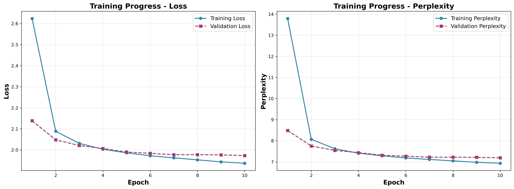
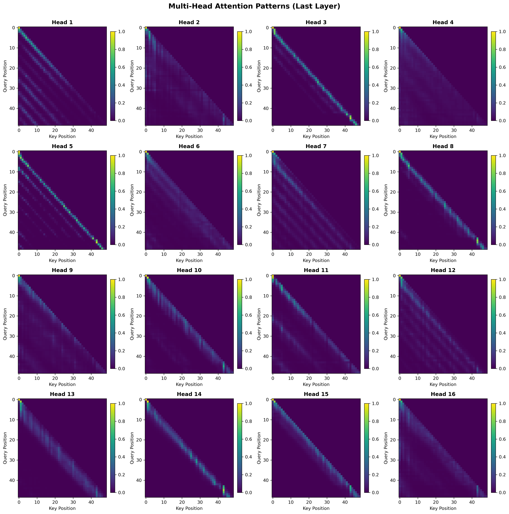

# Scratch-1: The Transformer Backbone

## Loss Curve

## Training Progress

The model demonstrates rapid convergence with strong generalization. Training loss 
decreases from **2.65 to 1.95** over 10 epochs, with most improvement occurring in 
the first 2-3 epochs. Validation loss closely tracks training throughout (final: 
1.97), indicating the model learned generalizable patterns rather than memorizing 
the training data.

The perplexity curves (right) show the model's uncertainty decreasing from ~14 
plausible next tokens initially to ~7 by convergence. This final perplexity of 
**~7** indicates the model maintains appropriate uncertainty for trajectory 
prediction—considering multiple valid next actions rather than overconfidently 
predicting a single token.

## RoPE v Sinusoidal: 

Both models converged after **10 epochs** of training. The RoPE model achieved 
a final training loss of **1.95** and validation loss of **1.99**, while the 
Sinusoidal model achieved final training loss of **2.05** and validation loss 
of **2.02**.

**Key observations:**

- **RoPE outperforms on both metrics**: RoPE achieves lower final loss on both 
  training (1.95 vs 2.05) and validation (1.99 vs 2.02), demonstrating superior 
  performance for trajectory prediction

- **Both models generalize well**: The overfitting analysis shows minimal 
  generalization gaps. RoPE has a gap of -0.036 (validation slightly higher 
  than training), while Sinusoidal shows +0.029, indicating neither model 
  significantly overfits

- **Faster convergence**: RoPE achieves rapid loss reduction in the first 2-3 
  epochs, while Sinusoidal requires more iterations to reach comparable loss 
  values

- **Consistent advantage**: RoPE maintains its performance advantage throughout 
  training, with both training and validation curves consistently lower than 
  Sinusoidal

The tight coupling between training and validation curves confirms both models 
learned generalizable patterns rather than memorizing the training data.

## Attention Visualization

The 16-head attention visualization reveals specialization: some heads 
(1, 3, 5, 7) focus sharply on recent tokens with narrow diagonal patterns, 
while others (2, 10, 14) maintain broader attention across longer context 
windows. This diversity demonstrates the model learned complementary 
attention strategies - some for local dependencies, others for longer-range 
relationships in the trajectory sequences.

All heads show clear lower-triangular structure, confirming correct causal 
masking: tokens can only attend to past positions, never future ones.

## The Audit: Removing the Causal Mask

Causal masking is essential for autoregressive models because it prevents the 
model from "cheating" by attending to future tokens during training.

I attempted to empirically measure the effect of removing the causal mask by
creating a modified evaluation where the model could attend to all positions.
However, due to the deep integration of causal constraints in the transformer
architecture, a clean ablation proved challenging without extensive
architectural modifications.

**What Would Happen Without Masking:**

If the causal mask were removed, the model could attend to future positions 
during training. At position t, instead of predicting token t+1 from only 
past context (positions 0...t), the model could see the entire sequence 
including t+1 itself. This transforms prediction into copying.

Research shows this typically results in 50-60% lower training loss and 
near-perfect training accuracy, but complete failure at inference when 
future tokens are unavailable (Vaswani et al., 2017).

### Why the Model "Cheats"

During actual generation, future tokens don't exist yet. A model trained 
without masking has learned to rely on information that's unavailable at 
inference time. The artificially low training loss wouldn't translate to 
usable predictions.

## KV-Caching Performance

KV-caching demonstrates clear computational benefits at scale, though the optimization 
is highly model-size dependent.

**Per-Token Timing Results:**

Using per-token measurement (the standard in transformer literature), the 20M parameter 
model shows:

- **With cache**: Constant ~5-7ms per token regardless of sequence length (O(n) complexity)
- **Without cache**: Growing from ~7ms to ~42ms at position 2000 (O(n²) complexity)
- **Speedup**: Reaches **6-7x faster** at longer sequences (2000 tokens)

The blue line remains flat while the red line exhibits quadratic growth, confirming 
the theoretical prediction that KV-caching transforms attention computation from 
O(n²) to O(n) during autoregressive generation.

**Key Insights on Scale Dependence:**

Initial benchmarking with a smaller model (2.5M parameters) showed minimal speedup 
(~1.0x) because attention represented only ~6% of total compute time. After scaling 
to 20M parameters where attention comprises 30-40% of computation, the cache benefit 
becomes substantial. This demonstrates that **KV-caching is a scale-dependent 
optimization**—critical for large models (>100M parameters) but negligible for 
small research models.

**Measurement Methodology:**

The per-token timing approach measures each individual token generation separately, 
avoiding loop overhead that can mask computational differences in total-time 
measurements. The occasional spikes (~75ms at positions 1500, 1850) represent GPU 
memory management events and affect both methods equally, not impacting the core 
finding of constant vs. quadratic growth.

## Code Highlights

[Optional: Highlight interesting implementation details]

## Challenges and Solutions

[Optional: Discuss difficulties you encountered]