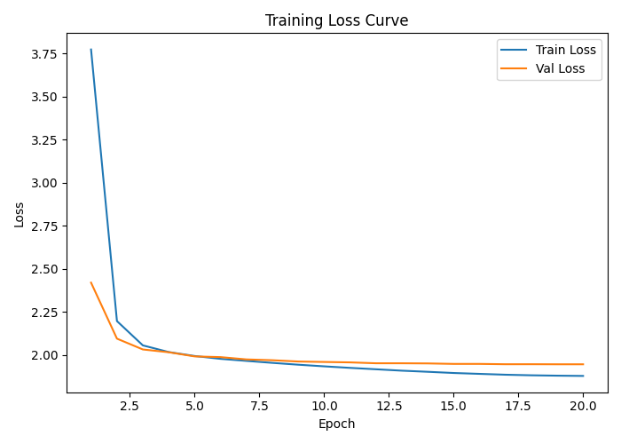
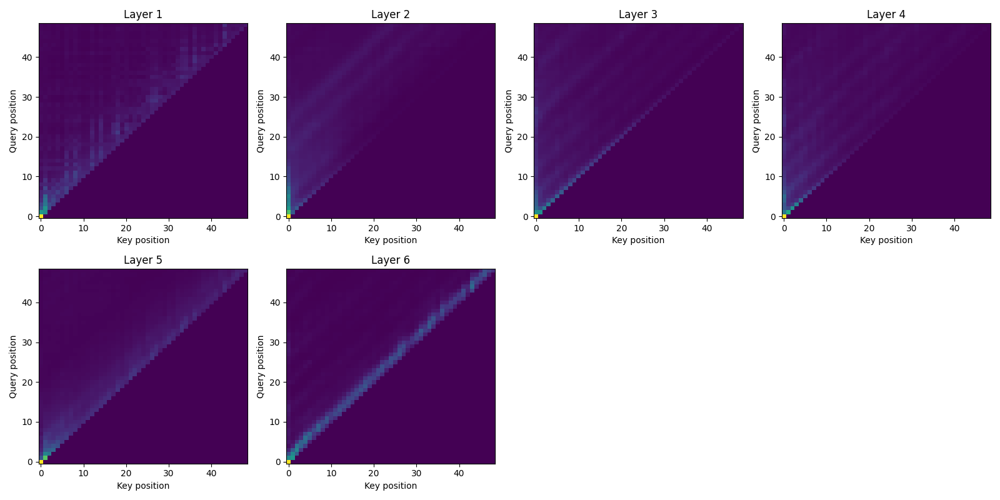

# Scratch-1: The Transformer Backbone

## Loss Curve

The model converged quickly (sharp drop in the first 2–3 epochs) and then
flattened, with train and val losses stabilizing around 1.88 and 1.95
respectively by the last epoch.

## Attention Visualization

The attention patterns show a strong lower-triangular structure (causal mask),
with most mass concentrated near the diagonal. Deeper layers sharpen this
diagonal band, suggesting stronger reliance on recent tokens, while earlier
layers display slightly broader spread over past positions. This makes some
sense to me since the trajectory data generated was quite structured (with
a little noise), thus I expect the fully learned attention mapping to look
fairly Markov over the action, i.e. all you need to predict the next action
is your current action.

## The Audit: Removing the Causal Mask

When I removed the causal mask, the loss dropped signficantly (train: 0.0049, 
val: 0.0742). In contrast to the causal attention map, the non-causal map shows 
attention over all actions in the sequence including future actions. The maps 
show a learned action structure by the second layer. Unsurprisingly, this map
shows an almost one-hot mapping from the j action to the j+1 action. This makes 
sense since the model cheats by allowing action tokens to attend to future action 
tokens and thus better predict the next action.

## Challenges and Solutions

I experimented a bunch with hyperparameters to reduce the loss, and it turns
out that increasing the number of heads or making the model wider didn't 
make it better. However the best improvement was realized after changing the 
learning rate. I increased the base learning rate to 3e-4 (from 1e-4) to speed early
convergence, then decayed it using a warmup + cosine schedule. The higher
starting LR helped the model move quickly off the initial plateau, while the
cosine decay stabilized later epochs and reduced oscillation in validation
loss.